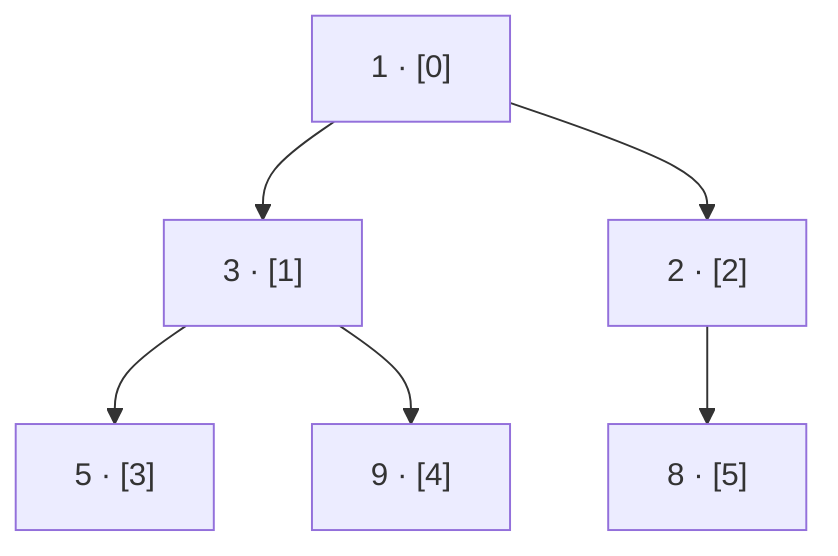

# Heaps

## Why It Exists

A scheduler always needs the *most urgent* task next — the earliest deadline, the closest node, the smallest distance — while new tasks keep streaming in. So you need a container that answers one question over and over, fast: "what's the smallest thing I'm holding right now?"

You already know two ways, and both disappoint. Keep the items in a **sorted array** and the smallest is right there (`O(1)`) — but inserting a new one shoves everything over (`O(n)`). Keep them **unsorted** and inserting is `O(1)` — but now finding the smallest means scanning the whole thing (`O(n)`). One end is always slow.

What you want is a structure where *both* the insert and the grab-the-smallest are cheap. That's the **heap**: it gives `O(1)` peek at the extreme item and `O(log n)` to insert or remove one — and it does it with nothing but a flat array.

## See It Work

A heap keeps the smallest value at the front, no matter what order things arrive. Run this — push six numbers, then peek and pop — and click **Visualise** to see the array drawn as the tree it secretly is.

> ▶ Run it, then click **Visualise** — the array renders as a binary tree; the smallest value sits at the root, ready to pop.

```python run viz=array viz-root=heap viz-kind=heap
import heapq

heap = []
for x in [5, 3, 8, 1, 9, 2]:
    heapq.heappush(heap, x)     # O(log n) each; heapq is a min-heap
print(heap[0])                   # peek the smallest → 1 (O(1), always at the root)
print(heapq.heappop(heap))       # remove the smallest → 1 (O(log n))
print(heap[0])                   # new smallest → 2
```

## How It Works

A binary heap is a tree obeying **two rules at once**:

1. **Complete** — every level is full except possibly the last, which fills left to right. (No gaps, so the tree is as short as possible: height `log n`.)
2. **Heap-ordered** — every parent is "more extreme" than its children. For a **min-heap**, each parent `≤` both children, so the **smallest value is always at the root**. (A max-heap flips the comparison; the root holds the largest.)

Those two rules are the whole trick: rule 2 puts the answer at the root (peek is `O(1)`), and rule 1 keeps the tree short (everything else is `O(log n)`).

The surprise is that this "tree" needs no nodes or pointers — it's **stored in a flat array**, level by level. For the node at index `i`:

```
children of i  →  2i + 1  and  2i + 2        parent of i  →  (i − 1) // 2
```



<p align="center"><strong>a min-heap as a complete binary tree: every parent ≤ its children, so the smallest sits at the root. It lives in a flat array — node <code>[i]</code>'s children are <code>[2i+1]</code> and <code>[2i+2]</code>.</strong></p>

Two operations maintain the rules, each just walking *one* root-to-leaf path:

- **push** — drop the new value at the end of the array, then **sift up**: swap it with its parent while it's smaller. At most `log n` swaps.
- **pop** (extract-min) — take the root (the answer), move the last element into the root, then **sift down**: swap it with its smaller child while it's bigger. Again `≤ log n` swaps.

One bonus: turning an unordered array *into* a heap all at once (**heapify**) is `O(n)`, not `O(n log n)` — a tighter bound than it looks, because most nodes are near the bottom and sift down barely at all.

### Key Takeaway

A heap is a complete binary tree, heap-ordered and packed into an array: the extreme value stays at the root for `O(1)` peek, while push and pop fix the order in one `O(log n)` walk up or down a single path.

## Trace It

Push `4` into the min-heap `[1, 3, 2, 5, 9, 8]` (the one above). It lands at the end, index `6`, whose parent is index `(6−1)//2 = 2`, holding `2`:

| Step | Action | Compare | Result |
|---|---|---|---|
| 1 | append `4` at index 6 | `4` vs parent `2` | `4 ≥ 2` → already ordered, stop |

One comparison and `4` is home. Now the harder case — predict before you read on: pop the root (`1`). What value ends up *at the root* after the dust settles?

The last element (`8`) moves to the root, then sifts down: its children are `3` and `2`; the smaller is `2`, and `8 > 2`, so they swap. `8` is now where `2` was, with child `8`... it settles, and **`2`** rises to the root — exactly the next-smallest value. The heap always surfaces the new minimum in one downward walk.

## Your Turn

Every language ships a heap as its priority queue — you rarely build one by hand. Watch it drain in sorted order, smallest first:

```python run viz=array viz-root=tasks viz-kind=heap
import heapq

tasks = []
for deadline in [5, 3, 8, 1, 9, 2]:
    heapq.heappush(tasks, deadline)   # O(log n) per push
print(heapq.heappop(tasks))           # earliest deadline first → 1
print(heapq.heappop(tasks))           # → 2
print(heapq.heappop(tasks))           # → 3
```

```java run viz=array viz-root=tasks viz-kind=heap
import java.util.PriorityQueue;

public class Main {
  public static void main(String[] args) {
    PriorityQueue<Integer> tasks = new PriorityQueue<>();   // a min-heap by default
    for (int d : new int[]{5, 3, 8, 1, 9, 2}) tasks.add(d);
    System.out.println(tasks.poll());   // → 1
    System.out.println(tasks.poll());   // → 2
    System.out.println(tasks.poll());   // → 3
  }
}
```

## Reflect & Connect

A heap *is* the **priority queue** of every standard library — Python's `heapq`, Java's `PriorityQueue`, C++'s `priority_queue` — and that makes it the quiet engine of a surprising amount of computing:

- **Dijkstra's shortest path** and **Prim's MST** pull the closest frontier node from a heap on every step.
- **Schedulers and event simulations** fire the next event by smallest timestamp; **`heapsort`** is just "push everything, pop everything."
- **Top-K** and the **streaming median** keep a small heap (or two) so you never sort the whole stream.

Why a heap and not a sorted array or a balanced tree? All three can do the job, but the heap wins on *constant factors and simplicity*: no per-node allocation, no pointers, no rebalancing — just an array and some index arithmetic, which is cache-friendly and short to code. The price is that a heap is **only** good at the extremes: it gives you the min (or max) instantly, but finding or removing some *arbitrary* middle value is `O(n)` — it keeps no total order, only "the root is the most extreme."

**Prerequisites:** [Arrays](/cortex/data-structures-and-algorithms/linear-structures/arrays/what-is-an-array) and [Measuring Cost](/cortex/data-structures-and-algorithms/foundations/measuring-cost).
**What's next:** a heap is your first *tree* — flattened into an array. Next come real, pointer-linked trees: the [Binary Tree](/cortex/data-structures-and-algorithms/trees/binary-tree/introduction-to-binary-trees).

## Recall

> **Mnemonic:** *Complete tree + parent-beats-children, packed in an array. Root is the answer (`O(1)`); push/pop fix one path (`O(log n)`). Children of `i`: `2i+1`, `2i+2`.*

| Operation | Cost | Why |
|---|---|---|
| peek (min or max) | `O(1)` | the extreme value is always at the root (index 0) |
| push / pop | `O(log n)` | sift up/down walks one root-to-leaf path |
| build a heap from `n` items | `O(n)` | most nodes sit near the bottom and barely sift |
| find / remove an arbitrary value | `O(n)` | a heap orders only the root, not the whole set |

<details>
<summary><strong>Q:</strong> What two invariants define a binary heap?</summary>

**A:** It's a *complete* binary tree (short, `log n` height) and *heap-ordered* (every parent beats its children).

</details>
<details>
<summary><strong>Q:</strong> Where is a heap actually stored, and how do you find a node's children?</summary>

**A:** In a flat array; node `[i]`'s children are `[2i+1]` and `[2i+2]`, its parent `[(i−1)//2]`.

</details>
<details>
<summary><strong>Q:</strong> Why are push and pop `O(log n)`?</summary>

**A:** Each restores the order by sifting along one root-to-leaf path, whose length is the tree's height, `log n`.

</details>
<details>
<summary><strong>Q:</strong> When is a heap the *wrong* choice?</summary>

**A:** When you need a total order or fast lookup of arbitrary elements — a heap only exposes the extreme.

</details>

## Sources & Verify

- **CLRS** (Cormen, Leiserson, Rivest, Stein), *Introduction to Algorithms*, 4th ed., **Ch. 6 — Heapsort**: the binary heap, `MAX-HEAPIFY`, `BUILD-MAX-HEAP` (the `O(n)` proof), and the array index formulas.
- **Sedgewick & Wayne**, *Algorithms*, 4th ed., §2.4 — priority queues, the binary heap, sink/swim (sift down/up), and heapsort.
- **CPython** `Lib/heapq.py` and **OpenJDK** `PriorityQueue.java` — the production min-heaps; verify the sift logic and array layout against source.
- Both runnable blocks are verified by running; the `O(1)` peek and `O(log n)` push/pop follow from the root position and the single-path walk.
