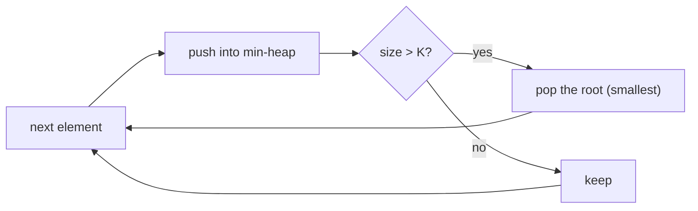

# Pattern: Top K Elements

## Why It Exists

"Find the K largest elements" (or the Kth largest). The obvious approach sorts everything and takes the last K — `O(n log n)` time and `O(n)` space. But when `K` is much smaller than `n`, that's wasteful: you sorted the whole array to keep a handful of values.

The insight: you only ever need to remember the **K best seen so far**. A **min-heap of size K** does exactly that. Its root is the *smallest* of those K — the weakest keeper, and the one easiest to compare against. Each new element either beats the root (evict the root, insert the newcomer) or doesn't (discard it). Every operation is `O(log K)`, so the whole pass is `O(n log K)` time and `O(K)` space. And because it processes one element at a time, it works on a **stream** you can't hold in memory.

## See It Work

Find the 2nd-largest element of `[3, 2, 1, 5, 6, 4]` by keeping a size-2 min-heap of the largest seen. Run it, then **Visualise** the heap hold only the top two.

> ▶ Run it, then click **Visualise** — each element pushes; once the heap holds more than `K`, the smallest is popped, so only the `K` largest survive.

```python run viz=array viz-root=heap viz-kind=heap
import heapq

nums = [3, 2, 1, 5, 6, 4]
k = 2
heap = []                          # min-heap of the K largest seen so far
for x in nums:
    heapq.heappush(heap, x)
    if len(heap) > k:
        heapq.heappop(heap)        # evict the smallest → keep only the K largest
print(heap[0])                     # 5 — the root is the smallest keeper = Kth largest
```

## How It Works

Maintain a min-heap capped at `K` elements:

1. **Push** the next element (`O(log K)`).
2. **Cap** the size: if the heap now holds `K + 1`, **pop the root** — the current smallest — so the heap keeps exactly the `K` largest seen so far.
3. **Answer**: after the pass, the heap *is* the K largest, and its **root is the Kth largest** (the smallest among the keepers).



<p align="center"><strong>push each element into a size-K min-heap; whenever it overflows, pop the smallest; the root ends up as the Kth largest.</strong></p>

The counterintuitive part: to track the **largest** elements you use a **min**-heap, not a max-heap. The root being the *minimum* of the keepers is the feature — it's the threshold a newcomer must beat, and popping it is `O(log K)`. Total cost is **`O(n log K)` time, `O(K)` space**, which beats `O(n log n)` sorting whenever `K ≪ n`. (To find the K *smallest*, mirror it: a **max**-heap of size K, popping the largest.)

### Key Takeaway

Keep the K best in a size-K min-heap: push, and pop the smallest whenever the size exceeds K. The root is the Kth largest. `O(n log K)` time, `O(K)` space — and use a *min*-heap for the *largest* (its root is the threshold to beat).

## Trace It

Size-2 min-heap over `[3, 2, 1, 5, 6, 4]` (root shown first):

| element | push → | size > 2? pop | heap (the 2 largest so far) |
|---|---|---|---|
| `3` | `[3]` | — | `[3]` |
| `2` | `[2,3]` | — | `[2,3]` |
| `1` | `[1,3,2]` | pop `1` | `[2,3]` |
| `5` | `[2,3,5]` | pop `2` | `[3,5]` |
| `6` | `[3,5,6]` | pop `3` | `[5,6]` |
| `4` | `[4,5,6]` | pop `4` | `[5,6]` |

Root = `5` → the 2nd largest.

Before you read on: to keep the *largest* elements, we pop the *smallest* each time, using a *min*-heap. That feels backwards. Why is a min-heap — not a max-heap — the right structure here?

Because the operation you repeat is "throw away the weakest keeper." The weakest of the current top-K is their *minimum*, and a min-heap puts exactly that at the root, poppable in `O(log K)`. A max-heap would put the *largest* on top — useless here, since you never want to discard your best. The heap's job isn't to find the maximum; it's to cheaply identify and evict the *threshold* element each time a stronger candidate arrives. Matching the heap's orientation to the element you need to remove (not the one you're hunting) is the crux of every top-K solution.

## Your Turn

The reusable Kth-largest and K-largest:

```python run viz=array viz-root=heap viz-kind=heap
import heapq

def kth_largest(nums, k):
    heap = []
    for x in nums:
        heapq.heappush(heap, x)
        if len(heap) > k:
            heapq.heappop(heap)
    return heap[0]                 # root = Kth largest

def k_largest(nums, k):
    heap = []
    for x in nums:
        heapq.heappush(heap, x)
        if len(heap) > k:
            heapq.heappop(heap)
    return sorted(heap, reverse=True)

print(kth_largest([3, 2, 3, 1, 2, 4, 5, 5, 6], 4))   # 4
print(k_largest([3, 2, 1, 5, 6, 4], 2))              # [6, 5]
```

```java run viz=array viz-root=heap viz-kind=heap
import java.util.*;

public class Main {
  static int kthLargest(int[] nums, int k) {
    PriorityQueue<Integer> heap = new PriorityQueue<>();   // min-heap
    for (int x : nums) {
      heap.offer(x);
      if (heap.size() > k) heap.poll();                    // evict smallest
    }
    return heap.peek();                                    // root = Kth largest
  }

  public static void main(String[] args) {
    System.out.println(kthLargest(new int[]{3, 2, 3, 1, 2, 4, 5, 5, 6}, 4));   // 4
  }
}
```

Drill the family in **Practice** — [Kth Largest Element](/cortex/data-structures-and-algorithms/trees-heap-pattern-top-k-elements-problems-kth-largest-element), [Kth Smallest Element](/cortex/data-structures-and-algorithms/trees-heap-pattern-top-k-elements-problems-kth-smallest-element), [K Range Sum](/cortex/data-structures-and-algorithms/trees-heap-pattern-top-k-elements-problems-k-range-sum), and [K Sorted Array Sorting](/cortex/data-structures-and-algorithms/trees-heap-pattern-top-k-elements-problems-k-sorted-array-sorting).

## Reflect & Connect

The size-K heap is the go-to for "best few out of many":

- **The family** — Kth largest/smallest, the K largest, sorting a *nearly-sorted* (each element ≤ K from its place) array with a size-K heap, and streaming top-K where the data won't fit in memory.
- **Match the heap to what you evict** — *largest* → min-heap (pop the smallest); *smallest* → max-heap (pop the largest). The root is always the element on the chopping block, not the one you're seeking.
- **vs sorting and vs quickselect** — sorting is `O(n log n)`; the heap is `O(n log K)`, better for small `K` and the only option on a stream. Quickselect finds the Kth element in `O(n)` average but needs the whole array in memory and isn't online. Pick by whether `K` is small and whether data streams.

**Prerequisites:** [What Is a Heap?](/cortex/data-structures-and-algorithms/trees-heap-what-is-a-heap).
**What's next:** order a heap by a custom key — frequency, distance, or a composite — in [Comparator](/cortex/data-structures-and-algorithms/trees-heap-pattern-comparator-pattern).

## Recall

> **Mnemonic:** *Size-K min-heap for the K largest. Push; if size > K pop the root (smallest). Root = Kth largest. `O(n log K)`. Min-heap for largest — match the heap to what you evict.*

| | |
|---|---|
| Structure | min-heap capped at K (for the K *largest*) |
| Per element | push; if `size > K`, pop the root |
| Answer | heap = K largest; root = Kth largest |
| Orientation | largest → min-heap · smallest → max-heap |
| Cost | `O(n log K)` time, `O(K)` space |

<details>
<summary><strong>Q:</strong> Why use a min-heap to track the *largest* elements?</summary>

**A:** Its root is the smallest keeper — the threshold a newcomer must beat and the element you evict, both in `O(log K)`.

</details>
<details>
<summary><strong>Q:</strong> What's the cost, and when does it beat sorting?</summary>

**A:** `O(n log K)` vs `O(n log n)` — better when `K ≪ n`, and it works on streams.

</details>
<details>
<summary><strong>Q:</strong> Where is the Kth largest after the pass?</summary>

**A:** At the heap's root (the smallest of the K largest).

</details>
<details>
<summary><strong>Q:</strong> How do you adapt it to the K smallest?</summary>

**A:** Use a max-heap of size K and pop the largest each time.

</details>

## Sources & Verify

- **CLRS**, *Introduction to Algorithms*, 4th ed., §6 — heaps, heap operations, and priority queues.
- **Sedgewick & Wayne**, *Algorithms*, 4th ed., §2.4 — priority queues; the "keep the M largest in a min-heap" application is given explicitly.
- The size-K heap for top-K (and `O(n log K)` cost) is standard; both runnable blocks are verified by running (`kth_largest ⇒ 5` then `4`, `k_largest ⇒ [6, 5]`).
