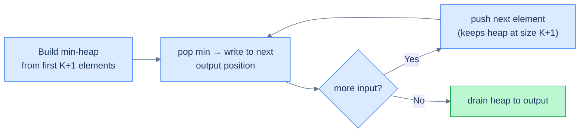

# K sorted array sorting

## Problem Statement

Given an array `arr` where every element is at most `k` positions away from its sorted position, sort the array in place in **`O(n log k)`** or better.

> A "K-sorted" array is *almost* sorted — every element is at most K positions out of place. Real-world example: data merged from `K` sorted streams; sensor readings with bounded jitter.

### Example 1

> - **Input:** `arr = [6, 5, 3, 2, 8, 10, 9]`, `k = 3`
> - **Output:** `[2, 3, 5, 6, 8, 9, 10]`

### Example 2

> - **Input:** `arr = [10, 9, 8, 7, 4, 70, 60, 50]`, `k = 4`
> - **Output:** `[4, 7, 8, 9, 10, 50, 60, 70]`

### Example 3

> - **Input:** `arr = [1, 2, 3]`, `k = 0`
> - **Output:** `[1, 2, 3]`

<details>
<summary><h2>The Strategy</h2></summary>


A general sort is `O(n log n)`. The K-sortedness *constraint* — every element is at most K positions misplaced — lets us do better.

**Key insight:** the smallest element of the entire array is somewhere in the **first K+1 positions** (it can be at most K positions out of place from index 0). So if we min-heapify the first K+1 elements, the heap's top **is** the global minimum. We pop it, write it to position 0, push `arr[K+1]` to keep the heap at size K+1, and now the heap's top is the second smallest. Repeat.



<p align="center"><strong>K-sorted sort with a sliding K+1 min-heap. Each step: pop the min into the output, push the next input.</strong></p>

> **Algorithm**
>
> - **Step 1:** Build a min-heap of size `K+1` from `arr[0..K]`.
> - **Step 2:** For `i = K+1` to `n-1`:
>   - Pop the min and write it to `arr[i - K - 1]`.
>   - Push `arr[i]` into the heap.
> - **Step 3:** Drain the remaining `K+1` elements from the heap into the tail of `arr`.

Total work: `n + 1` pushes, `n` pops, all on a heap of size at most `K+1` → **`O(n log K)`**.

</details>
<details>
<summary><h2>The Solution</h2></summary>


```python run viz=array viz-root=min_heap viz-kind=heap
from typing import List
import heapq

class Solution:
    def k_sorted_array_sorting(self, arr: List[int], k: int) -> None:
        n = len(arr)

        # Create a min heap
        min_heap = []

        # Build a min heap of size k+1 with elements from the first
        # k+1 elements of the array
        for i in range(k + 1):
            heapq.heappush(min_heap, arr[i])

        # Process the remaining elements of the array
        for i in range(k + 1, n):

            # Replace the current element with the minimum element from
            # the min heap
            arr[i - k - 1] = heapq.heappop(min_heap)

            # Push the current element to the min heap
            heapq.heappush(min_heap, arr[i])

        # Replace the remaining elements with the minimum elements from
        # the min heap
        for i in range(n - k - 1, n):
            arr[i] = heapq.heappop(min_heap)


# Examples from the problem statement
a1 = [6, 5, 3, 2, 8, 10, 9]
Solution().k_sorted_array_sorting(a1, 3); print(a1)   # [2, 3, 5, 6, 8, 9, 10]

a2 = [10, 9, 8, 7, 4, 70, 60, 50]
Solution().k_sorted_array_sorting(a2, 4); print(a2)   # [4, 7, 8, 9, 10, 50, 60, 70]

a3 = [1, 2, 3]
Solution().k_sorted_array_sorting(a3, 0); print(a3)   # [1, 2, 3]

# Edge cases
a4 = [1]
Solution().k_sorted_array_sorting(a4, 0); print(a4)   # [1] — single element

a5 = [2, 1]
Solution().k_sorted_array_sorting(a5, 1); print(a5)   # [1, 2] — two elements, k=1

a6 = [4, 4, 4]
Solution().k_sorted_array_sorting(a6, 1); print(a6)   # [4, 4, 4] — all same

a7 = [5, 3, 4, 1, 2]
Solution().k_sorted_array_sorting(a7, 2); print(a7)   # [1, 2, 3, 4, 5]
```

```java run viz=array viz-root=minHeap viz-kind=heap
import java.util.*;

public class Main {
    static class Solution {
        public void kSortedArraySorting(int[] arr, int k) {
            int n = arr.length;

            // Create a min heap
            PriorityQueue<Integer> minHeap = new PriorityQueue<>();

            // Build a min heap of size k+1 with elements from the first
            // k+1 elements of the array
            for (int i = 0; i <= k; i++) {
                minHeap.add(arr[i]);
            }

            // Process the remaining elements of the array
            for (int i = k + 1; i < n; i++) {

                // Replace the current element with the minimum element from
                // the min heap
                arr[i - k - 1] = minHeap.poll();

                // Push the current element to the min heap
                minHeap.add(arr[i]);
            }

            // Replace the remaining elements with the minimum elements from
            // the min heap
            int idx = n - k - 1;
            while (!minHeap.isEmpty()) {
                arr[idx++] = minHeap.poll();
            }
        }
    }

    public static void main(String[] args) {
        // Examples from the problem statement
        int[] a1 = {6, 5, 3, 2, 8, 10, 9};
        new Solution().kSortedArraySorting(a1, 3);
        System.out.println(Arrays.toString(a1));   // [2, 3, 5, 6, 8, 9, 10]

        int[] a2 = {10, 9, 8, 7, 4, 70, 60, 50};
        new Solution().kSortedArraySorting(a2, 4);
        System.out.println(Arrays.toString(a2));   // [4, 7, 8, 9, 10, 50, 60, 70]

        int[] a3 = {1, 2, 3};
        new Solution().kSortedArraySorting(a3, 0);
        System.out.println(Arrays.toString(a3));   // [1, 2, 3]

        // Edge cases
        int[] a4 = {1};
        new Solution().kSortedArraySorting(a4, 0);
        System.out.println(Arrays.toString(a4));   // [1] — single element

        int[] a5 = {2, 1};
        new Solution().kSortedArraySorting(a5, 1);
        System.out.println(Arrays.toString(a5));   // [1, 2] — two elements, k=1

        int[] a6 = {4, 4, 4};
        new Solution().kSortedArraySorting(a6, 1);
        System.out.println(Arrays.toString(a6));   // [4, 4, 4] — all same

        int[] a7 = {5, 3, 4, 1, 2};
        new Solution().kSortedArraySorting(a7, 2);
        System.out.println(Arrays.toString(a7));   // [1, 2, 3, 4, 5]
    }
}
```


<details>
<summary><strong>Trace — arr = [6, 5, 3, 2, 8, 10, 9], k = 3</strong></summary>

```
n = 7, build heap from arr[0..=3] = [6, 5, 3, 2] → heap = {2, 3, 5, 6}

Step 1 │ i = 4 │ pop 2 → arr[0] = 2 │ push 8  → heap = {3, 5, 6, 8}
Step 2 │ i = 5 │ pop 3 → arr[1] = 3 │ push 10 → heap = {5, 6, 8, 10}
Step 3 │ i = 6 │ pop 5 → arr[2] = 5 │ push 9  → heap = {6, 8, 9, 10}
Drain  │ pop 6 → arr[3] = 6
       │ pop 8 → arr[4] = 8
       │ pop 9 → arr[5] = 9
       │ pop 10 → arr[6] = 10
Result: [2, 3, 5, 6, 8, 9, 10] ✓
```

</details>

</details>
<details>
<summary><h2>Key Takeaway</h2></summary>


The Top-K pattern is one of the highest-leverage idioms in algorithms. **Maintain a fixed-size heap of size K**, stream the data through, and you've reduced an `O(n log n)` sort to **`O(n log K)`** — a strict improvement when `K << n`, and the foundation of every "leaderboard / closest-K / top-rated" feature in production.

Three patterns to internalise:

1. **Min-heap for K largest, max-heap for K smallest** — the heap holds the *threshold-keepers* of your top-K, so you want fast access to the *worst* of the kept ones.
2. **`heappushpop` is the magic primitive.** Pushing then immediately popping (when the heap is at capacity) is one operation in most heap libraries, and the most efficient way to write the "maybe replace the worst" pattern.
3. **K is a budget, not a hard limit.** Even when the problem doesn't explicitly bound K, this pattern works for any "top-K-of-a-stream" where the universe is too big to sort. Logging hot keys in a cache, top error messages by frequency, top-spending users — all the same shape.

The next lesson generalises away from `int` heaps: **comparators**. Once you can give your heap an arbitrary ordering function, "top K" applies to strings, structs, tuples, and any total-order domain you care about — opening the door to half the heap problems you'll meet in interviews and the wild.

</details>
