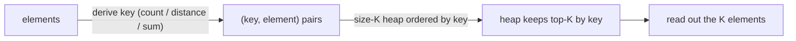

# Pattern: Comparator

## Why It Exists

The top-K pattern ranked elements by their natural value. But the real questions usually rank by something *derived*: the **K most frequent** values (rank by count), the **K closest** points (rank by distance), the **K smallest pair sums**, the next element across **K sorted lists** (rank by value, but you also need to know which list it came from). In all of these, the thing you store isn't the thing you compare by.

A heap doesn't have to order by the element itself — it can order by a **comparator** (or a key function). Store `(key, element)` and the heap orders by `key`; or hand a `PriorityQueue` an explicit `Comparator`. Every top-K mechanic — the size-K cap, the `O(n log K)` cost — carries over unchanged. The only new idea is: **separate what you keep from how you rank it.**

## See It Work

Find the 2 most frequent values in `[1, 1, 1, 2, 2, 3]`. Count frequencies, then run a size-2 heap **ordered by frequency** (not by the value). Run it.

```python run
import ast
import heapq

def k_most_frequent(nums, k):
    freq = {}
    for x in nums:                             # count (the counting pattern)
        freq[x] = freq.get(x, 0) + 1
    heap = []                                  # min-heap keyed by frequency
    for val, f in freq.items():
        heapq.heappush(heap, (f, val))         # compare by the DERIVED key f, carry val along
        if len(heap) > k:
            heapq.heappop(heap)                # drop the least frequent keeper
    result = sorted((val for f, val in heap), key=lambda v: (-freq[v], v))
    print(result)

nums = ast.literal_eval(input())
k = int(input())
k_most_frequent(nums, k)
```

```java run
import java.util.*;

public class Main {
  static int[] parseIntArray(String line) {
    String inner = line.replaceAll("[\\[\\]\\s]", "");
    if (inner.isEmpty()) return new int[0];
    String[] parts = inner.split(",");
    int[] out = new int[parts.length];
    for (int i = 0; i < parts.length; i++) out[i] = Integer.parseInt(parts[i].trim());
    return out;
  }

  static List<Integer> kMostFrequent(int[] nums, int k) {
    Map<Integer, Integer> freq = new HashMap<>();
    for (int x : nums) freq.merge(x, 1, Integer::sum);
    // min-heap ordered by a derived key — the comparator IS the pattern
    PriorityQueue<Integer> heap = new PriorityQueue<>(
      (a, b) -> freq.get(a).equals(freq.get(b)) ? a - b : freq.get(a) - freq.get(b));
    for (int val : freq.keySet()) {
      heap.offer(val);
      if (heap.size() > k) heap.poll();
    }
    List<Integer> out = new ArrayList<>(heap);
    out.sort((a, b) -> freq.get(b).equals(freq.get(a)) ? a - b : freq.get(b) - freq.get(a));
    return out;
  }

  public static void main(String[] args) {
    Scanner sc = new Scanner(System.in);
    int[] nums = parseIntArray(sc.nextLine());
    int k = Integer.parseInt(sc.nextLine().trim());
    System.out.println(kMostFrequent(nums, k));
  }
}
```

```testcases
{
  "args": [
    { "id": "nums", "label": "nums", "type": "int[]", "placeholder": "[1, 1, 1, 2, 2, 3]" },
    { "id": "k", "label": "k", "type": "int", "placeholder": "2" }
  ],
  "cases": [
    { "args": { "nums": "[1, 1, 1, 2, 2, 3]", "k": "2" }, "expected": "[1, 2]" },
    { "args": { "nums": "[4, 4, 4, 5, 5, 6, 6, 6, 6]", "k": "2" }, "expected": "[6, 4]" },
    { "args": { "nums": "[1, 2, 3]", "k": "1" }, "expected": "[3]" },
    { "args": { "nums": "[7, 7, 7]", "k": "1" }, "expected": "[7]" }
  ]
}
```

## How It Works

Two steps, the second being top-K with a twist:

1. **Derive the key.** Compute whatever you rank by — here, a frequency map (the [counting](/cortex/data-structures-and-algorithms/linear-structures/hash-table/pattern-counting/pattern) pattern). For "K closest" it'd be a distance; for "K smallest sums," the sum.
2. **Run a size-K heap ordered by the key.** Push `(key, element)` pairs; the heap compares by `key` first. Cap at `K` exactly as before. In Python a tuple `(key, element)` sorts by key automatically; in Java you pass a `Comparator` (e.g. `Comparator.comparingInt(freq::get)`).



<p align="center"><strong>derive a ranking key per element, then feed <code>(key, element)</code> into the same size-K heap; the comparator decides ordering, the element rides along.</strong></p>

Cost is still **`O(n log K)`** — the comparator changes *what* is compared, not *how many* comparisons. One subtlety: with `(key, element)` tuples, ties on `key` fall through to comparing the `element`, which can matter if elements aren't comparable (wrap them, or add a tiebreak field). A **composite key** — a tuple like `(primary, secondary)` or a multi-field comparator — handles "rank by X, break ties by Y" cleanly.

### Key Takeaway

Order the heap by a derived key — `(key, element)` tuples or an explicit comparator — and the entire top-K machinery applies to "most frequent / closest / smallest-sum" problems. Separate what you store from how you rank; use a composite key for tie-breaks.

## Trace It

K=2 most frequent over `[1, 1, 1, 2, 2, 3]`. Counts: `{1:3, 2:2, 3:1}`. Size-2 min-heap of `(freq, val)`:

| consider `(f, val)` | push → heap | size > 2? pop | heap |
|---|---|---|---|
| `(3, 1)` | `[(3,1)]` | — | `[(3,1)]` |
| `(2, 2)` | `[(2,2),(3,1)]` | — | `[(2,2),(3,1)]` |
| `(1, 3)` | `[(1,3),(3,1),(2,2)]` | pop `(1,3)` | `[(2,2),(3,1)]` |

Keepers: values `2` and `1` — the two most frequent.

Before you read on: the heap stored `(frequency, value)` tuples and popped `(1, 3)` — the value `3` with frequency `1`. If instead we'd pushed bare values and somehow tried to rank "by frequency," what goes wrong, and why does pairing the key *into* the heap entry fix it?

A bare-value min-heap compares values, so it would rank `1 < 2 < 3` and evict by *value*, not by frequency — completely the wrong order. The heap has no way to know an element's frequency unless that key travels *with* it. Pairing `(frequency, value)` makes the comparison key part of the entry, so the heap orders by frequency and the value just rides along to be read out later. That separation — *rank by the key, carry the payload* — is the whole pattern; in Java the same thing is expressed by handing the queue a `Comparator` that reads the key.

## Your Turn

Write `k_most_frequent(nums, k)` using a size-K min-heap ordered by frequency. Result must be sorted by descending frequency then ascending value (for determinism).

```python run
import ast
import heapq

def k_most_frequent(nums, k):
    # Your code goes here — count frequencies, then maintain a size-K heap
    # keyed by (frequency, value). Sort the final result by (-freq, value).
    pass

nums = ast.literal_eval(input())
k = int(input())
k_most_frequent(nums, k)
```

```java run
import java.util.*;

public class Main {
  static int[] parseIntArray(String line) {
    String inner = line.replaceAll("[\\[\\]\\s]", "");
    if (inner.isEmpty()) return new int[0];
    String[] parts = inner.split(",");
    int[] out = new int[parts.length];
    for (int i = 0; i < parts.length; i++) out[i] = Integer.parseInt(parts[i].trim());
    return out;
  }

  static List<Integer> kMostFrequent(int[] nums, int k) {
    // Your code goes here — count frequencies, heap of size K ordered by freq,
    // sort final result by descending freq then ascending value.
    return new ArrayList<>();
  }

  public static void main(String[] args) {
    Scanner sc = new Scanner(System.in);
    int[] nums = parseIntArray(sc.nextLine());
    int k = Integer.parseInt(sc.nextLine().trim());
    System.out.println(kMostFrequent(nums, k));
  }
}
```

```testcases
{
  "args": [
    { "id": "nums", "label": "nums", "type": "int[]", "placeholder": "[1, 1, 1, 2, 2, 3]" },
    { "id": "k", "label": "k", "type": "int", "placeholder": "2" }
  ],
  "cases": [
    { "args": { "nums": "[1, 1, 1, 2, 2, 3]", "k": "2" }, "expected": "[1, 2]" },
    { "args": { "nums": "[4, 4, 4, 5, 5, 6, 6, 6, 6]", "k": "2" }, "expected": "[6, 4]" },
    { "args": { "nums": "[1, 2, 3]", "k": "1" }, "expected": "[3]" },
    { "args": { "nums": "[7, 7, 7]", "k": "1" }, "expected": "[7]" }
  ]
}
```

<details>
<summary>Editorial</summary>

Count frequencies into a dict, then run a size-K min-heap of `(freq, val)` tuples. The heap evicts the least-frequent element whenever it overflows. Ties on frequency are broken by value (ascending) so the result is fully deterministic across Python and Java.

```python solution time=O(n log K) space=O(n)
import ast
import heapq

def k_most_frequent(nums, k):
    freq = {}
    for x in nums:
        freq[x] = freq.get(x, 0) + 1
    heap = []
    for val, f in freq.items():
        heapq.heappush(heap, (f, val))         # compare by the DERIVED key f, carry val along
        if len(heap) > k:
            heapq.heappop(heap)                # drop the least frequent keeper
    result = sorted((val for f, val in heap), key=lambda v: (-freq[v], v))
    print(result)

nums = ast.literal_eval(input())
k = int(input())
k_most_frequent(nums, k)
```

```java solution
import java.util.*;

public class Main {
  static int[] parseIntArray(String line) {
    String inner = line.replaceAll("[\\[\\]\\s]", "");
    if (inner.isEmpty()) return new int[0];
    String[] parts = inner.split(",");
    int[] out = new int[parts.length];
    for (int i = 0; i < parts.length; i++) out[i] = Integer.parseInt(parts[i].trim());
    return out;
  }

  static List<Integer> kMostFrequent(int[] nums, int k) {
    Map<Integer, Integer> freq = new HashMap<>();
    for (int x : nums) freq.merge(x, 1, Integer::sum);
    PriorityQueue<Integer> heap = new PriorityQueue<>(
      (a, b) -> freq.get(a).equals(freq.get(b)) ? a - b : freq.get(a) - freq.get(b));
    for (int val : freq.keySet()) {
      heap.offer(val);
      if (heap.size() > k) heap.poll();
    }
    List<Integer> out = new ArrayList<>(heap);
    out.sort((a, b) -> freq.get(b).equals(freq.get(a)) ? a - b : freq.get(b) - freq.get(a));
    return out;
  }

  public static void main(String[] args) {
    Scanner sc = new Scanner(System.in);
    int[] nums = parseIntArray(sc.nextLine());
    int k = Integer.parseInt(sc.nextLine().trim());
    System.out.println(kMostFrequent(nums, k));
  }
}
```

</details>

## Reflect & Connect

Drill the family in **Practice** — [K Most Frequent Elements](/cortex/data-structures-and-algorithms/trees/heap/pattern-comparator/problems/k-most-frequent-elements), [K Smallest Sum Pairs](/cortex/data-structures-and-algorithms/trees/heap/pattern-comparator/problems/k-smallest-sum-pairs), [K Closest Values](/cortex/data-structures-and-algorithms/trees/heap/pattern-comparator/problems/k-closest-values), [K Arrays Smallest Range](/cortex/data-structures-and-algorithms/trees/heap/pattern-comparator/problems/k-arrays-smallest-range), and [K-Way List Merge](/cortex/data-structures-and-algorithms/trees/heap/pattern-comparator/problems/k-way-list-merge).

The comparator turns the heap into a general "best-by-any-criterion" engine:

- **The family** — K most frequent (key = count), K closest (key = distance), K smallest pair sums (key = sum), and **merge K sorted lists** (a heap of `(value, list-id)` always yields the global minimum — the scalable version of the two-list [merge](/cortex/data-structures-and-algorithms/linear-structures/singly-linked-list/pattern-merge/pattern)).
- **Composite keys for tie-breaks** — rank by primary, then secondary: a tuple `(primary, secondary, element)` in Python, a chained `Comparator.comparing(...).thenComparing(...)` in Java. This is how you express "closest, and among ties the lexicographically smaller."
- **It composes the earlier patterns** — derive the key with counting, then select with top-K, ordered by a comparator. Most "K-something-by-X" interview questions are exactly this stack.

**Prerequisites:** [Top K Elements](/cortex/data-structures-and-algorithms/trees/heap/pattern-top-k-elements/pattern).

## Recall

> **Mnemonic:** *Heap orders by a derived key, not the value. Store `(key, element)` (or pass a Comparator); top-K machinery unchanged. Composite key = tie-break.*

| | |
|---|---|
| Idea | rank by a derived key; carry the element as payload |
| Python | push `(key, element)` tuples — tuple order = key order |
| Java | `new PriorityQueue<>(Comparator.comparing(...))` |
| Tie-break | composite key: `(primary, secondary, …)` / `thenComparing` |
| Cost | `O(n log K)` — same as top-K |

<details>
<summary><strong>Q:</strong> What does the comparator change versus plain top-K?</summary>

**A:** Only the ranking key — the size-K cap and `O(n log K)` cost are identical.

</details>
<details>
<summary><strong>Q:</strong> Why pair `(key, element)` instead of pushing bare elements?</summary>

**A:** The heap compares its entries, so the ranking key must travel inside each entry or it ranks by the wrong thing.

</details>
<details>
<summary><strong>Q:</strong> How do you rank by X and break ties by Y?</summary>

**A:** A composite key — a tuple `(X, Y, …)` in Python or chained `Comparator` in Java.

</details>
<details>
<summary><strong>Q:</strong> How does merge-K-sorted-lists use this?</summary>

**A:** A heap of `(value, list-id)` always pops the global minimum, so you repeatedly emit it and pull the next from that list.

</details>

## Sources & Verify

- **CLRS**, *Introduction to Algorithms*, 4th ed., §6.5 — priority queues and key-based ordering.
- **Sedgewick & Wayne**, *Algorithms*, 4th ed., §2.4 — priority queues, custom comparators, and multiway merge.
- Comparator-ordered heaps (K most frequent, merge-K) are standard priority-queue applications; both runnable blocks are verified by running (`[1,1,1,2,2,3],2 ⇒ [1, 2]`, `[4,4,4,5,5,6,6,6,6],2 ⇒ [4, 6]`).
