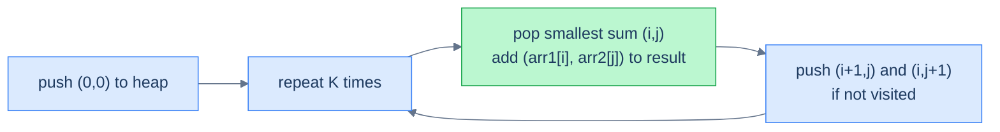

# K smallest sum pairs

## Problem Statement

Given two sorted arrays `arr1` and `arr2`, and a non-negative integer `k`, return the K pairs `(a, b)` (one element from each) with the smallest sum.

### Example 1

> - **Input:** `arr1 = [1, 7, 1]`, `arr2 = [2, 4, 6]`, `k = 3`
> - **Output:** `[[1, 2], [1, 4], [1, 6]]`

### Example 2

> - **Input:** `arr1 = [1, 1, 2]`, `arr2 = [1, 2, 3]`, `k = 2`
> - **Output:** `[[1, 1], [1, 1]]`

### Example 3

> - **Input:** `arr1 = [1, 3, 4]`, `arr2 = [4]`, `k = 2`
> - **Output:** `[[1, 4], [3, 4]]`

<details>
<summary><h2>The Strategy</h2></summary>


There are `n × m` possible pairs — up to `n²` if both arrays are large. Generating all of them is expensive. The trick is **lazy expansion**: start with the smallest possible pair `(arr1[0], arr2[0])`, then *only* expand the neighbours of pairs we've already extracted.

When we pop pair `(i, j)`, the next-smallest pair adjacent to it is either `(i+1, j)` or `(i, j+1)` — we push both into the heap, marked as visited so we don't re-add them. Then pop the next-smallest from the heap. Repeat K times.



<p align="center"><strong>Lazy expansion: at most 2 new pairs added per popped pair, so the heap stays at O(K).</strong></p>

The comparator is "compare by sum, ascending". The pair record carries `(sum, i, j)` so we can recover the actual values.

</details>
<details>
<summary><h2>The Solution</h2></summary>


```python run viz=array viz-root=min_heap
from typing import List, Tuple
import heapq

# Define a class to store the sum and the indices of the pair
class PairWithSum:
    def __init__(self, sum_: int, index1: int, index2: int):
        self.sum = sum_
        self.index1 = index1
        self.index2 = index2

    # Define comparison based on sum
    def __lt__(self, other):
        return self.sum < other.sum

class Solution:
    def k_smallest_sum_pairs(
        self, arr_1: List[int], arr_2: List[int], k: int
    ) -> List[List[int]]:
        n = len(arr_1)
        m = len(arr_2)

        # Result list to store the k smallest pairs
        result = []

        # Set to keep track of visited pairs
        visited = set()

        # Create a min-heap (priority queue)
        min_heap = []

        # Push the first pair into the heap
        heapq.heappush(min_heap, PairWithSum(arr_1[0] + arr_2[0], 0, 0))

        # Mark the first pair as visited
        visited.add((0, 0))

        # Process the pairs until k pairs have been found or the min
        # heap is empty
        while k > 0 and min_heap:

            # Get the smallest pair
            top = heapq.heappop(min_heap)

            # Retrieve the indices of the pair
            i, j = top.index1, top.index2

            # Add the pair to the answer list
            result.append([arr_1[i], arr_2[j]])

            # Check adjacent pairs and add them to the min heap if not
            # visited
            if i + 1 < n and (i + 1, j) not in visited:
                heapq.heappush(
                    min_heap,
                    PairWithSum(arr_1[i + 1] + arr_2[j], i + 1, j),
                )
                visited.add((i + 1, j))
            if j + 1 < m and (i, j + 1) not in visited:
                heapq.heappush(
                    min_heap,
                    PairWithSum(arr_1[i] + arr_2[j + 1], i, j + 1),
                )
                visited.add((i, j + 1))

            k -= 1

        # Return the k smallest pairs
        return result


# Examples from the problem statement
print(Solution().k_smallest_sum_pairs([1, 7, 11], [2, 4, 6], 3))     # [[1,2],[1,4],[1,6]]
print(Solution().k_smallest_sum_pairs([1, 1, 2], [1, 2, 3], 2))      # [[1,1],[1,1]]
print(Solution().k_smallest_sum_pairs([1, 3, 4], [4], 2))             # [[1,4],[3,4]]

# Edge cases
print(Solution().k_smallest_sum_pairs([1], [1], 1))                   # [[1,1]]
print(Solution().k_smallest_sum_pairs([1, 2], [3, 4], 4))             # all 4 pairs
print(Solution().k_smallest_sum_pairs([1, 7, 11], [2, 4, 6], 1))     # [[1,2]] — k=1
```

```java run viz=array viz-root=minHeap
import java.util.*;

public class Main {

    // Define a class to store the sum and the indices of the pair
    static class PairWithSum {

        int sum;
        int index1;
        int index2;

        PairWithSum(int sum, int index1, int index2) {
            this.sum = sum;
            this.index1 = index1;
            this.index2 = index2;
        }
    }

    // Comparator to create the min-heap based on sum
    static class CompareMinHeap implements Comparator<PairWithSum> {
        public int compare(PairWithSum a, PairWithSum b) {

            // For the priority queue to be a min-heap
            return Integer.compare(a.sum, b.sum);
        }
    }

    static class Solution {
        public List<List<Integer>> kSmallestSumPairs(
            int[] arr1,
            int[] arr2,
            int k
        ) {
            int n = arr1.length;
            int m = arr2.length;

            // Result list to store the k smallest pairs
            List<List<Integer>> result = new ArrayList<>();

            // Set to keep track of visited pairs
            Set<String> visited = new HashSet<>();

            // Create a priority queue (min-heap)
            PriorityQueue<PairWithSum> minHeap = new PriorityQueue<>(
                new CompareMinHeap()
            );

            // Push the first pair into the heap
            minHeap.add(new PairWithSum(arr1[0] + arr2[0], 0, 0));

            // Mark the first pair as visited
            visited.add("0,0");

            // Process the pairs until k pairs have been found or the min
            // heap is empty
            while (k > 0 && !minHeap.isEmpty()) {

                // Get the smallest pair
                PairWithSum top = minHeap.poll();

                // Retrieve the indices of the pair
                int i = top.index1;
                int j = top.index2;

                // Add the pair to the answer list
                result.add(List.of(arr1[i], arr2[j]));

                // Check adjacent pairs and add them to the min heap if not
                // visited
                if (i + 1 < n && !visited.contains((i + 1) + "," + j)) {
                    minHeap.add(
                        new PairWithSum(arr1[i + 1] + arr2[j], i + 1, j)
                    );
                    visited.add((i + 1) + "," + j);
                }

                if (j + 1 < m && !visited.contains(i + "," + (j + 1))) {
                    minHeap.add(
                        new PairWithSum(arr1[i] + arr2[j + 1], i, j + 1)
                    );
                    visited.add(i + "," + (j + 1));
                }

                k--;
            }

            // Return the k smallest pairs
            return result;
        }
    }

    public static void main(String[] args) {
        // Examples from the problem statement
        System.out.println(new Solution().kSmallestSumPairs(
            new int[]{1, 7, 11}, new int[]{2, 4, 6}, 3));     // [[1,2],[1,4],[1,6]]

        System.out.println(new Solution().kSmallestSumPairs(
            new int[]{1, 1, 2}, new int[]{1, 2, 3}, 2));      // [[1,1],[1,1]]

        System.out.println(new Solution().kSmallestSumPairs(
            new int[]{1, 3, 4}, new int[]{4}, 2));             // [[1,4],[3,4]]

        // Edge cases
        System.out.println(new Solution().kSmallestSumPairs(
            new int[]{1}, new int[]{1}, 1));                   // [[1,1]]

        System.out.println(new Solution().kSmallestSumPairs(
            new int[]{1, 2}, new int[]{3, 4}, 4));             // all 4 pairs

        System.out.println(new Solution().kSmallestSumPairs(
            new int[]{1, 7, 11}, new int[]{2, 4, 6}, 1));     // [[1,2]] — k=1
    }
}
```

</details>
