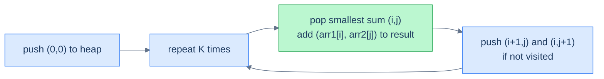

# K smallest sum pairs

## Problem Statement

Given two sorted arrays `arr1` and `arr2`, and a non-negative integer `k`, return the K pairs `(a, b)` (one element from each) with the smallest sum.

## Examples

**Example 1:**
```
Input:  arr1 = [1, 7, 11], arr2 = [2, 4, 6], k = 3
Output: [[1, 2], [1, 4], [1, 6]]
```

**Example 2:**
```
Input:  arr1 = [1, 1, 2], arr2 = [1, 2, 3], k = 2
Output: [[1, 1], [1, 1]]
```

**Example 3:**
```
Input:  arr1 = [1, 3, 4], arr2 = [4], k = 2
Output: [[1, 4], [3, 4]]
```

## Constraints

- `1 ≤ arr1.length, arr2.length ≤ 10⁴`
- `-10⁹ ≤ arr1[i], arr2[j] ≤ 10⁹`
- Both arrays are sorted in ascending order
- `1 ≤ k ≤ arr1.length × arr2.length`

```python run
import ast
import heapq

class Solution:
    def k_smallest_sum_pairs(self, arr1, arr2, k):
        # Your code goes here — push (sum, i, j) onto a min-heap starting from
        # (0, 0); on each pop add arr1[i+1,j] and arr1[i,j+1] if not visited.
        # Repeat k times. Return list of [a, b] pairs.
        return []

arr1 = ast.literal_eval(input())
arr2 = ast.literal_eval(input())
k = int(input())
print(Solution().k_smallest_sum_pairs(arr1, arr2, k))
```

```java run
import java.util.*;

public class Main {
  static int[] parseIntArray(String line) {
    String inner = line.replaceAll("[\\[\\]\\s]", "");
    if (inner.isEmpty()) return new int[0];
    String[] parts = inner.split(",");
    int[] out = new int[parts.length];
    for (int i = 0; i < parts.length; i++) out[i] = Integer.parseInt(parts[i].trim());
    return out;
  }

  static class Solution {
    public List<List<Integer>> kSmallestSumPairs(int[] arr1, int[] arr2, int k) {
      // Your code goes here — push {sum, i, j} onto a min-heap starting from
      // {0, 0}; on each pop push arr1[i+1,j] and arr1[i,j+1] if not visited.
      // Repeat k times. Return list of [a, b] pairs.
      return new ArrayList<>();
    }
  }

  public static void main(String[] args) {
    Scanner sc = new Scanner(System.in);
    int[] arr1 = parseIntArray(sc.nextLine());
    int[] arr2 = parseIntArray(sc.nextLine());
    int k = Integer.parseInt(sc.nextLine().trim());
    System.out.println(new Solution().kSmallestSumPairs(arr1, arr2, k));
  }
}
```

```testcases
{
  "args": [
    { "id": "arr1", "label": "arr1", "type": "int[]", "placeholder": "[1, 7, 11]" },
    { "id": "arr2", "label": "arr2", "type": "int[]", "placeholder": "[2, 4, 6]" },
    { "id": "k", "label": "k", "type": "int", "placeholder": "3" }
  ],
  "cases": [
    { "args": { "arr1": "[1, 7, 11]", "arr2": "[2, 4, 6]", "k": "3" }, "expected": "[[1, 2], [1, 4], [1, 6]]" },
    { "args": { "arr1": "[1, 1, 2]", "arr2": "[1, 2, 3]", "k": "2" }, "expected": "[[1, 1], [1, 1]]" },
    { "args": { "arr1": "[1, 3, 4]", "arr2": "[4]", "k": "2" }, "expected": "[[1, 4], [3, 4]]" },
    { "args": { "arr1": "[1]", "arr2": "[1]", "k": "1" }, "expected": "[[1, 1]]" },
    { "args": { "arr1": "[1, 7, 11]", "arr2": "[2, 4, 6]", "k": "1" }, "expected": "[[1, 2]]" }
  ]
}
```

<details>
<summary><h2>The Strategy</h2></summary>

There are `n × m` possible pairs — up to `n²` if both arrays are large. Generating all of them is expensive. The trick is **lazy expansion**: start with the smallest possible pair `(arr1[0], arr2[0])`, then *only* expand the neighbours of pairs we've already extracted.

When we pop pair `(i, j)`, the next-smallest pair adjacent to it is either `(i+1, j)` or `(i, j+1)` — we push both into the heap, marked as visited so we don't re-add them. Then pop the next-smallest from the heap. Repeat K times.



<p align="center"><strong>Lazy expansion: at most 2 new pairs added per popped pair, so the heap stays at O(K).</strong></p>

The comparator is "compare by sum, ascending". The pair record carries `(sum, i, j)` so we can recover the actual values.

</details>
<details>
<summary><h2>Solution</h2></summary>

Lazy-expansion heap: push `(sum, i, j)` starting from `(0, 0)`. Each pop yields the next smallest pair; push its two neighbours if unvisited. The output order is determined by the heap's pop sequence — since both arrays are sorted and expansion is BFS-like, pairs naturally come out in non-decreasing sum order with no tie ambiguity within the same sum+index path.

```python solution time=O(k log k) space=O(k)
import ast
import heapq

class PairWithSum:
    def __init__(self, sum_, index1, index2):
        self.sum = sum_
        self.index1 = index1
        self.index2 = index2
    def __lt__(self, other):
        return self.sum < other.sum

class Solution:
    def k_smallest_sum_pairs(self, arr1, arr2, k):
        n, m = len(arr1), len(arr2)
        result = []
        visited = set()
        min_heap = []
        heapq.heappush(min_heap, PairWithSum(arr1[0] + arr2[0], 0, 0))
        visited.add((0, 0))
        while k > 0 and min_heap:
            top = heapq.heappop(min_heap)
            i, j = top.index1, top.index2
            result.append([arr1[i], arr2[j]])
            if i + 1 < n and (i + 1, j) not in visited:
                heapq.heappush(min_heap, PairWithSum(arr1[i + 1] + arr2[j], i + 1, j))
                visited.add((i + 1, j))
            if j + 1 < m and (i, j + 1) not in visited:
                heapq.heappush(min_heap, PairWithSum(arr1[i] + arr2[j + 1], i, j + 1))
                visited.add((i, j + 1))
            k -= 1
        return result

arr1 = ast.literal_eval(input())
arr2 = ast.literal_eval(input())
k = int(input())
print(Solution().k_smallest_sum_pairs(arr1, arr2, k))
```

```java solution
import java.util.*;

public class Main {
  static int[] parseIntArray(String line) {
    String inner = line.replaceAll("[\\[\\]\\s]", "");
    if (inner.isEmpty()) return new int[0];
    String[] parts = inner.split(",");
    int[] out = new int[parts.length];
    for (int i = 0; i < parts.length; i++) out[i] = Integer.parseInt(parts[i].trim());
    return out;
  }

  static class PairWithSum {
    int sum, index1, index2;
    PairWithSum(int sum, int index1, int index2) {
      this.sum = sum; this.index1 = index1; this.index2 = index2;
    }
  }

  static class Solution {
    public List<List<Integer>> kSmallestSumPairs(int[] arr1, int[] arr2, int k) {
      int n = arr1.length, m = arr2.length;
      List<List<Integer>> result = new ArrayList<>();
      Set<String> visited = new HashSet<>();
      PriorityQueue<PairWithSum> minHeap = new PriorityQueue<>(
        (a, b) -> Integer.compare(a.sum, b.sum));
      minHeap.add(new PairWithSum(arr1[0] + arr2[0], 0, 0));
      visited.add("0,0");
      while (k > 0 && !minHeap.isEmpty()) {
        PairWithSum top = minHeap.poll();
        int i = top.index1, j = top.index2;
        result.add(Arrays.asList(arr1[i], arr2[j]));
        if (i + 1 < n && !visited.contains((i + 1) + "," + j)) {
          minHeap.add(new PairWithSum(arr1[i + 1] + arr2[j], i + 1, j));
          visited.add((i + 1) + "," + j);
        }
        if (j + 1 < m && !visited.contains(i + "," + (j + 1))) {
          minHeap.add(new PairWithSum(arr1[i] + arr2[j + 1], i, j + 1));
          visited.add(i + "," + (j + 1));
        }
        k--;
      }
      return result;
    }
  }

  public static void main(String[] args) {
    Scanner sc = new Scanner(System.in);
    int[] arr1 = parseIntArray(sc.nextLine());
    int[] arr2 = parseIntArray(sc.nextLine());
    int k = Integer.parseInt(sc.nextLine().trim());
    System.out.println(new Solution().kSmallestSumPairs(arr1, arr2, k));
  }
}
```

</details>
