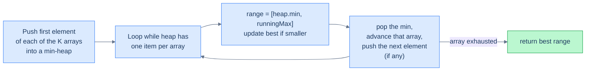

# K arrays smallest range

## Problem Statement

Given an array of `k` sorted integer arrays, return the **smallest range `[a, b]`** such that the range contains at least one number from each of the `k` arrays.

> A range `[a, b]` is "smaller than" `[c, d]` if `b − a < d − c`, or if their widths are equal and `a < c`.

### Example 1

> - **Input:** `arr = [[4, 8], [3, 6], [4, 5]]`
> - **Output:** `[3, 4]`

### Example 2

> - **Input:** `arr = [[1, 2, 5], [6, 7, 9], [3, 4]]`
> - **Output:** `[4, 6]`

### Example 3

> - **Input:** `arr = [[1, 5, 9], [3, 7, 12]]`
> - **Output:** `[1, 3]`

<details>
<summary><h2>The Strategy</h2></summary>


This is a classic **K-way merge** with a twist — we don't merge into one list, we slide a window across the merge.

**Key insight:** at any moment, if we have *one element from each list* in our hand, the smallest such range is `[min, max]` of the K values in hand. To shrink it, we have to advance whoever is the *minimum* — replacing them with the next element of their list (which is larger). Repeat. Stop when any list runs out.

The min-heap holds one record per list — `(value, listIndex, elementIndex)`. We track the running maximum separately. Each pop gives us the current `min`; the candidate range is `[min, max]`. After popping, we push the next element of that list (larger), updating `max` accordingly.



<p align="center"><strong>K-way merge with a sliding window. The min-heap tracks the smallest, an external <code>maxValue</code> tracks the largest, and their difference is the current candidate range.</strong></p>

</details>
<details>
<summary><h2>The Solution</h2></summary>


```python run viz=array viz-root=min_heap
import heapq
from typing import List

# Define a class to store the value, list index, and element index
class Element:
    def __init__(
        self, value: int, list_idx: int, element_idx: int
    ) -> None:
        self.value = value
        self.list_idx = list_idx
        self.element_idx = element_idx

    # For comparison in heapq
    def __lt__(self, other):
        return self.value < other.value

class Solution:
    def k_arrays_smallest_range(self, arr: List[List[int]]) -> List[int]:
        k = len(arr)

        # Define a min heap to store the elements from each list
        # The key of the heap is the value of the element
        # The value is a pair representing the list index and the
        # element index within the list
        min_heap = []

        # Initialize the maximum value seen so far
        max_value = float("-inf")

        # Initialize the heap with the first element from each list
        for i in range(k):
            if arr[i]:
                heapq.heappush(min_heap, Element(arr[i][0], i, 0))
                max_value = max(max_value, arr[i][0])

        # Initialize variables to track the smallest range
        range_start = -1
        range_end = -1
        range_length = float("inf")

        # Process the elements in the min heap until at least one element
        # from each list is included
        while len(min_heap) == k:

            # Extract the minimum element from the heap
            current = heapq.heappop(min_heap)

            value = current.value
            list_idx = current.list_idx
            idx = current.element_idx

            # Update the smallest range if the current range is smaller
            if max_value - value < range_length:
                range_start = value
                range_end = max_value
                range_length = range_end - range_start

            # Move to the next element in the list and update the maximum
            # value seen so far
            if idx + 1 < len(arr[list_idx]):
                heapq.heappush(
                    min_heap,
                    Element(arr[list_idx][idx + 1], list_idx, idx + 1),
                )
                max_value = max(max_value, arr[list_idx][idx + 1])

        # Return the smallest range as a list
        return [range_start, range_end]


# Examples from the problem statement
print(Solution().k_arrays_smallest_range([[4, 8], [3, 6], [4, 5]]))       # [3, 4]
print(Solution().k_arrays_smallest_range([[1, 2, 5], [6, 7, 9], [3, 4]])) # [4, 6]
print(Solution().k_arrays_smallest_range([[1, 5, 9], [3, 7, 12]]))        # [1, 3]

# Edge cases
print(Solution().k_arrays_smallest_range([[1], [2], [3]]))                # [1, 3] — single-element arrays
print(Solution().k_arrays_smallest_range([[1, 2], [1, 2]]))               # [1, 1] — identical arrays
print(Solution().k_arrays_smallest_range([[5], [5]]))                     # [5, 5] — same values
```

```java run viz=array viz-root=minHeap
import java.util.*;

public class Main {

    // Define an internal class to store the value, list index, and
    // element index
    static class Element {

        int value;
        int listIdx;
        int elementIdx;

        Element(int value, int listIdx, int elementIdx) {
            this.value = value;
            this.listIdx = listIdx;
            this.elementIdx = elementIdx;
        }
    }

    // Define an internal comparator class to compare the elements based
    // on their value
    static class CompareMinHeap implements Comparator<Element> {
        public int compare(Element a, Element b) {

            // Min-heap based on the value
            return Integer.compare(a.value, b.value);
        }
    }

    static class Solution {
        public List<Integer> kArraysSmallestRange(List<List<Integer>> arr) {
            int k = arr.size();

            // Define a min heap to store the elements from each list
            // The key of the heap is the value of the element
            // The value is a pair representing the list index and the
            // element index within the list
            PriorityQueue<Element> minHeap = new PriorityQueue<>(
                new CompareMinHeap()
            );

            // Initialize the maximum value seen so far
            int maxValue = Integer.MIN_VALUE;

            // Initialize the heap with the first element from each list
            for (int i = 0; i < k; i++) {
                if (!arr.get(i).isEmpty()) {
                    minHeap.add(new Element(arr.get(i).get(0), i, 0));
                    maxValue = Math.max(maxValue, arr.get(i).get(0));
                }
            }

            // Initialize variables to track the smallest range
            int rangeStart = -1;
            int rangeEnd = -1;
            int rangeLength = Integer.MAX_VALUE;

            // Process the elements in the min heap until at least one
            // element from each list is included
            while (minHeap.size() == k) {

                // Extract the minimum element from the heap
                Element current = minHeap.poll();

                int value = current.value;
                int listIdx = current.listIdx;
                int idx = current.elementIdx;

                // Update the smallest range if the current range is smaller
                if (maxValue - value < rangeLength) {
                    rangeStart = value;
                    rangeEnd = maxValue;
                    rangeLength = rangeEnd - rangeStart;
                }

                // Move to the next element in the list and update the
                // maximum value seen so far
                if (idx + 1 < arr.get(listIdx).size()) {
                    minHeap.add(
                        new Element(
                            arr.get(listIdx).get(idx + 1),
                            listIdx,
                            idx + 1
                        )
                    );
                    maxValue = Math.max(
                        maxValue,
                        arr.get(listIdx).get(idx + 1)
                    );
                }
            }

            // Return the smallest range as an array
            return List.of(rangeStart, rangeEnd);
        }
    }

    public static void main(String[] args) {
        // Examples from the problem statement
        System.out.println(new Solution().kArraysSmallestRange(
            List.of(List.of(4, 8), List.of(3, 6), List.of(4, 5))));       // [3, 4]

        System.out.println(new Solution().kArraysSmallestRange(
            List.of(List.of(1, 2, 5), List.of(6, 7, 9), List.of(3, 4)))); // [4, 6]

        System.out.println(new Solution().kArraysSmallestRange(
            List.of(List.of(1, 5, 9), List.of(3, 7, 12))));               // [1, 3]

        // Edge cases
        System.out.println(new Solution().kArraysSmallestRange(
            List.of(List.of(1), List.of(2), List.of(3))));                 // [1, 3]

        System.out.println(new Solution().kArraysSmallestRange(
            List.of(List.of(1, 2), List.of(1, 2))));                       // [1, 1]

        System.out.println(new Solution().kArraysSmallestRange(
            List.of(List.of(5), List.of(5))));                             // [5, 5]
    }
}
```

</details>
