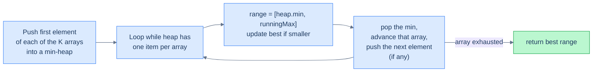

# K arrays smallest range

## Problem Statement

Given an array of `k` sorted integer arrays, return the **smallest range `[a, b]`** such that the range contains at least one number from each of the `k` arrays.

> A range `[a, b]` is "smaller than" `[c, d]` if `b − a < d − c`, or if their widths are equal and `a < c`.

## Examples

**Example 1:**
```
Input:  arr = [[4, 8], [3, 6], [4, 5]]
Output: [3, 4]
```

**Example 2:**
```
Input:  arr = [[1, 2, 5], [6, 7, 9], [3, 4]]
Output: [4, 6]
```

**Example 3:**
```
Input:  arr = [[1, 5, 9], [3, 7, 12]]
Output: [1, 3]
```

## Constraints

- `1 ≤ arr.length ≤ 3500`
- `1 ≤ arr[i].length ≤ 50`
- `-10⁵ ≤ arr[i][j] ≤ 10⁵`
- Each `arr[i]` is sorted in ascending order

```python run
import ast
import heapq

class Solution:
    def k_arrays_smallest_range(self, arr):
        # Your code goes here — initialize a min-heap with the first element
        # of each list plus a running max. Pop the min, check the candidate
        # range [min, max], then push the next element from that list.
        # Stop when any list is exhausted.
        return []

arr = ast.literal_eval(input())
print(Solution().k_arrays_smallest_range(arr))
```

```java run
import java.util.*;

public class Main {
  static int[][] parseIntMatrix(String line) {
    String trimmed = line.trim();
    if (trimmed.equals("[]") || trimmed.equals("[[]]")) return new int[0][];
    String inner = trimmed.substring(1, trimmed.length() - 1).trim();
    String[] rows = inner.split("\\],\\s*\\[");
    int[][] mat = new int[rows.length][];
    for (int r = 0; r < rows.length; r++) {
      String row = rows[r].replaceAll("[\\[\\]\\s]", "");
      if (row.isEmpty()) { mat[r] = new int[0]; continue; }
      String[] parts = row.split(",");
      mat[r] = new int[parts.length];
      for (int c = 0; c < parts.length; c++) mat[r][c] = Integer.parseInt(parts[c].trim());
    }
    return mat;
  }

  static class Solution {
    public List<Integer> kArraysSmallestRange(int[][] arr) {
      // Your code goes here — initialize a min-heap with the first element
      // of each row plus a running max. Pop the min, check [min, max], then
      // push the next element from that row. Stop when any row is exhausted.
      return new ArrayList<>();
    }
  }

  public static void main(String[] args) {
    Scanner sc = new Scanner(System.in);
    int[][] arr = parseIntMatrix(sc.nextLine());
    System.out.println(new Solution().kArraysSmallestRange(arr));
  }
}
```

```testcases
{
  "args": [
    { "id": "arr", "label": "arr", "type": "int[][]", "placeholder": "[[4, 8], [3, 6], [4, 5]]" }
  ],
  "cases": [
    { "args": { "arr": "[[4, 8], [3, 6], [4, 5]]" }, "expected": "[3, 4]" },
    { "args": { "arr": "[[1, 2, 5], [6, 7, 9], [3, 4]]" }, "expected": "[4, 6]" },
    { "args": { "arr": "[[1, 5, 9], [3, 7, 12]]" }, "expected": "[1, 3]" },
    { "args": { "arr": "[[1], [2], [3]]" }, "expected": "[1, 3]" },
    { "args": { "arr": "[[1, 2], [1, 2]]" }, "expected": "[1, 1]" },
    { "args": { "arr": "[[5], [5]]" }, "expected": "[5, 5]" }
  ]
}
```

<details>
<summary><h2>The Strategy</h2></summary>

This is a classic **K-way merge** with a twist — we don't merge into one list, we slide a window across the merge.

**Key insight:** at any moment, if we have *one element from each list* in our hand, the smallest such range is `[min, max]` of the K values in hand. To shrink it, we have to advance whoever is the *minimum* — replacing them with the next element of their list (which is larger). Repeat. Stop when any list runs out.

The min-heap holds one record per list — `(value, listIndex, elementIndex)`. We track the running maximum separately. Each pop gives us the current `min`; the candidate range is `[min, max]`. After popping, we push the next element of that list (larger), updating `max` accordingly.



<p align="center"><strong>K-way merge with a sliding window. The min-heap tracks the smallest, an external <code>maxValue</code> tracks the largest, and their difference is the current candidate range.</strong></p>

</details>
<details>
<summary><h2>Solution</h2></summary>

Push the first element from each row into a min-heap tracking `(value, rowIdx, colIdx)`. Keep a running `maxValue`. Each iteration: pop the minimum, check if `[min, maxValue]` is the best range so far, then push the next element of that row. Stop when any row is exhausted (heap size drops below k). The output is a 2-element list — deterministic.

```python solution time=O(n log k) space=O(k)
import ast
import heapq

class Element:
    def __init__(self, value, list_idx, element_idx):
        self.value = value
        self.list_idx = list_idx
        self.element_idx = element_idx
    def __lt__(self, other):
        return self.value < other.value

class Solution:
    def k_arrays_smallest_range(self, arr):
        k = len(arr)
        min_heap = []
        max_value = float("-inf")
        for i in range(k):
            if arr[i]:
                heapq.heappush(min_heap, Element(arr[i][0], i, 0))
                max_value = max(max_value, arr[i][0])
        range_start, range_end, range_length = -1, -1, float("inf")
        while len(min_heap) == k:
            current = heapq.heappop(min_heap)
            value, list_idx, idx = current.value, current.list_idx, current.element_idx
            if max_value - value < range_length:
                range_start = value
                range_end = max_value
                range_length = range_end - range_start
            if idx + 1 < len(arr[list_idx]):
                heapq.heappush(min_heap, Element(arr[list_idx][idx + 1], list_idx, idx + 1))
                max_value = max(max_value, arr[list_idx][idx + 1])
        return [range_start, range_end]

arr = ast.literal_eval(input())
print(Solution().k_arrays_smallest_range(arr))
```

```java solution
import java.util.*;

public class Main {
  static int[][] parseIntMatrix(String line) {
    String trimmed = line.trim();
    if (trimmed.equals("[]") || trimmed.equals("[[]]")) return new int[0][];
    String inner = trimmed.substring(1, trimmed.length() - 1).trim();
    String[] rows = inner.split("\\],\\s*\\[");
    int[][] mat = new int[rows.length][];
    for (int r = 0; r < rows.length; r++) {
      String row = rows[r].replaceAll("[\\[\\]\\s]", "");
      if (row.isEmpty()) { mat[r] = new int[0]; continue; }
      String[] parts = row.split(",");
      mat[r] = new int[parts.length];
      for (int c = 0; c < parts.length; c++) mat[r][c] = Integer.parseInt(parts[c].trim());
    }
    return mat;
  }

  static class Element {
    int value, listIdx, elementIdx;
    Element(int value, int listIdx, int elementIdx) {
      this.value = value; this.listIdx = listIdx; this.elementIdx = elementIdx;
    }
  }

  static class Solution {
    public List<Integer> kArraysSmallestRange(int[][] arr) {
      int k = arr.length;
      PriorityQueue<Element> minHeap = new PriorityQueue<>(
        (a, b) -> Integer.compare(a.value, b.value));
      int maxValue = Integer.MIN_VALUE;
      for (int i = 0; i < k; i++) {
        if (arr[i].length > 0) {
          minHeap.add(new Element(arr[i][0], i, 0));
          maxValue = Math.max(maxValue, arr[i][0]);
        }
      }
      int rangeStart = -1, rangeEnd = -1, rangeLength = Integer.MAX_VALUE;
      while (minHeap.size() == k) {
        Element current = minHeap.poll();
        int value = current.value, listIdx = current.listIdx, idx = current.elementIdx;
        if (maxValue - value < rangeLength) {
          rangeStart = value;
          rangeEnd = maxValue;
          rangeLength = rangeEnd - rangeStart;
        }
        if (idx + 1 < arr[listIdx].length) {
          minHeap.add(new Element(arr[listIdx][idx + 1], listIdx, idx + 1));
          maxValue = Math.max(maxValue, arr[listIdx][idx + 1]);
        }
      }
      return Arrays.asList(rangeStart, rangeEnd);
    }
  }

  public static void main(String[] args) {
    Scanner sc = new Scanner(System.in);
    int[][] arr = parseIntMatrix(sc.nextLine());
    System.out.println(new Solution().kArraysSmallestRange(arr));
  }
}
```

</details>
