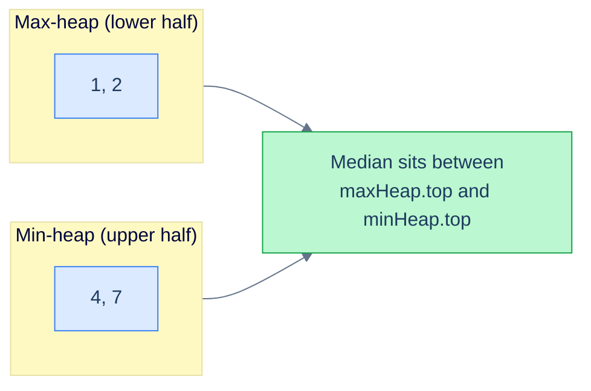
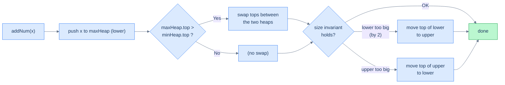

Real engineering rarely stops at "use the library priority queue" — it's "design a class that wraps one or two heaps to support a non-standard API". This lesson builds three heap-based structures from scratch:

1. **Max Heap** — implement the structure itself, no library shortcuts.
2. **Min Heap** — the mirror, from scratch.
3. **Median Finder** — the canonical **two-heaps** pattern: a max-heap of the "small half" and a min-heap of the "big half", so the running median is always at one of the two roots.

The median finder is the payoff — the **dual-heap balancing** technique you reach for whenever a problem says "running median", "running middle K", or "online order-statistics".

## Design a Max Heap

### Problem Statement

Implement a `MaxHeap` class **without using any built-in heap library**. The class should support:

- `MaxHeap()` — initialise an empty heap.
- `insert(val)` — push a value onto the heap.
- `remove(index)` — remove the value at `heap[index]`.
- `getMax()` — return the maximum value (without removing it).
- `extractMax()` — remove and return the maximum value.

### Example

> - **Input ops:** `[MaxHeap, insert, insert, remove, getMax, extractMax]`
> - **Input args:** `[[], [5], [3], [1], [], []]`
> - **Output:** `[null, null, null, null, 5, 5]`
>
> Walkthrough:
> - `insert(5)` → heap = `[5]`
> - `insert(3)` → heap = `[5, 3]`
> - `remove(1)` (removes the value at index 1) → heap = `[5]`
> - `getMax()` → returns `5`, heap unchanged
> - `extractMax()` → returns `5`, heap = `[]`

<details>
<summary><h2>The Strategy</h2></summary>


This is exactly the implementation we built in lesson 2, packaged as a class. The pieces:

- **Storage:** a single resizable array.
- **`upHeapify(i)`** — bubble up after an insert.
- **`downHeapify(i)`** — sift down after a remove.
- **`insert`** — append + `upHeapify`.
- **`remove`** — swap-with-last + pop + `downHeapify`.
- **`getMax`** — read `heap[0]`.
- **`extractMax`** — read `heap[0]`, then `remove(0)`.

</details>
<details>
<summary><h2>The Solution</h2></summary>


```python run viz=array viz-root=heap
from typing import List

class MaxHeap:
    def __init__(self) -> None:
        self.heap: List[int] = []

    # Helper function to restore heap property upwards (used in insert)
    def up_heapify(self, index: int) -> None:
        parent = (index - 1) // 2
        while index > 0 and self.heap[parent] < self.heap[index]:
            self.heap[parent], self.heap[index] = (
                self.heap[index],
                self.heap[parent],
            )
            index, parent = parent, (parent - 1) // 2

    # Helper function to maintain the max heap property downwards
    def down_heapify(self, index: int) -> None:
        largest = index
        left, right = 2 * index + 1, 2 * index + 2

        # Find the largest among the node and its left child
        if (
            left < len(self.heap)
            and self.heap[left] > self.heap[largest]
        ):
            largest = left

        # Find the largest among the node and its right child
        if (
            right < len(self.heap)
            and self.heap[right] > self.heap[largest]
        ):
            largest = right

        # If the largest is not the current node, swap and continue
        # heapify
        if largest != index:
            self.heap[index], self.heap[largest] = (
                self.heap[largest],
                self.heap[index],
            )
            self.down_heapify(largest)

    def insert(self, val: int) -> None:

        # Insert the new value at the end of the heap
        self.heap.append(val)

        # Get the index of the new value
        index = len(self.heap) - 1

        # Restore the max heap property by comparing with parent nodes
        self.up_heapify(index)

    def remove(self, index: int) -> None:

        # Replace the value with the largest possible value and heapify
        self.heap[index] = self.heap[-1]

        # Remove the last node
        self.heap.pop()

        # Restore the max heap property
        self.down_heapify(index)

    def get_max(self) -> int:
        if not self.heap:
            return -1

        # Return the root node
        return self.heap[0]

    def extract_max(self) -> int:
        if not self.heap:
            return -1

        # Extract the root node
        root = self.heap[0]

        # Delete the root node
        self.remove(0)

        # Return the extracted root node
        return root


# Example from the problem statement: [MaxHeap, insert, insert, remove, getMax, extractMax]
mh = MaxHeap()
mh.insert(5); mh.insert(3); mh.remove(1)
print(mh.get_max())     # 5
print(mh.extract_max()) # 5

# Additional tests — push/pop sequence
mh2 = MaxHeap()
mh2.insert(1); mh2.insert(9); mh2.insert(4); mh2.insert(7)
print(mh2.get_max())     # 9
print(mh2.extract_max()) # 9
print(mh2.get_max())     # 7

# Edge cases
mh3 = MaxHeap()
print(mh3.get_max())     # -1 — empty heap
print(mh3.extract_max()) # -1 — empty heap

mh4 = MaxHeap()
mh4.insert(42)
print(mh4.get_max())     # 42 — single element
print(mh4.extract_max()) # 42
print(mh4.get_max())     # -1 — now empty

mh5 = MaxHeap()
mh5.insert(3); mh5.insert(3); mh5.insert(3)
print(mh5.extract_max()) # 3 — all same
```

```java run viz=array viz-root=heap
import java.util.*;

public class Main {
    static class MaxHeap {
        private List<Integer> heap;

        public MaxHeap() {
            heap = new ArrayList<>();
        }

        private void swap(int i, int j) {
            int temp = heap.get(i);
            heap.set(i, heap.get(j));
            heap.set(j, temp);
        }

        // Helper function to restore heap property upwards (used in insert)
        private void upHeapify(int index) {
            int parent = (index - 1) / 2;
            while (index > 0 && heap.get(parent) < heap.get(index)) {
                swap(index, parent);
                index = parent;
                parent = (index - 1) / 2;
            }
        }

        // Helper function to maintain the max heap property downwards
        private void downHeapify(int index) {
            int largest = index;
            int left = 2 * index + 1;
            int right = 2 * index + 2;

            // Find the largest among the node and its left child
            if (left < heap.size() && heap.get(left) > heap.get(largest)) {
                largest = left;
            }

            // Find the largest among the node and its right child
            if (right < heap.size() && heap.get(right) > heap.get(largest)) {
                largest = right;
            }

            // If the largest is not the current node, swap and continue
            // heapify
            if (largest != index) {
                swap(index, largest);
                downHeapify(largest);
            }
        }

        public void insert(int val) {

            // Insert the new value at the end of the heap
            heap.add(val);

            // Get the index of the new value
            int index = heap.size() - 1;

            // Restore the max heap property by comparing with parent nodes
            upHeapify(index);
        }

        public void remove(int index) {

            // Replace the value with the largest possible value and heapify
            heap.set(index, heap.get(heap.size() - 1));

            // Remove the last node
            heap.remove(heap.size() - 1);

            // Restore the max heap property
            downHeapify(index);
        }

        public int getMax() {
            if (heap.isEmpty()) {
                return -1;
            }

            // Return the root node
            return heap.get(0);
        }

        public int extractMax() {
            if (heap.isEmpty()) {
                return -1;
            }

            // Extract the root node
            int root = heap.get(0);

            // Delete the root node
            remove(0);

            // Return the extracted root node
            return root;
        }
    }

    public static void main(String[] args) {
        // Example from the problem statement
        MaxHeap mh = new MaxHeap();
        mh.insert(5); mh.insert(3); mh.remove(1);
        System.out.println(mh.getMax());     // 5
        System.out.println(mh.extractMax()); // 5

        // Additional tests — push/pop sequence
        MaxHeap mh2 = new MaxHeap();
        mh2.insert(1); mh2.insert(9); mh2.insert(4); mh2.insert(7);
        System.out.println(mh2.getMax());     // 9
        System.out.println(mh2.extractMax()); // 9
        System.out.println(mh2.getMax());     // 7

        // Edge cases
        MaxHeap mh3 = new MaxHeap();
        System.out.println(mh3.getMax());     // -1 — empty heap
        System.out.println(mh3.extractMax()); // -1 — empty heap

        MaxHeap mh4 = new MaxHeap();
        mh4.insert(42);
        System.out.println(mh4.getMax());     // 42 — single element
        System.out.println(mh4.extractMax()); // 42
        System.out.println(mh4.getMax());     // -1 — now empty

        MaxHeap mh5 = new MaxHeap();
        mh5.insert(3); mh5.insert(3); mh5.insert(3);
        System.out.println(mh5.extractMax()); // 3 — all same
    }
}
```

</details>


***

## Design a Min Heap

### Problem Statement

Mirror image: implement a `MinHeap` class without built-in libraries. API:

- `MinHeap()` — initialise.
- `insert(val)` — push.
- `remove(index)` — remove the value at `heap[index]`.
- `getMin()` — return the minimum.
- `extractMin()` — remove and return the minimum.

### Example

> - **Input ops:** `[MinHeap, insert, insert, remove, getMin, extractMin]`
> - **Input args:** `[[], [5], [3], [1], [], []]`
> - **Output:** `[null, null, null, null, 3, 3]`

<details>
<summary><h2>The Strategy</h2></summary>


Identical to the max-heap, with `<` swapped for `>`. We name the helper "smallest" instead of "largest" for clarity, but the algorithm is mechanically the same.

</details>
<details>
<summary><h2>The Solution</h2></summary>


```python run viz=array viz-root=heap
from typing import List

class MinHeap:
    def __init__(self):
        self.heap: List[int] = []

    # Helper function to restore heap property upwards (used in insert)
    def up_heapify(self, index: int) -> None:
        parent = (index - 1) // 2
        while index > 0 and self.heap[parent] > self.heap[index]:
            self.heap[index], self.heap[parent] = (
                self.heap[parent],
                self.heap[index],
            )
            index = parent
            parent = (index - 1) // 2

    # Helper function to maintain the min heap property downwards
    def down_heapify(self, index: int) -> None:
        smallest = index
        left = 2 * index + 1
        right = 2 * index + 2

        # Find the smallest among the node and its left child
        if (
            left < len(self.heap)
            and self.heap[left] < self.heap[smallest]
        ):
            smallest = left

        # Find the smallest among the node and its right child
        if (
            right < len(self.heap)
            and self.heap[right] < self.heap[smallest]
        ):
            smallest = right

        # If the smallest is not the current node, swap and continue
        # heapify
        if smallest != index:
            self.heap[index], self.heap[smallest] = (
                self.heap[smallest],
                self.heap[index],
            )
            self.down_heapify(smallest)

    def insert(self, val: int) -> None:

        # Insert the new value at the end of the heap
        self.heap.append(val)

        # Get the index of the new value
        index = len(self.heap) - 1

        # Restore the min heap property by comparing with parent nodes
        self.up_heapify(index)

    def remove(self, index: int) -> None:

        # Replace the value with the largest possible value and heapify
        self.heap[index] = self.heap[-1]

        # Remove the last node
        self.heap.pop()

        # Restore the min heap property
        self.down_heapify(index)

    def get_min(self) -> int:
        if not self.heap:
            return -1

        # Return the root node
        return self.heap[0]

    def extract_min(self) -> int:
        if not self.heap:
            return -1

        # Extract the root node
        root = self.heap[0]

        # Delete the root node
        self.remove(0)

        # Return the extracted root node
        return root


# Example from the problem statement: [MinHeap, insert, insert, remove, getMin, extractMin]
mh = MinHeap()
mh.insert(5); mh.insert(3); mh.remove(1)
print(mh.get_min())     # 3
print(mh.extract_min()) # 3

# Additional tests — push/pop sequence
mh2 = MinHeap()
mh2.insert(9); mh2.insert(1); mh2.insert(4); mh2.insert(7)
print(mh2.get_min())     # 1
print(mh2.extract_min()) # 1
print(mh2.get_min())     # 4

# Edge cases
mh3 = MinHeap()
print(mh3.get_min())     # -1 — empty heap
print(mh3.extract_min()) # -1 — empty heap

mh4 = MinHeap()
mh4.insert(42)
print(mh4.get_min())     # 42 — single element
print(mh4.extract_min()) # 42
print(mh4.get_min())     # -1 — now empty

mh5 = MinHeap()
mh5.insert(7); mh5.insert(7); mh5.insert(7)
print(mh5.extract_min()) # 7 — all same
```

```java run viz=array viz-root=heap
import java.util.*;

public class Main {
    static class MinHeap {
        private ArrayList<Integer> heap;

        public MinHeap() {
            heap = new ArrayList<>();
        }

        // Helper function to restore heap property upwards (used in insert)
        private void upHeapify(int index) {
            int parent = (index - 1) / 2;
            while (index > 0 && heap.get(parent) > heap.get(index)) {
                int temp = heap.get(index);
                heap.set(index, heap.get(parent));
                heap.set(parent, temp);
                index = parent;
                parent = (index - 1) / 2;
            }
        }

        // Helper function to maintain the min heap property downwards
        private void downHeapify(int index) {
            int smallest = index;
            int left = 2 * index + 1;
            int right = 2 * index + 2;

            // Find the smallest among the node and its left child
            if (left < heap.size() && heap.get(left) < heap.get(smallest)) {
                smallest = left;
            }

            // Find the smallest among the node and its right child
            if (
                right < heap.size() && heap.get(right) < heap.get(smallest)
            ) {
                smallest = right;
            }

            // If the smallest is not the current node, swap and continue
            // heapify
            if (smallest != index) {
                int temp = heap.get(index);
                heap.set(index, heap.get(smallest));
                heap.set(smallest, temp);
                downHeapify(smallest);
            }
        }

        public void insert(int val) {

            // Insert the new value at the end of the heap
            heap.add(val);

            // Get the index of the new value
            int index = heap.size() - 1;

            // Restore the min heap property by comparing with parent nodes
            upHeapify(index);
        }

        public void remove(int index) {

            // Replace the value with the largest possible value and heapify
            heap.set(index, heap.get(heap.size() - 1));

            // Remove the last node
            heap.remove(heap.size() - 1);

            // Restore the min heap property
            downHeapify(index);
        }

        public int getMin() {
            if (heap.isEmpty()) {
                return -1;
            }

            // Return the root node
            return heap.get(0);
        }

        public int extractMin() {
            if (heap.isEmpty()) {
                return -1;
            }

            // Extract the root node
            int root = heap.get(0);

            // Delete the root node
            remove(0);

            // Return the extracted root node
            return root;
        }
    }

    public static void main(String[] args) {
        // Example from the problem statement
        MinHeap mh = new MinHeap();
        mh.insert(5); mh.insert(3); mh.remove(1);
        System.out.println(mh.getMin());     // 3
        System.out.println(mh.extractMin()); // 3

        // Additional tests — push/pop sequence
        MinHeap mh2 = new MinHeap();
        mh2.insert(9); mh2.insert(1); mh2.insert(4); mh2.insert(7);
        System.out.println(mh2.getMin());     // 1
        System.out.println(mh2.extractMin()); // 1
        System.out.println(mh2.getMin());     // 4

        // Edge cases
        MinHeap mh3 = new MinHeap();
        System.out.println(mh3.getMin());     // -1 — empty heap
        System.out.println(mh3.extractMin()); // -1 — empty heap

        MinHeap mh4 = new MinHeap();
        mh4.insert(42);
        System.out.println(mh4.getMin());     // 42 — single element
        System.out.println(mh4.extractMin()); // 42
        System.out.println(mh4.getMin());     // -1 — now empty

        MinHeap mh5 = new MinHeap();
        mh5.insert(7); mh5.insert(7); mh5.insert(7);
        System.out.println(mh5.extractMin()); // 7 — all same
    }
}
```

</details>


***

## Design a Median Finder

### Problem Statement

Implement a `MedianFinder` class that maintains the median of a *running stream* of integers. API:

- `MedianFinder()` — initialise.
- `addNum(num)` — insert a number into the stream.
- `findMedian()` — return the current median. (For even count, return the average of the two middles, as a `double`.)

### Example

> - **Input ops:** `[MedianFinder, addNum, addNum, addNum, findMedian]`
> - **Input args:** `[[], [1], [2], [4], []]`
> - **Output:** `[null, null, null, null, 2.0]`
>
> After the three adds, the sorted stream is `[1, 2, 4]`. Median = `2`.

(With `[1, 2]` it would be `1.5`; with `[1, 2, 3, 4]` it would be `2.5`.)

<details>
<summary><h2>The Strategy</h2></summary>


The naive approach maintains a sorted list and inserts in O(N) per `addNum` — too slow at scale. A heap-based approach gets us O(log N) per add and O(1) per median query.

**The core trick — two heaps:**



<p align="center"><strong>Two-heap median: a max-heap for the lower half, a min-heap for the upper half. The roots of the two heaps are the candidates for the median.</strong></p>

We split the stream into two halves:

- A **max-heap** `lower` holds the smaller half. Its top is the *largest of the smaller half*.
- A **min-heap** `upper` holds the larger half. Its top is the *smallest of the larger half*.

Two invariants:

1. **Size:** `len(lower) == len(upper)` OR `len(lower) == len(upper) + 1`. (We let `lower` carry the extra element when the count is odd.)
2. **Order:** every element in `lower` ≤ every element in `upper`. Equivalently, `lower.top() <= upper.top()`.

If invariant 1 holds, the median is:

- `lower.top()` when the total count is **odd** (`lower` has one extra element).
- `(lower.top() + upper.top()) / 2.0` when the total count is **even**.

### addNum

Pushing a new number is a two-step rebalance:

1. Push to `lower`.
2. **Order rebalance:** if `lower.top() > upper.top()`, swap the tops by extracting both and re-inserting on the opposite side. (This keeps invariant 2.)
3. **Size rebalance:** if `len(lower) > len(upper) + 1`, move `lower.top()` to `upper`. Conversely, if `len(upper) > len(lower)`, move `upper.top()` to `lower`. (This keeps invariant 1.)



<p align="center"><strong>Two-step rebalance: order first, then size. Each step touches at most one element on each side.</strong></p>

Each step is O(log N), so `addNum` is O(log N) overall.

### findMedian

If `lower.size > upper.size`, the median is `lower.top()` (count is odd). Otherwise the count is even and the median is the average of the two tops. **O(1)**.

</details>
<details>
<summary><h2>The Solution</h2></summary>


```python run viz=array viz-root=min_heap
import heapq

class MedianFinder:
    def __init__(self):

        # Stores the larger half of the numbers
        self.min_heap = []

        # Stores the smaller half of the numbers
        self.max_heap = []

    def add_num(self, num: int) -> None:

        # Add the number to the max heap (negated to simulate a max heap)
        heapq.heappush(self.max_heap, -num)

        # Balance the heaps to maintain the property:
        # len(max_heap) >= len(min_heap)
        # or
        # or len(max_heap) == len(min_heap) + 1
        if len(self.max_heap) > len(self.min_heap) + 1:

            # The max heap has more elements, so we extract the largest
            # element from it
            largest = -heapq.heappop(self.max_heap)

            # Add the largest element to the min heap
            heapq.heappush(self.min_heap, largest)

        # Balance the heaps to maintain the property:
        # max_heap[0] <= min_heap[0]
        if self.min_heap and -self.max_heap[0] > self.min_heap[0]:

            # The max heap's top element is larger than the min heap's
            # top element. Swap the elements to maintain the property

            # Fetch the smallest element from the max heap
            smallest = -heapq.heappop(self.max_heap)

            # Fetch the largest element from the min heap
            largest = heapq.heappop(self.min_heap)

            # Swap the elements
            heapq.heappush(self.max_heap, -largest)
            heapq.heappush(self.min_heap, smallest)

    def find_median(self) -> float:
        if len(self.max_heap) > len(self.min_heap):

            # The max heap has more elements, so the median is the top
            # element of the max heap
            return -self.max_heap[0]

        # The max heap and min heap have the same number of elements
        # Calculate the median as the average of the top elements of
        # both heaps
        return (-self.max_heap[0] + self.min_heap[0]) / 2


# Example from the problem statement: add 1, 2, 4 → median = 2
mf = MedianFinder()
mf.add_num(1); mf.add_num(2); mf.add_num(4)
print(mf.find_median())   # 2.0 — odd count, middle element

# Even count — median is average of two middle
mf2 = MedianFinder()
mf2.add_num(1); mf2.add_num(2)
print(mf2.find_median())  # 1.5

# Streaming — check after each insertion
mf3 = MedianFinder()
mf3.add_num(5)
print(mf3.find_median())  # 5.0
mf3.add_num(3)
print(mf3.find_median())  # 4.0
mf3.add_num(8)
print(mf3.find_median())  # 5.0

# Edge cases
mf4 = MedianFinder()
mf4.add_num(1); mf4.add_num(1); mf4.add_num(1)
print(mf4.find_median())  # 1.0 — all same

mf5 = MedianFinder()
mf5.add_num(100)
print(mf5.find_median())  # 100.0 — single element
```

```java run viz=array viz-root=min_heap
import java.util.*;

public class Main {
    static class MedianFinder {

        // Stores the smaller half of the numbers
        private PriorityQueue<Integer> maxHeap;

        // Stores the larger half of the numbers
        private PriorityQueue<Integer> minHeap;

        private MedianFinder() {

            // Use a max heap for the smaller half
            maxHeap = new PriorityQueue<>(Collections.reverseOrder());

            // Use a min heap for the larger half
            minHeap = new PriorityQueue<>();
        }

        public void addNum(int num) {

            // Add the number to the max heap
            maxHeap.add(num);

            // Balance the heaps to maintain the property:
            // maxHeap.size() >= minHeap.size()
            // or
            // maxHeap.size() == minHeap.size() + 1
            if (maxHeap.size() > minHeap.size() + 1) {

                // The max heap has more elements, so we extract the largest
                // element from it
                int largest = maxHeap.poll();

                // Add the largest element to the min heap
                minHeap.add(largest);
            }

            // Balance the heaps to maintain the property:
            // maxHeap.peek() <= minHeap.peek()
            if (!minHeap.isEmpty() && maxHeap.peek() > minHeap.peek()) {

                // The max heap's top element is larger than the min heap's
                // top element. Swap the elements to maintain the property

                // Fetch the smallest element from the max heap
                int smallest = maxHeap.poll();

                // Fetch the largest element from the min heap
                int largest = minHeap.poll();

                // Swap the elements
                maxHeap.add(largest);
                minHeap.add(smallest);
            }
        }

        public double findMedian() {
            if (maxHeap.size() > minHeap.size()) {

                // The max heap has more elements, so the median is the top
                // element of the max heap
                return maxHeap.peek();
            }

            // The max heap and min heap have the same number of elements
            // Calculate the median as the average of the top elements of
            // both heaps
            return (maxHeap.peek() + minHeap.peek()) / 2.0;
        }
    }

    public static void main(String[] args) {
        // Example from the problem statement: add 1, 2, 4 → median = 2
        MedianFinder mf = new MedianFinder();
        mf.addNum(1); mf.addNum(2); mf.addNum(4);
        System.out.println(mf.findMedian());   // 2.0 — odd count, middle element

        // Even count — median is average of two middle
        MedianFinder mf2 = new MedianFinder();
        mf2.addNum(1); mf2.addNum(2);
        System.out.println(mf2.findMedian());  // 1.5

        // Streaming — check after each insertion
        MedianFinder mf3 = new MedianFinder();
        mf3.addNum(5);
        System.out.println(mf3.findMedian());  // 5.0
        mf3.addNum(3);
        System.out.println(mf3.findMedian());  // 4.0
        mf3.addNum(8);
        System.out.println(mf3.findMedian());  // 5.0

        // Edge cases
        MedianFinder mf4 = new MedianFinder();
        mf4.addNum(1); mf4.addNum(1); mf4.addNum(1);
        System.out.println(mf4.findMedian());  // 1.0 — all same

        MedianFinder mf5 = new MedianFinder();
        mf5.addNum(100);
        System.out.println(mf5.findMedian());  // 100.0 — single element
    }
}
```


<details>
<summary><strong>Trace — addNum(1), addNum(2), addNum(4); then findMedian()</strong></summary>

```
Initial │ lower = [], upper = []

addNum(1)
  push 1 to lower    → lower = [1],     upper = []
  order check        → upper empty, skip
  size check         → |lower|=1, |upper|=0 → OK (lower has the extra)
  state: lower = [1], upper = []

addNum(2)
  push 2 to lower    → lower = [2, 1],  upper = []
  order check        → upper empty, skip
  size check         → |lower|=2, |upper|=0 → 2 > 0+1 → move top of lower to upper
                       lower = [1], upper = [2]
  state: lower = [1], upper = [2]

addNum(4)
  push 4 to lower    → lower = [4, 1],  upper = [2]
  order check        → lower.top=4 > upper.top=2 → SWAP
                       lower = [2, 1], upper = [4]
  size check         → |lower|=2, |upper|=1 → OK
  state: lower = [2, 1], upper = [4]

findMedian()
  |lower|=2, |upper|=1 → odd total → return lower.top() = 2.0
Result: 2.0 ✓
```

</details>

</details>
## Key Takeaway

The **two-heap pattern** is the lever to remember:

- **Two complementary heaps** — a max-heap on the *small* side and a min-heap on the *large* side — give O(log N) updates with O(1) access to the *middle* of the sorted stream.
- **Two invariants** — order (`lower.top() ≤ upper.top()`) and size (sizes equal, or `lower` ahead by 1). Every update restores order, then size.
- **It generalises** to the K-th order statistic in a stream, windowed median over the last K, and balanced-workload problems.

Three closing patterns: a heap is a **sorted stream with cheap updates** (partial order on dynamic data); **K-bounded heaps win on streams** (top-K / K-way merge in `O(N log K)`, memory bounded by K); and **custom orderings via comparators** let the same five operations work on any totally-ordered record.
