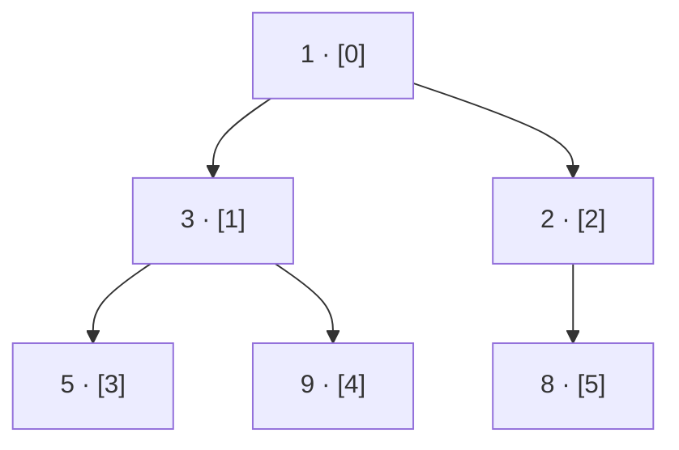

# Design a Heap

## Problem Statement

Implement a `MinHeap` class **without using any built-in heap library**. The class should support:

- `MinHeap()` — initialise an empty heap backed by a plain array.
- `push(val)` — insert `val`, maintaining the min-heap property.
- `pop()` — remove and return the minimum value.
- `peek()` — return the minimum value without removing it. Return `-1` if empty.
- `size()` — return the number of elements currently in the heap.

Use the standard array-index formulas: children of `i` are `2i+1` and `2i+2`; parent of `i` is `(i−1)//2`. Implement `sift_up` (called after push) and `sift_down` (called after pop) yourself.

## Examples

**Example 1 — push several values, then query:**

```
Input:  values = [5, 3, 8, 1, 9, 2]
Output:
  1        ← peek
  1        ← pop
  2        ← pop
  [3, 5, 8, 9]  ← final heap (array order)
```

**Example 2 — minimum must bubble up correctly:**

```
Input:  values = [10, 7, 4, 1]
Output:
  1        ← peek
  1        ← pop
  4        ← pop
  [7, 10]  ← final heap (array order)
```

## Constraints

- All values are integers in `[-10^4, 10^4]`.
- At least 3 values are pushed so the fixed pop sequence is always valid.
- At most 100 values pushed per case.

The workbench pushes all values in the `values` array, then runs a fixed op sequence: `peek → pop → pop`, printing one result per op, followed by the final heap contents as a list.

```python run viz=array viz-root=heap viz-kind=heap
import ast

class MinHeap:
    def __init__(self):
        self.heap = []

    def push(self, val):
        # Your code goes here — append val, then sift up
        pass

    def pop(self):
        # Your code goes here — swap root with last, pop last, sift down, return old root
        return -1

    def peek(self):
        # Your code goes here — return heap[0], or -1 if empty
        return -1

    def size(self):
        return len(self.heap)

    def _sift_up(self, i):
        # Your code goes here
        pass

    def _sift_down(self, i):
        # Your code goes here
        pass

mh = MinHeap()
for v in ast.literal_eval(input()):
    mh.push(v)

print(mh.peek())   # peek minimum
print(mh.pop())    # pop minimum (first)
print(mh.pop())    # pop minimum (second)
print(mh.heap)     # final heap backing array
```

```java run viz=array viz-root=heap viz-kind=heap
import java.util.*;

public class Main {
    static class MinHeap {
        List<Integer> heap = new ArrayList<>();

        public void push(int val) {
            // Your code goes here — add val, then sift up
        }

        public int pop() {
            // Your code goes here — swap root with last, remove last, sift down, return old root
            return -1;
        }

        public int peek() {
            // Your code goes here — return heap.get(0), or -1 if empty
            return -1;
        }

        public int size() { return heap.size(); }

        private void siftUp(int i) {
            // Your code goes here
        }

        private void siftDown(int i) {
            // Your code goes here
        }
    }

    public static void main(String[] args) {
        Scanner sc = new Scanner(System.in);
        int[] vals = parseIntArray(sc.nextLine());
        MinHeap mh = new MinHeap();
        for (int v : vals) mh.push(v);

        System.out.println(mh.peek());   // peek minimum
        System.out.println(mh.pop());    // pop minimum (first)
        System.out.println(mh.pop());    // pop minimum (second)
        System.out.println(mh.heap);     // final heap backing array
    }

    static int[] parseIntArray(String line) {
        String inner = line.replaceAll("[\\[\\]\\s]", "");
        if (inner.isEmpty()) return new int[0];
        String[] parts = inner.split(",");
        int[] out = new int[parts.length];
        for (int i = 0; i < parts.length; i++) out[i] = Integer.parseInt(parts[i]);
        return out;
    }
}
```

```testcases
{
  "args": [
    { "id": "values", "label": "values", "type": "int[]", "placeholder": "[5, 3, 8, 1, 9, 2]" }
  ],
  "cases": [
    { "args": { "values": "[5, 3, 8, 1, 9, 2]" }, "expected": "1\n1\n2\n[3, 5, 8, 9]" },
    { "args": { "values": "[10, 7, 4, 1]" },       "expected": "1\n1\n4\n[7, 10]" },
    { "args": { "values": "[3, 1, 2]" },            "expected": "1\n1\n2\n[3]" },
    { "args": { "values": "[8, 5, 3, 7, 6]" },     "expected": "3\n3\n5\n[6, 8, 7]" },
    { "args": { "values": "[4, 4, 4, 4]" },         "expected": "4\n4\n4\n[4, 4]" }
  ]
}
```

<details>
<summary><h2>Intuition</h2></summary>

The heap lives in a flat array; the tree structure is virtual — index arithmetic replaces pointers:

```
children of i  →  2i+1,  2i+2        parent of i  →  (i−1) // 2
```

**push** — append to the end, then **sift up**: while the new value is smaller than its parent, swap them upward. At most `log n` swaps.

**pop** — the minimum is always at index 0. Overwrite it with the last element, shrink the array, then **sift down**: repeatedly swap the node with its *smaller* child until the min-heap property holds. At most `log n` swaps.

**peek** — read `heap[0]` directly. `O(1)`.

The key insight: you never need to scan more than one root-to-leaf path to restore order, so both push and pop are `O(log n)`.



<p align="center"><strong>min-heap after pushing [5,3,8,1,9,2]: every parent ≤ its children; the minimum sits at index 0.</strong></p>

**MaxHeap is the mirror.** Flip every `<` to `>` in both `sift_up` and `sift_down`: the root then holds the *maximum* instead of the minimum. Everything else — the array layout, the index formulas, the `O(log n)` bounds — is identical.

**The two-heap pattern (Median Finder).** For a running median, maintain two heaps: a max-heap for the lower half and a min-heap for the upper half. After each insertion, rebalance so the sizes differ by at most 1 and the max-heap's top ≤ the min-heap's top. The median is then either the max-heap's top (odd total) or the average of the two tops (even total) — `O(log n)` per insert, `O(1)` per query.

</details>
<details>
<summary><h2>Solution &amp; Analysis</h2></summary>

### Solution

```python solution time=O(log n) space=O(n)
import ast

class MinHeap:
    def __init__(self):
        self.heap = []

    def push(self, val):
        self.heap.append(val)
        self._sift_up(len(self.heap) - 1)

    def pop(self):
        if not self.heap:
            return -1
        root = self.heap[0]
        self.heap[0] = self.heap[-1]
        self.heap.pop()
        if self.heap:
            self._sift_down(0)
        return root

    def peek(self):
        return self.heap[0] if self.heap else -1

    def size(self):
        return len(self.heap)

    def _sift_up(self, i):
        while i > 0:
            parent = (i - 1) // 2
            if self.heap[parent] > self.heap[i]:
                self.heap[parent], self.heap[i] = self.heap[i], self.heap[parent]
                i = parent
            else:
                break

    def _sift_down(self, i):
        n = len(self.heap)
        while True:
            smallest = i
            left, right = 2 * i + 1, 2 * i + 2
            if left < n and self.heap[left] < self.heap[smallest]:
                smallest = left
            if right < n and self.heap[right] < self.heap[smallest]:
                smallest = right
            if smallest == i:
                break
            self.heap[i], self.heap[smallest] = self.heap[smallest], self.heap[i]
            i = smallest

mh = MinHeap()
for v in ast.literal_eval(input()):
    mh.push(v)

print(mh.peek())   # peek minimum
print(mh.pop())    # pop minimum (first)
print(mh.pop())    # pop minimum (second)
print(mh.heap)     # final heap backing array
```

```java solution time=O(log n) space=O(n)
import java.util.*;

public class Main {
    static class MinHeap {
        List<Integer> heap = new ArrayList<>();

        public void push(int val) {
            heap.add(val);
            siftUp(heap.size() - 1);
        }

        public int pop() {
            if (heap.isEmpty()) return -1;
            int root = heap.get(0);
            heap.set(0, heap.get(heap.size() - 1));
            heap.remove(heap.size() - 1);
            if (!heap.isEmpty()) siftDown(0);
            return root;
        }

        public int peek() {
            return heap.isEmpty() ? -1 : heap.get(0);
        }

        public int size() { return heap.size(); }

        private void siftUp(int i) {
            while (i > 0) {
                int parent = (i - 1) / 2;
                if (heap.get(parent) > heap.get(i)) {
                    int tmp = heap.get(parent); heap.set(parent, heap.get(i)); heap.set(i, tmp);
                    i = parent;
                } else break;
            }
        }

        private void siftDown(int i) {
            int n = heap.size();
            while (true) {
                int smallest = i, left = 2 * i + 1, right = 2 * i + 2;
                if (left < n && heap.get(left) < heap.get(smallest)) smallest = left;
                if (right < n && heap.get(right) < heap.get(smallest)) smallest = right;
                if (smallest == i) break;
                int tmp = heap.get(i); heap.set(i, heap.get(smallest)); heap.set(smallest, tmp);
                i = smallest;
            }
        }
    }

    public static void main(String[] args) {
        Scanner sc = new Scanner(System.in);
        int[] vals = parseIntArray(sc.nextLine());
        MinHeap mh = new MinHeap();
        for (int v : vals) mh.push(v);

        System.out.println(mh.peek());   // peek minimum
        System.out.println(mh.pop());    // pop minimum (first)
        System.out.println(mh.pop());    // pop minimum (second)
        System.out.println(mh.heap);     // final heap backing array
    }

    static int[] parseIntArray(String line) {
        String inner = line.replaceAll("[\\[\\]\\s]", "");
        if (inner.isEmpty()) return new int[0];
        String[] parts = inner.split(",");
        int[] out = new int[parts.length];
        for (int i = 0; i < parts.length; i++) out[i] = Integer.parseInt(parts[i]);
        return out;
    }
}
```

### Dry Run — push [5, 3, 8, 1, 9, 2], peek, pop, pop

| Op | Action | heap after |
|---|---|---|
| push 5 | append, no parent | `[5]` |
| push 3 | append at 1, parent=0 holds 5; 3<5 → swap | `[3, 5]` |
| push 8 | append at 2, parent=0 holds 3; 8≥3 → stop | `[3, 5, 8]` |
| push 1 | append at 3, parent=1 holds 5; 1<5 → swap; parent=0 holds 3; 1<3 → swap | `[1, 3, 8, 5]` |
| push 9 | append at 4, parent=1 holds 3; 9≥3 → stop | `[1, 3, 8, 5, 9]` |
| push 2 | append at 5, parent=2 holds 8; 2<8 → swap; parent=0 holds 1; 2≥1 → stop | `[1, 3, 2, 5, 9, 8]` |
| peek | read heap[0] | → `1` |
| pop | root=1; move last (8) to root; sift down: children 3 and 2; min=2; swap 8↔2; children 8 and 9; min=8; stop | `[2, 3, 8, 5, 9]` → `1` |
| pop | root=2; move last (9) to root; sift down: children 3 and 8; min=3; swap 9↔3; children 5 and 9; min=5; 9>5 swap; settled | `[3, 5, 8, 9]` → `2` |
| print heap | final array | `[3, 5, 8, 9]` |

### Complexity

| Operation | Time | Space |
|---|---|---|
| push | O(log n) | O(1) amortised |
| pop | O(log n) | O(1) |
| peek | O(1) | O(1) |
| Heap storage | — | O(n) |

### Edge Cases

- **Duplicate values** — the heap property `≤` allows equal values; both sift directions handle them (the sift stops when the element is not strictly smaller than its parent/children, which is correct for `≤`-ordered heaps).
- **Single element** — pop moves the last element to index 0 then skips `sift_down` (the guard `if self.heap` / `if (!heap.isEmpty())` after removal prevents an empty-heap sift).
- **Empty heap** — peek and pop return `-1` rather than crashing.

</details>
