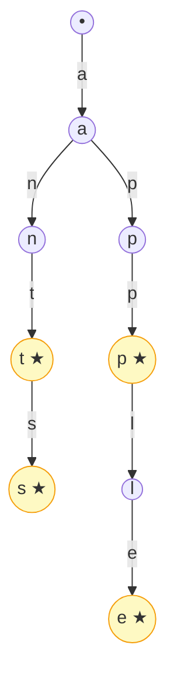
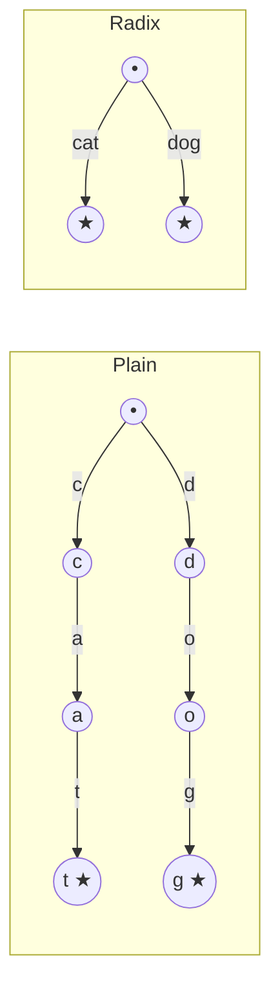

# Introduction to Tries

## Why It Exists

Type `ne` into a search box and ten suggestions appear before your finger lifts — `netflix`, `news`, `nest`, `netherlands`. The dictionary behind that drop-down holds hundreds of millions of strings, yet the lookup is measured in microseconds.

A **hash table can't do this**. It maps `"netflix"` to its data, but it has no order — it cannot enumerate everything that *starts with* `ne`. A **sorted array** can (binary-search to the first match, walk forward) but pays `O(log N + K)`, and each comparison scans up to a full word. A balanced BST has the same problem: cost grows with `N`, the number of stored strings.

The **trie** (pronounced "try," from re*trie*val) makes a prefix query cost only **`O(L)`** — the length of the query string — *regardless of how many strings are stored*. The trick: don't store whole words and compare them. Store the shared **prefix structure** of every word as a tree, and walk down one character at a time. `apple` is five pointer hops, zero comparisons. Every autocomplete, spell-checker, and IP-routing table runs on a trie or a compressed cousin.

## See It Work

A trie over `apple, app, apt, ant, ants, and`. `search` asks "is this a *stored word*?"; `starts_with` asks "is this a *prefix* of one?"; `words_with_prefix` is autocomplete. Run it.

```python run viz=trie viz-root=root viz-kind=trie
class TrieNode:
    __slots__ = ("children", "is_end")
    def __init__(self):
        self.children = {}           # char -> TrieNode
        self.is_end = False          # marks the end of a STORED word

class Trie:
    def __init__(self):
        self.root = TrieNode()

    def insert(self, word):
        node = self.root
        for ch in word:                                  # walk, creating nodes
            if ch not in node.children:
                node.children[ch] = TrieNode()
            node = node.children[ch]
        node.is_end = True                               # mark the final node

    def _walk(self, s):                                  # follow s; None if it falls off
        node = self.root
        for ch in s:
            if ch not in node.children:
                return None
            node = node.children[ch]
        return node

    def search(self, word):
        node = self._walk(word)
        return node is not None and node.is_end          # reached AND end-of-word

    def starts_with(self, prefix):
        return self._walk(prefix) is not None            # reached — marker irrelevant

    def words_with_prefix(self, prefix):
        node = self._walk(prefix)
        if node is None:
            return []
        out = []
        def dfs(n, path):                                # collect every word below
            if n.is_end:
                out.append("".join(path))
            for ch, child in n.children.items():
                path.append(ch); dfs(child, path); path.pop()
        dfs(node, list(prefix))
        return out

t = Trie()
for w in ["apple", "app", "apt", "ant", "ants", "and"]:
    t.insert(w)
print("search('app')     ->", t.search("app"))            # True
print("search('ap')      ->", t.search("ap"))             # False — a prefix, not a word
print("starts_with('ap') ->", t.starts_with("ap"))        # True
print("words 'an'        ->", sorted(t.words_with_prefix("an")))   # ['and', 'ant', 'ants']
```

## How It Works

A trie is a tree where **the root is the empty string**, **each edge carries one character**, **each node represents the string spelled by its root path**, and a node is flagged `is_end` when that string is a *stored word*.



<p align="center"><strong>the trie holding <code>ant, ants, app, apple</code>. Stars mark end-of-word nodes. The shared prefix <code>a</code> is one node every <code>a</code>-word reuses.</strong></p>

Every operation is the **same walk** from the root, one character per hop:

| Operation | What it does | Cost |
|---|---|---|
| `insert(word)` | walk, allocating missing children; mark `is_end` at the end | `O(L)` |
| `search(word)` | walk; return `reached AND is_end` | `O(L)` |
| `starts_with(prefix)` | walk; return `reached` (ignore `is_end`) | `O(L)` |
| `words_with_prefix(p)` | walk to `p`, then DFS collecting end-of-word nodes | `O(L + K·L_avg)` |

`L` is the query length; `K` the number of matches. Crucially, **`N` (how many words are stored) never appears** — that's the whole point. A node's children are usually a `Map<char, Node>` (sparse, any alphabet) or a fixed array of 26 pointers (dense, fast, English).

### Key Takeaway

A trie stores the shared prefix structure of its strings as a tree: root = empty string, edges = characters, `is_end` marks stored words. Every operation is one root-down walk costing `O(L)` in the *query* length, independent of how many strings are stored — the property a hash table and a BST can't match for prefix queries.

## Trace It

From the run above: `search("ap")` returns **`False`**, but `starts_with("ap")` returns **`True`** — for the *same* string on the *same* trie.

Before you read on: the walk for both reaches the exact same node (the one spelling `"ap"`). The only thing that differs is whether the code consults `is_end`. So picture deleting the `is_end` field entirely — every node treated as "present." What does `search` collapse into, and why does that make the trie unable to tell `app` from `apple`?

`search` would collapse into `starts_with` — it could no longer distinguish **"this string is a stored word"** from **"this string is merely a prefix of one."** Walk `"ap"`: the node exists because it's on the path to `app`, `apple`, `apt`. With `is_end`, `search("ap")` sees the node is *not* flagged and correctly returns `False` — `ap` was never inserted as a word. Without `is_end`, "the node exists" is the only signal, so `search("ap")` returns `True` — wrong. The same erasure makes `app` and `apple` indistinguishable: both are just paths from the root, and nothing records that `app` is a complete dictionary entry while the node spelling `ap` is not. The `is_end` marker is the one bit that separates the *path* a string traces from the *fact* that the string was stored. It's why a trie needs a boolean per node and not just the edges — and why "forgot the end-of-word marker" is the classic first-trie bug, turning a dictionary into a mere prefix set. (The flip side: `starts_with` deliberately ignores `is_end`, because a prefix query only cares that the path exists.)

## Your Turn

The trie in both languages — `insert` / `search` / `starts_with`, the LeetCode-208 core:

```python run viz=trie viz-root=root viz-kind=trie
class TrieNode:
    __slots__ = ("children", "is_end")
    def __init__(self):
        self.children = {}; self.is_end = False

class Trie:
    def __init__(self):
        self.root = TrieNode()
    def insert(self, word):
        node = self.root
        for ch in word:
            node = node.children.setdefault(ch, TrieNode())
        node.is_end = True
    def _walk(self, s):
        node = self.root
        for ch in s:
            if ch not in node.children: return None
            node = node.children[ch]
        return node
    def search(self, word):
        n = self._walk(word); return n is not None and n.is_end
    def starts_with(self, prefix):
        return self._walk(prefix) is not None

t = Trie()
for w in ["apple", "app", "apt"]: t.insert(w)
print(t.search("app"), t.search("ap"), t.starts_with("ap"))   # True False True
```

```java run viz=trie viz-root=root viz-kind=trie
import java.util.*;
public class Main {
  static class TrieNode {
    Map<Character, TrieNode> children = new HashMap<>();
    boolean isEnd = false;
  }
  static class Trie {
    TrieNode root = new TrieNode();
    void insert(String word) {
      TrieNode node = root;
      for (char ch : word.toCharArray())
        node = node.children.computeIfAbsent(ch, k -> new TrieNode());
      node.isEnd = true;
    }
    TrieNode walk(String s) {
      TrieNode node = root;
      for (char ch : s.toCharArray()) {
        node = node.children.get(ch);
        if (node == null) return null;
      }
      return node;
    }
    boolean search(String word) { TrieNode n = walk(word); return n != null && n.isEnd; }
    boolean startsWith(String prefix) { return walk(prefix) != null; }
  }
  public static void main(String[] args) {
    Trie t = new Trie();
    for (String w : new String[]{"apple", "app", "apt"}) t.insert(w);
    System.out.println(t.search("app") + " " + t.search("ap") + " " + t.startsWith("ap"));  // true false true
  }
}
```

Then climb the ladder: **Implement Trie** ([LeetCode 208](https://leetcode.com/problems/implement-trie-prefix-tree/)) is exactly this; **Word Search II** ([212](https://leetcode.com/problems/word-search-ii/)) builds a trie over the word list and DFS-prunes a letter board; **Replace Words** ([648](https://leetcode.com/problems/replace-words/)) walks each word to its first end-of-word root; **Stream of Characters** ([1032](https://leetcode.com/problems/stream-of-characters/)) tries reversed patterns.

## Reflect & Connect

The trie is the data structure of prefixes:

- **The family** — autocomplete (`words_with_prefix`), spell-check "did you mean…" (DFS with an edit budget), multi-pattern stream matching ([Aho–Corasick](/cortex/data-structures-and-algorithms/strings/aho-corasick) = trie + failure links), word-search puzzles (trie-pruned board DFS), and longest-prefix IP match.
- **Compression — the radix trie** — a plain trie wastes a long single-child chain on `internationalisation`. A **compressed (radix / PATRICIA) trie** collapses each single-child chain into one edge labelled with the whole substring; insert/delete get fancier (you must *split* edges) but stay `O(L)`. Cat-and-dog shrinks from 6 nodes to 3:



<p align="center"><strong>A plain trie spends one node per character (<code>c-a-t</code>, <code>d-o-g</code> = 6 nodes); a radix (PATRICIA) trie collapses each single-child chain into one labelled edge, shrinking the same two words to 3 nodes.</strong></p>

- **When a trie wins (and loses)** — it shines when prefixes are *shared* **and** you need *prefix* queries. For pure exact-match, a [hash table](/cortex/data-structures-and-algorithms/linear-structures/hash-table/what-is-a-hash-table) is faster and simpler; for sorted iteration, a BST suffices. With unrelated keys (UUIDs, hashes) nothing is shared, so the trie degenerates to one node per character with no savings.
- **In production** — Linux's `fib_trie.c` routes every packet through a level-compressed radix trie (RCU for lock-free reads); DuckDB and HyPer index memory with the **Adaptive Radix Tree** (node layouts of 4/16/48/256 by population); B+-tree leaves do prefix compression, the radix idea applied to disk blocks — you'll see it again in the [B-tree chapter](/cortex/data-structures-and-algorithms/trees/b-tree/introduction-to-b-trees).

**Prerequisites:** [Binary Tree](/cortex/data-structures-and-algorithms/trees/binary-tree/introduction-to-binary-trees), [Hash Table](/cortex/data-structures-and-algorithms/linear-structures/hash-table/what-is-a-hash-table).
**What's next:** trees that *keep themselves short* so search stays `O(log n)` — the [self-balancing overview](/cortex/data-structures-and-algorithms/trees/self-balancing-bst-overview/self-balancing-bst-overview).

## Recall

> **Mnemonic:** *Path spells the string; edges are characters; `is_end` marks a stored word. Cost is `O(L)` in the query length, never in `N`. Forget `is_end` and `search` rots into `starts_with`.*

| | |
|---|---|
| Node | children map (`char → node`) + `is_end` flag |
| Every op | one root-down walk, one char per hop |
| insert / search / starts_with | all `O(L)` (query length), independent of `N` |
| enumerate-with-prefix | `O(L + K·L_avg)` — walk to prefix, DFS the subtree |
| Radix / PATRICIA | collapse single-child chains into substring edges |
| Wins when | prefixes shared **and** prefix queries needed |

<details>
<summary><strong>Q:</strong> Time to insert/search/prefix-check a string of length `L`?</summary>

**A:** `O(L)`, independent of how many strings are stored.

</details>
<details>
<summary><strong>Q:</strong> Why is the end-of-word marker essential?</summary>

**A:** It distinguishes a *stored word* from a mere *prefix* of one; without it `search` collapses into `starts_with` and `app` can't be told from `apple`.

</details>
<details>
<summary><strong>Q:</strong> Why a trie over a hash set for autocomplete?</summary>

**A:** A hash set has no order and can't enumerate "everything starting with X"; a trie answers prefix queries in `O(L + matches)` regardless of dictionary size.

</details>
<details>
<summary><strong>Q:</strong> When does a trie *not* save space?</summary>

**A:** When prefixes aren't shared (random keys/UUIDs) — it becomes one node per character with no compression.

</details>
<details>
<summary><strong>Q:</strong> What does a compressed (radix) trie change?</summary>

**A:** It collapses each single-child chain into one edge labelled with the full substring, saving memory on deep sparse trees while keeping `O(L)`.

</details>

## Sources & Verify

- **Sedgewick & Wayne**, *Algorithms*, 4th ed., §5.2 — R-way tries and ternary search tries; the canonical treatment.
- **CLRS**, *Introduction to Algorithms*, 4th ed., §12 / Problem 12-2 — radix/prefix trees on strings.
- Leis et al., *The Adaptive Radix Tree* (ICDE 2013) — the ART layout used by DuckDB/HyPer; very readable. Implement Trie is [LeetCode 208](https://leetcode.com/problems/implement-trie-prefix-tree/). Both runnable blocks are verified by running (`search('app') ⇒ True`, `search('ap') ⇒ False`, `starts_with('ap') ⇒ True`, `words_with_prefix('an') ⇒ ['and','ant','ants']`).
