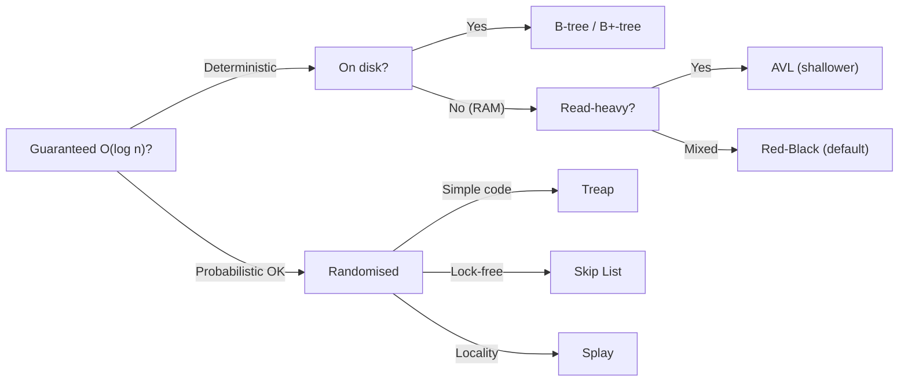

# Self-Balancing BSTs — Overview

## Why It Exists

Insert `1, 2, 3, …, 1_000_000` into a plain BST. What you get back is *not* a tree — it's a linked list. Every key is larger than all the ones before it, so each goes right, and the structure becomes a single million-node chain. A "BST search" is now a million pointer-chases. The `O(log n)` every BST chapter advertised has collapsed to **`O(n)`** — insert, search, delete, all linear. The indexed dictionary became the array you were trying to escape.

This is the **unbalanced-BST cliff**, and the adversary isn't malice — it's *accident*. Sorted input arrives every day: an `INSERT … ORDER BY` populating a fresh table, a pre-sorted import file, a service replaying events in timestamp order. The gap between average and worst case is `n / log n` — a factor of ~50,000 at a million keys.

The fix: make the tree **rebalance itself** on every insert and delete, holding its height to `O(log n)` *regardless of input order* — without blowing the `O(log n)` budget you're protecting. That's what AVL, Red-Black, B-trees, and friends do. This overview is the map: what "balanced" means, the menu, and which one to reach for.

## See It Work

The cliff, measured. The *same n keys* inserted sorted versus in bisection order. Height is the longest root-to-leaf path in edges. Run it.

```python run viz=binary-tree viz-root=root
import ast

class Node:
    __slots__ = ("key", "left", "right")
    def __init__(self, k): self.key, self.left, self.right = k, None, None

def insert(root, k):                          # iterative BST insert
    if root is None: return Node(k)
    cur = root
    while True:
        if k < cur.key:
            if cur.left is None: cur.left = Node(k); return root
            cur = cur.left
        else:
            if cur.right is None: cur.right = Node(k); return root
            cur = cur.right

def height(root):                             # edges on the longest path
    if root is None: return -1
    return 1 + max(height(root.left), height(root.right))

def bisection(lo, hi, out):                   # insert order that builds a balanced BST
    if lo > hi: return
    mid = (lo + hi) // 2
    out.append(mid); bisection(lo, mid - 1, out); bisection(mid + 1, hi, out)

n = int(input())
sorted_root = None
for x in range(1, n + 1): sorted_root = insert(sorted_root, x)
print("sorted insert:   height =", height(sorted_root))

order = []; bisection(1, n, order)
bal_root = None
for x in order: bal_root = insert(bal_root, x)
print("balanced insert: height =", height(bal_root))
```

```java run viz=binary-tree viz-root=root
import java.util.*;
public class Main {
  static class Node { int key; Node left, right; Node(int k){ key = k; } }
  static Node insert(Node root, int k) {
    if (root == null) return new Node(k);
    Node cur = root;
    while (true) {
      if (k < cur.key) {
        if (cur.left == null) { cur.left = new Node(k); return root; }
        cur = cur.left;
      } else {
        if (cur.right == null) { cur.right = new Node(k); return root; }
        cur = cur.right;
      }
    }
  }
  static int height(Node n) { return n == null ? -1 : 1 + Math.max(height(n.left), height(n.right)); }
  static void bisection(int lo, int hi, List<Integer> out) {
    if (lo > hi) return;
    int mid = (lo + hi) / 2;
    out.add(mid); bisection(lo, mid - 1, out); bisection(mid + 1, hi, out);
  }
  public static void main(String[] args) {
    Scanner sc = new Scanner(System.in);
    int n = Integer.parseInt(sc.nextLine().trim());
    Node sorted = null;
    for (int x = 1; x <= n; x++) sorted = insert(sorted, x);
    System.out.println("sorted insert:   height = " + height(sorted));
    List<Integer> order = new ArrayList<>();
    bisection(1, n, order);
    Node bal = null;
    for (int x : order) bal = insert(bal, x);
    System.out.println("balanced insert: height = " + height(bal));
  }
}
```

```testcases
{
  "args": [
    { "id": "n", "label": "n (keys 1..n)", "type": "number", "placeholder": "31" }
  ],
  "cases": [
    { "args": { "n": "31" }, "expected": "sorted insert:   height = 30\nbalanced insert: height = 4" },
    { "args": { "n": "7" },  "expected": "sorted insert:   height = 6\nbalanced insert: height = 2" },
    { "args": { "n": "15" }, "expected": "sorted insert:   height = 14\nbalanced insert: height = 3" },
    { "args": { "n": "1" },  "expected": "sorted insert:   height = 0\nbalanced insert: height = 0" }
  ]
}
```

Both print `sorted insert: height = 30` and `balanced insert: height = 4` — the same 31 keys, the same two orders, a factor-of-7 difference in height.

## How It Works

"Balanced" has no single definition — each structure enforces its own invariant, but all of them bound height to `O(log n)`:

- **Height-balanced** (AVL): every node's left/right subtree heights differ by ≤1. Strictest — height ≤ `1.44 log₂ n`.
- **Weight-balanced via colouring** (Red-Black): every root-to-leaf path has the same count of "black" nodes. Looser — height ≤ `2 log₂(n+1)`.
- **Probabilistically balanced** (Treap, Skip List): randomness makes *expected* height `O(log n)` for *any* input order.
- **Amortized balanced** (Splay): a single op can be deep, but any sequence averages `O(log n)` each.

The universal repair tool is the **rotation** — a constant-time, local pointer rewire that changes a node's depth while **preserving the in-order (sorted) sequence**. That last property is everything: rotating to fix balance never breaks the BST ordering, so search still works. After each mutation, the tree restores its invariant with a bounded number of rotations.



<p align="center"><strong>pick by storage (RAM vs disk), then by workload (read-heavy / mixed / concurrent / locality).</strong></p>

### Key Takeaway

A plain BST is `O(log n)` on random input and `O(n)` on sorted input — and sorted input happens by accident. Self-balancing trees enforce a height invariant (height/weight/probabilistic/amortized) and restore it after each mutation with rotations — local pointer rewires that preserve sorted order. All guarantee `O(log n)`; they differ only in constants, write cost, and per-node overhead.

## Trace It

AVL and Red-Black are *both* `O(log n)` for search, insert, and delete, and AVL is the **shallower** of the two (height `1.44 log n` vs `2 log n`) — so AVL lookups walk fewer levels.

Before you read on: given that, you'd expect AVL to be the default everywhere. Yet virtually every standard library ships **Red-Black** — Java's `TreeMap`, C++'s `std::map`, the Linux kernel's `lib/rbtree.c`. If AVL is shallower *and* the asymptotics are identical, why did the industry standardise on the taller tree?

Because **the decision is about write cost and per-node overhead, not asymptotics** — and that's the thesis of this whole chapter. AVL's strict height invariant is *expensive to maintain*: an insert needs at most one rotation, but a **delete can cascade up to `O(log n)` rotations** rippling toward the root as each level's balance factor goes out of range. Red-Black's looser invariant caps rebalancing at **≤2 rotations per insert and ≤3 per delete** — constant, no matter the tree size. On a mixed or write-heavy workload, those bounded rotations win decisively, and the price — a tree ~30% taller — barely dents lookup time because both are still logarithmic. Add the memory angle: AVL stores a height or balance factor (~4 bytes) per node, while Red-Black needs a **single colour bit**, routinely packed into the low bit of an existing pointer for *zero* extra bytes — a real saving across millions of nodes. So the standard-library default optimises the metric that actually varies in practice (write throughput and footprint) and treats the equal asymptotics as a wash. AVL still wins its niche — **read-heavy, write-rare** workloads where the shallower tree's faster lookups dominate and deletes are infrequent enough that rotation cascades never matter. The lesson generalises: when two structures share an asymptotic class, the choice is decided by constant factors and the shape of your workload, not the big-O.

## Your Turn

The cliff is language-independent — the same experiment in both, measuring height after a sorted versus bisection-ordered build:

```python run viz=binary-tree viz-root=root
class Node:
    __slots__ = ("key", "left", "right")
    def __init__(self, k): self.key, self.left, self.right = k, None, None

def insert(root, k):
    if root is None: return Node(k)
    cur = root
    while True:
        if k < cur.key:
            if cur.left is None: cur.left = Node(k); return root
            cur = cur.left
        else:
            if cur.right is None: cur.right = Node(k); return root
            cur = cur.right

def height(r):
    return -1 if r is None else 1 + max(height(r.left), height(r.right))

def bisection(lo, hi, out):
    if lo > hi: return
    mid = (lo + hi) // 2
    out.append(mid); bisection(lo, mid - 1, out); bisection(mid + 1, hi, out)

n = int(input())
root = None
for x in range(1, n + 1): root = insert(root, x)
print("sorted height:", height(root))
order = []
bisection(1, n, order)
bal = None
for x in order: bal = insert(bal, x)
print("balanced height:", height(bal))
```

```java run viz=binary-tree viz-root=root
import java.util.*;
public class Main {
  static class Node { int key; Node left, right; Node(int k){ key = k; } }
  static Node insert(Node root, int k) {
    if (root == null) return new Node(k);
    Node cur = root;
    while (true) {
      if (k < cur.key) {
        if (cur.left == null) { cur.left = new Node(k); return root; }
        cur = cur.left;
      } else {
        if (cur.right == null) { cur.right = new Node(k); return root; }
        cur = cur.right;
      }
    }
  }
  static int height(Node n) { return n == null ? -1 : 1 + Math.max(height(n.left), height(n.right)); }
  static void bisection(int lo, int hi, List<Integer> out) {
    if (lo > hi) return;
    int mid = (lo + hi) / 2;
    out.add(mid); bisection(lo, mid - 1, out); bisection(mid + 1, hi, out);
  }
  public static void main(String[] args) {
    Scanner sc = new Scanner(System.in);
    int n = Integer.parseInt(sc.nextLine().trim());
    Node sorted = null;
    for (int x = 1; x <= n; x++) sorted = insert(sorted, x);
    System.out.println("sorted height: " + height(sorted));
    List<Integer> order = new ArrayList<>();
    bisection(1, n, order);
    Node bal = null;
    for (int x : order) bal = insert(bal, x);
    System.out.println("balanced height: " + height(bal));
  }
}
```

```testcases
{
  "args": [
    { "id": "n", "label": "n (keys 1..n)", "type": "number", "placeholder": "31" }
  ],
  "cases": [
    { "args": { "n": "31" }, "expected": "sorted height: 30\nbalanced height: 4" },
    { "args": { "n": "7" },  "expected": "sorted height: 6\nbalanced height: 2" },
    { "args": { "n": "15" }, "expected": "sorted height: 14\nbalanced height: 3" },
    { "args": { "n": "1" },  "expected": "sorted height: 0\nbalanced height: 0" }
  ]
}
```

## Reflect & Connect

The menu, the niches, and where you've already been using these without knowing:

| Structure | Insert / delete | Search | Per-node | When |
|---|---|---|---|---|
| **AVL** | `O(log n)` (insert ≤1 rot, delete `O(log n)` rot) | `O(log n)` | 4 B (height) | read-heavy, shallowest |
| **Red-Black** | `O(log n)` (≤2 / ≤3 rotations) | `O(log n)` | 1 bit (colour) | **mixed; the default** |
| **B-tree / B+-tree** | `O(log_b n)` | `O(log_b n)` | per-node array | **on disk** |
| **Treap** | `O(log n)` expected | `O(log n)` exp. | 4 B (priority) | simple self-balancing |
| **Splay** | `O(log n)` amortized, `O(n)` worst | same | none | locality, batch |
| **Skip List** | `O(log n)` expected | `O(log n)` exp. | forward ptrs | **concurrent, simple** |

- **Two defaults to memorise** — sorted **in-memory** map → Red-Black (your standard library already ships it); sorted **on-disk** index → B+-tree (every relational DB). With `b ≈ 200`, a B-tree over a billion keys is ~5 levels — five disk seeks, not thirty.
- **You've met these in production** — Linux's CFS scheduler keys runnable tasks by `vruntime` in an [RB-tree](/cortex/data-structures-and-algorithms/trees/red-black-tree/introduction-to-red-black-trees) (`lib/rbtree.c`); Postgres indexes are [B+-trees](/cortex/data-structures-and-algorithms/trees/b-tree/introduction-to-b-trees) (`nbtree`); Redis sorted sets and LevelDB memtables are skip lists; Java's `ConcurrentSkipListMap` is the lock-free sorted map (skip lists are far easier to make concurrent than RB-trees).
- **The randomised cousins** — Treaps and Skip Lists trade a deterministic guarantee for *much* simpler code, getting `O(log n)` *expected* from randomness; both live in the [Probabilistic module](/cortex/data-structures-and-algorithms/probabilistic-and-advanced/index). Splay trees lean on [amortized analysis](/cortex/data-structures-and-algorithms/foundations/amortized-analysis) — cheap on average, but `O(n)` worst case rules them out of latency-sensitive paths.

**Prerequisites:** [Binary Search Tree](/cortex/data-structures-and-algorithms/trees/binary-search-tree/introduction-to-binary-search-trees), [Amortized Analysis](/cortex/data-structures-and-algorithms/foundations/amortized-analysis).
**What's next:** the strictest balance, made concrete — height tracking and the four rotation cases of the [AVL Tree](/cortex/data-structures-and-algorithms/trees/avl-tree/introduction-to-avl-trees).

## Recall

> **Mnemonic:** *Sorted input ⇒ plain BST becomes an O(n) chain. Self-balancing holds height O(log n) via rotations (local, sorted-order-preserving). All are O(log n) — pick on write cost + overhead, not big-O. RAM→Red-Black; disk→B+-tree.*

| | |
|---|---|
| The cliff | sorted insert ⇒ height `n` ⇒ `O(n)` ops |
| The repair | rotation: `O(1)` rewire, preserves in-order order |
| AVL | height `1.44 log n`; insert ≤1 rot, delete `O(log n)` rot; read-heavy |
| Red-Black | height `2 log n`; ≤2/≤3 rotations; 1 colour bit; the default |
| B-tree | high fanout `b`; height `log_b n`; on disk |
| Defaults | RAM → RB-tree · disk → B+-tree |

<details>
<summary><strong>Q:</strong> What is the unbalanced-BST cliff?</summary>

**A:** Sorted input degenerates a plain BST into a linked list, turning `O(log n)` operations into `O(n)` — and it happens by accident (sorted imports, ordered replays).

</details>
<details>
<summary><strong>Q:</strong> What property must a rotation preserve, and why?</summary>

**A:** The in-order (sorted) sequence — so rebalancing never breaks BST search.

</details>
<details>
<summary><strong>Q:</strong> Why do standard libraries ship Red-Black, not the shallower AVL?</summary>

**A:** Bounded rotations on writes (≤2 insert, ≤3 delete vs AVL's `O(log n)` delete cascades) and a 1-bit overhead; the equal asymptotics make the taller tree a non-issue.

</details>
<details>
<summary><strong>Q:</strong> When does AVL beat Red-Black?</summary>

**A:** Read-heavy, write-rare workloads, where the ~30% shallower tree speeds lookups and rotation cost rarely triggers.

</details>
<details>
<summary><strong>Q:</strong> Two defaults — in-memory vs on-disk sorted map?</summary>

**A:** In-memory → Red-Black; on-disk → B+-tree (high fanout keeps it ~5 levels for billions of keys).

</details>

## Sources & Verify

- **CLRS**, *Introduction to Algorithms*, 4th ed., ch. 13 — Red-Black trees (the `2 log(n+1)` height bound, ≤2/≤3 rotation proofs); §18 — B-trees.
- **Adelson-Velsky & Landis (1962)** — the original AVL paper; the `1.44 log₂ n` height bound. **Sedgewick & Wayne**, *Algorithms*, 4th ed., §3.3 — balanced search trees (LLRB).
- The height-cliff demo is verified by running (sorted insert of 1..31 ⇒ height 30, a chain; bisection order ⇒ height 4 ≈ `log₂ 31`); the bound arithmetic at `n = 10⁶` checks out (balanced ≈ 20, AVL ≈ 29, RB ≈ 40, B-tree `b=200` ≈ 3 levels).
