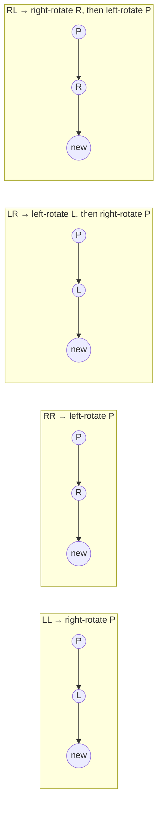

# Introduction to AVL Trees

## Why It Exists

In 1962, Adelson-Velsky and Landis published the first binary search tree that could *guarantee* `O(log n)` on any input order. The idea: enforce a strict invariant after every insert and delete — **for every node, the heights of its left and right subtrees differ by at most 1** — and restore it by paying a constant amount of rebalancing work.

That invariant defeats the [sorted-input cliff](/cortex/data-structures-and-algorithms/trees/self-balancing-bst-overview/self-balancing-bst-overview): insert `1, 2, 3, …` and a plain BST becomes an `O(n)` chain, but an AVL tree rotates itself back into shape after each insert, holding its height near `log₂ n`. AVL is the **shallowest** of all self-balancing BSTs — height ≤ `1.44 · log₂ n`, about 30% shorter than a red-black tree — which is exactly why it's the pick for **read-heavy** workloads: fewer levels per lookup. The price is more rotation work on writes, a fair trade when reads dominate.

## See It Work

Insert the sorted run `1 … n` — the worst case for a plain BST. The AVL tree stays balanced, and an in-order walk still returns sorted keys. Run it.

```python run viz=binary-tree viz-root=root
class Node:
    __slots__ = ("key", "left", "right", "height")
    def __init__(self, key):
        self.key, self.left, self.right, self.height = key, None, None, 1

def h(n): return n.height if n else 0
def bf(n): return h(n.left) - h(n.right) if n else 0           # balance factor
def update(n): n.height = 1 + max(h(n.left), h(n.right))

def rot_right(p):
    l = p.left; p.left = l.right; l.right = p
    update(p); update(l); return l
def rot_left(p):
    r = p.right; p.right = r.left; r.left = p
    update(p); update(r); return r

def insert(node, key):
    if node is None: return Node(key)
    if   key < node.key: node.left  = insert(node.left, key)
    elif key > node.key: node.right = insert(node.right, key)
    else: return node
    update(node)
    b = bf(node)
    if b >  1 and key < node.left.key:  return rot_right(node)                                    # LL
    if b < -1 and key > node.right.key: return rot_left(node)                                     # RR
    if b >  1 and key > node.left.key:  node.left  = rot_left(node.left);  return rot_right(node) # LR
    if b < -1 and key < node.right.key: node.right = rot_right(node.right); return rot_left(node) # RL
    return node

def inorder(n, out):
    if n: inorder(n.left, out); out.append(n.key); inorder(n.right, out)

n = int(input())
root = None
for k in range(1, n + 1): root = insert(root, k)
out = []; inorder(root, out)
print("AVL height:", h(root))
print("root:", root.key)
print("inorder sorted:", "true" if out == list(range(1, n + 1)) else "false")
```

```java run viz=binary-tree viz-root=root
import java.util.*;
public class Main {
  static class Node {
    int key, height = 1; Node left, right; Node(int k){ key = k; }
  }
  static int h(Node n) { return n == null ? 0 : n.height; }
  static int bf(Node n) { return n == null ? 0 : h(n.left) - h(n.right); }
  static void update(Node n) { n.height = 1 + Math.max(h(n.left), h(n.right)); }
  static Node rotRight(Node p) { Node l = p.left; p.left = l.right; l.right = p; update(p); update(l); return l; }
  static Node rotLeft(Node p)  { Node r = p.right; p.right = r.left; r.left = p; update(p); update(r); return r; }

  static Node insert(Node node, int key) {
    if (node == null) return new Node(key);
    if (key < node.key) node.left = insert(node.left, key);
    else if (key > node.key) node.right = insert(node.right, key);
    else return node;
    update(node);
    int b = bf(node);
    if (b >  1 && key < node.left.key)  return rotRight(node);
    if (b < -1 && key > node.right.key) return rotLeft(node);
    if (b >  1 && key > node.left.key)  { node.left  = rotLeft(node.left);  return rotRight(node); }
    if (b < -1 && key < node.right.key) { node.right = rotRight(node.right); return rotLeft(node); }
    return node;
  }
  static List<Integer> inorder(Node n) {
    List<Integer> out = new ArrayList<>();
    inorderHelper(n, out); return out;
  }
  static void inorderHelper(Node n, List<Integer> out) {
    if (n == null) return;
    inorderHelper(n.left, out); out.add(n.key); inorderHelper(n.right, out);
  }
  public static void main(String[] args) {
    Scanner sc = new Scanner(System.in);
    int n = Integer.parseInt(sc.nextLine().trim());
    Node root = null;
    for (int k = 1; k <= n; k++) root = insert(root, k);
    List<Integer> out = inorder(root);
    System.out.println("AVL height: " + h(root));
    System.out.println("root: " + root.key);
    List<Integer> expected = new ArrayList<>();
    for (int i = 1; i <= n; i++) expected.add(i);
    System.out.println("inorder sorted: " + out.equals(expected));
  }
}
```

```testcases
{
  "args": [
    { "id": "n", "label": "n (insert 1..n sorted)", "type": "number", "placeholder": "15" }
  ],
  "cases": [
    { "args": { "n": "15" }, "expected": "AVL height: 4\nroot: 8\ninorder sorted: true" },
    { "args": { "n": "7" },  "expected": "AVL height: 3\nroot: 4\ninorder sorted: true" },
    { "args": { "n": "1" },  "expected": "AVL height: 1\nroot: 1\ninorder sorted: true" },
    { "args": { "n": "31" }, "expected": "AVL height: 5\nroot: 16\ninorder sorted: true" }
  ]
}
```

Both print `AVL height: 4`, `root: 8`, `inorder sorted: true` for n=15 — the sorted run stays balanced (height 4, not 14), and in-order emits all keys in sorted order.

## How It Works

Each node stores its **height**; the **balance factor** `bf(n) = height(left) − height(right)` must stay in `{−1, 0, +1}`. After a BST insert, exactly one node on the path back to the root can reach `±2`; you fix it with a **rotation** — a local, `O(1)` pointer rewire that changes two subtree heights *while preserving the in-order (sorted) sequence*, so search still works.

Which rotation depends on the path the new key took from the imbalanced node `P` — four cases:



<p align="center"><strong>the four cases. LL/RR are single rotations; LR/RL are doubles (rotate the child first to convert into LL/RR).</strong></p>

- **LL** (new key in `P.left.left`) → **right-rotate `P`**.
- **RR** (new key in `P.right.right`) → **left-rotate `P`**.
- **LR** (new key in `P.left.right`) → **left-rotate `P.left`, then right-rotate `P`**.
- **RL** (new key in `P.right.left`) → **right-rotate `P.right`, then left-rotate `P`**.

The `if`-chain order matters: test LL/RR (the `key < node.left.key` direction) before LR/RL. After one single or double rotation, the subtree's height is restored and the recursion unwinds. An **insert needs at most one** (single or double) rotation; a **delete can cascade up to `O(log n)`** rotations toward the root, since shortening a subtree can unbalance its ancestors. The `1.44 log₂ n` bound comes from the *minimum*-node AVL tree of height `h` obeying `N(h) = N(h−1) + N(h−2) + 1` — the Fibonacci recurrence — so `N(h) ≈ φ^h/√5` and `h ≤ log_φ n ≈ 1.44 log₂ n`.

### Key Takeaway

AVL keeps every node's balance factor in `{−1, 0, +1}`, restoring it after each mutation with `O(1)` rotations chosen by the four cases (LL/RR single, LR/RL double). Rotations preserve sorted order, so search is unaffected. Height ≤ `1.44 log₂ n` (Fibonacci bound) — the shallowest BST, best for read-heavy work. Insert ≤1 rotation; delete up to `O(log n)`.

## Trace It

Insert `30, 10, 20` into an AVL tree. After all three, node `30` is left-heavy with balance factor `+2`, and the offending key took the path `30 → left (10) → right (20)` — the **LR** case.

Before you read on: the LL fix for a left-heavy node is "right-rotate `P`." It's tempting to just apply that here — one rotation, done. Trace a single right-rotate of `30` (whose left child is `10`, whose right child is `20`). Where does `20` end up, and is the tree balanced afterward?

It is **not** — a single right-rotate leaves the tree just as unbalanced, only mirrored. Right-rotating `30` pulls `10` up to the root and pushes `30` down to the right; `10`'s old *right* child `20` becomes `30`'s left child. You get `10` at the root with no left child and a right spine `10 → 30 → 20` — balance factor `−2` at `10`. The imbalance didn't vanish; it flipped sides. The reason is structural: in an LR shape the "heavy" grandchild `20` is the **inner** one (it hangs off the right of the left child), and a single right rotation keeps an inner child inner — it never lifts `20` to the top where it belongs. The fix is the **double rotation**: first **left-rotate `10`**, which swings `20` above `10` and converts the shape into a plain LL (`30 → 20 → 10` going left-left); *then* **right-rotate `30`**, lifting `20` to the root with `10` and `30` as its children. Balanced, height 2. That's the whole reason LR and RL exist as separate cases: when the new key lands on the *inner* side, one rotation only mirrors the problem — you must rotate the child first to move the inner node out, then rotate the parent. Recognising "inner vs outer grandchild" is how you pick single vs double on sight.

## Your Turn

AVL insert in both languages — insert a sequence of keys and print the root, its left child key, and its right child key:

```python run viz=binary-tree viz-root=root
import json

class Node:
    __slots__ = ("key", "left", "right", "height")
    def __init__(self, key):
        self.key, self.left, self.right, self.height = key, None, None, 1

def h(n): return n.height if n else 0
def bf(n): return h(n.left) - h(n.right) if n else 0
def update(n): n.height = 1 + max(h(n.left), h(n.right))
def rot_right(p):
    l = p.left; p.left = l.right; l.right = p; update(p); update(l); return l
def rot_left(p):
    r = p.right; p.right = r.left; r.left = p; update(p); update(r); return r

def insert(node, key):
    if node is None: return Node(key)
    if   key < node.key: node.left  = insert(node.left, key)
    elif key > node.key: node.right = insert(node.right, key)
    else: return node
    update(node)
    b = bf(node)
    if b >  1 and key < node.left.key:  return rot_right(node)
    if b < -1 and key > node.right.key: return rot_left(node)
    if b >  1 and key > node.left.key:  node.left  = rot_left(node.left);  return rot_right(node)
    if b < -1 and key < node.right.key: node.right = rot_right(node.right); return rot_left(node)
    return node

keys = json.loads(input())
r = None
for k in keys: r = insert(r, k)
left_key = r.left.key if r.left else -1
right_key = r.right.key if r.right else -1
print(r.key, left_key, right_key)
```

```java run viz=binary-tree viz-root=root
import java.util.*;
public class Main {
  static class Node { int key, height = 1; Node left, right; Node(int k){ key = k; } }
  static int h(Node n) { return n == null ? 0 : n.height; }
  static int bf(Node n) { return n == null ? 0 : h(n.left) - h(n.right); }
  static void update(Node n) { n.height = 1 + Math.max(h(n.left), h(n.right)); }
  static Node rotRight(Node p) { Node l = p.left; p.left = l.right; l.right = p; update(p); update(l); return l; }
  static Node rotLeft(Node p)  { Node r = p.right; p.right = r.left; r.left = p; update(p); update(r); return r; }

  static Node insert(Node node, int key) {
    if (node == null) return new Node(key);
    if (key < node.key) node.left = insert(node.left, key);
    else if (key > node.key) node.right = insert(node.right, key);
    else return node;
    update(node);
    int b = bf(node);
    if (b >  1 && key < node.left.key)  return rotRight(node);                                  // LL
    if (b < -1 && key > node.right.key) return rotLeft(node);                                   // RR
    if (b >  1 && key > node.left.key)  { node.left  = rotLeft(node.left);  return rotRight(node); }  // LR
    if (b < -1 && key < node.right.key) { node.right = rotRight(node.right); return rotLeft(node);  } // RL
    return node;
  }
  static int[] parseIntArray(String line) {
    String inner = line.replaceAll("[\\[\\]\\s]", "");
    if (inner.isEmpty()) return new int[0];
    String[] parts = inner.split(",");
    int[] out = new int[parts.length];
    for (int i = 0; i < parts.length; i++) out[i] = Integer.parseInt(parts[i]);
    return out;
  }
  public static void main(String[] args) {
    Scanner sc = new Scanner(System.in);
    int[] keys = parseIntArray(sc.nextLine());
    Node root = null;
    for (int k : keys) root = insert(root, k);
    int leftKey = root.left != null ? root.left.key : -1;
    int rightKey = root.right != null ? root.right.key : -1;
    System.out.println(root.key + " " + leftKey + " " + rightKey);
  }
}
```

```testcases
{
  "args": [
    { "id": "keys", "label": "keys to insert", "type": "array", "placeholder": "[30, 10, 20]" }
  ],
  "cases": [
    { "args": { "keys": "[30, 10, 20]" }, "expected": "20 10 30" },
    { "args": { "keys": "[1, 2, 3]" },    "expected": "2 1 3" },
    { "args": { "keys": "[3, 2, 1]" },    "expected": "2 1 3" },
    { "args": { "keys": "[10, 20, 30, 40, 50, 25]" }, "expected": "30 20 40" }
  ]
}
```

`[30, 10, 20]` exercises the LR double rotation — after inserting all three, `20` rises to the root with `10` left and `30` right. `[1,2,3]` exercises RR (root `2`); `[3,2,1]` exercises LL (root `2`); `[10,20,30,40,50,25]` mixes RR then RL (root `30`).

Then climb the ladder: verify the invariant recursively (return `(height, isAvl)`); trace the rotations for `[10,20,30,40,50,25]` by hand (RR, then RL); build an AVL from a sorted array in `O(n)` (recursive middle-as-root, no rotations); augment nodes with a `size` field for `kthSmallest` in `O(log n)`; implement `delete` and confirm every intermediate state stays AVL.

## Reflect & Connect

AVL is the strict end of the balance spectrum:

- **AVL vs Red-Black** — same `O(log n)`, but AVL is ~30% shallower (`1.44 log n` vs `2 log n`) and pays for it on writes (delete can cascade `O(log n)` rotations vs RB's ≤3). Read-heavy → AVL; mixed/write-heavy → [Red-Black](/cortex/data-structures-and-algorithms/trees/red-black-tree/introduction-to-red-black-trees), which is what every standard library actually ships.
- **The height field is free augmentation real estate** — AVL already stores per-node metadata, so adding a `size` (subtree node count) turns it into an **order-statistics tree**: `kthSmallest` and `rank(key)` in `O(log n)`. The same augment-and-maintain-through-rotations trick generalises to interval trees and segment-tree-like structures.
- **Rotations are the universal BST primitive** — the left/right rotation you learned here is the *same* operation red-black trees, treaps, and splay trees use; only the *policy* for when to apply it differs. Master "single vs double = outer vs inner grandchild" and every balanced-BST rebalance reads the same way.
- **In production** — AVL appears in PostgreSQL's GiST (in-memory index parts) and some in-memory DB engines, but RB-trees dominate standard libraries. AVL's claim to fame is pedagogical clarity and the tightest height bound when reads are everything.

**Prerequisites:** [Self-Balancing BSTs Overview](/cortex/data-structures-and-algorithms/trees/self-balancing-bst-overview/self-balancing-bst-overview), [Binary Search Tree](/cortex/data-structures-and-algorithms/trees/binary-search-tree/introduction-to-binary-search-trees).
**What's next:** the looser, write-cheaper balance that ships everywhere — the [Red-Black Tree](/cortex/data-structures-and-algorithms/trees/red-black-tree/introduction-to-red-black-trees).

## Recall

> **Mnemonic:** *Balance factor ∈ {−1,0,+1}. Imbalance ±2 ⇒ rotate. Outer grandchild (LL/RR) → single; inner grandchild (LR/RL) → double (rotate child first). Height ≤ 1.44 log₂ n (Fibonacci). Insert ≤1 rotation; delete up to O(log n).*

| | |
|---|---|
| Invariant | every node `|h(left) − h(right)| ≤ 1` |
| Balance factor | `h(left) − h(right)` ∈ {−1, 0, +1} |
| LL / RR | single rotation (right / left) |
| LR / RL | double — rotate the inner child first, then the parent |
| Height bound | `1.44 log₂ n` (Fibonacci / golden ratio) |
| Rotations | insert ≤1; delete up to `O(log n)`; each rotation `O(1)` |

<details>
<summary><strong>Q:</strong> The AVL invariant and balance factor?</summary>

**A:** Every node's left/right subtree heights differ by ≤1; balance factor `h(left) − h(right)` ∈ {−1, 0, +1}.

</details>
<details>
<summary><strong>Q:</strong> The four rebalance cases?</summary>

**A:** LL → right-rotate P; RR → left-rotate P; LR → left-rotate P.left then right-rotate P; RL → right-rotate P.right then left-rotate P.

</details>
<details>
<summary><strong>Q:</strong> Why do LR/RL need *two* rotations?</summary>

**A:** The heavy grandchild is the *inner* one; a single rotation keeps it inner (just mirrors the imbalance), so you rotate the child first to convert into LL/RR.

</details>
<details>
<summary><strong>Q:</strong> Why is the height bound `1.44 log n`, not `log n`?</summary>

**A:** The minimum-node AVL tree of height `h` follows the Fibonacci recurrence `N(h)=N(h−1)+N(h−2)+1`, giving `N(h) ≈ φ^h/√5`, so `h ≈ 1.44 log₂ n`.

</details>
<details>
<summary><strong>Q:</strong> Rotations per insert vs delete?</summary>

**A:** Insert ≤1 (single or double); delete up to `O(log n)` because rebalancing can cascade toward the root.

</details>

## Sources & Verify

- **Adelson-Velsky & Landis (1962)**, *An algorithm for the organization of information* — the original AVL paper and the `1.44 log₂ n` bound.
- **CLRS**, *Introduction to Algorithms*, 4th ed., Problem 13-3 — AVL trees (insert and rebalance); §13 — rotations.
- **Sedgewick & Wayne**, *Algorithms*, 4th ed., §3.3 — balanced BSTs. Both runnable blocks are verified by running (sorted `1..15` ⇒ AVL height 4, root 8, in-order sorted; `insert 30,10,20` ⇒ root 20 via the LR double rotation; a naive single right-rotate leaves `bf = −2`, confirming the double is necessary).
