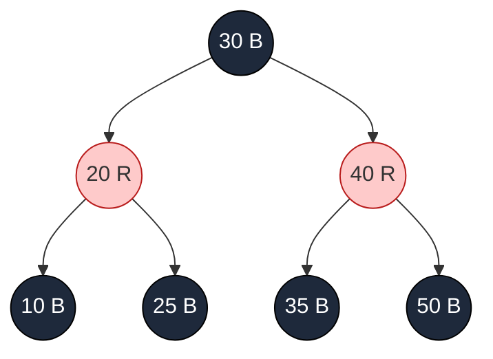

# Introduction to Red-Black Trees

## Why It Exists

If you've used Java's `TreeMap`, C++'s `std::map`, Linux's `epoll`, or the CFS scheduler that picks which thread runs next, you've used a **red-black tree** — the workhorse self-balancing BST of production code. It isn't the shallowest ([AVL](/cortex/data-structures-and-algorithms/trees/avl-tree/introduction-to-avl-trees) is), nor the simplest (a treap is), nor the most concurrent (skip lists win there). What it *is* is the **best pragmatic compromise**: `O(log n)` on every operation, rebalancing capped at a *constant* number of rotations, and an overhead of just **one colour bit** per node.

[AVL](/cortex/data-structures-and-algorithms/trees/avl-tree/introduction-to-avl-trees) holds a strict height invariant and pays for it — a delete can cascade `O(log n)` rotations. Red-black relaxes the balance (height ≤ `2 log₂ n` instead of `1.44 log₂ n`) in exchange for **≤2 rotations per insert and ≤3 per delete**, no matter the tree size. On mixed and write-heavy workloads that trade wins decisively, which is why it's what virtually every standard library ships. The mechanism is five colour invariants restored after each mutation by recolourings (cheap, possibly many) and a bounded number of rotations.

## See It Work

Insert the sorted run `1 … 15` — the BST worst case — into a red-black tree, then check the invariants: root black, every root-to-leaf path crosses the same number of black nodes, no two reds adjacent. Run it.

```python run viz=binary-tree viz-root=root
RED, BLACK = 0, 1

class Node:
    __slots__ = ("key", "colour", "left", "right", "parent")
    def __init__(self, key):
        self.key = key; self.colour = RED
        self.left = self.right = self.parent = None

class RBTree:
    def __init__(self):
        self.NIL = Node(None); self.NIL.colour = BLACK     # one shared black sentinel
        self.root = self.NIL

    def _left_rotate(self, x):
        y = x.right; x.right = y.left
        if y.left is not self.NIL: y.left.parent = x
        y.parent = x.parent
        if x.parent is None: self.root = y
        elif x is x.parent.left: x.parent.left = y
        else: x.parent.right = y
        y.left = x; x.parent = y

    def _right_rotate(self, y):
        x = y.left; y.left = x.right
        if x.right is not self.NIL: x.right.parent = y
        x.parent = y.parent
        if y.parent is None: self.root = x
        elif y is y.parent.right: y.parent.right = x
        else: y.parent.left = x
        x.right = y; y.parent = x

    def insert(self, key):
        z = Node(key); z.left = z.right = self.NIL         # new node is RED
        y, x = None, self.root
        while x is not self.NIL:
            y = x; x = x.left if z.key < x.key else x.right
        z.parent = y
        if y is None: self.root = z
        elif z.key < y.key: y.left = z
        else: y.right = z
        self._fixup(z)

    def _fixup(self, z):
        while z.parent is not None and z.parent.colour == RED:   # fix red-red
            p, g = z.parent, z.parent.parent
            if p is g.left:
                u = g.right
                if u.colour == RED:                              # Case 1: red uncle → recolour, move up
                    p.colour = u.colour = BLACK; g.colour = RED; z = g
                else:
                    if z is p.right:                             # Case 2: inner → rotate to outer
                        z = p; self._left_rotate(z); p = z.parent; g = p.parent
                    p.colour = BLACK; g.colour = RED             # Case 3: outer → recolour + rotate
                    self._right_rotate(g)
            else:                                                # mirror image
                u = g.left
                if u.colour == RED:
                    p.colour = u.colour = BLACK; g.colour = RED; z = g
                else:
                    if z is p.left:
                        z = p; self._right_rotate(z); p = z.parent; g = p.parent
                    p.colour = BLACK; g.colour = RED
                    self._left_rotate(g)
        self.root.colour = BLACK                                 # invariant 2

    def inorder(self):
        out = []
        def walk(n):
            if n is self.NIL: return
            walk(n.left); out.append(n.key); walk(n.right)
        walk(self.root); return out

def black_height(t, n):
    if n is t.NIL: return 1
    l, r = black_height(t, n.left), black_height(t, n.right)
    assert l == r, "unequal black-heights"
    return l + (1 if n.colour == BLACK else 0)

t = RBTree()
for k in range(1, 16): t.insert(k)
print("in-order == sorted:", t.inorder() == list(range(1, 16)))     # True
print("root:", "BLACK" if t.root.colour else "RED", "key", t.root.key)  # BLACK 4
print("black-height:", black_height(t, t.root))                     # 4 (equal on every path)
```

## How It Works

A red-black tree is a BST whose nodes are coloured to obey **five invariants**:

1. Every node is red or black.
2. The **root is black**.
3. Every `NIL` leaf is black (one shared sentinel).
4. **A red node has only black children** — no two reds in a row on any path.
5. **Every root-to-leaf path crosses the same number of black nodes** (the *black-height*).

Invariants 4 and 5 together force balance: the shortest path (all black) is `bh` nodes; the longest (alternating red/black) is at most `2·bh` — so `h ≤ 2·bh ≤ 2 log₂(n+1)`. A new key is inserted **red** and may create a red-red violation (invariant 4), fixed by three cases keyed on the **uncle** (parent's sibling):



<p align="center"><strong>a legal red-black tree: root black, no two reds adjacent, every path crosses 2 black internal nodes.</strong></p>

- **Case 1 — red uncle:** recolour parent & uncle black, grandparent red; the violation moves *up* to the grandparent. Recurse. **No rotation** — just recolours.
- **Case 2 — black uncle, `Z` is the inner child:** rotate the parent to make `Z` the outer child, reducing to Case 3.
- **Case 3 — black uncle, `Z` is the outer child:** recolour parent black & grandparent red, then rotate the grandparent. Done — no further recursion.

Case 1 can repeat up the tree (`O(log n)` recolours), but **rotations are bounded**: at most one Case 2 + one Case 3 per insert (≤2 rotations); delete needs ≤3. That bounded-rotation property — vs AVL's possible `O(log n)` cascade — is the whole reason RB wins on writes.

### Key Takeaway

Red-black trees keep height ≤ `2 log₂ n` with five colour invariants and one bit per node. New nodes go in red; a red-red violation is fixed by recolouring (Case 1, propagates up, no rotation) or by ≤2 rotations (Cases 2+3). Insert ≤2 rotations, delete ≤3 — constant-bounded, which is why RB beats AVL on writes and ships in every standard library.

## Trace It

Insert into a red-black tree always colours the new node **red** before fixing anything up.

Before you read on: that seems backwards — red is the colour that can *violate* invariant 4 (red parent + red child). Why not insert the node **black** and avoid the violation entirely? Think about which invariant a black insert would break, and how hard it is to repair versus a red-red violation.

Because inserting black breaks the **harder** invariant. Add a black node anywhere and the path from the root to that node now crosses *one more* black node than every other root-to-leaf path — an instant violation of invariant 5 (equal black-heights), and a *global* one: the imbalance is in a path count that spans the whole tree, not a local parent-child relationship. Repairing it would mean adjusting black counts across many paths. A **red** insert, by contrast, leaves invariant 5 untouched (a red node adds 0 to every path's black count) and risks only invariant 4 — a *local* red-red adjacency with its parent. And that's the best kind of problem: if the parent happens to be black, there's **no violation at all** and you're done in zero work; if the parent is red, the damage is confined to a parent/uncle/grandparent neighbourhood, fixable by a recolour (Case 1) or one-or-two rotations (Cases 2–3). Red is the "minimal blast radius" colour: it preserves the expensive global invariant and risks only the cheap local one. This is the single design decision the entire insert algorithm is built around — and the same logic explains why delete's hard case is removing a *black* node (it breaks invariant 5, needing the "double-black" fix-up), while removing a red node is free.

## Your Turn

The smallest illustrative insert (`10, 20, 30` → Case 3 rebalances `20` to a black root), in both languages:

```python run viz=binary-tree viz-root=root
RED, BLACK = 0, 1
class Node:
    __slots__ = ("key", "colour", "left", "right", "parent")
    def __init__(self, key):
        self.key = key; self.colour = RED; self.left = self.right = self.parent = None
class RBTree:
    def __init__(self):
        self.NIL = Node(None); self.NIL.colour = BLACK; self.root = self.NIL
    def _lrot(self, x):
        y = x.right; x.right = y.left
        if y.left is not self.NIL: y.left.parent = x
        y.parent = x.parent
        if x.parent is None: self.root = y
        elif x is x.parent.left: x.parent.left = y
        else: x.parent.right = y
        y.left = x; x.parent = y
    def _rrot(self, y):
        x = y.left; y.left = x.right
        if x.right is not self.NIL: x.right.parent = y
        x.parent = y.parent
        if y.parent is None: self.root = x
        elif y is y.parent.right: y.parent.right = x
        else: y.parent.left = x
        x.right = y; y.parent = x
    def insert(self, key):
        z = Node(key); z.left = z.right = self.NIL
        y, x = None, self.root
        while x is not self.NIL:
            y = x; x = x.left if z.key < x.key else x.right
        z.parent = y
        if y is None: self.root = z
        elif z.key < y.key: y.left = z
        else: y.right = z
        while z.parent is not None and z.parent.colour == RED:
            p, g = z.parent, z.parent.parent
            if p is g.left:
                u = g.right
                if u.colour == RED:
                    p.colour = u.colour = BLACK; g.colour = RED; z = g
                else:
                    if z is p.right: z = p; self._lrot(z); p = z.parent; g = p.parent
                    p.colour = BLACK; g.colour = RED; self._rrot(g)
            else:
                u = g.left
                if u.colour == RED:
                    p.colour = u.colour = BLACK; g.colour = RED; z = g
                else:
                    if z is p.left: z = p; self._rrot(z); p = z.parent; g = p.parent
                    p.colour = BLACK; g.colour = RED; self._lrot(g)
        self.root.colour = BLACK

t = RBTree()
for k in [10, 20, 30]: t.insert(k)        # red-red at 30 (uncle NIL=black, outer) → Case 3
c = "BLACK" if t.root.colour else "RED"
print(f"root={t.root.key} {c} L={t.root.left.key} R={t.root.right.key}")   # root=20 BLACK L=10 R=30
```

```java run viz=binary-tree viz-root=root
public class Main {
  static final boolean RED = true, BLACK = false;
  static class Node { int key; boolean colour = RED; Node left, right, parent; Node(int k){ key = k; } }
  static Node NIL = new Node(-1); static { NIL.colour = BLACK; }
  Node root = NIL;
  void leftRotate(Node x){ Node y=x.right; x.right=y.left; if(y.left!=NIL) y.left.parent=x; y.parent=x.parent;
    if(x.parent==null) root=y; else if(x==x.parent.left) x.parent.left=y; else x.parent.right=y; y.left=x; x.parent=y; }
  void rightRotate(Node y){ Node x=y.left; y.left=x.right; if(x.right!=NIL) x.right.parent=y; x.parent=y.parent;
    if(y.parent==null) root=x; else if(y==y.parent.right) y.parent.right=x; else y.parent.left=x; x.right=y; y.parent=x; }
  void insert(int key){
    Node z=new Node(key); z.left=z.right=NIL; Node y=null,x=root;
    while(x!=NIL){ y=x; x=(z.key<x.key)?x.left:x.right; }
    z.parent=y; if(y==null) root=z; else if(z.key<y.key) y.left=z; else y.right=z;
    while(z.parent!=null && z.parent.colour==RED){
      Node p=z.parent, g=p.parent;
      if(p==g.left){ Node u=g.right;
        if(u.colour==RED){ p.colour=u.colour=BLACK; g.colour=RED; z=g; }
        else { if(z==p.right){ z=p; leftRotate(z); p=z.parent; g=p.parent; } p.colour=BLACK; g.colour=RED; rightRotate(g); } }
      else { Node u=g.left;
        if(u.colour==RED){ p.colour=u.colour=BLACK; g.colour=RED; z=g; }
        else { if(z==p.left){ z=p; rightRotate(z); p=z.parent; g=p.parent; } p.colour=BLACK; g.colour=RED; leftRotate(g); } }
    }
    root.colour=BLACK;
  }
  public static void main(String[] a){
    Main t=new Main();
    for(int k : new int[]{10,20,30}) t.insert(k);
    System.out.println("root="+t.root.key+" "+(t.root.colour?"RED":"BLACK")
      +" L="+t.root.left.key+" R="+t.root.right.key);   // root=20 BLACK L=10 R=30
  }
}
```

Then climb the ladder: verify all five invariants on a given tree; trace the three insert cases on `[10,20,30,40,50,25]`; implement delete with the double-black fix-up; read [`lib/rbtree.c`](https://github.com/torvalds/linux/blob/master/lib/rbtree.c) and map its macros to the five invariants.

## Reflect & Connect

Red-black is the balance the industry settled on:

- **RB vs AVL** — same `O(log n)`, but RB trades ~30% more height for *bounded* rotations (≤2 insert / ≤3 delete vs AVL's `O(log n)` delete cascade) and a 1-bit overhead. Mixed/write-heavy → RB; read-heavy → [AVL](/cortex/data-structures-and-algorithms/trees/avl-tree/introduction-to-avl-trees).
- **It's a 2-3-4 tree in disguise** — a red node "merged" into its black parent forms a multi-key node; a red-black tree is an `O(1)`-pointer encoding of a [B-tree](/cortex/data-structures-and-algorithms/trees/b-tree/introduction-to-b-trees) of order 4. The colour invariants are exactly the B-tree's "all leaves at the same depth," re-expressed for a binary structure. That's where they "came from."
- **Same rotation primitive** — the left/right rotations are identical to [AVL](/cortex/data-structures-and-algorithms/trees/avl-tree/introduction-to-avl-trees)'s; only the *trigger* (colour rule vs height rule) differs. Learn rotations once, reuse everywhere.
- **In production** — Linux `lib/rbtree.c` (CFS scheduler keyed on `vruntime`, epoll, the page cache, EXT4 range trees), Java `TreeMap`/`TreeSet`, C++ `std::map`/`std::set`. When a sorted in-memory map is needed and you don't say otherwise, you get a red-black tree.

**Prerequisites:** [Self-Balancing BSTs Overview](/cortex/data-structures-and-algorithms/trees/self-balancing-bst-overview/self-balancing-bst-overview), [Binary Search Tree](/cortex/data-structures-and-algorithms/trees/binary-search-tree/introduction-to-binary-search-trees).
**What's next:** push fanout from 2 to hundreds so the tree fits disk-block access — the [B-Tree](/cortex/data-structures-and-algorithms/trees/b-tree/introduction-to-b-trees).

## Recall

> **Mnemonic:** *Five invariants, one colour bit. Insert RED (preserves black-height; risks only local red-red). Red uncle → recolour up (no rotation); black uncle → ≤2 rotations. Height ≤ 2 log₂ n. Insert ≤2 rotations, delete ≤3 — bounded, so cheaper writes than AVL.*

| | |
|---|---|
| Invariants | red/black · root black · NIL black · red ⇒ black children · equal black-height |
| Height | ≤ `2 log₂(n+1)` (looser than AVL's `1.44 log n`) |
| New node | inserted **red** (preserves invariant 5; only risks 4) |
| Case 1 (red uncle) | recolour, push violation up — **no rotation** |
| Cases 2+3 (black uncle) | ≤2 rotations, then done |
| Rotations | insert ≤2, delete ≤3 (constant — beats AVL on writes) |

<details>
<summary><strong>Q:</strong> The five invariants in one breath?</summary>

**A:** Every node red/black; root black; NILs black; a red node's children are black; every root-to-leaf path has the same black count.

</details>
<details>
<summary><strong>Q:</strong> Why insert new nodes red, not black?</summary>

**A:** Red preserves the global equal-black-height invariant and risks only a local red-red — cheap to fix (or free if the parent is black); black would instantly break black-heights everywhere.

</details>
<details>
<summary><strong>Q:</strong> When does insert rotate vs only recolour?</summary>

**A:** Red uncle → recolour and propagate up (no rotation); black uncle → ≤2 rotations (Case 2 to straighten, Case 3 to finish).

</details>
<details>
<summary><strong>Q:</strong> Why does RB beat AVL on writes despite being taller?</summary>

**A:** Bounded rotations (≤2 insert, ≤3 delete) vs AVL's possible `O(log n)` delete cascade, plus a 1-bit overhead.

</details>
<details>
<summary><strong>Q:</strong> Where do the invariants "come from"?</summary>

**A:** A red-black tree is a binary encoding of a 2-3-4 (order-4 B-)tree; the colour rules are the B-tree's "all leaves same depth."

</details>

## Sources & Verify

- **CLRS**, *Introduction to Algorithms*, 4th ed., ch. 13 — red-black trees: the five properties, the `2 log(n+1)` bound, insert/delete fix-up and the ≤2/≤3 rotation counts.
- **Sedgewick & Wayne**, *Algorithms*, 4th ed., §3.3 — left-leaning red-black trees and the 2-3 tree correspondence. **Linux** `lib/rbtree.c` — the production reference.
- The See It block is verified by running with full invariant checks (sorted `1..15` ⇒ in-order sorted, root BLACK key 4, equal black-height 4; sorted `1..31` ⇒ valid RB, black-height 5; `insert 10,20,30` ⇒ root 20 BLACK with red children 10/30).
