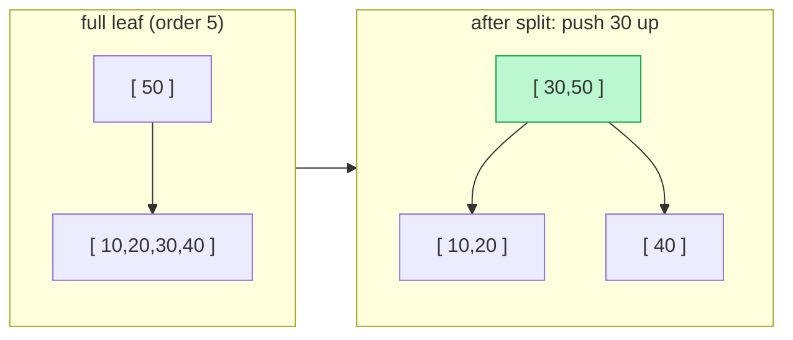
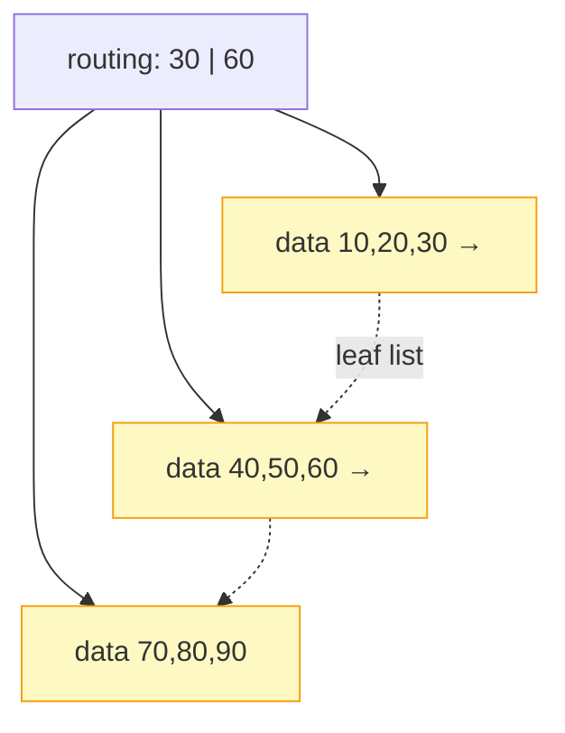

# Introduction to B-Trees

## Why It Exists

A random read on an SSD costs ~100 microseconds; in RAM it's ~100 nanoseconds — a **1000× gap**. That gap turns "tree on disk" into a different problem from "tree in memory." A binary search tree over a billion records has height `log₂(10⁹) ≈ 30`: in RAM that's `30 × 100 ns = 3 µs`, fine — but on disk it's `30 × 100 µs = 3 ms` per lookup, and a database serving 10,000 queries/sec needs microseconds, not milliseconds.

The fix isn't a smarter balancing rule — it's a **change of geometry**. Make each node hold *hundreds* of keys instead of one, so a single disk read resolves hundreds of comparisons. A node with 200 keys has 201 children, so a billion-key tree is `log₂₀₁(10⁹) ≈ 4` levels — **four** seeks instead of thirty, ~8× faster, with no tuning.

That structure is the **B-tree** (Bayer & McCreight, 1971) — the most-deployed data structure in computing. Every relational index, every filesystem directory, every key-value store is a B-tree or a close cousin. The design rule in one line: **make each node fill exactly one I/O block** (a 4–8 KB disk page, or a cache line in memory).

## See It Work

A B-tree of minimum degree `T=3` (so 2–5 keys per node). Insert keys and watch the height stay tiny and *logarithmic* as `n` grows — that's the whole point. Run it.

```python run
import math, random

T = 3   # minimum degree: a node holds T-1 .. 2T-1 keys (root may hold fewer)

class BNode:
    __slots__ = ("keys", "children", "leaf")
    def __init__(self, leaf=True):
        self.keys = []; self.children = []; self.leaf = leaf

class BTree:
    def __init__(self): self.root = BNode()

    def search(self, key, node=None):
        node = node or self.root
        i = 0
        while i < len(node.keys) and key > node.keys[i]: i += 1      # find the slot / child
        if i < len(node.keys) and key == node.keys[i]: return True
        return False if node.leaf else self.search(key, node.children[i])

    def insert(self, key):
        root = self.root
        if len(root.keys) == 2 * T - 1:                              # root full → grow UP
            nr = BNode(leaf=False); nr.children.append(root)
            self.root = nr; self._split_child(nr, 0)
        self._insert_nonfull(self.root, key)

    def _split_child(self, parent, i):
        full = parent.children[i]; sib = BNode(leaf=full.leaf)
        sib.keys = full.keys[T:]                                     # upper half → new sibling
        full.keys, mid = full.keys[:T-1], full.keys[T-1]            # middle key promoted
        if not full.leaf:
            sib.children = full.children[T:]; full.children = full.children[:T]
        parent.keys.insert(i, mid); parent.children.insert(i + 1, sib)

    def _insert_nonfull(self, node, key):
        i = len(node.keys) - 1
        if node.leaf:
            while i >= 0 and key < node.keys[i]: i -= 1
            node.keys.insert(i + 1, key)
        else:
            while i >= 0 and key < node.keys[i]: i -= 1
            i += 1
            if len(node.children[i].keys) == 2 * T - 1:             # split a full child before descending
                self._split_child(node, i)
                if key > node.keys[i]: i += 1
            self._insert_nonfull(node.children[i], key)

    def height(self):
        n = self.root; h = 1
        while not n.leaf: n = n.children[0]; h += 1
        return h

random.seed(7)
for n in [100, 1_000, 10_000]:
    t = BTree(); ks = list(range(1, n + 1)); random.shuffle(ks)
    for k in ks: t.insert(k)
    print(f"n={n:>6}  height={t.height()}  (vs binary log2(n) ≈ {math.log2(n):.0f})")
print("search 42:", t.search(42), " search 99999:", t.search(99999))
```

Now *watch* one grow. This inserts nine keys into a `T=3` tree (2–5 keys per node) and visualises every step — click **Visualise** and scrub through it: keys fill the root, it **splits** (the middle key jumps *up*), and the tree gains a level. Each node is a **row** of keys, not a single value, and a parent with `k` keys has `k+1` children hanging from the gaps between them — that's the whole idea.

```python run viz=graph viz-root=tree viz-kind=btree
T = 3   # each node holds T-1 .. 2T-1 keys → 2..5 keys per node

class BNode:
    def __init__(self, leaf=True):
        self.keys = []; self.children = []; self.leaf = leaf

class BTree:
    def __init__(self): self.root = BNode()

    def insert(self, key):
        root = self.root
        if len(root.keys) == 2 * T - 1:                  # root full → grow UP a level
            nr = BNode(leaf=False); nr.children.append(root)
            self.root = nr; self._split(nr, 0)
        self._insert_nonfull(self.root, key)

    def _split(self, parent, i):
        full = parent.children[i]; sib = BNode(leaf=full.leaf)
        sib.keys = full.keys[T:]                          # upper half → new sibling
        full.keys, mid = full.keys[:T-1], full.keys[T-1]  # middle key promoted up
        if not full.leaf:
            sib.children = full.children[T:]; full.children = full.children[:T]
        parent.keys.insert(i, mid); parent.children.insert(i + 1, sib)

    def _insert_nonfull(self, node, key):
        i = len(node.keys) - 1
        if node.leaf:
            while i >= 0 and key < node.keys[i]: i -= 1
            node.keys.insert(i + 1, key)
        else:
            while i >= 0 and key < node.keys[i]: i -= 1
            i += 1
            if len(node.children[i].keys) == 2 * T - 1:   # split a full child first
                self._split(node, i)
                if key > node.keys[i]: i += 1
            self._insert_nonfull(node.children[i], key)

tree = BTree()
for k in [10, 20, 30, 40, 50, 60, 70, 80, 90]:
    tree.insert(k)
print("root keys:", tree.root.keys)                       # [30, 60] — two keys, three children
```
<p align="center"><strong>▶ Run it, then Visualise — nine keys into a T=3 B-tree: the root fills to five keys, splits (30 jumps up), and by the ninth key the root holds [30, 60] over three leaf nodes.</strong></p>

## How It Works

A B-tree of **order `m`** (minimum degree `T = m/2`) obeys five invariants:

1. Every node holds between `T−1` and `2T−1` keys (the root may hold as few as 1).
2. An internal node with `k` keys has exactly `k+1` children.
3. Keys within a node are **sorted**.
4. **All leaves are at the same depth** — perfectly height-balanced.
5. The `i`-th child's keys lie between the `(i−1)`-th and `i`-th keys of the parent (ranges nest).

**Search** descends like a BST, but at each node does a sorted-array search to pick the right child — `O(log_m n)` *seeks*, the only cost that matters on disk. **Insert** always lands at a leaf; when a node fills (`2T−1` keys), it **splits**: the middle key moves *up* into the parent, leaving two half-full siblings.



<p align="center"><strong>a full leaf splits: the middle key (30) is promoted into the parent, creating two half-full siblings. The tree grows in width here, in height only when the root splits.</strong></p>

The "at least half-full" rule (invariant 1) guarantees disk utilisation never drops below 50% regardless of insertion order — B-trees don't fragment storage the way deletes can fragment other balanced trees. Delete mirrors insert: remove the key, and if a node drops below `T−1`, **borrow** from a sibling or **merge** with one (merges propagate up like splits).

### Key Takeaway

A B-tree trades binary fanout for `m`-way fanout so each node fills one I/O block: height `log_m n` means a billion keys in ~4 disk seeks. Nodes are sorted key arrays; inserts split a full node by **pushing the middle key up**, so all leaves stay at the same depth and the tree is always ≥50% full. It's the on-disk default everywhere.

## Trace It

A plain BST grows *downward* — each insert hangs a new node off a leaf, and with bad input one branch grows far longer than the others (the sorted-input cliff). A B-tree *also* only ever inserts at a leaf.

Before you read on: given that B-tree inserts also happen at leaves, how does it keep **every** leaf at *exactly* the same depth — forever, on any insertion order — when a BST can't? What does a split do that a BST leaf-insert doesn't?

The trick is the **direction of growth**. A BST leaf-insert lengthens *one* root-to-leaf path, so paths drift out of sync — depth is added at the bottom, locally. A B-tree never lets a node overflow: when a leaf fills, it **splits and promotes its middle key up into the parent**, which absorbs the new separator *sideways* (the parent gets wider, not taller). The only way the tree gains a level is when this promotion reaches a **full root** — and then the root splits into a new root above it, which lifts **every** leaf down one level *simultaneously*. So a B-tree grows from the **top**, not the bottom: depth is only ever added to *all* paths at once, never to one. That's the structural reason invariant 4 (all leaves same depth) holds automatically — there is no operation that can deepen a single path. A BST has no "push up" move; it can only deepen locally, which is exactly why it needs rotations (AVL/RB) bolted on to stay balanced, while a B-tree is balanced *by construction*. "Grows from the top" is the one sentence that captures why.

## Your Turn

B-tree insert, search, and height in both languages — the height stays at 4 for 100 keys:

```python run
T = 3
class BNode:
    __slots__ = ("keys", "children", "leaf")
    def __init__(self, leaf=True): self.keys = []; self.children = []; self.leaf = leaf
class BTree:
    def __init__(self): self.root = BNode()
    def search(self, key, node=None):
        node = node or self.root; i = 0
        while i < len(node.keys) and key > node.keys[i]: i += 1
        if i < len(node.keys) and key == node.keys[i]: return True
        return False if node.leaf else self.search(key, node.children[i])
    def insert(self, key):
        root = self.root
        if len(root.keys) == 2 * T - 1:
            nr = BNode(leaf=False); nr.children.append(root); self.root = nr; self._split(nr, 0)
        self._ins(self.root, key)
    def _split(self, parent, i):
        full = parent.children[i]; sib = BNode(leaf=full.leaf)
        sib.keys = full.keys[T:]; full.keys, mid = full.keys[:T-1], full.keys[T-1]
        if not full.leaf: sib.children = full.children[T:]; full.children = full.children[:T]
        parent.keys.insert(i, mid); parent.children.insert(i + 1, sib)
    def _ins(self, node, key):
        i = len(node.keys) - 1
        if node.leaf:
            while i >= 0 and key < node.keys[i]: i -= 1
            node.keys.insert(i + 1, key)
        else:
            while i >= 0 and key < node.keys[i]: i -= 1
            i += 1
            if len(node.children[i].keys) == 2 * T - 1:
                self._split(node, i)
                if key > node.keys[i]: i += 1
            self._ins(node.children[i], key)
    def height(self):
        n = self.root; h = 1
        while not n.leaf: n = n.children[0]; h += 1
        return h

t = BTree()
for k in range(1, 101): t.insert(k)
print("height:", t.height(), " search 42:", t.search(42), " search 999:", t.search(999))  # 4 True False
```

```java run
public class Main {
  static final int T = 3;
  static class BNode { int[] keys = new int[2*T-1]; BNode[] children = new BNode[2*T]; int n = 0; boolean leaf = true; }
  BNode root = new BNode();
  boolean search(int key, BNode node) {
    int i = 0;
    while (i < node.n && key > node.keys[i]) i++;
    if (i < node.n && key == node.keys[i]) return true;
    return node.leaf ? false : search(key, node.children[i]);
  }
  void split(BNode parent, int i) {
    BNode full = parent.children[i], sib = new BNode();
    sib.leaf = full.leaf; sib.n = T - 1;
    for (int j = 0; j < T - 1; j++) sib.keys[j] = full.keys[j + T];
    if (!full.leaf) for (int j = 0; j < T; j++) sib.children[j] = full.children[j + T];
    full.n = T - 1;
    for (int j = parent.n; j > i; j--) parent.children[j + 1] = parent.children[j];
    parent.children[i + 1] = sib;
    for (int j = parent.n - 1; j >= i; j--) parent.keys[j + 1] = parent.keys[j];
    parent.keys[i] = full.keys[T - 1]; parent.n++;
  }
  void insNonfull(BNode node, int key) {
    int i = node.n - 1;
    if (node.leaf) {
      while (i >= 0 && key < node.keys[i]) { node.keys[i + 1] = node.keys[i]; i--; }
      node.keys[i + 1] = key; node.n++;
    } else {
      while (i >= 0 && key < node.keys[i]) i--;
      i++;
      if (node.children[i].n == 2 * T - 1) { split(node, i); if (key > node.keys[i]) i++; }
      insNonfull(node.children[i], key);
    }
  }
  void insert(int key) {
    if (root.n == 2 * T - 1) { BNode r = new BNode(); r.leaf = false; r.children[0] = root; root = r; split(r, 0); }
    insNonfull(root, key);
  }
  int height() { BNode n = root; int h = 1; while (!n.leaf) { n = n.children[0]; h++; } return h; }
  public static void main(String[] args) {
    Main t = new Main();
    for (int i = 1; i <= 100; i++) t.insert(i);
    System.out.println("height: " + t.height() + " search 42: " + t.search(42, t.root));  // 4 true
  }
}
```

Then climb the ladder: implement delete with borrow/merge; build a B+-tree (data only at leaves, leaves linked) and add a range scan; measure how height changes as you vary `T`; map the structure onto Postgres's `nbtree` page layout.

## Reflect & Connect

The B-tree is the on-disk workhorse, and its variants run the databases you use daily:

- **B-tree vs B+-tree** — a **B+-tree** stores data *only* in leaves (internal nodes are pure routing) and links the leaves in a list. That makes range queries cheap (descend once, walk the leaf chain) and lets internal nodes pack more keys → higher fanout → shallower tree. Every relational DB (Postgres, MySQL/InnoDB, Oracle, SQL Server) uses B+-trees for indexes.



<p align="center"><strong>A B+-tree stores data only in the leaves (internal nodes are pure routing) and links the leaves in a list — so a range query descends once, then walks the leaf chain.</strong></p>

- **A red-black tree IS a B-tree** — recall from the [red-black chapter](/cortex/data-structures-and-algorithms/trees/red-black-tree/introduction-to-red-black-trees): merge each red node into its black parent and you get an order-4 B-tree (a 2-3-4 tree). The colour invariants are the B-tree's "all leaves same depth," re-expressed for binary nodes. B-trees generalise that idea to *any* fanout.
- **Fanout = match the storage level** — order 200–1000 for disk pages, order ~6 for an in-memory cache-line-sized node (Rust's `BTreeMap`). The structure is the same; only `m` changes to fit the [memory hierarchy](/cortex/data-structures-and-algorithms/foundations/memory-model-and-cache).
- **In production** — Postgres `nbtree` (note: it doesn't shrink on delete; `VACUUM` reclaims pages), MySQL InnoDB clustered indexes, ext4/NTFS/Btrfs metadata. When data outgrows RAM, the answer is almost always a B+-tree.

**Prerequisites:** [Self-Balancing BSTs Overview](/cortex/data-structures-and-algorithms/trees/self-balancing-bst-overview/self-balancing-bst-overview), [Memory Model & Cache](/cortex/data-structures-and-algorithms/foundations/memory-model-and-cache).
**What's next:** trees that answer *range aggregate* queries (sum/min over `[l, r]`) in `O(log n)` — the [Segment Tree](/cortex/data-structures-and-algorithms/trees/segment-tree/introduction-to-segment-trees).

## Recall

> **Mnemonic:** *Fat nodes (fill one I/O block) ⇒ high fanout ⇒ height `log_m n` ⇒ ~4 seeks for a billion keys. Insert at a leaf; full node splits, middle key pushed UP. Grows from the top ⇒ all leaves same depth, always ≥50% full.*

| | |
|---|---|
| Order `m` / min degree `T` | node holds `T−1 .. 2T−1` keys; `k` keys ⇒ `k+1` children |
| Height | `log_m n` — fanout 200 ⇒ billion keys in ~4 levels |
| Search | sorted-array search per node, descend; `O(log_m n)` seeks |
| Insert | at a leaf; full node splits, **middle key promoted up** |
| Grows from | the **top** (root split) ⇒ all leaves at equal depth |
| B+-tree | data only in leaves + leaf linked-list ⇒ fast range scans (every DB) |

<details>
<summary><strong>Q:</strong> Why B-trees over binary trees on disk?</summary>

**A:** High fanout means height `log_m n` — a few disk seeks instead of `log₂ n` (≈30); each node fills one I/O block.

</details>
<details>
<summary><strong>Q:</strong> What happens when a node fills on insert?</summary>

**A:** It splits; the middle key is promoted up into the parent, leaving two half-full siblings.

</details>
<details>
<summary><strong>Q:</strong> Why are all leaves always at the same depth?</summary>

**A:** The tree only grows when the root splits, which adds a level to every path at once — depth is never added to a single path.

</details>
<details>
<summary><strong>Q:</strong> B-tree vs B+-tree?</summary>

**A:** B+-trees store data only in leaves and link them, making range scans and sequential reads cheap; that's why every relational DB uses them.

</details>
<details>
<summary><strong>Q:</strong> How does this connect to red-black trees?</summary>

**A:** A red-black tree is an order-4 (2-3-4) B-tree encoded with one colour bit per binary node.

</details>

## Sources & Verify

- **CLRS**, *Introduction to Algorithms*, 4th ed., ch. 18 — B-trees: the invariants, `B-Tree-Search`, `B-Tree-Split-Child`, and `B-Tree-Insert` (this implementation follows it directly).
- **Bayer & McCreight (1972)**, *Organization and Maintenance of Large Ordered Indexes* — the original paper. **Comer (1979)**, *The Ubiquitous B-Tree* (ACM Computing Surveys) — the classic survey.
- Both runnable blocks are verified by running (`T=3`: 100 keys ⇒ height 4, `search 42` True / `search 999` False; height stays logarithmic as `n` grows: n=1000 ⇒ 5, n=10000 ⇒ 7).
