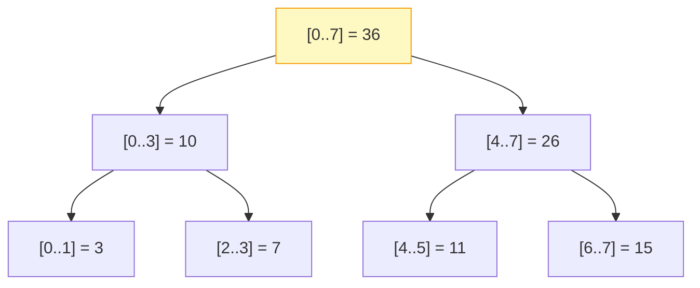

# Introduction to Segment Trees

## Why It Exists

You have an array and a stream of two interleaved requests: "what's the sum of `A[l..r]`?" and "set/add to `A[i]`." A **plain array** answers the query in `O(n)` (scan the range) and the update in `O(1)`. A **prefix-sum array** flips it: `O(1)` query, but any update forces an `O(n)` rebuild. Either way, one of the two operations is linear — fatal if both are frequent.

| Strategy | range query | point update | range update |
|---|---|---|---|
| Plain array | `O(n)` | `O(1)` | `O(n)` |
| Prefix sum | `O(1)` | `O(n)` | `O(n)` |
| **Segment tree** | `O(log n)` | `O(log n)` | `O(log n)` (lazy) |

The **segment tree** stores the aggregate of every *range* in a binary tree: the root holds the whole array's aggregate, each node splits its range in half, and leaves are single elements. Because any query range decomposes into `O(log n)` precomputed sub-ranges, both query and update are logarithmic. It's the structure that makes "aggregate of any subarray, with live updates" feel free — the backbone of range-query problems in competitive programming and analytics.

## See It Work

A sum segment tree over `[1..8]`. Query any range, then **add 10 to all of `[3..5]`** in one `O(log n)` call via lazy propagation, and re-query. Run it.

```python run viz=array viz-root=tree
class SegTree:
    def __init__(self, arr):
        self.n = len(arr)
        self.tree = [0] * (4 * self.n)        # 4n is safe sizing for any n
        self.lazy = [0] * (4 * self.n)        # pending range-adds, deferred
        if self.n: self._build(arr, 1, 0, self.n - 1)

    def _build(self, arr, node, l, r):
        if l == r: self.tree[node] = arr[l]; return       # leaf = one element
        mid = (l + r) // 2
        self._build(arr, 2*node,   l,     mid)            # left child = slot 2k
        self._build(arr, 2*node+1, mid+1, r)              # right child = slot 2k+1
        self.tree[node] = self.tree[2*node] + self.tree[2*node+1]   # aggregate up

    def _push(self, node, l, r):                          # apply + push pending lazy
        if self.lazy[node]:
            self.tree[node] += self.lazy[node] * (r - l + 1)
            if l != r:
                self.lazy[2*node]   += self.lazy[node]
                self.lazy[2*node+1] += self.lazy[node]
            self.lazy[node] = 0

    def range_update(self, ql, qr, val, node=1, l=0, r=None):
        if r is None: r = self.n - 1
        self._push(node, l, r)
        if qr < l or ql > r: return                       # no overlap
        if ql <= l and r <= qr:                           # full cover → mark lazy, stop
            self.lazy[node] += val; self._push(node, l, r); return
        mid = (l + r) // 2
        self.range_update(ql, qr, val, 2*node,   l,     mid)
        self.range_update(ql, qr, val, 2*node+1, mid+1, r)
        self.tree[node] = self.tree[2*node] + self.tree[2*node+1]

    def range_query(self, ql, qr, node=1, l=0, r=None):
        if r is None: r = self.n - 1
        if qr < l or ql > r: return 0                     # no overlap
        self._push(node, l, r)
        if ql <= l and r <= qr: return self.tree[node]    # full cover → use aggregate
        mid = (l + r) // 2
        return (self.range_query(ql, qr, 2*node,   l,     mid)
              + self.range_query(ql, qr, 2*node+1, mid+1, r))

st = SegTree([1, 2, 3, 4, 5, 6, 7, 8])
print("sum[0..7]:", st.range_query(0, 7))     # 36
print("sum[2..5]:", st.range_query(2, 5))     # 18
st.range_update(3, 5, 10)                      # +10 to A[3], A[4], A[5]
print("after +10 on [3..5]  sum[0..7]:", st.range_query(0, 7))   # 66
print("                     sum[3..5]:", st.range_query(3, 5))   # 45
print("                     sum[0..2]:", st.range_query(0, 2))   # 6  (unchanged)
```

## How It Works

The tree mirrors a recursive halving of the index range:

- The **root** covers `[0, n−1]`; a node covering `[l, r]` has children `[l, mid]` and `[mid+1, r]`; **leaves** are single indices `[i, i]`.
- **Each node stores the aggregate** (sum, min, max, gcd, …) of its range.
- Stored in a flat array of size `4n`; node `k`'s children are `2k` and `2k+1` (the same implicit-tree indexing as a binary heap).



<p align="center"><strong>sum segment tree over <code>A = [1..8]</code>: each internal node is the sum of its two children; the root is the whole-array sum.</strong></p>

Three operations, all `O(log n)`: **build** bottom-up (`O(n)` once); **query** descends, returning a node's stored aggregate whenever its range is *fully inside* the query (and pruning fully-outside nodes); **update** walks to a leaf and refreshes aggregates on the way back up. For *range* updates, **lazy propagation** is the trick: when an update fully covers a node's range, mark a `lazy` tag on that node and stop — defer the work. `_push` applies a pending tag (and passes it to children) only when a later query or update actually descends through that node. That deferral is what keeps range updates `O(log n)` instead of `O(n)`.

### Key Takeaway

A segment tree stores every range's aggregate in a binary tree (`4n` flat array, children at `2k`/`2k+1`). Query and point-update are `O(log n)` because a range decomposes into `O(log n)` fully-covered nodes; lazy propagation defers range updates so they're `O(log n)` too. Use it when you need *both* range queries and frequent updates over the same data.

## Trace It

A range query *could* visit every node — that would be `O(n)`. It doesn't: querying `sum(A[1..3])` on the 4-element tree below touches only a handful of nodes and returns `3 + 12 = 15`.

> ▶ Run it, then Visualise — range sum query `[1,3]`: the traversal path and the two answer segments.

```d3 widget=segment-tree
{
  "title": "Range sum query: sum(A[1..3])",
  "steps": [
    {
      "nodes": [
        {"id": "1", "label": "16", "kind": "node", "slot": 1, "meta": [{"name": "range", "value": "[0,3]"}], "cardId": "", "layoutKind": ""},
        {"id": "2", "label": "4",  "kind": "node", "slot": 2, "meta": [{"name": "range", "value": "[0,1]"}], "cardId": "", "layoutKind": ""},
        {"id": "3", "label": "12", "kind": "node", "slot": 3, "meta": [{"name": "range", "value": "[2,3]"}], "cardId": "", "layoutKind": ""},
        {"id": "4", "label": "1",  "kind": "leaf", "slot": 4, "meta": [{"name": "range", "value": "[0,0]"}], "cardId": "", "layoutKind": ""},
        {"id": "5", "label": "3",  "kind": "leaf", "slot": 5, "meta": [{"name": "range", "value": "[1,1]"}], "cardId": "", "layoutKind": ""},
        {"id": "6", "label": "5",  "kind": "leaf", "slot": 6, "meta": [{"name": "range", "value": "[2,2]"}], "cardId": "", "layoutKind": ""},
        {"id": "7", "label": "7",  "kind": "leaf", "slot": 7, "meta": [{"name": "range", "value": "[3,3]"}], "cardId": "", "layoutKind": ""}
      ],
      "edges": [
        {"from": "2", "to": "1", "label": ""},
        {"from": "3", "to": "1", "label": ""},
        {"from": "4", "to": "2", "label": ""},
        {"from": "5", "to": "2", "label": ""},
        {"from": "6", "to": "3", "label": ""},
        {"from": "7", "to": "3", "label": ""}
      ],
      "cursor": [], "highlight": [], "changed": [], "removed": [],
      "annotation": "Initial state. Query: sum(A[1..3]) = 3+5+7 = 15.",
      "line": 0, "frames": [], "cardCursor": []
    },
    {
      "nodes": [
        {"id": "1", "label": "16", "kind": "node", "slot": 1, "meta": [{"name": "range", "value": "[0,3]"}], "cardId": "", "layoutKind": ""},
        {"id": "2", "label": "4",  "kind": "node", "slot": 2, "meta": [{"name": "range", "value": "[0,1]"}], "cardId": "", "layoutKind": ""},
        {"id": "3", "label": "12", "kind": "node", "slot": 3, "meta": [{"name": "range", "value": "[2,3]"}], "cardId": "", "layoutKind": ""},
        {"id": "4", "label": "1",  "kind": "leaf", "slot": 4, "meta": [{"name": "range", "value": "[0,0]"}], "cardId": "", "layoutKind": ""},
        {"id": "5", "label": "3",  "kind": "leaf", "slot": 5, "meta": [{"name": "range", "value": "[1,1]"}], "cardId": "", "layoutKind": ""},
        {"id": "6", "label": "5",  "kind": "leaf", "slot": 6, "meta": [{"name": "range", "value": "[2,2]"}], "cardId": "", "layoutKind": ""},
        {"id": "7", "label": "7",  "kind": "leaf", "slot": 7, "meta": [{"name": "range", "value": "[3,3]"}], "cardId": "", "layoutKind": ""}
      ],
      "edges": [
        {"from": "2", "to": "1", "label": ""},
        {"from": "3", "to": "1", "label": ""},
        {"from": "4", "to": "2", "label": ""},
        {"from": "5", "to": "2", "label": ""},
        {"from": "6", "to": "3", "label": ""},
        {"from": "7", "to": "3", "label": ""}
      ],
      "cursor": [], "highlight": ["1","2","4","5","3"], "changed": [], "removed": [],
      "annotation": "Traversal: root[0,3] partial. Left[0,1] partial. [0,0] outside (skip). [1,1] fully inside. Right[2,3] fully inside.",
      "line": 0, "frames": [], "cardCursor": []
    },
    {
      "nodes": [
        {"id": "1", "label": "16", "kind": "node", "slot": 1, "meta": [{"name": "range", "value": "[0,3]"}], "cardId": "", "layoutKind": ""},
        {"id": "2", "label": "4",  "kind": "node", "slot": 2, "meta": [{"name": "range", "value": "[0,1]"}], "cardId": "", "layoutKind": ""},
        {"id": "3", "label": "12", "kind": "node", "slot": 3, "meta": [{"name": "range", "value": "[2,3]"}], "cardId": "", "layoutKind": ""},
        {"id": "4", "label": "1",  "kind": "leaf", "slot": 4, "meta": [{"name": "range", "value": "[0,0]"}], "cardId": "", "layoutKind": ""},
        {"id": "5", "label": "3",  "kind": "leaf", "slot": 5, "meta": [{"name": "range", "value": "[1,1]"}], "cardId": "", "layoutKind": ""},
        {"id": "6", "label": "5",  "kind": "leaf", "slot": 6, "meta": [{"name": "range", "value": "[2,2]"}], "cardId": "", "layoutKind": ""},
        {"id": "7", "label": "7",  "kind": "leaf", "slot": 7, "meta": [{"name": "range", "value": "[3,3]"}], "cardId": "", "layoutKind": ""}
      ],
      "edges": [
        {"from": "2", "to": "1", "label": ""},
        {"from": "3", "to": "1", "label": ""},
        {"from": "4", "to": "2", "label": ""},
        {"from": "5", "to": "2", "label": ""},
        {"from": "6", "to": "3", "label": ""},
        {"from": "7", "to": "3", "label": ""}
      ],
      "cursor": [], "highlight": [], "changed": ["5","3"], "removed": [],
      "annotation": "Answer segments: node 5 ([1,1] = 3) + node 3 ([2,3] = 12). Total = 15.",
      "line": 0, "frames": [], "cardCursor": []
    }
  ]
}
```

Before you read on: the query for `[1,3]` returned by reading just **two** stored nodes — `[1,1]` and `[2,3]` — instead of summing three leaves. Why does *every* range query, no matter how wide, finish by reading only `O(log n)` nodes rather than visiting the whole tree?

Because any range `[l, r]` decomposes into at most `O(log n)` **canonical segments** — maximal tree nodes that lie entirely inside it. Here's the argument: descend from the root. A node is one of three things relative to the query — *fully inside* (return its stored aggregate, **don't recurse**), *fully outside* (return identity, **prune**), or *partially overlapping* (recurse into both children). The key fact is that **at most two nodes per level are "partially overlapping"** — the one straddling the query's left boundary `l` and the one straddling the right boundary `r`. Every other node at that level is wholly inside (answered in `O(1)`) or wholly outside (pruned). So the recursion branches at most twice per level, across `⌈log₂ n⌉` levels → `O(log n)` nodes touched, and the answer is assembled from `O(log n)` canonical segments. That "boundary nodes are the only ones that split" property is the entire reason the structure is logarithmic — and it's also why the *same* decomposition makes updates logarithmic, and why lazy propagation can tag a fully-covered node and stop: a full-cover node is a canonical segment, and there are only `O(log n)` of them on any path.

## Your Turn

Build, range-query, and lazy range-update in both languages:

```python run viz=binary-tree viz-root=root viz-kind=segment-tree
class SegTree:
    def __init__(self, arr):
        self.n = len(arr); self.tree = [0]*(4*self.n); self.lazy = [0]*(4*self.n)
        if self.n: self._build(arr, 1, 0, self.n-1)
    def _build(self, a, nd, l, r):
        if l == r: self.tree[nd] = a[l]; return
        m = (l+r)//2; self._build(a,2*nd,l,m); self._build(a,2*nd+1,m+1,r)
        self.tree[nd] = self.tree[2*nd]+self.tree[2*nd+1]
    def _push(self, nd, l, r):
        if self.lazy[nd]:
            self.tree[nd] += self.lazy[nd]*(r-l+1)
            if l != r: self.lazy[2*nd]+=self.lazy[nd]; self.lazy[2*nd+1]+=self.lazy[nd]
            self.lazy[nd] = 0
    def update(self, ql, qr, v, nd=1, l=0, r=None):
        if r is None: r = self.n-1
        self._push(nd,l,r)
        if qr<l or ql>r: return
        if ql<=l and r<=qr: self.lazy[nd]+=v; self._push(nd,l,r); return
        m=(l+r)//2; self.update(ql,qr,v,2*nd,l,m); self.update(ql,qr,v,2*nd+1,m+1,r)
        self.tree[nd]=self.tree[2*nd]+self.tree[2*nd+1]
    def query(self, ql, qr, nd=1, l=0, r=None):
        if r is None: r = self.n-1
        if qr<l or ql>r: return 0
        self._push(nd,l,r)
        if ql<=l and r<=qr: return self.tree[nd]
        m=(l+r)//2; return self.query(ql,qr,2*nd,l,m)+self.query(ql,qr,2*nd+1,m+1,r)

st = SegTree([1,3,5,7])
print(st.query(0,3), st.query(1,3))     # 16 15
st.update(0,1,10)                        # +10 to A[0],A[1]
print(st.query(0,3), st.query(0,1))      # 36 24
```

```java run viz=binary-tree viz-root=root viz-kind=segment-tree
public class Main {
  static int n; static long[] tree, lazy;
  static void build(int[] a, int nd, int l, int r) {
    if (l == r) { tree[nd] = a[l]; return; }
    int m = (l+r)/2; build(a,2*nd,l,m); build(a,2*nd+1,m+1,r);
    tree[nd] = tree[2*nd] + tree[2*nd+1];
  }
  static void push(int nd, int l, int r) {
    if (lazy[nd] != 0) {
      tree[nd] += lazy[nd]*(long)(r-l+1);
      if (l != r) { lazy[2*nd] += lazy[nd]; lazy[2*nd+1] += lazy[nd]; }
      lazy[nd] = 0;
    }
  }
  static void update(int nd,int l,int r,int ql,int qr,int v){
    push(nd,l,r);
    if (qr<l||ql>r) return;
    if (ql<=l&&r<=qr){ lazy[nd]+=v; push(nd,l,r); return; }
    int m=(l+r)/2; update(2*nd,l,m,ql,qr,v); update(2*nd+1,m+1,r,ql,qr,v);
    tree[nd]=tree[2*nd]+tree[2*nd+1];
  }
  static long query(int nd,int l,int r,int ql,int qr){
    if (qr<l||ql>r) return 0;
    push(nd,l,r);
    if (ql<=l&&r<=qr) return tree[nd];
    int m=(l+r)/2; return query(2*nd,l,m,ql,qr)+query(2*nd+1,m+1,r,ql,qr);
  }
  public static void main(String[] a){
    int[] arr={1,3,5,7}; n=arr.length; tree=new long[4*n]; lazy=new long[4*n];
    build(arr,1,0,n-1);
    System.out.println(query(1,0,n-1,0,3) + " " + query(1,0,n-1,1,3));  // 16 15
    update(1,0,n-1,0,1,10);
    System.out.println(query(1,0,n-1,0,3) + " " + query(1,0,n-1,0,1));  // 36 24
  }
}
```

Then climb the ladder: swap the aggregate to min/max/gcd (any associative op works); implement range-min with lazy "assign" instead of "add"; build a segment tree for "count of values ≤ k in a range"; compare against a Fenwick tree on a prefix-sum-only workload.

## Reflect & Connect

The segment tree is the general-purpose range-query workhorse:

- **Any associative aggregate works** — sum, min, max, gcd, xor, "leftmost 1." The structure only needs a *monoid*: an associative combine with an identity. Swap `+`/`0` for `min`/`∞` and you have a range-minimum tree, same code shape.
- **Lazy propagation is the deferral pattern** — "mark work pending at the highest covering node, do it only when someone looks below." The same idea recurs in lazy evaluation, copy-on-write, and database MVCC. It's what turns range updates from `O(n)` into `O(log n)`.
- **vs Fenwick (BIT)** — the [Fenwick tree](/cortex/data-structures-and-algorithms/trees/fenwick-tree/introduction-to-fenwick-trees) is a tighter, simpler structure for *prefix-sum*-style queries (less code, smaller constant) but far less general — no easy range-min, no arbitrary monoid. Reach for Fenwick when you only need invertible prefix aggregates; reach for a segment tree when you need min/max/gcd or range assignment.
- **vs sparse table** — for a *static* array (no updates) and an idempotent op (min/max/gcd), a sparse table answers queries in `O(1)` after `O(n log n)` build. Segment trees win the moment updates enter the picture.

**Prerequisites:** [Binary Tree](/cortex/data-structures-and-algorithms/trees/binary-tree/introduction-to-binary-trees), [Asymptotic Analysis](/cortex/data-structures-and-algorithms/foundations/asymptotic-analysis).
**What's next:** the leaner cousin for prefix sums — fewer lines, smaller constant, a beautiful bit trick — the [Fenwick Tree](/cortex/data-structures-and-algorithms/trees/fenwick-tree/introduction-to-fenwick-trees).

## Recall

> **Mnemonic:** *Each node = aggregate of a range; root = whole array; leaves = single elements; flat `4n` array, children `2k`/`2k+1`. A range splits into O(log n) canonical (full-cover) segments ⇒ query/update O(log n). Lazy = tag a full-cover node, push only when someone descends.*

| | |
|---|---|
| Node stores | the aggregate of its range (sum/min/max/gcd/…) |
| Layout | flat `4n` array; node `k` ⇒ children `2k`, `2k+1` |
| Query / point update | `O(log n)` — range = `O(log n)` canonical segments |
| Range update | `O(log n)` with lazy propagation (deferred tags) |
| Needs | an associative combine + identity (a monoid) |
| vs Fenwick / sparse table | more general / loses to them on prefix-only or static |

<details>
<summary><strong>Q:</strong> Why are query and update `O(log n)`?</summary>

**A:** Any range decomposes into `O(log n)` canonical (fully-covered) nodes — at most two "boundary" nodes per level partially overlap and recurse; the rest are answered or pruned.

</details>
<details>
<summary><strong>Q:</strong> What does each node store, and how is the tree laid out?</summary>

**A:** The aggregate of its range; in a flat `4n` array with children at `2k` and `2k+1`.

</details>
<details>
<summary><strong>Q:</strong> What problem does lazy propagation solve, and how?</summary>

**A:** `O(log n)` *range* updates — tag a fully-covered node as pending and stop; `_push` applies and forwards the tag only when a later op descends through it.

</details>
<details>
<summary><strong>Q:</strong> What must the aggregate satisfy?</summary>

**A:** It must be a monoid — an associative combine with an identity (sum/0, min/∞, gcd/0, xor/0).

</details>
<details>
<summary><strong>Q:</strong> Segment tree vs Fenwick vs sparse table?</summary>

**A:** Fenwick: simpler, prefix-sum-only; sparse table: `O(1)` static idempotent queries, no updates; segment tree: general, supports updates and arbitrary monoids.

</details>

## Sources & Verify

- **CP-Algorithms**, *Segment Tree* (cp-algorithms.com) — the canonical reference for build/query/update and lazy propagation, which this implementation follows.
- **Sedgewick & Wayne**, *Algorithms*, 4th ed. — range-search and aggregate structures; **Competitive Programmer's Handbook** (Laaksonen), ch. 9 — range queries.
- Both runnable blocks are verified by running (`[1..8]`: sum[0..7]=36, sum[2..5]=18; after `+10` on `[3..5]` ⇒ sum[0..7]=66, sum[3..5]=45, sum[0..2]=6 unchanged. `[1,3,5,7]`: sum[0..3]=16, sum[1..3]=15; after `+10` on `[0,1]` ⇒ 36, 24).
