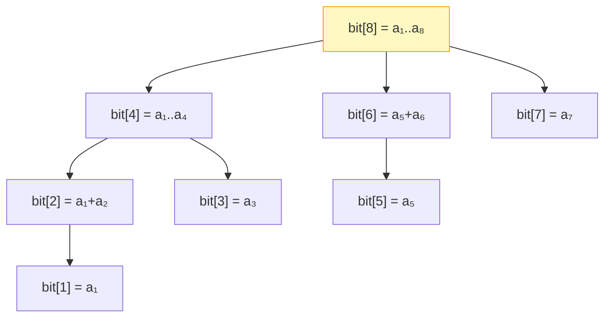

# Introduction to Fenwick Trees (BIT)

## Why It Exists

The [segment tree](/cortex/data-structures-and-algorithms/trees-segment-tree-introduction-to-segment-trees) solves range queries with updates in `O(log n)` — but it's a few hundred lines, a `4n` array, two recursive functions, and lazy bookkeeping. For the *specific, common* case of **prefix sums with point updates** ("sum of `A[1..i]`" and "`A[i] += δ`"), that's overkill.

The **Fenwick tree** (or **Binary Indexed Tree**, BIT) does exactly that case in **six lines per operation**, one flat array, no recursion. The whole structure rests on one identity from two's-complement arithmetic: `i & (-i)` isolates the **lowest set bit** of `i`. That single expression both defines which range each array cell covers *and* drives the `O(log n)` walks for query and update. Less general than a segment tree (no range-min, no arbitrary monoid), but half the code, half the memory, and a smaller constant — the default when prefix sums are all you need.

## See It Work

A Fenwick tree over `[1..8]`. Query any prefix or range sum, do a point update, and re-query — all in `O(log n)` with a single `bit[]` array. Run it.

```python run viz=array viz-root=tree viz-kind=fenwick
class Fenwick:
    def __init__(self, n):
        self.n = n
        self.bit = [0] * (n + 1)              # 1-indexed; bit[0] unused

    def update(self, i, delta):               # A[i] += delta  — walk UP
        while i <= self.n:
            self.bit[i] += delta
            i += i & -i                       # jump to the next cell that covers i

    def prefix_sum(self, i):                  # sum of A[1..i] — walk DOWN
        s = 0
        while i > 0:
            s += self.bit[i]
            i -= i & -i                       # jump to the previous disjoint slice
        return s

    def range_sum(self, l, r):
        return self.prefix_sum(r) - self.prefix_sum(l - 1)

arr = [1, 2, 3, 4, 5, 6, 7, 8]
bit = Fenwick(len(arr))
for i, v in enumerate(arr, start=1):
    bit.update(i, v)                          # build by n point-updates

print("sum[1..8]:", bit.range_sum(1, 8))      # 36
print("sum[3..6]:", bit.range_sum(3, 6))      # 18
bit.update(5, 100)                            # A[5] += 100
print("after A[5]+=100  sum[1..8]:", bit.range_sum(1, 8))   # 136
print("                 sum[3..6]:", bit.range_sum(3, 6))   # 118
```

## How It Works

The one trick: in two's complement, `i & (-i)` is `i`'s **lowest set bit**. `12 = 1100` → `12 & -12 = 0100 = 4`; `13 → 1`; `8 → 8`. Each BIT cell uses it to define its range:

> `bit[i]` stores the sum of `A[i − lowbit(i) + 1 .. i]` — a power-of-2-sized slice ending at `i`.

```
i:          1     2     3       4       5     6     7        8
lowbit(i):  1     2     1       4       1     2     1        8
bit[i]:     a₁  a₁+a₂   a₃  a₁+…+a₄    a₅  a₅+a₆   a₇   a₁+…+a₈
```

Those slices form an **implicit forest** — the edges are never stored; they emerge from the index bit patterns:



<p align="center"><strong>each cell covers a power-of-2 slice ending at its index; parent links emerge from <code>lowbit</code>.</strong></p>

Two `O(log n)` walks, both driven by `lowbit`: **prefix_sum(i)** walks *down* — add `bit[i]`, then `i -= lowbit(i)`, until `i = 0` — accumulating disjoint slices that exactly tile `[1..i]`. **update(i, δ)** walks *up* — add δ to `bit[i]`, then `i += lowbit(i)`, until `i > n` — hitting every cell whose slice contains index `i`. Range sum is just `prefix_sum(r) − prefix_sum(l−1)`, which is why the aggregate must be **invertible** (subtraction is required) — sums and XORs work, min/max don't.

> ▶ Run it, then Visualise — prefix sum `sum(1..5)`: the LSB-jump path from 5 down to 0.

```d3 widget=fenwick
{
  "title": "Prefix sum query: sum(1..5)",
  "steps": [
    {
      "nodes": [
        {"id": "1", "label": "1",  "kind": "node", "slot": 1, "meta": [{"name": "range", "value": "[1,1]"}], "cardId": "", "layoutKind": ""},
        {"id": "2", "label": "3",  "kind": "node", "slot": 2, "meta": [{"name": "range", "value": "[1,2]"}], "cardId": "", "layoutKind": ""},
        {"id": "3", "label": "3",  "kind": "node", "slot": 3, "meta": [{"name": "range", "value": "[3,3]"}], "cardId": "", "layoutKind": ""},
        {"id": "4", "label": "10", "kind": "node", "slot": 4, "meta": [{"name": "range", "value": "[1,4]"}], "cardId": "", "layoutKind": ""},
        {"id": "5", "label": "5",  "kind": "node", "slot": 5, "meta": [{"name": "range", "value": "[5,5]"}], "cardId": "", "layoutKind": ""},
        {"id": "6", "label": "11", "kind": "node", "slot": 6, "meta": [{"name": "range", "value": "[5,6]"}], "cardId": "", "layoutKind": ""},
        {"id": "7", "label": "7",  "kind": "node", "slot": 7, "meta": [{"name": "range", "value": "[7,7]"}], "cardId": "", "layoutKind": ""},
        {"id": "8", "label": "36", "kind": "node", "slot": 8, "meta": [{"name": "range", "value": "[1,8]"}], "cardId": "", "layoutKind": ""}
      ],
      "edges": [],
      "cursor": [{"name": "i", "target": "5", "color": "#6366f1"}],
      "highlight": ["5"], "changed": [], "removed": [],
      "annotation": "Query sum(1..5): start at i=5. bit[5]=[5,5], acc += 5. Running total: 5.",
      "line": 0, "frames": [], "cardCursor": []
    },
    {
      "nodes": [
        {"id": "1", "label": "1",  "kind": "node", "slot": 1, "meta": [{"name": "range", "value": "[1,1]"}], "cardId": "", "layoutKind": ""},
        {"id": "2", "label": "3",  "kind": "node", "slot": 2, "meta": [{"name": "range", "value": "[1,2]"}], "cardId": "", "layoutKind": ""},
        {"id": "3", "label": "3",  "kind": "node", "slot": 3, "meta": [{"name": "range", "value": "[3,3]"}], "cardId": "", "layoutKind": ""},
        {"id": "4", "label": "10", "kind": "node", "slot": 4, "meta": [{"name": "range", "value": "[1,4]"}], "cardId": "", "layoutKind": ""},
        {"id": "5", "label": "5",  "kind": "node", "slot": 5, "meta": [{"name": "range", "value": "[5,5]"}], "cardId": "", "layoutKind": ""},
        {"id": "6", "label": "11", "kind": "node", "slot": 6, "meta": [{"name": "range", "value": "[5,6]"}], "cardId": "", "layoutKind": ""},
        {"id": "7", "label": "7",  "kind": "node", "slot": 7, "meta": [{"name": "range", "value": "[7,7]"}], "cardId": "", "layoutKind": ""},
        {"id": "8", "label": "36", "kind": "node", "slot": 8, "meta": [{"name": "range", "value": "[1,8]"}], "cardId": "", "layoutKind": ""}
      ],
      "edges": [{"from": "5", "to": "4", "label": "query"}],
      "cursor": [{"name": "i", "target": "4", "color": "#6366f1"}],
      "highlight": ["5", "4"], "changed": [], "removed": [],
      "annotation": "i -= lowbit(5)=1 → i=4. bit[4]=[1,4], acc += 10. Running total: 15.",
      "line": 0, "frames": [], "cardCursor": []
    },
    {
      "nodes": [
        {"id": "1", "label": "1",  "kind": "node", "slot": 1, "meta": [{"name": "range", "value": "[1,1]"}], "cardId": "", "layoutKind": ""},
        {"id": "2", "label": "3",  "kind": "node", "slot": 2, "meta": [{"name": "range", "value": "[1,2]"}], "cardId": "", "layoutKind": ""},
        {"id": "3", "label": "3",  "kind": "node", "slot": 3, "meta": [{"name": "range", "value": "[3,3]"}], "cardId": "", "layoutKind": ""},
        {"id": "4", "label": "10", "kind": "node", "slot": 4, "meta": [{"name": "range", "value": "[1,4]"}], "cardId": "", "layoutKind": ""},
        {"id": "5", "label": "5",  "kind": "node", "slot": 5, "meta": [{"name": "range", "value": "[5,5]"}], "cardId": "", "layoutKind": ""},
        {"id": "6", "label": "11", "kind": "node", "slot": 6, "meta": [{"name": "range", "value": "[5,6]"}], "cardId": "", "layoutKind": ""},
        {"id": "7", "label": "7",  "kind": "node", "slot": 7, "meta": [{"name": "range", "value": "[7,7]"}], "cardId": "", "layoutKind": ""},
        {"id": "8", "label": "36", "kind": "node", "slot": 8, "meta": [{"name": "range", "value": "[1,8]"}], "cardId": "", "layoutKind": ""}
      ],
      "edges": [],
      "cursor": [], "highlight": [], "changed": ["5", "4"], "removed": [],
      "annotation": "i -= lowbit(4)=4 → i=0, stop. sum(1..5) = 5 + 10 = 15. Two cells read in O(log n).",
      "line": 0, "frames": [], "cardCursor": []
    }
  ]
}
```

### Key Takeaway

A Fenwick tree is one `bit[]` array where `bit[i]` holds the sum of a `lowbit(i)`-sized slice ending at `i`. `prefix_sum` walks down (`i -= i & -i`) over disjoint slices that tile `[1..i]`; `update` walks up (`i += i & -i`) over every cell that contains `i`. Both `O(log n)`, six lines each, no recursion — for **invertible** prefix aggregates (range sum needs subtraction).

## Trace It

The two operations move in *opposite* directions: `update` does `i += i & -i` (upward), `prefix_sum` does `i -= i & -i` (downward).

Before you read on: that asymmetry looks like a quirk — why not make both walk the same way? Trace the cells each visits for index 5 (`update(5)` vs `prefix_sum(5)`) and figure out *why* they must go opposite directions to both be correct.

`update(5)` visits **`5 → 6 → 8`** (each `+= lowbit`), while `prefix_sum(5)` visits **`5 → 4`** (each `−= lowbit`), then stops. They traverse *complementary* sets of cells, and that's exactly the point. `prefix_sum(i)` needs the cells whose slices **disjointly tile `[1..i]`**: `bit[5]` covers `[5,5]` and `bit[4]` covers `[1,4]` — together exactly `[1,5]`, no overlap, no gap. Subtracting the low bit peels off one slice at a time, marching down to 0. `update(i)` needs the opposite relation — *every* cell whose slice **contains** index `i`, because all of them must absorb the delta: `bit[5]` (`[5,5]`), `bit[6]` (`[5,6]`), `bit[8]` (`[1,8]`) all include index 5, and adding the low bit jumps to the next-larger enclosing slice. So "what tiles my prefix" (go down, disjoint) and "who contains me" (go up, nested) are genuinely different cell sets, and the `i & -i` jump is the same primitive read two ways: subtract to *shrink the prefix to the previous slice boundary*, add to *grow to the next enclosing parent*. Make them go the same direction and one of the two relations breaks — you'd either miss cells that must be updated or double-count slices in the sum. The opposite-direction duality is what makes a single tiny array serve both queries and updates correctly.

## Your Turn

Fenwick build, range sum, and point update in both languages:

```python run viz=array viz-root=tree viz-kind=fenwick
class Fenwick:
    def __init__(self, n):
        self.n = n; self.bit = [0]*(n+1)
    def update(self, i, delta):
        while i <= self.n: self.bit[i] += delta; i += i & -i
    def prefix_sum(self, i):
        s = 0
        while i > 0: s += self.bit[i]; i -= i & -i
        return s
    def range_sum(self, l, r): return self.prefix_sum(r) - self.prefix_sum(l-1)

bit = Fenwick(8)
for i, v in enumerate([1,2,3,4,5,6,7,8], start=1): bit.update(i, v)
print(bit.range_sum(1,8), bit.range_sum(3,6))     # 36 18
bit.update(5, 100)
print(bit.range_sum(1,8), bit.range_sum(3,6))     # 136 118
```

```java run viz=array viz-root=tree viz-kind=fenwick
public class Main {
  static int n; static long[] bit;
  static void update(int i, long d) { while (i <= n) { bit[i] += d; i += i & -i; } }
  static long prefixSum(int i) { long s = 0; while (i > 0) { s += bit[i]; i -= i & -i; } return s; }
  static long rangeSum(int l, int r) { return prefixSum(r) - prefixSum(l - 1); }
  public static void main(String[] a) {
    int[] arr = {1,2,3,4,5,6,7,8}; n = arr.length; bit = new long[n + 1];
    for (int i = 1; i <= n; i++) update(i, arr[i - 1]);
    System.out.println(rangeSum(1, 8) + " " + rangeSum(3, 6));   // 36 18
    update(5, 100);
    System.out.println(rangeSum(1, 8) + " " + rangeSum(3, 6));   // 136 118
  }
}
```

Then climb the ladder: build in `O(n)` (add `bit[i]` into `bit[i + lowbit(i)]`) instead of `n` updates; count inversions in an array with a BIT over value ranks; do range-update/point-query with a difference BIT; extend to a 2D Fenwick for grid prefix sums.

## Reflect & Connect

The Fenwick tree is the specialist where the segment tree is the generalist:

- **vs Segment tree** — same `O(log n)`, but Fenwick is ~half the code/memory and a smaller constant *for prefix-sum-style queries only*. The price of that economy: the aggregate must be **invertible** (range = `prefix(r) − prefix(l−1)`), so sum and xor work but min/max don't — those need a [segment tree](/cortex/data-structures-and-algorithms/trees-segment-tree-introduction-to-segment-trees) or a sparse table.
- **The lowbit trick is the whole structure** — `i & -i` (the [set-bit-finder](/cortex/data-structures-and-algorithms/bit-tricks-pattern-set-bit-finder-pattern) identity) defines each cell's range and drives both walks. No node objects, no pointers, no recursion — just index arithmetic over one array. It's the cleanest example of "a clever index scheme replaces an explicit tree" (the same idea as the implicit binary heap).
- **Classic uses** — counting inversions (BIT over value ranks while scanning), order statistics / rank queries, range-add with point-query via a difference array, and 2D prefix sums. It's a staple of competitive programming precisely because it's so short to type correctly under time pressure.

**Prerequisites:** [Segment Tree](/cortex/data-structures-and-algorithms/trees-segment-tree-introduction-to-segment-trees), [Set-Bit Finder](/cortex/data-structures-and-algorithms/bit-tricks-pattern-set-bit-finder-pattern).
**What's next:** leave trees-as-ordered-data behind for trees-as-connectivity — near-`O(1)` union and find over disjoint sets — the [Disjoint Set Union](/cortex/data-structures-and-algorithms/trees-disjoint-set-union-introduction-to-disjoint-set-union).

## Recall

> **Mnemonic:** *`bit[i]` = sum of a lowbit(i) slice ending at i. Query walks DOWN (`i -= i&-i`, disjoint slices tiling [1..i]); update walks UP (`i += i&-i`, every cell containing i). One array, six-line loops, O(log n). Invertible aggregates only.*

| | |
|---|---|
| The trick | `i & -i` = lowest set bit (two's complement) |
| `bit[i]` covers | `A[i − lowbit(i) + 1 .. i]` |
| prefix_sum(i) | walk **down**: `i -= i & -i` until 0 (disjoint tiling) |
| update(i, δ) | walk **up**: `i += i & -i` until `> n` (enclosing cells) |
| range_sum(l,r) | `prefix(r) − prefix(l−1)` — needs an **invertible** op |
| vs segment tree | half the code/memory; prefix-only, no min/max |

<details>
<summary><strong>Q:</strong> What does `i & -i` compute, and why does it matter?</summary>

**A:** The lowest set bit of `i`; it defines each cell's slice size and drives both the query and update walks.

</details>
<details>
<summary><strong>Q:</strong> Why do update and prefix_sum walk in opposite directions?</summary>

**A:** prefix_sum needs the disjoint slices that *tile* `[1..i]` (go down); update needs every cell whose slice *contains* `i` (go up) — complementary cell sets.

</details>
<details>
<summary><strong>Q:</strong> What aggregates can a Fenwick tree handle?</summary>

**A:** Invertible ones (sum, xor) — range = `prefix(r) − prefix(l−1)` requires subtraction; min/max need a segment tree.

</details>
<details>
<summary><strong>Q:</strong> Fenwick vs segment tree — when each?</summary>

**A:** Fenwick for prefix-sum + point-update (shorter, smaller constant); segment tree for arbitrary monoids, range-min/max, or range updates.

</details>
<details>
<summary><strong>Q:</strong> Name two classic Fenwick applications.</summary>

**A:** Counting inversions and rank/order-statistic queries (BIT over value ranks).

</details>

## Sources & Verify

- **Fenwick, P. (1994)**, *A New Data Structure for Cumulative Frequency Tables* (Software: Practice & Experience) — the original paper.
- **CP-Algorithms**, *Fenwick Tree* (cp-algorithms.com) and **Competitive Programmer's Handbook** (Laaksonen), ch. 9 — the canonical references; this implementation follows them.
- Both runnable blocks are verified by running (`[1..8]`: sum[1..8]=36, sum[3..6]=18; after `A[5]+=100` ⇒ 136, 118). The `lowbit` walks are verified: `prefix_sum(5)` visits `[5,4]`, `update(5)` visits `[5,6,8]`.
