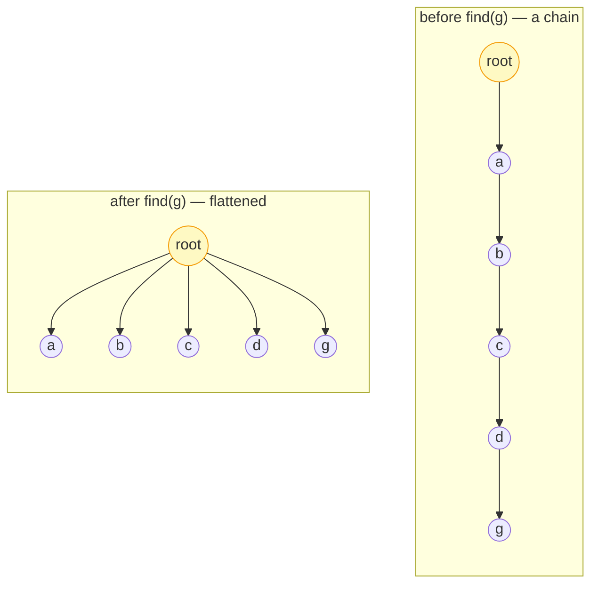

# Introduction to Disjoint Set Union (Union-Find)

## Why It Exists

You have `n` items, each initially in its own group, and a stream of two requests: `union(x, y)` — merge `x`'s group with `y`'s — and `same_set(x, y)` — are they currently in the same group? This is the **dynamic connectivity** problem, and it's everywhere: "are these two cities connected by roads built so far?", "do these two pixels belong to the same blob?", "would adding this edge create a cycle?" (the heart of [Kruskal's MST](/cortex/data-structures-and-algorithms/graphs-minimum-spanning-trees)).

The naive options both fail. Re-run BFS per query? `O(n + m)` each — fatal. Give each element a group-ID and relabel on union? `O(1)` query but `O(n)` per union when half the elements must be relabelled. **Disjoint Set Union** (DSU, a.k.a. **Union-Find**) does *both* in **amortized `O(α(n))`** — the inverse Ackermann function, which is ≤ 4 for any input you could ever build. Effectively constant time, from one array and two tiny optimizations.

## See It Work

A DSU over 10 elements. Union some pairs, count the components, and ask connectivity questions — all near-instant. Run it.

```python run viz=array viz-root=parent viz-kind=union-find
class DSU:
    def __init__(self, n):
        self.parent = list(range(n))      # everyone starts as their own root
        self.rank = [0] * n               # upper bound on tree height
        self.num_sets = n

    def find(self, x):                    # walk to root, compressing the path
        if self.parent[x] != x:
            self.parent[x] = self.find(self.parent[x])   # re-point straight to root
        return self.parent[x]

    def union(self, x, y):
        rx, ry = self.find(x), self.find(y)
        if rx == ry: return False         # already connected
        if self.rank[rx] < self.rank[ry]: # attach shorter tree under taller
            rx, ry = ry, rx
        self.parent[ry] = rx
        if self.rank[rx] == self.rank[ry]:
            self.rank[rx] += 1
        self.num_sets -= 1
        return True

    def same_set(self, x, y):
        return self.find(x) == self.find(y)

dsu = DSU(10)
for u, v in [(0, 1), (1, 2), (3, 4), (5, 6), (6, 7)]:
    dsu.union(u, v)
print("components remain:", dsu.num_sets)        # 5  → {0,1,2} {3,4} {5,6,7} {8} {9}
print("same_set(0, 2):", dsu.same_set(0, 2))     # True
print("same_set(0, 3):", dsu.same_set(0, 3))     # False
dsu.union(2, 3)
print("after union(2,3) same_set(0, 4):", dsu.same_set(0, 4))   # True

# build a 100-long chain, then one find — path compression flattens it
chain = DSU(100)
for i in range(99): chain.union(i, i + 1)
chain.find(0)
depth = lambda x: 0 if chain.parent[x] == x else 1 + depth(chain.parent[x])
print("max tree depth after compression:", max(depth(x) for x in range(100)))   # 1
```

## How It Works

Each element stores **one parent pointer**; a group is a tree, and its **root** (a node whose parent is itself) is the group's leader. `find(x)` walks parent pointers to the root; `same_set` is just "same root"; `union` links one root under the other. Two optimizations make it fast:

- **Path compression** — during `find`, re-point every node on the path *directly to the root*. The tree flattens as a side effect of reading it.
- **Union by rank (or size)** — attach the *shorter* (or *smaller*) tree under the *taller* (or *larger*) one, so height grows as slowly as possible.



<p align="center"><strong>path compression: the first <code>find(g)</code> on a length-5 chain costs 5 hops; afterward every node points straight at the root, so later finds are 1 hop.</strong></p>

> ▶ Run it, then Visualise — the parent-pointer array after two unions.

```d3 widget=union-find
{
  "title": "DSU — parent-pointer array after two unions",
  "steps": [
    {
      "nodes": [
        {"id": "0", "label": "0", "kind": "root", "slot": 0, "meta": [], "cardId": "", "layoutKind": ""},
        {"id": "1", "label": "1", "kind": "root", "slot": 1, "meta": [], "cardId": "", "layoutKind": ""},
        {"id": "2", "label": "2", "kind": "root", "slot": 2, "meta": [], "cardId": "", "layoutKind": ""},
        {"id": "3", "label": "3", "kind": "root", "slot": 3, "meta": [], "cardId": "", "layoutKind": ""},
        {"id": "4", "label": "4", "kind": "root", "slot": 4, "meta": [], "cardId": "", "layoutKind": ""}
      ],
      "edges": [
        {"from": "0", "to": "0", "label": ""},
        {"from": "1", "to": "1", "label": ""},
        {"from": "2", "to": "2", "label": ""},
        {"from": "3", "to": "3", "label": ""},
        {"from": "4", "to": "4", "label": ""}
      ],
      "cursor": [], "highlight": [], "changed": [], "removed": [],
      "annotation": "Initial: parent = [0, 1, 2, 3, 4]. Five disjoint components.",
      "line": 0, "frames": [], "cardCursor": []
    },
    {
      "nodes": [
        {"id": "0", "label": "0", "kind": "node", "slot": 0, "meta": [], "cardId": "", "layoutKind": ""},
        {"id": "1", "label": "1", "kind": "root", "slot": 1, "meta": [], "cardId": "", "layoutKind": ""},
        {"id": "2", "label": "2", "kind": "root", "slot": 2, "meta": [], "cardId": "", "layoutKind": ""},
        {"id": "3", "label": "3", "kind": "root", "slot": 3, "meta": [], "cardId": "", "layoutKind": ""},
        {"id": "4", "label": "4", "kind": "root", "slot": 4, "meta": [], "cardId": "", "layoutKind": ""}
      ],
      "edges": [
        {"from": "0", "to": "1", "label": ""},
        {"from": "1", "to": "1", "label": ""},
        {"from": "2", "to": "2", "label": ""},
        {"from": "3", "to": "3", "label": ""},
        {"from": "4", "to": "4", "label": ""}
      ],
      "cursor": [], "highlight": ["0", "1"], "changed": ["0"], "removed": [],
      "annotation": "After union(0, 1): parent[0] = 1. Elements 0 and 1 share root 1.",
      "line": 0, "frames": [], "cardCursor": []
    },
    {
      "nodes": [
        {"id": "0", "label": "0", "kind": "node", "slot": 0, "meta": [], "cardId": "", "layoutKind": ""},
        {"id": "1", "label": "1", "kind": "root", "slot": 1, "meta": [], "cardId": "", "layoutKind": ""},
        {"id": "2", "label": "2", "kind": "node", "slot": 2, "meta": [], "cardId": "", "layoutKind": ""},
        {"id": "3", "label": "3", "kind": "root", "slot": 3, "meta": [], "cardId": "", "layoutKind": ""},
        {"id": "4", "label": "4", "kind": "root", "slot": 4, "meta": [], "cardId": "", "layoutKind": ""}
      ],
      "edges": [
        {"from": "0", "to": "1", "label": ""},
        {"from": "1", "to": "1", "label": ""},
        {"from": "2", "to": "3", "label": ""},
        {"from": "3", "to": "3", "label": ""},
        {"from": "4", "to": "4", "label": ""}
      ],
      "cursor": [], "highlight": ["2", "3"], "changed": ["2"], "removed": [],
      "annotation": "After union(2, 3): parent[2] = 3. Three components remain: {0,1}, {2,3}, {4}.",
      "line": 0, "frames": [], "cardCursor": []
    }
  ]
}
```

Without either optimization, `find` is `O(n)` on a degenerate chain. Union-by-rank alone gives `O(log n)`; path compression alone gives `O(log n)` amortized; **together** they give `O(α(n))` amortized (Tarjan, 1975) — where `α(n) ≤ 4` for `n` up to `2^65536`. For all practical purposes, constant.

### Key Takeaway

DSU is a parent-pointer forest: `find` returns a group's root, `same_set` compares roots, `union` links them. **Path compression** flattens the path on every `find`; **union by rank/size** keeps trees short. Together they make all operations amortized `O(α(n))` ≈ constant — the standard tool for dynamic connectivity and the union step of Kruskal's MST.

## Trace It

Look hard at `find`: it's nominally a *read* ("what's `x`'s root?"), yet it **mutates** the structure — `self.parent[x] = self.find(...)` rewrites parent pointers as it returns.

Before you read on: a read that writes is a red flag. Why is it *correct* for `find` to rewire the tree mid-query — and why is doing so during the read (rather than in `union`) exactly what buys the near-constant amortized bound?

It's correct because **`find` never changes which root a node belongs to — only `union` does that.** A node's root is fixed until a `union` merges its whole group into another; path compression only *shortens the path* to that same root by re-pointing intermediate nodes straight at it. Every `same_set`/`find` answer is identical before and after — the compression is invisible to correctness, a pure structural optimization. And doing it *during the read* is the whole trick: the cost of one expensive `find` (a long walk up a tall tree) is immediately *paid forward* — those nodes are now one hop from the root, so the next `find` on any of them is `O(1)`. A single `find` can still be `O(log n)` (the first one up a chain), but it can only be slow *once*, because it destroys the very depth that made it slow. That "expensive operations make themselves cheap for next time" is the textbook setup for [amortized analysis](/cortex/data-structures-and-algorithms/foundations-amortized-analysis): you can't bound any *single* `find` below `O(log n)`, but you can bound the *total* across `m` operations at `O(m · α(n))`. The self-flattening read is why DSU is one of the few structures whose amortized cost is dramatically better than its worst-case single-operation cost — and why you must always go through `find` (never compare `parent[x]` directly), since only `find` keeps the forest flat.

## Your Turn

DSU with path compression + union by rank in both languages — union edges, then query connectivity and component count:

```python run viz=array viz-root=parent viz-kind=union-find
class DSU:
    def __init__(self, n):
        self.parent = list(range(n)); self.rank = [0]*n; self.num_sets = n
    def find(self, x):
        if self.parent[x] != x: self.parent[x] = self.find(self.parent[x])
        return self.parent[x]
    def union(self, x, y):
        rx, ry = self.find(x), self.find(y)
        if rx == ry: return False
        if self.rank[rx] < self.rank[ry]: rx, ry = ry, rx
        self.parent[ry] = rx
        if self.rank[rx] == self.rank[ry]: self.rank[rx] += 1
        self.num_sets -= 1; return True
    def same_set(self, x, y): return self.find(x) == self.find(y)

dsu = DSU(6)
for u, v in [(0,1), (2,3), (3,4)]: dsu.union(u, v)
print(dsu.num_sets, dsu.same_set(2,4), dsu.same_set(0,5))   # 3 True False
```

```java run viz=array viz-root=parent viz-kind=union-find
public class Main {
  static int[] parent, rnk;
  static int find(int x) { if (parent[x] != x) parent[x] = find(parent[x]); return parent[x]; }
  static boolean union(int x, int y) {
    int rx = find(x), ry = find(y);
    if (rx == ry) return false;
    if (rnk[rx] < rnk[ry]) { int t = rx; rx = ry; ry = t; }
    parent[ry] = rx;
    if (rnk[rx] == rnk[ry]) rnk[rx]++;
    return true;
  }
  public static void main(String[] a) {
    int n = 6; parent = new int[n]; rnk = new int[n];
    for (int i = 0; i < n; i++) parent[i] = i;
    int[][] edges = {{0,1}, {2,3}, {3,4}};
    int comps = n;
    for (int[] e : edges) if (union(e[0], e[1])) comps--;
    System.out.println(comps + " " + (find(2) == find(4)) + " " + (find(0) == find(5)));  // 3 true false
  }
}
```

Then climb the ladder: count connected components of a graph by unioning every edge; detect a cycle (an edge whose endpoints are already in the same set); implement Kruskal's MST (sort edges, union those that don't form a cycle); switch to union-by-size and expose a `component_size(x)`; make `find` iterative to avoid deep recursion on huge inputs.

## Reflect & Connect

DSU is the canonical "self-improving" amortized structure:

- **Kruskal's MST is the killer app** — sort edges by weight, and add each edge whose endpoints are in *different* sets (`union` returns true), skipping those that would form a cycle. DSU is what makes the cycle check `O(α(n))`. See [Minimum Spanning Trees](/cortex/data-structures-and-algorithms/graphs-minimum-spanning-trees).
- **It's specialized — no split** — DSU supports merging groups but *not* splitting them; there's no efficient "un-union." For problems that delete edges, you process queries **offline in reverse** (deletions become unions) or reach for a more complex structure (link-cut trees). Knowing the limitation is half of knowing the tool.
- **Amortized, not worst-case** — like the [dynamic array](/cortex/data-structures-and-algorithms/linear-structures-arrays-dynamic-arrays)'s doubling, a single operation can be slow, but the *sequence* is cheap. DSU is the cleanest example where the amortized bound (`α(n)`) is wildly better than the single-op worst case (`O(log n)`).
- **The whole structure is one int array** — `parent[]` (plus a `rank[]`/`size[]`). No nodes, no pointers — the forest is implicit in the array, the same "clever indexing beats explicit objects" idea behind the binary heap and the Fenwick tree.

**Prerequisites:** [Amortized Analysis](/cortex/data-structures-and-algorithms/foundations-amortized-analysis), [Asymptotic Analysis](/cortex/data-structures-and-algorithms/foundations-asymptotic-analysis).
**What's next:** you've finished the tree structures — step into the most general relational structure, where connectivity is the *whole game*: [Graphs](/cortex/data-structures-and-algorithms/graphs-introduction-to-graphs).

## Recall

> **Mnemonic:** *Parent-pointer forest; root = group leader. find walks up + flattens (path compression); union links roots, short-under-tall (union by rank). Together ⇒ amortized O(α(n)) ≈ constant. Always go through find; only union changes roots.*

| | |
|---|---|
| Representation | `parent[]` array (+ `rank[]`/`size[]`); forest of trees |
| `find(x)` | walk to root, re-point path to root (compression) |
| `same_set(x,y)` | `find(x) == find(y)` |
| `union(x,y)` | link roots; attach shorter under taller (by rank) |
| Cost | amortized `O(α(n))` ≈ constant; single find ≤ `O(log n)` |
| Limitation | merge only — no efficient split / un-union |

<details>
<summary><strong>Q:</strong> What do the two optimizations do, and what do they give together?</summary>

**A:** Path compression flattens the find path; union by rank keeps trees short — together, amortized `O(α(n))` (inverse Ackermann, ≤ 4 in practice).

</details>
<details>
<summary><strong>Q:</strong> Why is it correct for `find` (a read) to mutate parent pointers?</summary>

**A:** A node's root only changes on `union`; compression just shortens the path to the same root, so all answers are unchanged while future finds get faster.

</details>
<details>
<summary><strong>Q:</strong> Why amortized, not worst-case, `O(α(n))`?</summary>

**A:** A single `find` up a fresh chain can be `O(log n)`, but it flattens the path, so it can only be slow once — the *total* over `m` ops is `O(m·α(n))`.

</details>
<details>
<summary><strong>Q:</strong> What's DSU's key limitation?</summary>

**A:** It merges but can't efficiently split; edge-deletion problems need reverse-offline processing or link-cut trees.

</details>
<details>
<summary><strong>Q:</strong> Name the killer application.</summary>

**A:** Kruskal's MST — DSU makes the "would this edge form a cycle?" check near-constant.

</details>

## Sources & Verify

- **CLRS**, *Introduction to Algorithms*, 4th ed., ch. 19 — Data Structures for Disjoint Sets (forest representation, union by rank, path compression, the `α(n)` analysis).
- **Tarjan, R. (1975)**, *Efficiency of a Good But Not Linear Set Union Algorithm* — the inverse-Ackermann amortized bound. **Sedgewick & Wayne**, *Algorithms*, 4th ed., §1.5 — union-find.
- Both runnable blocks are verified by running (10 elements, 5 unions ⇒ 5 components; `same_set(0,2)` True, `same_set(0,3)` False; after `union(2,3)`, `same_set(0,4)` True; a 100-element chain flattens to max depth 1 after one `find`. The 6-element block ⇒ `3 True False`).
