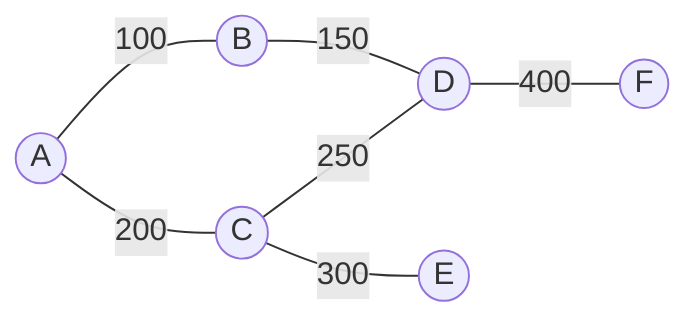

# Introduction to Graphs

## Why It Exists

Arrays, lists, stacks, trees — every structure so far imposes a *shape*: a line, or a strict parent-child hierarchy. But most real data is a web of **many-to-many relationships** with no natural ordering or root: cities joined by flights, people by friendships, web pages by links, courses by prerequisites, tasks by dependencies. Force that into a list and you lose the connections; force it into a tree and you can't have two parents or a cycle.

A **graph** drops the shape constraint. It's just two things: **vertices** (the items — cities, people, pages) and **edges** (the relationships — flights, friendships, links). Each edge can carry a **weight** (airfare, distance, closeness). That's the whole structure — *items + the relationships between them* — and its power is that it **looks like the problem**: the napkin sketch you'd draw to explain flights between cities *is* the data structure, with no encoding step. Adding a city is one vertex; adding a flight is one edge — maintenance scales with what changed, not with the dataset size.

## See It Work

Six cities, six weighted flights. Store it as an **adjacency list** (each vertex → its neighbours), then answer "fewest flights from A to F?" with a breadth-first ripple. Run it.

```python run viz=graph viz-kind=graph
from collections import deque

# undirected weighted "flights" graph (fares in $)
edges = [("A","B",100), ("A","C",200), ("B","D",150),
         ("C","D",250), ("C","E",300), ("D","F",400)]
adj = {}
for u, v, w in edges:
    adj.setdefault(u, []).append((v, w))
    adj.setdefault(v, []).append((u, w))    # undirected → record BOTH directions

def min_hops(src, dst):                      # BFS: ripple outward, level by level
    seen, q = {src}, deque([(src, 0)])
    while q:
        node, d = q.popleft()
        if node == dst:
            return d
        for nb, _ in adj[node]:
            if nb not in seen:
                seen.add(nb); q.append((nb, d + 1))
    return -1

print("cities:", len(adj), " flights:", len(edges))
print("fewest flights A → F:", min_hops("A", "F"))   # 3  (A→B→D→F or A→C→D→F)
```

## How It Works

The vocabulary you'll use for the rest of your career:

- **Vertex (node)** — one item. **Edge** — one relationship between two vertices, optionally **weighted**.
- **Degree** — how many edges touch a vertex. In a **directed** graph, split into **indegree** / **outdegree**.
- **Path** — a sequence of vertices joined by edges; a **cycle** is a path back to its start.

And the families you'll meet:

| Family | Meaning |
|---|---|
| **Undirected** | edges go both ways (friendship); store each edge from *both* endpoints |
| **Directed (digraph)** | edges have a direction (follows, prerequisites) |
| **Weighted** | edges carry a number (fare, distance) |
| **Cyclic / Acyclic** | has a cycle / has none; a directed acyclic graph is a **DAG** (dependencies, schedules) |
| **Connected / Disconnected** | one piece / several |
| **Bipartite** | vertices split into two sides, edges only cross (jobs↔applicants) |



<p align="center"><strong>the travel network as a weighted graph: cities are vertices, flights are edges, fares are weights.</strong></p>

Two foundational searches fall straight out of the picture. **Breadth-first search** ripples outward level by level (a queue) — the natural fit for *fewest hops* / shortest unweighted path. **Depth-first search** dives down one path and backtracks (a stack/recursion) — the fit for *explore everything* / reachability / cycle questions. Crucially, **once your data is a graph, the algorithm reads almost like the question**: "shortest path" → ripple outward; "most flights I can afford" → explore deep, backtrack when broke.

### Key Takeaway

A graph is vertices + edges (optionally weighted/directed). It models many-to-many relationships no linear or tree structure can, and it "looks like the problem." Store it as an adjacency list (vertex → neighbours), remembering an **undirected** edge is recorded from *both* endpoints. BFS (queue, ripple) answers fewest-hops; DFS (stack, backtrack) answers explore-everything.

## Trace It

Second query: *starting at A with $600, what's the most flights you can take* (any destination, no city twice)? Trace it by hand and it's tempting to try `A→B→D` ($250, 2 hops) and `A→C→E` ($500, 2 hops), hit a dead end on each, and answer **2**.

Before you read on: run the exhaustive search instead and the answer is **3**. Which path did the hand-trace miss — and what general lesson about depth-first search does the miss teach?

The hand-trace missed that **`D` has more edges to explore**. From `A→C→D` ($450, 2 hops) you can still afford `D→B` (150) for a total of **exactly $600** and a **third** hop: `A→C→D→B`. (Equivalently `A→B→D→C` reaches 3 hops for just $500.) The hand-trace stopped at the *first* dead end it found on each branch instead of backing up and trying `D`'s other neighbours — and that's precisely the bug DFS exists to prevent. Depth-first search is "go as deep as you can, then **backtrack and try every untried branch**" — it must exhaust *all* of a node's edges before concluding, not just the first promising one. A human eyeballing a graph naturally explores a path or two and quits; the algorithm is valuable exactly because it's *complete*. This is also why you **run the code instead of trusting a hand-trace**: the graph is small, yet the obvious by-hand answer (2) is wrong. The general lesson — verify graph reasoning by execution, because the combinatorial fan-out of paths defeats eyeballing fast — is the whole reason every claim in this book ships with a runnable block.

## Your Turn

Both queries in both languages — BFS for fewest hops, DFS-with-backtracking for the most affordable flights:

```python run viz=graph viz-kind=graph
from collections import deque

edges = [("A","B",100), ("A","C",200), ("B","D",150),
         ("C","D",250), ("C","E",300), ("D","F",400)]
adj = {}
for u, v, w in edges:
    adj.setdefault(u, []).append((v, w)); adj.setdefault(v, []).append((u, w))

def min_hops(src, dst):
    seen, q = {src}, deque([(src, 0)])
    while q:
        node, d = q.popleft()
        if node == dst: return d
        for nb, _ in adj[node]:
            if nb not in seen: seen.add(nb); q.append((nb, d + 1))
    return -1

def max_flights(node, budget, visited):              # DFS: try EVERY affordable edge
    best = 0
    for nb, w in adj[node]:
        if nb not in visited and w <= budget:
            best = max(best, 1 + max_flights(nb, budget - w, visited | {nb}))
    return best

print(min_hops("A", "F"))                            # 3
print(max_flights("A", 600, {"A"}))                  # 3  (A→C→D→B = exactly $600)
```

```java run viz=graph viz-kind=graph
import java.util.*;
public class Main {
  static Map<String,List<String[]>> adj = new HashMap<>();
  static void addEdge(String u, String v, int w) {
    adj.computeIfAbsent(u, k -> new ArrayList<>()).add(new String[]{v, "" + w});
    adj.computeIfAbsent(v, k -> new ArrayList<>()).add(new String[]{u, "" + w});  // undirected
  }
  static int minHops(String src, String dst) {
    Set<String> seen = new HashSet<>(List.of(src));
    Deque<String[]> q = new ArrayDeque<>(); q.add(new String[]{src, "0"});
    while (!q.isEmpty()) {
      String[] c = q.poll(); int d = Integer.parseInt(c[1]);
      if (c[0].equals(dst)) return d;
      for (String[] e : adj.get(c[0])) if (!seen.contains(e[0])) { seen.add(e[0]); q.add(new String[]{e[0], "" + (d + 1)}); }
    }
    return -1;
  }
  static int maxFlights(String node, int budget, Set<String> visited) {
    int best = 0;
    for (String[] e : adj.get(node)) {
      int w = Integer.parseInt(e[1]);
      if (!visited.contains(e[0]) && w <= budget) {
        Set<String> nv = new HashSet<>(visited); nv.add(e[0]);
        best = Math.max(best, 1 + maxFlights(e[0], budget - w, nv));
      }
    }
    return best;
  }
  public static void main(String[] a) {
    addEdge("A","B",100); addEdge("A","C",200); addEdge("B","D",150);
    addEdge("C","D",250); addEdge("C","E",300); addEdge("D","F",400);
    System.out.println(minHops("A","F"));                                  // 3
    System.out.println(maxFlights("A", 600, new HashSet<>(List.of("A")))); // 3
  }
}
```

## Reflect & Connect

A graph is the most general relational structure — almost everything connects back to it:

- **Trees are graphs** — a [binary tree](/cortex/data-structures-and-algorithms/trees-binary-tree-introduction-to-binary-trees) is a connected, acyclic graph with a designated root. Graphs drop *all* those restrictions: any number of edges per node, cycles, multiple components, no root. That generality is why graph algorithms subsume tree traversals.
- **Two representations, a real trade-off** — an **adjacency list** (used here) is `O(V + E)` space and great for sparse graphs; an **adjacency matrix** is `O(V²)` but answers "is there an edge u→v?" in `O(1)`. The next two lessons ([matrix](/cortex/data-structures-and-algorithms/graphs-adjacency-matrix-representation), [list](/cortex/data-structures-and-algorithms/graphs-adjacency-list-representation)) make the choice concrete.
- **The algorithm family ahead** — BFS/DFS [traversal](/cortex/data-structures-and-algorithms/graphs-traversing-a-graph), [cycle detection](/cortex/data-structures-and-algorithms/graphs-cycle-detection), [topological sort](/cortex/data-structures-and-algorithms/graphs-topological-sort) (order a DAG), [shortest paths](/cortex/data-structures-and-algorithms/graphs-single-source-shortest-path) (Dijkstra/Bellman-Ford), and [minimum spanning trees](/cortex/data-structures-and-algorithms/graphs-minimum-spanning-trees) (where [DSU](/cortex/data-structures-and-algorithms/trees-disjoint-set-union-introduction-to-disjoint-set-union) returns). Each is "the question, phrased as a walk."
- **In production** — Google Maps (weighted shortest path), social graphs (BFS for "degrees of separation"), `npm`/build systems (topological sort over a dependency DAG), compilers (control-flow graphs), and spreadsheets (recalc order via a DAG).

**Prerequisites:** [Binary Tree](/cortex/data-structures-and-algorithms/trees-binary-tree-introduction-to-binary-trees), [Hash Table](/cortex/data-structures-and-algorithms/linear-structures-hash-table-what-is-a-hash-table).
**What's next:** the two ways to store a graph in memory, and when to pick each — [Adjacency Matrix](/cortex/data-structures-and-algorithms/graphs-adjacency-matrix-representation) and [Adjacency List](/cortex/data-structures-and-algorithms/graphs-adjacency-list-representation).

## Recall

> **Mnemonic:** *Graph = vertices + edges (optionally weighted/directed). It looks like the problem. Store as adjacency list (undirected ⇒ record both ends). BFS (queue, ripple) = fewest hops; DFS (stack, backtrack, exhaust every edge) = explore-all.*

| | |
|---|---|
| Vertex / edge | an item / a relationship (edge may carry a weight) |
| Degree | edges touching a vertex (in/out for digraphs) |
| Adjacency list | vertex → neighbours; `O(V+E)` space; sparse-friendly |
| Undirected edge | recorded from **both** endpoints |
| BFS | queue, level-by-level ripple → fewest hops / shortest unweighted |
| DFS | stack/recursion, backtrack → reachability, cycles, "explore all" |

<details>
<summary><strong>Q:</strong> What does a graph model that a tree or list can't?</summary>

**A:** Arbitrary many-to-many relationships — multiple edges per node, cycles, multiple components, no root.

</details>
<details>
<summary><strong>Q:</strong> When you store an undirected edge in an adjacency list, how many entries does it create?</summary>

**A:** Two — one in each endpoint's neighbour list (so `sum of degrees = 2·|E|`).

</details>
<details>
<summary><strong>Q:</strong> BFS vs DFS — which for fewest hops, which for explore-everything?</summary>

**A:** BFS (queue, ripples outward) for fewest hops / shortest unweighted path; DFS (backtracking) for reachability, cycles, exhaustive search.

</details>
<details>
<summary><strong>Q:</strong> Adjacency list vs matrix?</summary>

**A:** List: `O(V+E)` space, good for sparse graphs; matrix: `O(V²)` space, `O(1)` edge lookup, good for dense graphs.

</details>
<details>
<summary><strong>Q:</strong> Why run code instead of hand-tracing graph queries?</summary>

**A:** Path fan-out defeats eyeballing — the "max flights for $600" hand-trace says 2 but the real answer is 3; DFS must exhaust *every* branch.

</details>

## Sources & Verify

- **CLRS**, *Introduction to Algorithms*, 4th ed., ch. 20 — Elementary Graph Algorithms (representations, BFS, DFS).
- **Sedgewick & Wayne**, *Algorithms*, 4th ed., ch. 4 — Graphs (undirected, directed, the adjacency-list API).
- Both runnable blocks are verified by running (the 6-city weighted graph: `sum of degrees = 12 = 2·|E|`; fewest flights `A → F = 3`; **max flights for $600 = 3** via `A→C→D→B` at exactly $600 — correcting a too-shallow hand-trace that yields 2).
