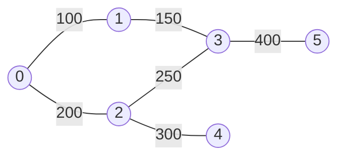

# Introduction to Graphs

## Why It Exists

Arrays, lists, stacks, trees — every structure so far imposes a *shape*: a line, or a strict parent-child hierarchy. But most real data is a web of **many-to-many relationships** with no natural ordering or root: cities joined by flights, people by friendships, web pages by links, courses by prerequisites, tasks by dependencies. Force that into a list and you lose the connections; force it into a tree and you can't have two parents or a cycle.

A **graph** drops the shape constraint. It's just two things: **vertices** (the items — cities, people, pages) and **edges** (the relationships — flights, friendships, links). Each edge can carry a **weight** (airfare, distance, closeness). That's the whole structure — *items + the relationships between them* — and its power is that it **looks like the problem**: the napkin sketch you'd draw to explain flights between cities *is* the data structure, with no encoding step. Adding a city is one vertex; adding a flight is one edge — maintenance scales with what changed, not with the dataset size.

## See It Work

Six cities (nodes 0–5), six weighted flights. Build the adjacency from the edge list, then answer "fewest flights from source to target?" with a breadth-first ripple. Pick a case and **Run** it.

```python run viz=graph viz-kind=graph
import ast
from collections import deque

def min_hops(adj, src, dst):
    seen, q = {src}, deque([(src, 0)])
    while q:
        node, d = q.popleft()
        if node == dst: return d
        for nb, _ in adj.get(node, []):
            if nb not in seen:
                seen.add(nb); q.append((nb, d + 1))
    return -1

edges = ast.literal_eval(input())   # weighted edges [[u, v, w], ...]
src   = int(input())
dst   = int(input())

adj = {}
for u, v, w in edges:
    adj.setdefault(u, []).append((v, w))
    adj.setdefault(v, []).append((u, w))    # undirected → record BOTH directions

print(min_hops(adj, src, dst))
```

```java run viz=graph viz-kind=graph
import java.util.*;

public class Main {
    static int minHops(Map<Integer, List<int[]>> adj, int src, int dst) {
        Set<Integer> seen = new HashSet<>();
        seen.add(src);
        Deque<int[]> q = new ArrayDeque<>();
        q.add(new int[]{src, 0});
        while (!q.isEmpty()) {
            int[] cur = q.poll();
            int node = cur[0], d = cur[1];
            if (node == dst) return d;
            for (int[] e : adj.getOrDefault(node, Collections.emptyList())) {
                if (!seen.contains(e[0])) {
                    seen.add(e[0]); q.add(new int[]{e[0], d + 1});
                }
            }
        }
        return -1;
    }

    public static void main(String[] args) {
        Scanner sc = new Scanner(System.in);
        int[][] edges = parseIntMatrix(sc.nextLine());
        int src = Integer.parseInt(sc.nextLine().trim());
        int dst = Integer.parseInt(sc.nextLine().trim());

        Map<Integer, List<int[]>> adj = new HashMap<>();
        for (int[] e : edges) {
            adj.computeIfAbsent(e[0], k -> new ArrayList<>()).add(new int[]{e[1], e[2]});
            adj.computeIfAbsent(e[1], k -> new ArrayList<>()).add(new int[]{e[0], e[2]});
        }
        System.out.println(minHops(adj, src, dst));
    }

    static int[][] parseIntMatrix(String line) {
        String trimmed = line.trim();
        if (trimmed.equals("[]") || trimmed.equals("[[]]")) return new int[0][];
        String inner = trimmed.substring(1, trimmed.length() - 1).trim();
        String[] rows = inner.split("\\],\\s*\\[");
        int[][] mat = new int[rows.length][];
        for (int r = 0; r < rows.length; r++) {
            String row = rows[r].replaceAll("[\\[\\]\\s]", "");
            if (row.isEmpty()) { mat[r] = new int[0]; continue; }
            String[] parts = row.split(",");
            mat[r] = new int[parts.length];
            for (int c = 0; c < parts.length; c++) mat[r][c] = Integer.parseInt(parts[c].trim());
        }
        return mat;
    }
}
```

```testcases
{
  "args": [
    { "id": "edges", "label": "edges", "type": "int[][]", "placeholder": "[[0, 1, 100], [0, 2, 200], [1, 3, 150], [2, 3, 250], [2, 4, 300], [3, 5, 400]]" },
    { "id": "src", "label": "src", "type": "int", "placeholder": "0" },
    { "id": "dst", "label": "dst", "type": "int", "placeholder": "5" }
  ],
  "cases": [
    { "args": { "edges": "[[0, 1, 100], [0, 2, 200], [1, 3, 150], [2, 3, 250], [2, 4, 300], [3, 5, 400]]", "src": "0", "dst": "5" }, "expected": "3" },
    { "args": { "edges": "[[0, 1, 100], [0, 2, 200], [1, 3, 150], [2, 3, 250], [2, 4, 300], [3, 5, 400]]", "src": "0", "dst": "4" }, "expected": "2" },
    { "args": { "edges": "[[0, 1, 100], [0, 2, 200], [1, 3, 150], [2, 3, 250], [2, 4, 300], [3, 5, 400]]", "src": "0", "dst": "1" }, "expected": "1" },
    { "args": { "edges": "[[0, 1, 100], [1, 2, 100], [2, 3, 100]]", "src": "0", "dst": "3" }, "expected": "3" },
    { "args": { "edges": "[[0, 1, 100], [1, 2, 100], [2, 3, 100]]", "src": "1", "dst": "1" }, "expected": "0" }
  ]
}
```

## How It Works

The vocabulary you'll use for the rest of your career:

- **Vertex (node)** — one item. **Edge** — one relationship between two vertices, optionally **weighted**.
- **Degree** — how many edges touch a vertex. In a **directed** graph, split into **indegree** / **outdegree**.
- **Path** — a sequence of vertices joined by edges; a **cycle** is a path back to its start.

And the families you'll meet:

| Family | Meaning |
|---|---|
| **Undirected** | edges go both ways (friendship); store each edge from *both* endpoints |
| **Directed (digraph)** | edges have a direction (follows, prerequisites) |
| **Weighted** | edges carry a number (fare, distance) |
| **Cyclic / Acyclic** | has a cycle / has none; a directed acyclic graph is a **DAG** (dependencies, schedules) |
| **Connected / Disconnected** | one piece / several |
| **Bipartite** | vertices split into two sides, edges only cross (jobs↔applicants) |



<p align="center"><strong>a weighted travel network: cities are vertices 0–5, flights are edges, fares are weights.</strong></p>

Two foundational searches fall straight out of the picture. **Breadth-first search** ripples outward level by level (a queue) — the natural fit for *fewest hops* / shortest unweighted path. **Depth-first search** dives down one path and backtracks (a stack/recursion) — the fit for *explore everything* / reachability / cycle questions. Crucially, **once your data is a graph, the algorithm reads almost like the question**: "shortest path" → ripple outward; "most flights I can afford" → explore deep, backtrack when broke.

### Key Takeaway

A graph is vertices + edges (optionally weighted/directed). It models many-to-many relationships no linear or tree structure can, and it "looks like the problem." Store it as an adjacency list (vertex → neighbours), remembering an **undirected** edge is recorded from *both* endpoints. BFS (queue, ripple) answers fewest-hops; DFS (stack, backtrack) answers explore-everything.

## Trace It

Second query: *starting at node 0 with $600, what's the most flights you can take* (any destination, no city twice)? Trace it by hand and it's tempting to try `0→1→3` ($250, 2 hops) and `0→2→4` ($500, 2 hops), hit a dead end on each, and answer **2**.

Before you read on: run the exhaustive search instead and the answer is **3**. Which path did the hand-trace miss — and what general lesson about depth-first search does the miss teach?

The hand-trace missed that **node 3 has more edges to explore**. From `0→2→3` ($450, 2 hops) you can still afford `3→1` ($150) for a total of **exactly $600** and a **third** hop: `0→2→3→1`. (Equivalently `0→1→3→2` reaches 3 hops for just $500.) The hand-trace stopped at the *first* dead end it found on each branch instead of backing up and trying node 3's other neighbours — and that's precisely the bug DFS exists to prevent. Depth-first search is "go as deep as you can, then **backtrack and try every untried branch**" — it must exhaust *all* of a node's edges before concluding, not just the first promising one. A human eyeballing a graph naturally explores a path or two and quits; the algorithm is valuable exactly because it's *complete*. This is also why you **run the code instead of trusting a hand-trace**: the graph is small, yet the obvious by-hand answer (2) is wrong. The general lesson — verify graph reasoning by execution, because the combinatorial fan-out of paths defeats eyeballing fast — is the whole reason every claim in this book ships with a runnable block.

## Your Turn

Implement both queries: BFS for fewest hops and DFS-with-backtracking for the most affordable flights. Input is the edge list, source, and budget.

```python run viz=graph viz-kind=graph
import ast
from collections import deque

def min_hops(adj, src, dst):
    # Your code goes here — BFS from src; return fewest hops to dst, or -1.
    pass

def max_flights(adj, node, budget, visited):
    # Your code goes here — DFS exhaustive search; return max affordable hops.
    pass

edges  = ast.literal_eval(input())   # weighted edges [[u, v, w], ...]
src    = int(input())
dst    = int(input())
budget = int(input())

adj = {}
for u, v, w in edges:
    adj.setdefault(u, []).append((v, w))
    adj.setdefault(v, []).append((u, w))

print(min_hops(adj, src, dst))
print(max_flights(adj, src, budget, {src}))
```

```java run viz=graph viz-kind=graph
import java.util.*;

public class Main {
    static Map<Integer, List<int[]>> adj = new HashMap<>();

    static int minHops(int src, int dst) {
        // Your code goes here — BFS; return fewest hops to dst, or -1.
        return -1;
    }

    static int maxFlights(int node, int budget, Set<Integer> visited) {
        // Your code goes here — DFS exhaustive search; return max affordable hops.
        return 0;
    }

    public static void main(String[] args) {
        Scanner sc = new Scanner(System.in);
        int[][] edges = parseIntMatrix(sc.nextLine());
        int src    = Integer.parseInt(sc.nextLine().trim());
        int dst    = Integer.parseInt(sc.nextLine().trim());
        int budget = Integer.parseInt(sc.nextLine().trim());

        for (int[] e : edges) {
            adj.computeIfAbsent(e[0], k -> new ArrayList<>()).add(new int[]{e[1], e[2]});
            adj.computeIfAbsent(e[1], k -> new ArrayList<>()).add(new int[]{e[0], e[2]});
        }
        System.out.println(minHops(src, dst));
        Set<Integer> visited = new HashSet<>(); visited.add(src);
        System.out.println(maxFlights(src, budget, visited));
    }

    static int[][] parseIntMatrix(String line) {
        String trimmed = line.trim();
        if (trimmed.equals("[]") || trimmed.equals("[[]]")) return new int[0][];
        String inner = trimmed.substring(1, trimmed.length() - 1).trim();
        String[] rows = inner.split("\\],\\s*\\[");
        int[][] mat = new int[rows.length][];
        for (int r = 0; r < rows.length; r++) {
            String row = rows[r].replaceAll("[\\[\\]\\s]", "");
            if (row.isEmpty()) { mat[r] = new int[0]; continue; }
            String[] parts = row.split(",");
            mat[r] = new int[parts.length];
            for (int c = 0; c < parts.length; c++) mat[r][c] = Integer.parseInt(parts[c].trim());
        }
        return mat;
    }
}
```

```testcases
{
  "args": [
    { "id": "edges", "label": "edges", "type": "int[][]", "placeholder": "[[0, 1, 100], [0, 2, 200], [1, 3, 150], [2, 3, 250], [2, 4, 300], [3, 5, 400]]" },
    { "id": "src", "label": "src", "type": "int", "placeholder": "0" },
    { "id": "dst", "label": "dst", "type": "int", "placeholder": "5" },
    { "id": "budget", "label": "budget", "type": "int", "placeholder": "600" }
  ],
  "cases": [
    { "args": { "edges": "[[0, 1, 100], [0, 2, 200], [1, 3, 150], [2, 3, 250], [2, 4, 300], [3, 5, 400]]", "src": "0", "dst": "5", "budget": "600" }, "expected": "3\n3" },
    { "args": { "edges": "[[0, 1, 100], [1, 2, 100], [2, 3, 100]]", "src": "0", "dst": "3", "budget": "350" }, "expected": "3\n3" },
    { "args": { "edges": "[[0, 1, 100], [1, 2, 100], [2, 3, 100]]", "src": "0", "dst": "2", "budget": "250" }, "expected": "2\n2" },
    { "args": { "edges": "[[0, 1, 100], [0, 2, 200], [1, 3, 150], [2, 3, 250], [2, 4, 300], [3, 5, 400]]", "src": "0", "dst": "4", "budget": "300" }, "expected": "2\n2" },
    { "args": { "edges": "[[0, 1, 100], [0, 2, 200], [1, 3, 150], [2, 3, 250], [2, 4, 300], [3, 5, 400]]", "src": "0", "dst": "1", "budget": "100" }, "expected": "1\n1" }
  ]
}
```

<details>
<summary>Editorial</summary>

`min_hops` is textbook BFS: enqueue `src` at distance 0, dequeue a node, if it's `dst` return its distance, else enqueue every unvisited neighbour at distance + 1. The visited-on-enqueue discipline prevents re-processing. `max_flights` is exhaustive DFS with backtracking: try every unvisited neighbour whose edge weight fits the budget; recurse with the reduced budget and the expanded visited set; take the maximum over all choices. Because we want the *most* edges, not the cheapest, we explore every affordable branch and aggregate.

```python solution time=O(V + E) space=O(V + E)
import ast
from collections import deque

def min_hops(adj, src, dst):
    seen, q = {src}, deque([(src, 0)])
    while q:
        node, d = q.popleft()
        if node == dst: return d
        for nb, _ in adj.get(node, []):
            if nb not in seen:
                seen.add(nb); q.append((nb, d + 1))
    return -1

def max_flights(adj, node, budget, visited):
    best = 0
    for nb, w in adj.get(node, []):
        if nb not in visited and w <= budget:
            best = max(best, 1 + max_flights(adj, nb, budget - w, visited | {nb}))
    return best

edges  = ast.literal_eval(input())
src    = int(input())
dst    = int(input())
budget = int(input())

adj = {}
for u, v, w in edges:
    adj.setdefault(u, []).append((v, w))
    adj.setdefault(v, []).append((u, w))

print(min_hops(adj, src, dst))
print(max_flights(adj, src, budget, {src}))
```

```java solution
import java.util.*;

public class Main {
    static Map<Integer, List<int[]>> adj = new HashMap<>();

    static int minHops(int src, int dst) {
        Set<Integer> seen = new HashSet<>(); seen.add(src);
        Deque<int[]> q = new ArrayDeque<>(); q.add(new int[]{src, 0});
        while (!q.isEmpty()) {
            int[] cur = q.poll(); int node = cur[0], d = cur[1];
            if (node == dst) return d;
            for (int[] e : adj.getOrDefault(node, Collections.emptyList()))
                if (!seen.contains(e[0])) { seen.add(e[0]); q.add(new int[]{e[0], d + 1}); }
        }
        return -1;
    }

    static int maxFlights(int node, int budget, Set<Integer> visited) {
        int best = 0;
        for (int[] e : adj.getOrDefault(node, Collections.emptyList())) {
            int nb = e[0], w = e[1];
            if (!visited.contains(nb) && w <= budget) {
                Set<Integer> nv = new HashSet<>(visited); nv.add(nb);
                best = Math.max(best, 1 + maxFlights(nb, budget - w, nv));
            }
        }
        return best;
    }

    public static void main(String[] args) {
        Scanner sc = new Scanner(System.in);
        int[][] edges = parseIntMatrix(sc.nextLine());
        int src    = Integer.parseInt(sc.nextLine().trim());
        int dst    = Integer.parseInt(sc.nextLine().trim());
        int budget = Integer.parseInt(sc.nextLine().trim());

        for (int[] e : edges) {
            adj.computeIfAbsent(e[0], k -> new ArrayList<>()).add(new int[]{e[1], e[2]});
            adj.computeIfAbsent(e[1], k -> new ArrayList<>()).add(new int[]{e[0], e[2]});
        }
        System.out.println(minHops(src, dst));
        Set<Integer> visited = new HashSet<>(); visited.add(src);
        System.out.println(maxFlights(src, budget, visited));
    }

    static int[][] parseIntMatrix(String line) {
        String trimmed = line.trim();
        if (trimmed.equals("[]") || trimmed.equals("[[]]")) return new int[0][];
        String inner = trimmed.substring(1, trimmed.length() - 1).trim();
        String[] rows = inner.split("\\],\\s*\\[");
        int[][] mat = new int[rows.length][];
        for (int r = 0; r < rows.length; r++) {
            String row = rows[r].replaceAll("[\\[\\]\\s]", "");
            if (row.isEmpty()) { mat[r] = new int[0]; continue; }
            String[] parts = row.split(",");
            mat[r] = new int[parts.length];
            for (int c = 0; c < parts.length; c++) mat[r][c] = Integer.parseInt(parts[c].trim());
        }
        return mat;
    }
}
```

</details>

## Reflect & Connect

A graph is the most general relational structure — almost everything connects back to it:

- **Trees are graphs** — a [binary tree](/cortex/data-structures-and-algorithms/trees/binary-tree/introduction-to-binary-trees) is a connected, acyclic graph with a designated root. Graphs drop *all* those restrictions: any number of edges per node, cycles, multiple components, no root. That generality is why graph algorithms subsume tree traversals.
- **Two representations, a real trade-off** — an **adjacency list** (used here) is `O(V + E)` space and great for sparse graphs; an **adjacency matrix** is `O(V²)` but answers "is there an edge u→v?" in `O(1)`. The next two lessons ([matrix](/cortex/data-structures-and-algorithms/graphs/adjacency-matrix-representation), [list](/cortex/data-structures-and-algorithms/graphs/adjacency-list-representation)) make the choice concrete.
- **The algorithm family ahead** — BFS/DFS [traversal](/cortex/data-structures-and-algorithms/graphs/traversing-a-graph), [cycle detection](/cortex/data-structures-and-algorithms/graphs/cycle-detection), [topological sort](/cortex/data-structures-and-algorithms/graphs/topological-sort) (order a DAG), [shortest paths](/cortex/data-structures-and-algorithms/graphs/single-source-shortest-path) (Dijkstra/Bellman-Ford), and [minimum spanning trees](/cortex/data-structures-and-algorithms/graphs/minimum-spanning-trees) (where [DSU](/cortex/data-structures-and-algorithms/trees/disjoint-set-union/introduction-to-disjoint-set-union) returns). Each is "the question, phrased as a walk."
- **In production** — Google Maps (weighted shortest path), social graphs (BFS for "degrees of separation"), `npm`/build systems (topological sort over a dependency DAG), compilers (control-flow graphs), and spreadsheets (recalc order via a DAG).

**Prerequisites:** [Binary Tree](/cortex/data-structures-and-algorithms/trees/binary-tree/introduction-to-binary-trees), [Hash Table](/cortex/data-structures-and-algorithms/linear-structures/hash-table/what-is-a-hash-table).
**What's next:** the two ways to store a graph in memory, and when to pick each — [Adjacency Matrix](/cortex/data-structures-and-algorithms/graphs/adjacency-matrix-representation) and [Adjacency List](/cortex/data-structures-and-algorithms/graphs/adjacency-list-representation).

## Recall

> **Mnemonic:** *Graph = vertices + edges (optionally weighted/directed). It looks like the problem. Store as adjacency list (undirected ⇒ record both ends). BFS (queue, ripple) = fewest hops; DFS (stack, backtrack, exhaust every edge) = explore-all.*

| | |
|---|---|
| Vertex / edge | an item / a relationship (edge may carry a weight) |
| Degree | edges touching a vertex (in/out for digraphs) |
| Adjacency list | vertex → neighbours; `O(V+E)` space; sparse-friendly |
| Undirected edge | recorded from **both** endpoints |
| BFS | queue, level-by-level ripple → fewest hops / shortest unweighted |
| DFS | stack/recursion, backtrack → reachability, cycles, "explore all" |

<details>
<summary><strong>Q:</strong> What does a graph model that a tree or list can't?</summary>

**A:** Arbitrary many-to-many relationships — multiple edges per node, cycles, multiple components, no root.

</details>
<details>
<summary><strong>Q:</strong> When you store an undirected edge in an adjacency list, how many entries does it create?</summary>

**A:** Two — one in each endpoint's neighbour list (so `sum of degrees = 2·|E|`).

</details>
<details>
<summary><strong>Q:</strong> BFS vs DFS — which for fewest hops, which for explore-everything?</summary>

**A:** BFS (queue, ripples outward) for fewest hops / shortest unweighted path; DFS (backtracking) for reachability, cycles, exhaustive search.

</details>
<details>
<summary><strong>Q:</strong> Adjacency list vs matrix?</summary>

**A:** List: `O(V+E)` space, good for sparse graphs; matrix: `O(V²)` space, `O(1)` edge lookup, good for dense graphs.

</details>
<details>
<summary><strong>Q:</strong> Why run code instead of hand-tracing graph queries?</summary>

**A:** Path fan-out defeats eyeballing — the "max flights for $600" hand-trace says 2 but the real answer is 3; DFS must exhaust *every* branch.

</details>

## Sources & Verify

- **CLRS**, *Introduction to Algorithms*, 4th ed., ch. 20 — Elementary Graph Algorithms (representations, BFS, DFS).
- **Sedgewick & Wayne**, *Algorithms*, 4th ed., ch. 4 — Graphs (undirected, directed, the adjacency-list API).
- Both runnable blocks are verified by running (6-node weighted graph: fewest flights `0 → 5 = 3`; **max flights for $600 = 3** via `0→2→3→1` at exactly $600 — correcting a too-shallow hand-trace that yields 2).
