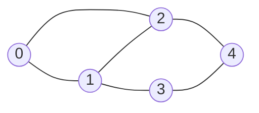

# Adjacency Matrix Representation

## Why It Exists

A graph on paper is circles and lines; the CPU only knows **arrays and arithmetic**. The *translation problem* is squeezing that network into a flat block of memory. The simplest answer: number the nodes `0 … N−1`, then build an `N×N` table where cell `[i][j]` is `true` if an edge joins `i` and `j`. That's the **adjacency matrix**.

Its appeal is raw speed: "is there an edge between `i` and `j`?" is a single array index — `adj[i][j]` — answered in **`O(1)`**, one instruction, no search. The catch (which the rest of this lesson earns): the matrix always occupies `N²` cells *regardless of how many edges exist*, so it's perfect for dense graphs and ruinous for the large sparse graphs that dominate the real world.

## See It Work

The 5-node undirected graph below, built into a matrix. Check an edge in `O(1)`, and list a node's neighbours by scanning its row. Run it.

```python run viz=graph viz-kind=graph
def create_graph(n, edges):
    adj = [[False] * n for _ in range(n)]      # N×N, all false (see the aliasing note!)
    for i, j in edges:
        adj[i][j] = True
        adj[j][i] = True                        # undirected ⇒ set BOTH ⇒ symmetric matrix
    return adj

edges = [[0, 1], [0, 2], [1, 2], [1, 3], [2, 4], [3, 4]]
m = create_graph(5, edges)
for row in m:
    print("".join("T" if c else "." for c in row))
print("edge(1,3)?", m[1][3])                    # True   — O(1) lookup
print("edge(0,3)?", m[0][3])                    # False
print("neighbours of 2:", [j for j in range(5) if m[2][j]])   # [0, 1, 4]  — O(N) row scan
```

## How It Works

1. **Enumerate** the nodes `0 … N−1` (zero-based, so the integer *is* the array index).
2. **Allocate** an `N×N` matrix of `false`.
3. **For each edge `(i, j)`**, set `adj[i][j] = true`; if undirected, also `adj[j][i] = true`.

That second assignment makes an undirected matrix **symmetric across the diagonal** — symmetry is the visual signature of "undirected." Drop it and you have a **directed** graph (the asymmetry encodes one-way edges). For a **weighted** graph, store the weight in the cell instead of a boolean, with a **sentinel** (e.g. `∞` or `-1`) meaning "no edge" — since any number could be a real weight.

For the example graph, the matrix is:

|  | 0 | 1 | 2 | 3 | 4 |
|---|---|---|---|---|---|
| **0** | · | T | T | · | · |
| **1** | T | · | T | T | · |
| **2** | T | T | · | · | T |
| **3** | · | T | · | · | T |
| **4** | · | · | T | T | · |



<p align="center"><strong>the 5-node graph this matrix encodes; <code>adj[i][j]=T</code> ⇔ an edge joins <code>i</code> and <code>j</code>.</strong></p>

`adj[i][j]` is `O(1)` because the 2D array is really one contiguous block: the CPU computes the offset `i*N + j` (row-major) and fetches it directly — the same trick that makes 1D arrays fast. **One Python/JS gotcha:** `[[False] * n] * n` makes `n` references to the *same* inner row, so setting one cell mutates the whole column. Build rows with a comprehension/factory (`[[False]*n for _ in range(n)]`), as above.

### Key Takeaway

An adjacency matrix is an `N×N` grid: `adj[i][j]` = "edge between `i` and `j`?" in `O(1)`. Undirected ⇒ symmetric (set both cells); weighted ⇒ store the weight with a no-edge sentinel. Edge lookup, add, and remove are `O(1)`; listing a node's neighbours is `O(N)`; **space is always `O(N²)`** — its defining strength (dense) and weakness (sparse).

## Trace It

The matrix gives `O(1)` edge lookups — the fastest possible. So a natural question: why not *always* use it?

Before you read on: picture a social network — 1 billion users, each averaging ~1,000 friends. Roughly how many cells does the adjacency matrix allocate, how many of them hold a real edge, and what does that ratio tell you about when the matrix is the wrong tool?

The matrix allocates `N² = (10⁹)² = 10¹⁸` cells — an **exabyte-scale** block — while the actual edges number only `~10⁹ × 1,000 = 10¹²`. That's a **factor of a million wasted**: 999,999 of every million cells are `false`, storing "these two strangers are not friends." The space is `O(N²)` *no matter how few edges exist*, because the grid is sized by the node count alone, never the edge count. And almost every real graph is **sparse** — social networks, road maps, the web, dependency graphs all have `E ≪ N²` (each node connects to a tiny fraction of the others), so the matrix is structurally wrong for them: it would exhaust memory long before the algorithm ran. The matrix only earns its `N²` cells when the graph is **dense** (`E` close to `N²`) — tournament results where every team plays every other, full distance matrices, or small graphs (`N ≤ 100`) where the waste is negligible. It also wins when the *bottleneck* is `O(1)` edge-existence checks: Floyd-Warshall's `O(N³)` all-pairs loop hammers `adj[i][j]` and benefits massively. The decision rule that falls out: **dense or edge-query-bound → matrix; large and sparse → adjacency list** (the next lesson). The `O(1)` lookup is real, but you pay for it in `O(N²)` space — and on sparse data that bill is unpayable.

## Your Turn

Build the matrix, query an edge, and list neighbours — in both languages:

```python run viz=graph viz-kind=graph
def create_graph(n, edges):
    adj = [[False] * n for _ in range(n)]       # comprehension avoids the shared-row trap
    for i, j in edges:
        adj[i][j] = True; adj[j][i] = True
    return adj

edges = [[0, 1], [0, 2], [1, 2], [1, 3], [2, 4], [3, 4]]
m = create_graph(5, edges)
print(m[1][3], m[0][3])                          # True False
print([j for j in range(5) if m[2][j]])          # [0, 1, 4]
print(all(m[i][j] == m[j][i] for i in range(5) for j in range(5)))   # True (symmetric)
```

```java run viz=graph viz-kind=graph
import java.util.*;
public class Main {
  static boolean[][] createGraph(int n, int[][] edges) {
    boolean[][] adj = new boolean[n][n];          // Java arrays are value-allocated — no aliasing trap
    for (int[] e : edges) { adj[e[0]][e[1]] = true; adj[e[1]][e[0]] = true; }
    return adj;
  }
  public static void main(String[] a) {
    int[][] edges = {{0,1}, {0,2}, {1,2}, {1,3}, {2,4}, {3,4}};
    boolean[][] m = createGraph(5, edges);
    System.out.println(m[1][3] + " " + m[0][3]);  // true false
    List<Integer> nbrs = new ArrayList<>();
    for (int j = 0; j < 5; j++) if (m[2][j]) nbrs.add(j);
    System.out.println(nbrs);                     // [0, 1, 4]
  }
}
```

Then: store a **weighted** graph (cells hold weights, with `∞`/`-1` as the no-edge sentinel); build a **directed** version (drop the second assignment — the matrix loses its symmetry); and write `add_node`, noticing it costs `O(N²)` (reallocate + copy the whole grid).

## Reflect & Connect

The matrix is one half of the representation choice every graph program makes:

- **Matrix vs list** — the [adjacency list](/cortex/data-structures-and-algorithms/graphs-adjacency-list-representation) (next lesson) stores, per node, just its actual neighbours: `O(V + E)` space and `O(degree)` neighbour iteration. It wins for sparse graphs (almost all of them); the matrix wins for dense graphs and `O(1)` edge tests. This is *the* first decision in graph code.
- **Symmetry is a property check** — an undirected graph's matrix equals its transpose (`adj[i][j] == adj[j][i]`); a directed graph's generally doesn't. Reading symmetry off the matrix tells you the edge semantics at a glance.
- **Where the matrix is the *right* call** — [Floyd-Warshall](/cortex/data-structures-and-algorithms/graphs-all-pairs-shortest-path) all-pairs shortest paths runs `O(N³)` directly over the matrix and lives on `O(1)` edge access; dense graphs, tournament tables, and small `N` all favour it. The killer-app question is always "dense or sparse?"
- **It rides on the 1D array** — the `N×N` logical grid is a contiguous block addressed by `i*N + j`. Same row-major arithmetic as any 2D array, which is why the lookup is a single fetch.

**Prerequisites:** [Introduction to Graphs](/cortex/data-structures-and-algorithms/graphs-introduction-to-graphs).
**What's next:** the sparse-friendly representation that flips every trade-off — [Adjacency List](/cortex/data-structures-and-algorithms/graphs-adjacency-list-representation).

## Recall

> **Mnemonic:** *N×N grid, `adj[i][j]` = edge? in O(1). Undirected ⇒ set both ⇒ symmetric. Weighted ⇒ store weight + no-edge sentinel. Space is always O(N²) — great dense, fatal sparse. Build rows with a factory (no `[[x]*n]*n` aliasing).*

| | |
|---|---|
| Cell `adj[i][j]` | edge `i↔j`? (`O(1)` via `i*N+j`) |
| Undirected | set `[i][j]` **and** `[j][i]` ⇒ matrix is symmetric |
| Weighted | store weight; reserve a sentinel (`∞`/`-1`) for "no edge" |
| Space | `O(N²)` — independent of edge count |
| Neighbours of `i` | scan row `i` ⇒ `O(N)` |
| Use when | dense graph, `O(1)` edge tests (Floyd-Warshall), small `N` |

<details>
<summary><strong>Q:</strong> What does `adj[i][j]` mean and what does it cost?</summary>

**A:** "Is there an edge between `i` and `j`?" — `O(1)`, a single indexed fetch.

</details>
<details>
<summary><strong>Q:</strong> How do you tell an undirected matrix from a directed one?</summary>

**A:** Undirected is symmetric (`adj[i][j] == adj[j][i]`); directed generally isn't.

</details>
<details>
<summary><strong>Q:</strong> Why is the matrix wrong for large sparse graphs?</summary>

**A:** Space is `O(N²)` regardless of edge count — a billion-node sparse graph would need `10¹⁸` cells, almost all `false`.

</details>
<details>
<summary><strong>Q:</strong> When is the matrix the right choice?</summary>

**A:** Dense graphs (`E ≈ N²`), `O(1)`-edge-query-bound algorithms (Floyd-Warshall), or small `N`.

</details>
<details>
<summary><strong>Q:</strong> What's the `[[False]*n]*n` trap?</summary>

**A:** It makes `n` references to one shared row, so editing a cell mutates the whole column; build rows with a comprehension/factory.

</details>

## Sources & Verify

- **CLRS**, *Introduction to Algorithms*, 4th ed., §20.1 — adjacency-matrix vs adjacency-list representations and their space/time trade-offs.
- **Sedgewick & Wayne**, *Algorithms*, 4th ed., ch. 4 — graph representations.
- Both runnable blocks are verified by running (5-node graph: `edge(1,3)=True`, `edge(0,3)=False`, neighbours of 2 = `[0,1,4]`, matrix symmetric; the `[[False]*3]*3` aliasing trap reproduced — one assignment mutates all rows).
