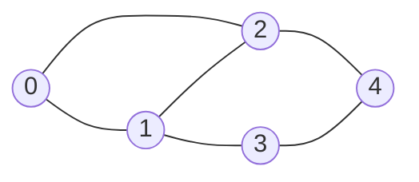

# Adjacency List Representation

## Why It Exists

The [adjacency matrix](/cortex/data-structures-and-algorithms/graphs/adjacency-matrix-representation) has one fatal flaw: it pays for every edge that *could* exist. A graph of 10,000 nodes with 20,000 edges still allocates `10,000² = 100 million` cells — 99.98% of them wasted on `false`. But **real graphs are sparse**: your contacts know a few dozen people (not everyone on Earth), a Wikipedia article links to ~50 others (not all millions), a road intersection joins 2–5 neighbours (not every intersection).

So flip the matrix's question. Instead of "between *every* pair, is there an edge?", ask "for *each* node, who are its neighbours?" The smallest possible answer: each node stores **a list of its neighbour IDs**. Node 0 has 3 neighbours → store 3 IDs; node 1 has 50 → store 50. You pay only for edges that exist. That's the **adjacency list** — an array of lists — and its space is `O(V + E)` instead of `O(V²)`. It's the default graph representation precisely because it matches how real graphs look *and* how most graph algorithms work (walk a node's neighbours).

## See It Work

The same 5-node graph as the matrix lesson, stored as an array of neighbour lists. Building it is one pass over the edges; reading a node's neighbours is direct. Run it.

```python run viz=graph viz-kind=graph
def create_graph(n, edges):
    adj = [[] for _ in range(n)]               # one empty list per node (factory — no aliasing!)
    for u, v in edges:
        adj[u].append(v)                        # u → v
        adj[v].append(u)                        # undirected ⇒ also v → u
    return adj

edges = [[0, 1], [0, 2], [1, 2], [1, 3], [2, 4], [3, 4]]
adj = create_graph(5, edges)
for i, nbrs in enumerate(adj):
    print(f"{i}: {nbrs}")
print("total entries:", sum(len(n) for n in adj), "(= 2E)")     # 12 = 2 × 6 edges
```

## How It Works

1. **Enumerate** nodes `0 … N−1` (the integer indexes the outer array).
2. **Allocate** an outer array of `N` empty lists.
3. **For each edge `(u, v)`**, append `v` to `adj[u]`; if undirected, also append `u` to `adj[v]`.

The outer array indexes by node ID; each slot points to a dynamically-sized inner list (`vector`/`ArrayList`/`list`) holding that node's actual neighbours:

| Node | Neighbours |
|---|---|
| 0 | 1, 2 |
| 1 | 0, 2, 3 |
| 2 | 0, 1, 4 |
| 3 | 1, 4 |
| 4 | 2, 3 |



<p align="center"><strong>the graph this list encodes; each node's row holds exactly its neighbours, nothing more.</strong></p>

Total integers stored = **`2E`** (undirected — each edge appears in two lists) or **`E`** (directed), versus the matrix's unconditional `N²`. Use **dynamic arrays** for the inner lists (not linked lists) — contiguous memory means cache-friendly neighbour scans. Same Python/JS **aliasing trap** as the matrix: `[[]] * n` makes `n` references to *one* list, so every `append` hits every row — build with a factory (`[[] for _ in range(n)]`). For a **directed** graph, drop the second append; for a **weighted** graph, store `(neighbour, weight)` pairs in the inner lists.

### Key Takeaway

An adjacency list is an array of `N` lists; `adj[i]` holds node `i`'s actual neighbours. Space is `O(V + E)` (2E undirected / E directed), and iterating a node's neighbours is `O(degree)` — optimal. It scales with real edges, not potential ones, which is why it's the default for the sparse graphs and neighbour-walking algorithms (BFS, DFS, Dijkstra) that dominate practice.

## Trace It

The matrix answers "is there an edge `i↔j`?" in `O(1)` — one indexed fetch. The adjacency list answers the same question by scanning `adj[i]` for `j`: `O(degree(i))`.

Before you read on: on the billion-user sparse graph, the list crushes the matrix on space — so is the list strictly better? Name the query where the matrix still wins, and then explain why the list is *still* the right default for almost all graph code despite losing that query.

The matrix wins **random edge-existence tests**. "Are `u` and `v` adjacent?" is `O(1)` in the matrix but `O(degree(u))` in the list — and when an algorithm hammers that question, the difference is decisive. The textbook case is **Floyd–Warshall** all-pairs shortest paths: its `O(V³)` triple loop asks "edge `i→k`? edge `k→j`?" billions of times, and `O(1)` access keeps it `O(V³)` while a list would inflate it. Dense graphs and edge-test-bound algorithms genuinely favour the matrix. **But** the list is still the default because the *dominant* operation in graph algorithms isn't "is `u` adjacent to `v`?" — it's **"give me all of `u`'s neighbours"**, and that's where the list is optimal (`O(degree)`, touching only real edges) while the matrix is wasteful (`O(V)`, scanning a whole row of mostly-`false` cells). Every traversal — [BFS](/cortex/data-structures-and-algorithms/graphs/traversing-a-graph), DFS, [Dijkstra](/cortex/data-structures-and-algorithms/graphs/single-source-shortest-path), [topological sort](/cortex/data-structures-and-algorithms/graphs/topological-sort) — is built on "expand a node's neighbours," so on a sparse graph the list makes them `O(V + E)` where the matrix would force `O(V²)`. Combine that with `O(V + E)` space, and for the sparse graphs that make up almost all real data, the list wins on *both* the space bill and the common-case time. The decision rule: **dense or edge-test-bound → matrix; sparse or neighbour-walking → list** — and since most graphs are sparse and most algorithms walk neighbours, "list" is the answer you reach for first.

## Your Turn

Build the list, check an edge (`O(degree)`), and convert a list back to a matrix — in both languages:

```python run viz=graph viz-kind=graph
def create_graph(n, edges):
    adj = [[] for _ in range(n)]
    for u, v in edges:
        adj[u].append(v); adj[v].append(u)
    return adj

def has_edge(adj, u, v):                         # O(degree(u)), not O(1)
    return v in adj[u]

def to_matrix(adj):                              # list → matrix
    n = len(adj)
    m = [[0] * n for _ in range(n)]
    for u in range(n):
        for v in adj[u]:
            m[u][v] = 1
    return m

adj = create_graph(5, [[0,1],[0,2],[1,2],[1,3],[2,4],[3,4]])
print(adj[1], adj[3])                            # [0, 2, 3] [1, 4]
print(has_edge(adj, 1, 3), has_edge(adj, 0, 3)) # True False
print(to_matrix(adj)[1])                         # [1, 0, 1, 1, 0]
```

```java run viz=graph viz-kind=graph
import java.util.*;
public class Main {
  static List<List<Integer>> createGraph(int n, int[][] edges) {
    List<List<Integer>> adj = new ArrayList<>();
    for (int i = 0; i < n; i++) adj.add(new ArrayList<>());
    for (int[] e : edges) { adj.get(e[0]).add(e[1]); adj.get(e[1]).add(e[0]); }
    return adj;
  }
  public static void main(String[] a) {
    int[][] edges = {{0,1},{0,2},{1,2},{1,3},{2,4},{3,4}};
    List<List<Integer>> adj = createGraph(5, edges);
    System.out.println(adj.get(1) + " " + adj.get(3));                 // [0, 2, 3] [1, 4]
    System.out.println(adj.get(1).contains(3) + " " + adj.get(0).contains(3));  // true false
  }
}
```

Then: store a **weighted** list (`(neighbour, weight)` pairs); build a **directed** version (drop the second append); convert a **matrix → list** (scan each row, collect the `true` columns); and clone an adjacency list deeply (a classic interview problem — beware sharing inner lists).

## Reflect & Connect

The adjacency list is the representation you'll use 95% of the time:

- **List vs matrix — the canonical trade-off**

  | | Adjacency list | Adjacency matrix |
  |---|---|---|
  | Space | `O(V + E)` | `O(V²)` |
  | Edge exists `u↔v`? | `O(degree(u))` | `O(1)` |
  | Iterate `u`'s neighbours | `O(degree(u))` | `O(V)` |
  | Best for | sparse graphs, neighbour-walking | dense graphs, edge-test-bound |

- **It's why graph algorithms are `O(V + E)`** — BFS, DFS, topological sort, and Dijkstra all "visit each vertex, then expand its neighbours." With an adjacency list that sums to `V + 2E` work; the matrix would force `V²`. The representation choice is baked into the complexity you'll quote for every traversal.
- **Conversions are routine** — list ↔ matrix is a common warm-up (and interview question): matrix→list scans each row for `true` columns; list→matrix sets `m[u][v]=1` for each neighbour. Knowing both lets you pick per problem and translate when a library hands you the other.
- **Same enumeration trick** — both representations number nodes `0…N−1` so an array can index by node ID; the list just nests a per-node list where the matrix nests a fixed row. The weighted variant simply stores `(neighbour, weight)` instead of a bare ID.

**Prerequisites:** [Adjacency Matrix](/cortex/data-structures-and-algorithms/graphs/adjacency-matrix-representation).
**What's next:** now that the graph is in memory, *walk* it — breadth-first and depth-first — [Traversing a Graph](/cortex/data-structures-and-algorithms/graphs/traversing-a-graph).

## Recall

> **Mnemonic:** *Array of lists: `adj[i]` = node i's real neighbours. Space O(V+E) (2E undirected). Iterate neighbours O(degree) — optimal. Edge test O(degree) (matrix wins that). Sparse / neighbour-walk → list; dense / edge-test → matrix. Build inner lists with a factory.*

| | |
|---|---|
| `adj[i]` | list of node `i`'s neighbours |
| Space | `O(V + E)` — `2E` entries undirected, `E` directed |
| Iterate neighbours of `i` | `O(degree(i))` — optimal |
| Edge exists `i↔j`? | `O(degree(i))` (matrix is `O(1)`) |
| Inner lists | dynamic arrays (cache-friendly), built with a factory |
| Default because | real graphs sparse + algorithms walk neighbours |

<details>
<summary><strong>Q:</strong> How much space does an adjacency list use, and why is that better for sparse graphs?</summary>

**A:** `O(V + E)` — it stores only real edges (`2E` entries undirected), versus the matrix's `O(V²)` regardless of edge count.

</details>
<details>
<summary><strong>Q:</strong> What's the cost of iterating a node's neighbours vs the matrix?</summary>

**A:** `O(degree)` for the list (touches only real edges) vs `O(V)` for the matrix (scans a whole row).

</details>
<details>
<summary><strong>Q:</strong> What query does the list lose to the matrix?</summary>

**A:** Random edge-existence (`is u↔v?`): `O(degree(u))` for the list vs `O(1)` for the matrix.

</details>
<details>
<summary><strong>Q:</strong> Why is the list the default despite that?</summary>

**A:** Most graphs are sparse and most algorithms expand neighbours (BFS/DFS/Dijkstra), where the list is optimal in both time and space.

</details>
<details>
<summary><strong>Q:</strong> What's the `[[]] * n` trap?</summary>

**A:** It makes `n` references to one shared list, so every append hits all rows; build inner lists with a factory.

</details>

## Sources & Verify

- **CLRS**, *Introduction to Algorithms*, 4th ed., §20.1 — adjacency-list vs adjacency-matrix representations and the `O(V+E)` traversal complexity.
- **Sedgewick & Wayne**, *Algorithms*, 4th ed., ch. 4 — the adjacency-list graph API (the standard implementation).
- Both runnable blocks are verified by running (5-node graph: `adj[1]=[0,2,3]`, `adj[3]=[1,4]`, total entries `12 = 2E`; `has_edge(1,3)=True`, `has_edge(0,3)=False`; list→matrix row 1 = `[1,0,1,1,0]`; the `[[]]*3` aliasing trap reproduced).
