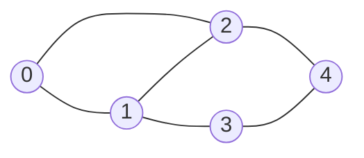

# Traversing a Graph

## Why It Exists

"Visit every element" is a one-line `for` loop on an array and a tidy recursion on a tree. On a graph, **both fail**. A `for i in 0..N-1` visits index order, blind to the structure — it can't answer "what's reachable from X?", the question every graph algorithm asks. And naive tree recursion **loops forever** on a cycle: `A → B → C → A → B → …` until the stack explodes.

So graph traversal needs three things a tree walk doesn't: (1) a **sensible visiting order**, (2) a **visited set** so cycles don't trap you, and (3) handling for **disconnected graphs**, where one start node can't reach everything. Two orderings solve (1) — **depth-first** (follow one path to its end, then backtrack) and **breadth-first** (visit all 1-hop neighbours, then all 2-hop, …). They share the visited-set and disconnected-handling machinery; they differ only in *order*, and that difference decides which algorithms each unlocks. Both run in `O(V + E)`.

## See It Work

The same 5-node graph, walked both ways from node 0. DFS dives deep; BFS ripples outward — watch the orders diverge. Run it.

```python run viz=graph viz-kind=graph
from collections import deque

graph = [[1, 2], [0, 2, 3], [0, 1, 4], [1, 4], [2, 3]]   # undirected adjacency list

def dfs_traversal(g):
    visited, result = set(), []
    def dfs(node):                          # recursion = the backtrack trail
        visited.add(node); result.append(node)
        for nb in g[node]:
            if nb not in visited:
                dfs(nb)
    for v in range(len(g)):                 # outer loop → reach every component
        if v not in visited:
            dfs(v)
    return result

def bfs_traversal(g):
    visited, result = set(), []
    def bfs(src):
        q = deque([src]); visited.add(src)  # mark on ENQUEUE
        while q:
            node = q.popleft(); result.append(node)
            for nb in g[node]:
                if nb not in visited:
                    visited.add(nb); q.append(nb)
    for v in range(len(g)):
        if v not in visited:
            bfs(v)
    return result

print("DFS:", dfs_traversal(graph))     # [0, 1, 2, 4, 3]  — deep first
print("BFS:", bfs_traversal(graph))     # [0, 1, 2, 3, 4]  — level by level
```

## How It Works

Both traversals are **two-level**: an inner search from one source, wrapped in an outer loop that restarts the search from any still-unvisited node (so disconnected components are all covered). The visited set, checked before every descent, is what stops cycles.

- **DFS** is naturally **recursion**: mark the node, then recurse into each unvisited neighbour. The call stack *is* the trail of branch points you retrace when you backtrack — every `return` is "back up to the last fork." (An explicit stack gives the iterative form.)
- **BFS** is a **queue**: enqueue the source, then repeatedly dequeue a node, record it, and enqueue its unvisited neighbours. The FIFO order guarantees all distance-`k` nodes come out before any distance-`k+1` node — a ripple.



<p align="center"><strong>from node 0, DFS commits to one branch to its end before trying the next; BFS fans out a whole level at a time.</strong></p>

For a **connected** graph the outer loop fires the inner search once; for a **disconnected** one, once per component — either way every node is visited exactly once, giving `O(V + E)` (each vertex once, each edge examined once). The order is the only difference, and it dictates the use: DFS for "explore a whole branch / detect a cycle / order dependencies," BFS for "fewest hops / nearest first."

### Key Takeaway

Graph traversal = a visited set (against cycles) + a two-level outer loop (for disconnected components) + an ordering. **DFS** uses recursion/stack (deep, then backtrack); **BFS** uses a queue (ripple, level by level). Both are `O(V + E)`. DFS underlies cycle detection, topological sort, and connectivity; BFS underlies shortest-unweighted-path and level-order.

## Trace It

In the BFS above, a node is added to the visited set the instant it's **enqueued** — not when it's later dequeued and processed.

Before you read on: that ordering looks arbitrary. Suppose you "simplify" by marking a node visited only when you *dequeue* it (guarding re-processing with an `if already visited: skip`). The output order can still come out right — so what silently goes wrong, and why is mark-on-enqueue the correct discipline?

The traversal still *finishes* correctly, but nodes get **enqueued multiple times** — the queue bloats and you do redundant work. Picture a diamond: `0 → {1, 2, 3}`, and all of `1, 2, 3 → 4`. With mark-on-enqueue, when `1` enqueues `4` it's marked at once, so `2` and `3` each see `4` already visited and skip it — `4` enters the queue **once**. With mark-on-dequeue, `4` isn't marked until it's pulled from the front, so `1`, `2`, *and* `3` all enqueue it first — `4` sits in the queue **three times** (verified: 3 redundant enqueues), and you only discard the dupes when you pop them. On a dense graph a node can be enqueued `O(degree)` times, inflating the queue toward `O(E)` and doing wasted dequeues. Worse, in BFS variants that record *distance* or *parent* on enqueue, marking late lets a node's distance be set by a longer path before the shorter one is processed — a genuine correctness bug. The rule that prevents both: **mark a node visited at the moment you put it on the queue**, so each node enters exactly once and its first (shortest) discovery wins. (DFS has the mirror discipline — mark on entry, before recursing — for the same "don't visit twice" reason.) It's a one-line placement, but it's the difference between a clean `O(V+E)` BFS and a quietly quadratic one.

## Your Turn

DFS and BFS traversal in both languages, on the same graph:

```python run viz=graph viz-kind=graph
from collections import deque

def dfs_traversal(g):
    visited, result = set(), []
    def dfs(node):
        visited.add(node); result.append(node)
        for nb in g[node]:
            if nb not in visited: dfs(nb)
    for v in range(len(g)):
        if v not in visited: dfs(v)
    return result

def bfs_traversal(g):
    visited, result = set(), []
    for s in range(len(g)):
        if s in visited: continue
        q = deque([s]); visited.add(s)
        while q:
            node = q.popleft(); result.append(node)
            for nb in g[node]:
                if nb not in visited: visited.add(nb); q.append(nb)
    return result

g = [[1, 2], [0, 2, 3], [0, 1, 4], [1, 4], [2, 3]]
print(dfs_traversal(g))   # [0, 1, 2, 4, 3]
print(bfs_traversal(g))   # [0, 1, 2, 3, 4]
print(bfs_traversal([[1], [0], [3], [2]]))   # [0, 1, 2, 3] — two components
```

```java run viz=graph viz-kind=graph
import java.util.*;
public class Main {
  static void dfs(List<List<Integer>> g, int node, boolean[] seen, List<Integer> out) {
    seen[node] = true; out.add(node);
    for (int nb : g.get(node)) if (!seen[nb]) dfs(g, nb, seen, out);
  }
  static List<Integer> dfsTraversal(List<List<Integer>> g) {
    boolean[] seen = new boolean[g.size()]; List<Integer> out = new ArrayList<>();
    for (int v = 0; v < g.size(); v++) if (!seen[v]) dfs(g, v, seen, out);
    return out;
  }
  static List<Integer> bfsTraversal(List<List<Integer>> g) {
    boolean[] seen = new boolean[g.size()]; List<Integer> out = new ArrayList<>();
    for (int s = 0; s < g.size(); s++) {
      if (seen[s]) continue;
      Deque<Integer> q = new ArrayDeque<>(); q.add(s); seen[s] = true;   // mark on enqueue
      while (!q.isEmpty()) {
        int node = q.poll(); out.add(node);
        for (int nb : g.get(node)) if (!seen[nb]) { seen[nb] = true; q.add(nb); }
      }
    }
    return out;
  }
  public static void main(String[] a) {
    List<List<Integer>> g = List.of(List.of(1,2), List.of(0,2,3), List.of(0,1,4), List.of(1,4), List.of(2,3));
    System.out.println(dfsTraversal(g));   // [0, 1, 2, 4, 3]
    System.out.println(bfsTraversal(g));   // [0, 1, 2, 3, 4]
  }
}
```

Then: write the **iterative** DFS with an explicit stack; count **connected components** (how many times the outer loop fires the inner search); record each node's **BFS distance** from the source (the fewest-hops number); and detect a **cycle** by spotting an already-visited neighbour that isn't the parent.

## Reflect & Connect

These two walks are the substrate of the whole graph-algorithms chapter:

- **DFS's family** — [cycle detection](/cortex/data-structures-and-algorithms/graphs/cycle-detection), [topological sort](/cortex/data-structures-and-algorithms/graphs/topological-sort) (DFS finish-order), [connected components](/cortex/data-structures-and-algorithms/graphs/pattern-connected-components/pattern), strongly-connected components, bridges/articulation points. Anything about "explore a whole region" or "ordering by dependency" is DFS.
- **BFS's family** — [shortest path in an unweighted graph](/cortex/data-structures-and-algorithms/graphs/pattern-shortest-path-breadth-first-search/pattern) (the ripple reaches every node by its fewest-hops distance), level-order, "nearest first," and [grid traversal](/cortex/data-structures-and-algorithms/graphs/traversing-a-grid) (a grid is a graph; neighbours are the 4 cells). The moment a problem says "fewest," reach for BFS.
- **Same skeleton, different container** — DFS is BFS with a **stack** instead of a **queue**: both pop a frontier node and push its unvisited neighbours; LIFO goes deep, FIFO goes wide. Internalise the visited-set + two-level-loop skeleton once and you've written 90% of every graph algorithm.
- **The complexity you'll quote forever** — `O(V + E)` (with an adjacency list): each vertex dequeued/recursed once, each edge inspected once. It's why the [adjacency list](/cortex/data-structures-and-algorithms/graphs/adjacency-list-representation) is the default representation — a matrix would force `O(V²)`.

**Prerequisites:** [Adjacency List](/cortex/data-structures-and-algorithms/graphs/adjacency-list-representation).
**What's next:** apply BFS/DFS to the most common graph in interviews — a 2D grid — [Traversing a Grid](/cortex/data-structures-and-algorithms/graphs/traversing-a-grid).

## Recall

> **Mnemonic:** *Visited set (kills cycles) + outer loop over all nodes (covers components) + an order. DFS = recursion/stack, go deep then backtrack. BFS = queue, ripple level-by-level, MARK ON ENQUEUE. Both O(V+E). DFS → cycles/topo/components; BFS → fewest hops.*

| | |
|---|---|
| Cycle safety | a `visited` set, checked before every descent |
| Disconnected graphs | outer loop: restart from each unvisited node |
| DFS | recursion / explicit stack — deep, then backtrack |
| BFS | queue — ripple; **mark visited on enqueue** (once each) |
| Complexity | `O(V + E)` (adjacency list) |
| Use | DFS: cycles, topo sort, components · BFS: fewest hops, nearest |

<details>
<summary><strong>Q:</strong> Why can't a plain `for` loop or tree recursion traverse a graph?</summary>

**A:** A `for` loop ignores structure; tree recursion loops forever on cycles — graphs need a visited set and an explicit order.

</details>
<details>
<summary><strong>Q:</strong> What does the two-level structure (inner search + outer loop) buy you?</summary>

**A:** The outer loop restarts the search from each unvisited node, so disconnected components are all covered.

</details>
<details>
<summary><strong>Q:</strong> DFS vs BFS — mechanism and use?</summary>

**A:** DFS = recursion/stack (deep, backtrack) for cycles/topo/components; BFS = queue (ripple) for fewest-hops / nearest-first.

</details>
<details>
<summary><strong>Q:</strong> Why mark a node visited on *enqueue* in BFS, not on dequeue?</summary>

**A:** So each node enters the queue exactly once (no redundant enqueues) and its first/shortest discovery wins — marking late bloats the queue and can corrupt distances.

</details>
<details>
<summary><strong>Q:</strong> Why is traversal `O(V + E)`?</summary>

**A:** Each vertex is processed once and each edge examined once, given an adjacency list.

</details>

## Sources & Verify

- **CLRS**, *Introduction to Algorithms*, 4th ed., §20.2–20.3 — Breadth-First Search and Depth-First Search (the `O(V+E)` analysis and the colour/visited discipline).
- **Sedgewick & Wayne**, *Algorithms*, 4th ed., §4.1–4.2 — DFS and BFS over the adjacency-list API.
- Both runnable blocks are verified by running (5-node graph: `DFS = [0,1,2,4,3]` deep, `BFS = [0,1,2,3,4]` ripple; two-component graph `[[1],[0],[3],[2]]` → `[0,1,2,3]`). The mark-on-enqueue point is verified: marking on dequeue enqueues a shared sink node 3× on a diamond graph.
