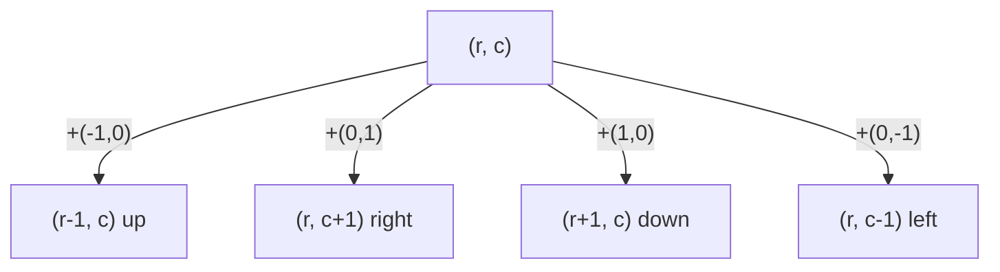

# Traversing a Grid

## Why It Exists

Grid problems are everywhere — count the islands, flood-fill a region, find the shortest path through a maze, spread infection across cells. They *look* like a new topic, but they're the [graph traversal](/cortex/data-structures-and-algorithms/graphs/traversing-a-graph) you already know, wearing a disguise.

The reframe: **every grid is a graph.** Each cell `(r, c)` is a node; its neighbours are the (usually four) cardinally adjacent cells `(r±1, c)` and `(r, c±1)`. The one twist is that a grid stores **no adjacency list** — the edges are *implicit*, recovered on the fly by adding small **direction deltas** to the current coordinates. Get that, plus a **bounds check** for the edge of the world, and DFS/BFS on a grid is the exact same visited-set + two-level-loop skeleton — only "get neighbours" becomes a tiny calculation instead of a list lookup.

## See It Work

A 4×4 grid where `1` = walkable, `0` = blocked. DFS visits every walkable cell reachable from each unvisited start — each walkable region is a component ("island"). Returns the visited cells as a list of `[row, col]` pairs. Pick a case and **Run** it.

```python run viz=grid
import ast

DIRS = [(-1, 0), (0, 1), (1, 0), (0, -1)]      # up, right, down, left

def dfs_grid(grid):
    if not grid: return []
    rows, cols = len(grid), len(grid[0])
    visited = [[False] * cols for _ in range(rows)]
    result = []
    def dfs(r, c):
        visited[r][c] = True
        result.append([r, c])                   # [row, col] — not a tuple
        for dr, dc in DIRS:
            nr, nc = r + dr, c + dc
            if 0 <= nr < rows and 0 <= nc < cols and grid[nr][nc] == 1 and not visited[nr][nc]:
                dfs(nr, nc)
    for r in range(rows):
        for c in range(cols):
            if grid[r][c] == 1 and not visited[r][c]:
                dfs(r, c)
    return result

grid = ast.literal_eval(input())
print(dfs_grid(grid))
```

```java run viz=grid
import java.util.*;

public class Main {
    static final int[][] DIRS = {{-1,0},{0,1},{1,0},{0,-1}};
    static List<List<Integer>> result;
    static boolean[][] visited;

    static void dfs(int[][] grid, int r, int c) {
        visited[r][c] = true;
        result.add(Arrays.asList(r, c));            // [row, col]
        for (int[] d : DIRS) {
            int nr = r + d[0], nc = c + d[1];
            if (nr >= 0 && nr < grid.length && nc >= 0 && nc < grid[0].length
                    && grid[nr][nc] == 1 && !visited[nr][nc])
                dfs(grid, nr, nc);
        }
    }

    public static void main(String[] args) {
        Scanner sc = new Scanner(System.in);
        int[][] grid = parseIntMatrix(sc.nextLine());
        if (grid.length == 0) { System.out.println("[]"); return; }
        result  = new ArrayList<>();
        visited = new boolean[grid.length][grid[0].length];
        for (int r = 0; r < grid.length; r++)
            for (int c = 0; c < grid[0].length; c++)
                if (grid[r][c] == 1 && !visited[r][c]) dfs(grid, r, c);
        System.out.println(result);
    }

    static int[][] parseIntMatrix(String line) {
        String trimmed = line.trim();
        if (trimmed.equals("[]") || trimmed.equals("[[]]")) return new int[0][];
        String inner = trimmed.substring(1, trimmed.length() - 1).trim();
        String[] rows = inner.split("\\],\\s*\\[");
        int[][] mat = new int[rows.length][];
        for (int r = 0; r < rows.length; r++) {
            String row = rows[r].replaceAll("[\\[\\]\\s]", "");
            if (row.isEmpty()) { mat[r] = new int[0]; continue; }
            String[] parts = row.split(",");
            mat[r] = new int[parts.length];
            for (int c = 0; c < parts.length; c++) mat[r][c] = Integer.parseInt(parts[c].trim());
        }
        return mat;
    }
}
```

```testcases
{
  "args": [
    { "id": "grid", "label": "grid", "type": "int[][]", "placeholder": "[[1, 1, 0, 0], [0, 0, 1, 1], [1, 0, 1, 1], [1, 0, 0, 0]]" }
  ],
  "cases": [
    { "args": { "grid": "[[1, 1, 0, 0], [0, 0, 1, 1], [1, 0, 1, 1], [1, 0, 0, 0]]" }, "expected": "[[0, 0], [0, 1], [1, 2], [1, 3], [2, 3], [2, 2], [2, 0], [3, 0]]" },
    { "args": { "grid": "[[1, 0, 1], [0, 0, 0], [1, 0, 1]]" }, "expected": "[[0, 0], [0, 2], [2, 0], [2, 2]]" },
    { "args": { "grid": "[[1, 1, 1], [1, 1, 1], [1, 1, 1]]" }, "expected": "[[0, 0], [0, 1], [0, 2], [1, 2], [2, 2], [2, 1], [1, 1], [1, 0], [2, 0]]" },
    { "args": { "grid": "[[0, 0, 0], [0, 0, 0]]" }, "expected": "[]" },
    { "args": { "grid": "[[1, 0], [0, 1]]" }, "expected": "[[0, 0], [1, 1]]" }
  ]
}
```

## How It Works

The grid-as-graph mapping is mechanical:

- **Node** = cell `(r, c)`. **Neighbours** = `(r, c)` plus each direction delta, filtered by the grid bounds and (often) a walkability test.
- **Direction array** — `[(-1,0), (0,1), (1,0), (0,-1)]`. One loop over it replaces four hand-rolled `if`s; going **8-directional** is just adding the 4 diagonal deltas `(±1, ±1)`. (Read each delta as a compass arrow: `(-1,0)` = row decreases = up.)
- **Bounds check** — `0 ≤ nr < rows and 0 ≤ nc < cols`, the "edge of the world" a real graph never has. Skip it and you get an `IndexError` / out-of-bounds — or worse, silent negative-index wraparound.
- **`visited` grid + two-level outer loop** — same as graph traversal: the outer double-loop launches a search from each unvisited walkable cell, so all islands are covered.



<p align="center"><strong>a cell's four neighbours are itself plus each direction delta; bounds + walkability filter which actually exist.</strong></p>

The 4×4 grid above has three walkable regions, so the outer loop fires DFS three times — `count_islands` is literally "how many times did the outer loop start a search?" Complexity is `O(rows × cols)`: every cell is visited once and each does `O(1)` neighbour work.

### Key Takeaway

A grid is a graph with **implicit edges**: a cell's neighbours are computed as `(r, c) + direction delta`, not read from a stored list — so traversal needs a **direction array** and a **bounds check** on top of the usual visited-set + two-level-loop. With that, islands/flood-fill are DFS and maze-shortest-path is BFS, all `O(rows × cols)`.

## Trace It

A normal graph hands you each node's neighbours from its adjacency list. A grid hands you *nothing* — there's no edge list anywhere in the input, just a rectangle of values.

Before you read on: if no edges are stored, where do a cell's neighbours come from — and what's the one safety check grid traversal must perform on every single neighbour that an adjacency-list graph never thinks about?

The neighbours are **computed, not stored**: you add each direction delta to the current coordinate — `(r+dr, c+dc)` for the four deltas — to *generate* the candidate neighbours. The grid's edges are implicit in the geometry; the direction array is the rule that reconstructs them. But generation is unbounded — from corner `(0,0)` the "up" delta produces `(-1, 0)`, a cell that doesn't exist — so every generated neighbour must pass a **bounds check** (`0 ≤ nr < rows and 0 ≤ nc < cols`) before you touch the grid at that coordinate. An adjacency-list graph never needs this: its lists contain *only* real neighbours, so "the edge of the world" can't arise. On a grid it arises constantly — interior cells have all 4 neighbours, edge cells 3, and **corners only 2** (e.g. `(0,0)` keeps just `(0,1)` and `(1,0)`). Forgetting the check is the single most common grid bug: in Java it throws `ArrayIndexOutOfBoundsException`; in Python the negative index `grid[-1][0]` *silently wraps to the last row*, so your traversal "teleports" across the board and returns garbage with no error at all. The discipline — **generate via deltas, then validate bounds (and walkability) before recursing** — is the whole difference between grid traversal and plain graph traversal. Bundle it into one `is_valid(grid, r, c)` helper and the bug class disappears.

## Your Turn

Implement `count_islands` — the classic grid DFS counting problem — in both languages.

```python run viz=grid
import ast

DIRS = [(-1, 0), (0, 1), (1, 0), (0, -1)]

def count_islands(grid):
    # Your code goes here — outer double-loop over cells; for each unvisited walkable cell,
    # increment a counter and run DFS to mark the whole island; return the count.
    pass

grid = ast.literal_eval(input())
print(count_islands(grid))
```

```java run viz=grid
import java.util.*;

public class Main {
    static final int[][] DIRS = {{-1,0},{0,1},{1,0},{0,-1}};

    static void dfs(int[][] g, boolean[][] seen, int r, int c) {
        // Your code goes here — mark seen, recurse into valid unvisited walkable neighbours.
        seen[r][c] = true;
    }

    static int countIslands(int[][] g) {
        // Your code goes here — outer double-loop; count DFS launches.
        return 0;
    }

    public static void main(String[] args) {
        Scanner sc = new Scanner(System.in);
        int[][] grid = parseIntMatrix(sc.nextLine());
        System.out.println(countIslands(grid));
    }

    static int[][] parseIntMatrix(String line) {
        String trimmed = line.trim();
        if (trimmed.equals("[]") || trimmed.equals("[[]]")) return new int[0][];
        String inner = trimmed.substring(1, trimmed.length() - 1).trim();
        String[] rows = inner.split("\\],\\s*\\[");
        int[][] mat = new int[rows.length][];
        for (int r = 0; r < rows.length; r++) {
            String row = rows[r].replaceAll("[\\[\\]\\s]", "");
            if (row.isEmpty()) { mat[r] = new int[0]; continue; }
            String[] parts = row.split(",");
            mat[r] = new int[parts.length];
            for (int c = 0; c < parts.length; c++) mat[r][c] = Integer.parseInt(parts[c].trim());
        }
        return mat;
    }
}
```

```testcases
{
  "args": [
    { "id": "grid", "label": "grid", "type": "int[][]", "placeholder": "[[1, 1, 0, 0], [0, 0, 1, 1], [1, 0, 1, 1], [1, 0, 0, 0]]" }
  ],
  "cases": [
    { "args": { "grid": "[[1, 1, 0, 0], [0, 0, 1, 1], [1, 0, 1, 1], [1, 0, 0, 0]]" }, "expected": "3" },
    { "args": { "grid": "[[1, 1, 1], [1, 1, 1], [1, 1, 1]]" }, "expected": "1" },
    { "args": { "grid": "[[1, 0, 1], [0, 0, 0], [1, 0, 1]]" }, "expected": "4" },
    { "args": { "grid": "[[0, 0, 0], [0, 0, 0]]" }, "expected": "0" },
    { "args": { "grid": "[[1, 0], [0, 1]]" }, "expected": "2" }
  ]
}
```

<details>
<summary>Editorial</summary>

The outer double-loop scans every cell. When it finds a walkable, unvisited cell, it increments the island counter and launches a DFS from that cell to mark every connected walkable cell as visited — so the outer loop never re-enters a cell that's already part of a discovered island. The DFS is a standard recursive visit: mark the current cell visited, then for each direction delta generate the candidate neighbour, check bounds + walkability + not-yet-visited, and recurse. Each outer-loop launch = one island; the total launch count is the answer.

```python solution time=O(rows × cols) space=O(rows × cols)
import ast

DIRS = [(-1, 0), (0, 1), (1, 0), (0, -1)]

def count_islands(grid):
    if not grid: return 0
    rows, cols = len(grid), len(grid[0])
    seen = [[False] * cols for _ in range(rows)]
    def dfs(r, c):
        seen[r][c] = True
        for dr, dc in DIRS:
            nr, nc = r + dr, c + dc
            if 0 <= nr < rows and 0 <= nc < cols and grid[nr][nc] == 1 and not seen[nr][nc]:
                dfs(nr, nc)
    islands = 0
    for r in range(rows):
        for c in range(cols):
            if grid[r][c] == 1 and not seen[r][c]:
                islands += 1; dfs(r, c)
    return islands

grid = ast.literal_eval(input())
print(count_islands(grid))
```

```java solution
import java.util.*;

public class Main {
    static final int[][] DIRS = {{-1,0},{0,1},{1,0},{0,-1}};

    static void dfs(int[][] g, boolean[][] seen, int r, int c) {
        seen[r][c] = true;
        for (int[] d : DIRS) {
            int nr = r + d[0], nc = c + d[1];
            if (nr >= 0 && nr < g.length && nc >= 0 && nc < g[0].length
                    && g[nr][nc] == 1 && !seen[nr][nc])
                dfs(g, seen, nr, nc);
        }
    }

    static int countIslands(int[][] g) {
        if (g.length == 0) return 0;
        boolean[][] seen = new boolean[g.length][g[0].length];
        int islands = 0;
        for (int r = 0; r < g.length; r++)
            for (int c = 0; c < g[0].length; c++)
                if (g[r][c] == 1 && !seen[r][c]) { islands++; dfs(g, seen, r, c); }
        return islands;
    }

    public static void main(String[] args) {
        Scanner sc = new Scanner(System.in);
        int[][] grid = parseIntMatrix(sc.nextLine());
        System.out.println(countIslands(grid));
    }

    static int[][] parseIntMatrix(String line) {
        String trimmed = line.trim();
        if (trimmed.equals("[]") || trimmed.equals("[[]]")) return new int[0][];
        String inner = trimmed.substring(1, trimmed.length() - 1).trim();
        String[] rows = inner.split("\\],\\s*\\[");
        int[][] mat = new int[rows.length][];
        for (int r = 0; r < rows.length; r++) {
            String row = rows[r].replaceAll("[\\[\\]\\s]", "");
            if (row.isEmpty()) { mat[r] = new int[0]; continue; }
            String[] parts = row.split(",");
            mat[r] = new int[parts.length];
            for (int c = 0; c < parts.length; c++) mat[r][c] = Integer.parseInt(parts[c].trim());
        }
        return mat;
    }
}
```

</details>

Then: swap DFS for **BFS** (a queue) to get the **shortest path** through a maze (fewest steps = BFS's ripple); extend `DIRS` to **8 directions**; do a **flood fill** (recolour a region); and try **multi-source BFS** (seed the queue with several starts at once — "rotting oranges").

## Reflect & Connect

"Grid = graph" is one of the highest-leverage reframes in the whole subject:

- **The problem family** — number of islands, flood fill, surrounded regions, max area of island (all DFS/connected-components); shortest path in a maze, rotting oranges, "01 matrix" (all [BFS](/cortex/data-structures-and-algorithms/graphs/pattern-shortest-path-breadth-first-search/pattern), because they ask for *fewest steps*). Same two engines, dozens of disguises.
- **Implicit-graph thinking generalises** — you never built an adjacency list, yet you ran graph algorithms. The same trick applies to any state space where "neighbours" are *generated by rules*: chess-knight moves, word-ladder edits, puzzle states. Whenever you can write a `neighbours(state)` function, BFS/DFS apply with no explicit graph.
- **DFS vs BFS, grid edition** — DFS (recursion) is cleanest for "fill / count a region"; BFS (queue) is mandatory for "fewest steps," because the ripple reaches each cell by its shortest distance. The choice is the same one from [graph traversal](/cortex/data-structures-and-algorithms/graphs/traversing-a-graph).
- **The recurring bugs** — forgetting the bounds check (or Python's silent negative-index wraparound), hardcoding four `if`s instead of a direction array, and marking visited too late in BFS. The direction array + bounds check kill the first two.

**Prerequisites:** [Traversing a Graph](/cortex/data-structures-and-algorithms/graphs/traversing-a-graph).
**What's next:** use DFS's structure to answer a yes/no about the graph itself — does it contain a cycle? — [Cycle Detection](/cortex/data-structures-and-algorithms/graphs/cycle-detection).

## Recall

> **Mnemonic:** *Grid = graph, cell = node, neighbours = current + direction deltas (NOT a stored list). Always bounds-check before touching grid[nr][nc] (corners have 2 neighbours, interiors 4). Then it's plain DFS/BFS, O(rows×cols). Islands = outer-loop launch count.*

| | |
|---|---|
| Node / neighbours | cell `(r,c)` / `(r,c) + each direction delta` |
| Direction array | `[(-1,0),(0,1),(1,0),(0,-1)]`; +4 diagonals for 8-dir |
| Bounds check | `0 ≤ nr < rows and 0 ≤ nc < cols` (the edge of the world) |
| Neighbour count | corner 2, edge 3, interior 4 |
| Traversal | visited grid + two-level outer loop; DFS or BFS |
| Complexity | `O(rows × cols)` |

<details>
<summary><strong>Q:</strong> In what sense is a grid a graph?</summary>

**A:** Each cell is a node and its cardinally adjacent cells are neighbours; the edges are implicit (computed), not stored.

</details>
<details>
<summary><strong>Q:</strong> Where do a cell's neighbours come from?</summary>

**A:** Add each direction delta `(dr,dc)` to `(r,c)`, then keep the in-bounds, walkable, unvisited ones.

</details>
<details>
<summary><strong>Q:</strong> What check does grid traversal need that adjacency-list traversal doesn't, and why?</summary>

**A:** A bounds check — generated neighbours can fall off the grid (and a negative index silently wraps in Python); an adjacency list only ever holds real neighbours.

</details>
<details>
<summary><strong>Q:</strong> DFS or BFS for a maze's shortest path?</summary>

**A:** BFS — the ripple reaches each cell by its fewest-steps distance; DFS doesn't give shortest paths.

</details>
<details>
<summary><strong>Q:</strong> How do you count islands?</summary>

**A:** Run the two-level traversal; the number of times the outer loop *launches* a search equals the number of connected walkable regions.

</details>

## Sources & Verify

- **CLRS**, *Introduction to Algorithms*, 4th ed., §20.2–20.3 — BFS/DFS (grids are the implicit-graph special case).
- **Sedgewick & Wayne**, *Algorithms*, 4th ed., §4.1 — connected components and implicit graphs.
- Both runnable blocks are verified by running (4×4 grid DFS order `[[0,0],[0,1],[1,2],[1,3],[2,3],[2,2],[2,0],[3,0]]`; `count_islands` → 3, 1, 4, 0, 2; neighbour counts corner 2 / interior 4 confirmed).
