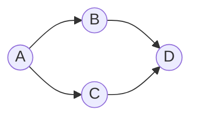

# Cycle Detection

## Why It Exists

"Is there a cycle?" is one of the most-asked questions of a graph. A cycle in a build's dependency graph is a circular `import` that won't compile; a cycle in a lock-acquisition graph is a **deadlock**; a cycle in a task scheduler means there's no valid order to run things ([topological sort](/cortex/data-structures-and-algorithms/graphs/topological-sort) fails exactly when a cycle exists). Spreadsheets reject cyclic formulas for the same reason.

Both answers are a [DFS](/cortex/data-structures-and-algorithms/graphs/traversing-a-graph) — but the *rule* for "I found a cycle" differs by graph type, and that difference trips people up. In an **undirected** graph, finding an already-visited neighbour means a cycle *unless* it's the parent you just came from (every edge is two-way, so walking back isn't a loop). In a **directed** graph, that's not enough: you need a back edge to a node that's **still on the current DFS path** — being merely "visited" isn't a cycle. Getting the right rule for the right graph is the lesson.

## See It Work

Undirected cycle detection: DFS, and flag a back edge to a visited node that **isn't the parent**. A square has a cycle; a tree doesn't. Run it.

```python run viz=graph viz-kind=graph
def has_cycle_undirected(graph):
    visited = set()
    def dfs(node, parent):
        visited.add(node)
        for nb in graph[node]:
            if nb not in visited:
                if dfs(nb, node):           # carry the parent down
                    return True
            elif nb != parent:              # visited AND not parent ⇒ cycle
                return True
        return False
    for v in range(len(graph)):             # outer loop ⇒ all components
        if v not in visited and dfs(v, -1):
            return True
    return False

square = [[1,2], [0,4], [0,3], [2,4], [1,3]]    # contains a cycle
tree   = [[1,2], [0,3], [0], [1]]               # acyclic
print(has_cycle_undirected(square))   # True
print(has_cycle_undirected(tree))     # False
```

## How It Works

**Undirected** — DFS carrying the `parent`. A neighbour that's already visited *and* isn't the parent closes a loop. The parent exclusion is essential: without it, the trivial edge `A—B` would "find" `A` again from `B` and falsely report a cycle, because an undirected edge is traversable both ways. (DSU is an alternative: union each edge; an edge whose endpoints are already in the same set is a cycle.)

**Directed** — the parent trick fails, because edge *direction* matters. You need to know not just "visited?" but "still on the path from the root to here?" Give each node three states:

| State | Meaning |
|---|---|
| **White** | not yet visited |
| **Grey** | entered, not finished — **on the recursion stack (current path)** |
| **Black** | finished — it and all its descendants are done |

A directed edge to a **grey** node is a cycle (you've looped back onto your own path); an edge to a **black** node is fine. In code you keep two sets: `visited` (grey ∪ black) and `in_path` (grey only) — add to `in_path` on entry, **remove on exit** (that's the grey→black flip).



<p align="center"><strong>a "diamond" DAG: <code>D</code> is reachable two ways from <code>A</code>, but there's no cycle. The grey/black distinction is what tells it apart from a real loop.</strong></p>

Both run in `O(V + E)` — one DFS, each vertex and edge touched once, the outer loop covering disconnected components.

### Key Takeaway

Cycle detection is DFS with the right "back edge" rule. **Undirected:** a visited neighbour that isn't the parent = cycle (exclude the edge you came in on). **Directed:** a neighbour still on the current DFS path (grey) = cycle — track a recursion-stack set and remove a node from it on exit (grey→black). Both `O(V+E)`.

## Trace It

Take the diamond above — `A→B→D` and `A→C→D`, no cycle. Now *misapply* the undirected rule to it: "a visited non-parent neighbour means a cycle."

Before you read on: DFS goes `A→B→D`, backtracks, then `A→C→D` and finds `D` already visited (and `D` isn't `C`'s parent). The undirected rule shouts "cycle!" — but the diamond is acyclic. Why is it wrong, and what does the directed algorithm check instead that gets it right?

The undirected rule conflates **"visited"** with **"on my current path,"** and on a directed graph those are different. When `C` reaches `D` the second time, `D` was already **finished** — DFS entered it from `B`, explored it fully, and backtracked out. In three-state terms `D` is **black**, not grey: it's *not* on the path `A→C→…` currently being explored, it's just a node that happens to have been completed earlier via another route. There's no loop, because following the edges never returns you to a node you're *currently inside*. The directed algorithm asks the precise question — **"is this neighbour grey (still on the recursion stack)?"** — and `D` is black, so it correctly says "no cycle." Add the edge `D→A` and re-run: now from `D` you look at `A`, which is **grey** (you're still inside `A`'s call — it's the root of the current path), so you've closed a loop and it's a true cycle. The load-bearing line is `in_path.remove(node)` on exit: it flips a node grey→black so that finishing a node *takes it off the path*. Delete that one line and every visited node stays grey forever — the diamond's second visit to `D` finds it "grey" and you're back to the false positive. So the rules aren't arbitrary per graph type: undirected needs *parent exclusion* (because edges are bidirectional), directed needs *path membership* (because a back edge only loops if it points at an ancestor you haven't left yet). Same DFS skeleton, two different "what counts as a back edge" tests.

## Your Turn

Both detectors in both languages — undirected (parent rule) and directed (recursion-stack rule):

```python run viz=graph viz-kind=graph
def has_cycle_undirected(graph):
    visited = set()
    def dfs(node, parent):
        visited.add(node)
        for nb in graph[node]:
            if nb not in visited:
                if dfs(nb, node): return True
            elif nb != parent: return True
        return False
    return any(v not in visited and dfs(v, -1) for v in range(len(graph)))

def has_cycle_directed(graph):
    visited, in_path = set(), set()
    def dfs(node):
        visited.add(node); in_path.add(node)
        for nb in graph[node]:
            if nb in in_path: return True               # grey neighbour ⇒ cycle
            if nb not in visited and dfs(nb): return True
        in_path.remove(node)                             # grey → black on exit
        return False
    return any(v not in visited and dfs(v) for v in range(len(graph)))

print(has_cycle_undirected([[1,2],[0,4],[0,3],[2,4],[1,3]]))   # True
print(has_cycle_directed([[1,2],[3],[3],[]]))                  # False — diamond DAG
print(has_cycle_directed([[1,2],[3],[3],[0]]))                 # True  — diamond + D→A
print(has_cycle_directed([[4],[5],[3],[5],[1],[]]))            # False — a DAG
```

```java run viz=graph viz-kind=graph
import java.util.*;
public class Main {
  static boolean dfsDir(List<List<Integer>> g, int node, boolean[] visited, boolean[] inPath) {
    visited[node] = true; inPath[node] = true;
    for (int nb : g.get(node)) {
      if (inPath[nb]) return true;                       // grey ⇒ cycle
      if (!visited[nb] && dfsDir(g, nb, visited, inPath)) return true;
    }
    inPath[node] = false;                                // grey → black
    return false;
  }
  static boolean hasCycleDirected(List<List<Integer>> g) {
    boolean[] visited = new boolean[g.size()], inPath = new boolean[g.size()];
    for (int v = 0; v < g.size(); v++)
      if (!visited[v] && dfsDir(g, v, visited, inPath)) return true;
    return false;
  }
  public static void main(String[] a) {
    System.out.println(hasCycleDirected(List.of(List.of(1,2), List.of(3), List.of(3), List.of())));   // false
    System.out.println(hasCycleDirected(List.of(List.of(1,2), List.of(3), List.of(3), List.of(0))));  // true
  }
}
```

Then: detect a cycle in an undirected graph with **DSU** (union edges; same-set endpoints = cycle); return the **actual cycle** (track parents and walk back when you hit a grey node); and use directed cycle detection as the **feasibility check** for a topological sort.

## Reflect & Connect

Cycle detection is the canonical "same DFS, graph-type-specific rule" lesson:

- **Two rules, one skeleton** — undirected excludes the *parent* (edges are bidirectional, so the come-from edge isn't a loop); directed checks *path membership* (grey), because a back edge loops only if it points to an unfinished ancestor. Picking the wrong rule is the classic bug — the undirected rule false-positives on the directed diamond.
- **Directed cycle detection ⇔ "is it a DAG?"** — a directed graph has a valid [topological order](/cortex/data-structures-and-algorithms/graphs/topological-sort) *if and only if* it has no cycle. The grey-node check here is exactly the failure condition topo sort watches for; the two algorithms are the same DFS read two ways.
- **The 3-colour pattern recurs** — white/grey/black (unvisited / in-progress / done) is the general DFS-state vocabulary; it reappears in [strongly-connected components](/cortex/data-structures-and-algorithms/graphs/strongly-connected-components), [bridges and articulation points](/cortex/data-structures-and-algorithms/graphs/bridges-and-articulation-points), and any algorithm that distinguishes tree/back/forward/cross edges.
- **Two tools for undirected** — DFS-parent and [DSU](/cortex/data-structures-and-algorithms/trees/disjoint-set-union/introduction-to-disjoint-set-union) (union-find) both detect undirected cycles in near-linear time; DSU shines when edges arrive as a stream (Kruskal's MST uses exactly this to skip cycle-forming edges).

**Prerequisites:** [Traversing a Graph](/cortex/data-structures-and-algorithms/graphs/traversing-a-graph).
**What's next:** order a DAG so every edge points "forward" — and see why it's possible *exactly when* there's no cycle — [Topological Sort](/cortex/data-structures-and-algorithms/graphs/topological-sort).

## Recall

> **Mnemonic:** *Both are DFS. UNDIRECTED: visited non-PARENT neighbour ⇒ cycle (exclude the come-from edge). DIRECTED: neighbour still on the current path (GREY) ⇒ cycle — keep an in_path set, remove on exit (grey→black). Black neighbour = fine (diamond).*

| | |
|---|---|
| Undirected rule | visited neighbour `≠ parent` ⇒ cycle |
| Why parent-exclude | edges are bidirectional; the come-from edge isn't a loop |
| Directed rule | neighbour in `in_path` (grey) ⇒ cycle |
| States | white (unvisited) / grey (on path) / black (finished) |
| Load-bearing line | `in_path.remove(node)` on exit (grey→black) |
| Both | `O(V + E)`; directed cycle-free ⇔ has a topological order |

<details>
<summary><strong>Q:</strong> What's the undirected cycle rule, and why the parent exclusion?</summary>

**A:** A visited neighbour that isn't the parent = cycle; without excluding the parent, every bidirectional edge would falsely look like a back edge.

</details>
<details>
<summary><strong>Q:</strong> Why doesn't the undirected rule work for directed graphs?</summary>

**A:** It treats any visited node as a back edge; in a directed graph a node can be visited via a *different* finished path (the diamond) without forming a cycle.

</details>
<details>
<summary><strong>Q:</strong> What's the directed cycle rule?</summary>

**A:** A directed edge to a node still on the current DFS path (grey / in the recursion stack) is a cycle; an edge to a finished (black) node is not.

</details>
<details>
<summary><strong>Q:</strong> Why is `in_path.remove(node)` on exit essential?</summary>

**A:** It flips a node grey→black so a finished node leaves the path; without it the diamond's re-visited node looks grey and false-positives.

</details>
<details>
<summary><strong>Q:</strong> How does directed cycle detection relate to topological sort?</summary>

**A:** A directed graph is topologically sortable iff it's acyclic — the grey-node check is exactly topo sort's failure condition.

</details>

## Sources & Verify

- **CLRS**, *Introduction to Algorithms*, 4th ed., §20.3 — DFS, edge classification, and the white/grey/black colours; back edges ⇔ cycles.
- **Sedgewick & Wayne**, *Algorithms*, 4th ed., §4.1–4.2 — cycle detection in undirected and directed graphs.
- Both runnable blocks are verified by running (undirected: square ⇒ True, tree ⇒ False; directed: diamond ⇒ False, diamond+`D→A` ⇒ True, a DAG ⇒ False). The false-positive is confirmed: the undirected parent-rule misapplied to the directed diamond returns True.
