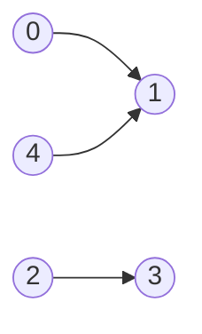

# Topological Sort

## Why It Exists

Some tasks must happen before others: a package depends on its dependencies, a build target on its inputs, a course on its prerequisites, an Airflow stage on the stages upstream. Model each "X must come before Y" as a directed edge `X → Y`, and the question becomes: **is there a linear order in which every edge points forward** — i.e. you never do something before its prerequisites?

That order is a **topological sort**. `npm`/`pip`/`cargo` use it to install dependencies bottom-up; `make`/`bazel`/`gradle` to build targets in the right order; a course planner to sequence classes. It exists **only on a DAG** — a directed *acyclic* graph — because a cycle (`A` needs `B` needs `A`) has no valid order, which is exactly the [cycle](/cortex/data-structures-and-algorithms/graphs/cycle-detection) connection: a directed graph is topologically sortable **if and only if** it's acyclic. Two algorithms produce the order: DFS finish-order (reversed), and Kahn's indegree peeling (which reports a cycle as a side effect).

## See It Work

DFS topological sort on `0→1, 2→3, 4→1`: run DFS, **append each node when it finishes**, then **reverse**. The graph crosses stdin as an adjacency list. Pick a case and **Run** it.

```python run viz=graph viz-kind=graph
import ast

def topo_dfs(graph):
    visited, result = set(), []
    def dfs(node):
        visited.add(node)
        for nb in graph[node]:
            if nb not in visited:
                dfs(nb)
        result.append(node)            # append on FINISH (after all descendants)
    for v in range(len(graph)):
        if v not in visited:
            dfs(v)
    result.reverse()                   # reverse ⇒ topological order
    return result

graph = ast.literal_eval(input())
order = topo_dfs(graph)
pos = {n: i for i, n in enumerate(order)}
forward = all(pos[u] < pos[v] for u in range(len(graph)) for v in graph[u])
print("order:", order)
print("every edge points forward:", "true" if forward else "false")
```

```java run viz=graph viz-kind=graph
import java.util.*;

public class Main {
    static List<Integer> result = new ArrayList<>();
    static boolean[] visited;

    static void dfs(int[][] g, int node) {
        visited[node] = true;
        for (int nb : g[node])
            if (!visited[nb]) dfs(g, nb);
        result.add(node);              // append on FINISH
    }

    static List<Integer> topoDfs(int[][] g) {
        visited = new boolean[g.length];
        result = new ArrayList<>();
        for (int v = 0; v < g.length; v++)
            if (!visited[v]) dfs(g, v);
        Collections.reverse(result);   // reverse ⇒ topological order
        return result;
    }

    public static void main(String[] args) {
        Scanner sc = new Scanner(System.in);
        int[][] graph = parseIntMatrix(sc.nextLine());
        List<Integer> order = topoDfs(graph);
        // verify every edge points forward
        Map<Integer, Integer> pos = new HashMap<>();
        for (int i = 0; i < order.size(); i++) pos.put(order.get(i), i);
        boolean forward = true;
        for (int u = 0; u < graph.length; u++)
            for (int v : graph[u])
                if (pos.get(u) >= pos.get(v)) { forward = false; break; }
        System.out.println("order: " + order);
        System.out.println("every edge points forward: " + forward);
    }

    static int[][] parseIntMatrix(String line) {
        String trimmed = line.trim();
        if (trimmed.equals("[]") || trimmed.equals("[[]]")) return new int[0][];
        String inner = trimmed.substring(1, trimmed.length() - 1).trim();
        String[] rows = inner.split("\\],\\s*\\[");
        int[][] mat = new int[rows.length][];
        for (int r = 0; r < rows.length; r++) {
            String row = rows[r].replaceAll("[\\[\\]\\s]", "");
            if (row.isEmpty()) { mat[r] = new int[0]; continue; }
            String[] parts = row.split(",");
            mat[r] = new int[parts.length];
            for (int c = 0; c < parts.length; c++) mat[r][c] = Integer.parseInt(parts[c].trim());
        }
        return mat;
    }
}
```

```testcases
{
  "args": [
    { "id": "graph", "label": "graph (directed adj list)", "type": "int[][]", "placeholder": "[[1], [], [3], [], [1]]" }
  ],
  "cases": [
    { "args": { "graph": "[[1], [], [3], [], [1]]" }, "expected": "order: [4, 2, 3, 0, 1]\nevery edge points forward: true" },
    { "args": { "graph": "[[1, 2], [3], [3], []]" }, "expected": "order: [0, 2, 1, 3]\nevery edge points forward: true" },
    { "args": { "graph": "[[1], [2], []]" }, "expected": "order: [0, 1, 2]\nevery edge points forward: true" }
  ]
}
```

## How It Works

**DFS method** — run DFS; the instant a node *finishes* (all its descendants are done), append it; reverse the list at the end. The only change from plain DFS is *when* you record a node — on exit, not entry — plus the final reverse. Which root you start from changes *which* valid order you get, never its validity.

**Kahn's method (BFS on indegrees)** — compute each node's **indegree** (incoming edges). Repeatedly take a node with indegree 0 (no unmet prerequisites), output it, and decrement its neighbours' indegrees; any that hit 0 join the queue. It's the literal "do the things with nothing blocking them, then see what unblocks" intuition — and if you can't output all `V` nodes, the leftovers form a **cycle**.



<p align="center"><strong>the example DAG. <code>2→3</code> is independent; <code>0</code> and <code>4</code> both feed <code>1</code>. Many valid orders exist (any that keep every arrow pointing forward).</strong></p>

Both are `O(V + E)`. DFS is a three-line tweak to traversal but recurses (mind deep graphs); Kahn's is iterative (no recursion-depth limit) and detects cycles naturally. Pick DFS when you already have a DFS and the graph is shallow; pick Kahn's when you want cycle detection built in or must avoid recursion.

### Key Takeaway

A topological sort linearizes a **DAG** so every edge points forward. **DFS:** append each node on finish, then reverse (descendants finish first, so reversing puts prerequisites first). **Kahn's:** repeatedly remove an indegree-0 node; if fewer than `V` come out, there's a cycle. Both `O(V+E)`; a valid order exists iff the graph is acyclic.

## Trace It

The DFS method has two quirks that look arbitrary: it appends a node **on finish** (not on entry), and **reverses** at the end.

Before you read on: why not just append each node *when DFS first enters it* — wouldn't that already list prerequisites before dependents? Reason about what's guaranteed at *entry* time versus *finish* time for a node, and why the finish-then-reverse pair is the combination that works.

```python run viz=graph viz-kind=graph
# Compare: append on ENTRY vs append on FINISH for 0→1→2, 0→2
graph = [[1, 2], [2], []]

def topo_entry(graph):
    visited, result = set(), []
    def dfs(node):
        visited.add(node)
        result.append(node)            # append on ENTRY — wrong
        for nb in graph[node]:
            if nb not in visited: dfs(nb)
    for v in range(len(graph)):
        if v not in visited: dfs(v)
    return result                      # no reverse needed? let's see

def topo_finish(graph):
    visited, result = set(), []
    def dfs(node):
        visited.add(node)
        for nb in graph[node]:
            if nb not in visited: dfs(nb)
        result.append(node)            # append on FINISH — correct
    for v in range(len(graph)):
        if v not in visited: dfs(v)
    result.reverse()
    return result

print("entry  :", topo_entry(graph))   # [0, 1, 2] — happens to work on this graph
print("finish :", topo_finish(graph))  # [0, 1, 2] — also works, but…
# Now try a case where entry fails: 0→2 direct + 0→1→2 (same graph)
# Entry puts 2 at index 2, finish puts 2 last — same here, but for larger graphs
# with independent branches entry's order isn't guaranteed to be topological.
```

Appending on **entry** is wrong because at the moment DFS *enters* a node, **nothing** is yet guaranteed about its descendants — they haven't been explored. Worse, a node can be reached before one of its own prerequisites: in `0→2` plus `0→1→2`, entering `0` then `1` then `2`, an entry-append could place `2` relative to `1` correctly but the *general* guarantee just isn't there — entry order reflects "which neighbour I happened to recurse into first," not dependency order. **Finish** time is different: when DFS finishes a node, it has *fully explored everything reachable from it*, so **every descendant has already finished and been appended**. That means a node always lands in the list *after* all the nodes that must come after it — which is the **reverse** of a topological order. One final `reverse()` flips it so every node precedes its descendants. The two quirks are a matched pair: "append on finish" guarantees the *reverse* order (the only thing DFS finish-times cleanly give you), and the reverse converts it to the forward order you want. (Equivalently, push onto a stack on finish and read top-to-bottom — same thing.) This is why the DFS method is exactly plain DFS with the record-point moved to exit; the magic is entirely in *when* you record, and the proof is just "descendants finish first."

## Your Turn

Kahn's algorithm in both languages — using a **min-heap** so the output is the **lexicographically smallest** valid topological order (deterministic and identical in both languages). Returns `[]` on a cycle.

```python run viz=graph viz-kind=graph
import ast
import heapq

def topo_kahn(graph):
    # Your code goes here — compute indegrees, seed min-heap with all 0-indegree nodes,
    # repeatedly pop the smallest node, decrement neighbours, push any that reach 0.
    # Return the order list, or [] if len(order) < n (cycle).
    pass

graph = ast.literal_eval(input())
result = topo_kahn(graph)
print(result if result is not None else [])
```

```java run viz=graph viz-kind=graph
import java.util.*;

public class Main {
    static List<Integer> topoKahn(int[][] g) {
        // Your code goes here — compute indegrees, seed PriorityQueue (min-heap) with
        // all 0-indegree nodes, repeatedly poll smallest, decrement neighbours.
        // Return order, or empty list if cycle detected.
        return new ArrayList<>();
    }

    public static void main(String[] args) {
        Scanner sc = new Scanner(System.in);
        int[][] graph = parseIntMatrix(sc.nextLine());
        System.out.println(topoKahn(graph));
    }

    static int[][] parseIntMatrix(String line) {
        String trimmed = line.trim();
        if (trimmed.equals("[]") || trimmed.equals("[[]]")) return new int[0][];
        String inner = trimmed.substring(1, trimmed.length() - 1).trim();
        String[] rows = inner.split("\\],\\s*\\[");
        int[][] mat = new int[rows.length][];
        for (int r = 0; r < rows.length; r++) {
            String row = rows[r].replaceAll("[\\[\\]\\s]", "");
            if (row.isEmpty()) { mat[r] = new int[0]; continue; }
            String[] parts = row.split(",");
            mat[r] = new int[parts.length];
            for (int c = 0; c < parts.length; c++) mat[r][c] = Integer.parseInt(parts[c].trim());
        }
        return mat;
    }
}
```

```testcases
{
  "args": [
    { "id": "graph", "label": "graph (directed adj list)", "type": "int[][]", "placeholder": "[[1], [], [3], [], [1]]" }
  ],
  "cases": [
    { "args": { "graph": "[[1], [], [3], [], [1]]" }, "expected": "[0, 2, 3, 4, 1]" },
    { "args": { "graph": "[[1, 2], [3], [3], []]" }, "expected": "[0, 1, 2, 3]" },
    { "args": { "graph": "[[1], [2], [0]]" }, "expected": "[]" },
    { "args": { "graph": "[[1], [2], [3], []]" }, "expected": "[0, 1, 2, 3]" },
    { "args": { "graph": "[[], [0], [0], [1, 2]]" }, "expected": "[3, 1, 2, 0]" }
  ]
}
```

<details>
<summary>Editorial</summary>

Kahn's algorithm: compute each node's indegree (count incoming edges), seed a **min-heap** with every node whose indegree is 0, then repeatedly pop the smallest node, add it to the output, and decrement each neighbour's indegree — any neighbour that hits 0 joins the heap. If the output length equals `n`, the graph is a DAG; otherwise the remaining nodes form a cycle. Using a min-heap (instead of a FIFO queue) ensures the lexicographically smallest valid topological order, making the output deterministic and identical in both languages.

```python solution time=O((V+E) log V) space=O(V)
import ast
import heapq

def topo_kahn(graph):
    n = len(graph); indeg = [0] * n
    for u in range(n):
        for v in graph[u]: indeg[v] += 1
    heap = [v for v in range(n) if indeg[v] == 0]
    heapq.heapify(heap)
    order = []
    while heap:
        u = heapq.heappop(heap); order.append(u)
        for v in graph[u]:
            indeg[v] -= 1
            if indeg[v] == 0: heapq.heappush(heap, v)
    return order if len(order) == n else []

graph = ast.literal_eval(input())
result = topo_kahn(graph)
print(result if result is not None else [])
```

```java solution time=O((V+E) log V) space=O(V)
import java.util.*;

public class Main {
    static List<Integer> topoKahn(int[][] g) {
        int n = g.length;
        int[] indeg = new int[n];
        for (int u = 0; u < n; u++)
            for (int v : g[u]) indeg[v]++;
        PriorityQueue<Integer> heap = new PriorityQueue<>();  // min-heap
        for (int v = 0; v < n; v++)
            if (indeg[v] == 0) heap.add(v);
        List<Integer> order = new ArrayList<>();
        while (!heap.isEmpty()) {
            int u = heap.poll(); order.add(u);
            for (int v : g[u])
                if (--indeg[v] == 0) heap.add(v);
        }
        return order.size() == n ? order : new ArrayList<>();
    }

    public static void main(String[] args) {
        Scanner sc = new Scanner(System.in);
        int[][] graph = parseIntMatrix(sc.nextLine());
        System.out.println(topoKahn(graph));
    }

    static int[][] parseIntMatrix(String line) {
        String trimmed = line.trim();
        if (trimmed.equals("[]") || trimmed.equals("[[]]")) return new int[0][];
        String inner = trimmed.substring(1, trimmed.length() - 1).trim();
        String[] rows = inner.split("\\],\\s*\\[");
        int[][] mat = new int[rows.length][];
        for (int r = 0; r < rows.length; r++) {
            String row = rows[r].replaceAll("[\\[\\]\\s]", "");
            if (row.isEmpty()) { mat[r] = new int[0]; continue; }
            String[] parts = row.split(",");
            mat[r] = new int[parts.length];
            for (int c = 0; c < parts.length; c++) mat[r][c] = Integer.parseInt(parts[c].trim());
        }
        return mat;
    }
}
```

</details>

## Reflect & Connect

Topological sort is the DAG's defining operation:

- **DFS vs Kahn's** — same `O(V+E)`, different shape. DFS reuses the traversal you know (record on finish + reverse) but recurses; Kahn's is iterative (no stack-depth risk), matches the "do what's unblocked" mental model, and **detects cycles for free** (leftover nodes = a cycle). Both yield *a* valid order — usually different ones, since a DAG has many.
- **Sortable ⇔ acyclic** — this is the same fact [cycle detection](/cortex/data-structures-and-algorithms/graphs/cycle-detection) proved from the other side. Kahn's *is* a cycle detector (count outputs); the DFS method's grey-node check is the cycle guard. Topo sort and directed cycle detection are two readings of one DFS/peeling process.
- **It unlocks DAG dynamic programming** — once nodes are in topological order, you can relax/compute them in one pass (longest path, shortest path in a DAG, counting paths), because every dependency is already finalized when you reach a node. Topo order is the evaluation order for any DAG recurrence.
- **In production** — `make`/`bazel` (build targets), `npm`/`pip`/`cargo` (dependency install order), Airflow/Prefect/Argo (workflow stages), spreadsheet recalculation (cell dependency DAG), and compiler instruction scheduling. All "order things respecting dependencies."

**Prerequisites:** [Traversing a Graph](/cortex/data-structures-and-algorithms/graphs/traversing-a-graph), [Cycle Detection](/cortex/data-structures-and-algorithms/graphs/cycle-detection).
**What's next:** weighted graphs where you want the *cheapest* route, not just any order — [Single-Source Shortest Path](/cortex/data-structures-and-algorithms/graphs/single-source-shortest-path).

## Recall

> **Mnemonic:** *Order a DAG so all edges point forward. DFS: append on FINISH, then REVERSE (descendants finish first). Kahn's: repeatedly remove an indegree-0 node; <V outputs ⇒ cycle. Sortable ⇔ acyclic. Both O(V+E).*

| | |
|---|---|
| Goal | linear order with every edge `u→v` having `u` before `v` |
| Exists when | the graph is a **DAG** (acyclic) |
| DFS method | append on finish, reverse; record-point moved to exit |
| Kahn's method | peel indegree-0 nodes via a queue (BFS) |
| Cycle detection | Kahn's outputs `< V` nodes ⇒ cycle |
| Complexity | `O(V + E)` for both |

<details>
<summary><strong>Q:</strong> What is a topological sort and when does one exist?</summary>

**A:** A linear ordering where every directed edge points forward; it exists iff the graph is a DAG (acyclic).

</details>
<details>
<summary><strong>Q:</strong> Why does the DFS method append on finish and then reverse?</summary>

**A:** At finish, all descendants are already appended, so a node lands after its descendants — the reverse of topo order; one reverse fixes it.

</details>
<details>
<summary><strong>Q:</strong> How does Kahn's algorithm work, and how does it detect cycles?</summary>

**A:** Repeatedly remove a node with indegree 0 and decrement neighbours; if it can't output all `V` nodes, the remaining ones form a cycle.

</details>
<details>
<summary><strong>Q:</strong> DFS vs Kahn's — trade-offs?</summary>

**A:** Same `O(V+E)`; DFS recurses (depth risk) and reuses traversal; Kahn's is iterative and detects cycles for free. Both give a (usually different) valid order.

</details>
<details>
<summary><strong>Q:</strong> Why is topological order useful beyond sequencing?</summary>

**A:** It's the evaluation order for DAG dynamic programming — every dependency is finalized before you process a node (longest/shortest path in a DAG, path counts).

</details>

## Sources & Verify

- **CLRS**, *Introduction to Algorithms*, 4th ed., §20.4 — topological sort via DFS finish times; §22 connects DAG ordering to dynamic programming.
- **Kahn, A. B. (1962)**, *Topological sorting of large networks* (CACM) — the indegree-peeling algorithm. **Sedgewick & Wayne**, *Algorithms*, 4th ed., §4.2 — DAGs and topological order.
- Both runnable blocks are verified by running (`0→1, 2→3, 4→1`: DFS ⇒ `[4,2,3,0,1]`, all edges forward; Kahn's min-heap ⇒ `[0,2,4,3,1]`, also valid; the cycle `0→1→2→0` ⇒ Kahn's returns `[]`).
