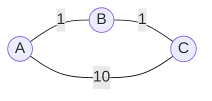

# Single-Source Shortest Path

## Why It Exists

"From here, what's the cheapest way to reach everywhere else?" is the question behind every map app, every routing protocol, every cost-minimising planner. You already have one shortest-path tool — [BFS](/cortex/data-structures-and-algorithms/graphs/traversing-a-graph) — but it measures **hops**, and on a *weighted* graph hops aren't cost: a 2-hop path of cheap edges can beat a 1-hop expensive edge. The right notion of "closest" is **smallest accumulated weight**, not fewest edges.

Two algorithms cover the cases. **Dijkstra** generalises BFS by replacing the queue with a **min-heap keyed by distance**: always expand the closest-so-far node, and (given **non-negative** weights) its distance is final the moment it's popped. **Bellman-Ford** drops the non-negative assumption: it just **relaxes every edge `V−1` times**, which is slower (`O(VE)`) but correct with negative weights — and one extra round detects a **negative cycle** (a loop you can ride to `−∞`). Pick Dijkstra when weights are non-negative; Bellman-Ford when they aren't.

## See It Work

Dijkstra from source 0: a min-heap of `(distance, node)`, popping the closest node and relaxing its neighbours. Run it.

```python run viz=graph viz-kind=graph
import heapq

def dijkstra(graph, src):              # graph[u] = list of (neighbour, weight)
    n = len(graph)
    dist = [float('inf')] * n
    dist[src] = 0
    pq = [(0, src)]                    # min-heap keyed by distance
    while pq:
        d, node = heapq.heappop(pq)
        if d > dist[node]:             # stale pair (a better distance already found)
            continue
        for nb, w in graph[node]:
            if dist[node] + w < dist[nb]:        # relax
                dist[nb] = dist[node] + w
                heapq.heappush(pq, (dist[nb], nb))   # lazy push, no decrease-key
    return [x if x != float('inf') else -1 for x in dist]

# 0:[(1,2),(3,5)] 1:[(4,6)] 2:[(4,1)] 3:[(2,2)] 4:[(3,7)]
graph = [[(1,2),(3,5)], [(4,6)], [(4,1)], [(2,2)], [(3,7)]]
print(dijkstra(graph, 0))     # [0, 2, 7, 5, 8]
```

## How It Works

**Dijkstra** is BFS ordered by weighted distance instead of depth:

1. `dist[src] = 0`, all others `∞`; push `(0, src)` onto a min-heap.
2. Pop the smallest `(d, node)`. For each neighbour `(v, w)`, **relax**: if `dist[node] + w < dist[v]`, update `dist[v]` and push `(dist[v], v)`.
3. When a node is popped, its distance is **final** (under non-negative weights).

Instead of a decrease-key, we **push a new pair** on every improvement; old pairs go stale but are harmless — a stale pop finds `dist[node]` already better and relaxes nothing (`if d > dist[node]: continue`). Cost: `O((V + E) log V)`.

**Bellman-Ford** abandons greed. It relaxes **every** edge, `V−1` times:



<p align="center"><strong>BFS counts hops, so it would call the direct <code>A→C</code> (weight 10) "closer" than <code>A→B→C</code> (weight 2). Shortest path must order by <em>weight</em>, not <em>hops</em>.</strong></p>

A shortest path has at most `V−1` edges, so after round `k` every node reachable in `≤ k` hops has its correct distance; after `V−1` rounds, all of them do. A **V-th round** that still relaxes something proves a **negative cycle** (distances would keep dropping forever). Cost: `O(VE)` — slower than Dijkstra, but it tolerates negative edges and reports negative cycles, which is why distance-vector routing (RIP) uses it.

### Key Takeaway

Weighted shortest path orders by accumulated weight, not hops. **Dijkstra:** min-heap, pop-the-closest, relax; final-on-pop *only with non-negative weights*; `O((V+E) log V)`. **Bellman-Ford:** relax all edges `V−1` times; handles negatives and detects negative cycles (one extra round); `O(VE)`. Non-negative → Dijkstra; negative → Bellman-Ford.

## Trace It

Dijkstra's whole speed comes from one promise: **when you pop a node, its distance is final** — never revisit it. That's why the standard form carries a `visited`/finalized set. Now add a single **negative** edge.

Before you read on: on `0→1 (1), 1→3 (1), 0→2 (4), 2→1 (−4)` (no cycle), the true shortest distance to `3` is **1** (via `0→2→1→3 = 4 − 4 + 1`). Run finalize-on-pop Dijkstra and it reports `dist[3] = 2`. Where does the greedy "final on pop" promise break?

It breaks at node `1`. Dijkstra pops in increasing distance, so it reaches `1` with the cheap direct edge `0→1 = 1` and **finalises `dist[1] = 1`** — then immediately expands `1`, setting `dist[3] = 1 + 1 = 2` and finalising `3` too. Only *later* does it pop node `2` (distance 4) and discover `2→1 = −4`, which would make `dist[1] = 0` and therefore `dist[3] = 1`. But `1` and `3` are already in the finalized set, so the visited check blocks the fix — the answer is stuck at the too-high `dist[3] = 2`. The greedy promise ("nothing reached later can be cheaper") is **only true when every edge is non-negative**: with non-negative weights, any unpopped node already has distance `≥` the one just popped, so adding more (non-negative) edges can't beat it. A **negative** edge violates exactly that — a node popped far away can route *backward* and lower a node you already finalised. (The lazy, no-visited-set variant happens to self-correct here by re-pushing the improved `(0,1)`, but it loses Dijkstra's guarantee and can do exponential work on adversarial graphs — it is *not* a fix.) The real fix is to **change algorithm**: Bellman-Ford makes no finality assumption — it just relaxes every edge `V−1` times, so the `2→1 = −4` improvement propagates to `3` on a later round, yielding the correct `1`. The rule to bank: *negative edge anywhere ⇒ Dijkstra is unsafe, reach for Bellman-Ford.*

## Your Turn

Both algorithms in both languages — Dijkstra for the non-negative graph, Bellman-Ford for the negative one (and its `−1` negative-cycle signal):

```python run viz=graph viz-kind=graph
import heapq

def dijkstra(graph, src):
    n = len(graph); dist = [float('inf')]*n; dist[src] = 0; pq = [(0, src)]
    while pq:
        d, node = heapq.heappop(pq)
        if d > dist[node]: continue
        for nb, w in graph[node]:
            if dist[node] + w < dist[nb]:
                dist[nb] = dist[node] + w; heapq.heappush(pq, (dist[nb], nb))
    return [x if x != float('inf') else -1 for x in dist]

def bellman_ford(graph, src):
    n = len(graph); dist = [float('inf')]*n; dist[src] = 0
    for _ in range(n - 1):                              # V-1 rounds
        for u in range(n):
            for v, w in graph[u]:
                if dist[u] != float('inf') and dist[u] + w < dist[v]:
                    dist[v] = dist[u] + w
    for u in range(n):                                  # extra round → negative cycle?
        for v, w in graph[u]:
            if dist[u] != float('inf') and dist[u] + w < dist[v]:
                return [-1]*n
    return [x if x != float('inf') else -1 for x in dist]

print(dijkstra([[(1,2),(3,5)], [(4,6)], [(4,1)], [(2,2)], [(3,7)]], 0))   # [0, 2, 7, 5, 8]
print(bellman_ford([[(1,4),(2,5)], [(2,-3),(3,6)], [(3,4)], []], 0))       # [0, 4, 1, 5]
print(bellman_ford([[(1,1)], [(2,-3)], [(0,1)]], 0))                       # [-1,-1,-1] cycle
```

```java run viz=graph viz-kind=graph
import java.util.*;
public class Main {
  static int[] bellmanFord(int[][][] g, int src) {
    int n = g.length; int[] dist = new int[n];
    Arrays.fill(dist, Integer.MAX_VALUE); dist[src] = 0;
    for (int i = 0; i < n - 1; i++)
      for (int u = 0; u < n; u++)
        if (dist[u] != Integer.MAX_VALUE)
          for (int[] e : g[u])
            if (dist[u] + e[1] < dist[e[0]]) dist[e[0]] = dist[u] + e[1];
    for (int u = 0; u < n; u++)
      if (dist[u] != Integer.MAX_VALUE)
        for (int[] e : g[u])
          if (dist[u] + e[1] < dist[e[0]]) { Arrays.fill(dist, -1); return dist; }
    for (int i = 0; i < n; i++) if (dist[i] == Integer.MAX_VALUE) dist[i] = -1;
    return dist;
  }
  public static void main(String[] a) {
    int[][][] neg = {{{1,4},{2,5}}, {{2,-3},{3,6}}, {{3,4}}, {}};
    System.out.println(Arrays.toString(bellmanFord(neg, 0)));        // [0, 4, 1, 5]
    int[][][] cyc = {{{1,1}}, {{2,-3}}, {{0,1}}};
    System.out.println(Arrays.toString(bellmanFord(cyc, 0)));        // [-1, -1, -1]
  }
}
```

Then: reconstruct the actual *path* (store a `parent[]` and walk it back); implement **0-1 BFS** (a deque for graphs with weights only 0/1, `O(V+E)`); add an **A\*** heuristic to Dijkstra for goal-directed search; and use **Floyd-Warshall** when you need *all-pairs* distances.

## Reflect & Connect

Shortest path is a family selected by edge weights:

- **Dijkstra vs Bellman-Ford** — Dijkstra is faster (`O((V+E) log V)`) but assumes non-negative weights; Bellman-Ford is slower (`O(VE)`) but handles negatives and *detects negative cycles*. The decision is purely "are any weights negative?" — and Dijkstra fails *silently* (wrong answer, no error) if you ignore it.
- **BFS is Dijkstra with all weights 1** — and Dijkstra is BFS with a priority queue. The progression queue → min-heap, depth → distance, is one idea applied at three weight regimes (unweighted → non-negative → arbitrary). Recognising it means you never memorise three unrelated algorithms.
- **The min-heap is the engine** — Dijkstra is the headline application of the [binary heap](/cortex/data-structures-and-algorithms/trees/heap/what-is-a-heap); the lazy-push-instead-of-decrease-key trick (tolerate stale entries, skip them on pop) is a broadly useful pattern for heap-driven algorithms.
- **In production** — Google/Apple Maps (Dijkstra/A\* over road graphs), OSPF link-state routing (Dijkstra), RIP distance-vector routing (Bellman-Ford, for its cycle awareness), and arbitrage detection in currency graphs (negative cycle ⇔ profit loop, found by Bellman-Ford).

**Prerequisites:** [Traversing a Graph](/cortex/data-structures-and-algorithms/graphs/traversing-a-graph).
**What's next:** when you need the distance between *every* pair of nodes at once — [All-Pairs Shortest Path](/cortex/data-structures-and-algorithms/graphs/all-pairs-shortest-path).

## Recall

> **Mnemonic:** *Order by WEIGHT, not hops. Dijkstra = BFS + min-heap; pop-the-closest is final ONLY if weights ≥ 0; O((V+E)log V). Bellman-Ford = relax all edges V−1 times; handles negatives; V-th round still relaxing ⇒ negative cycle; O(VE). Negative edge ⇒ Bellman-Ford.*

| | |
|---|---|
| Dijkstra core | min-heap of `(dist, node)`; pop closest, relax neighbours |
| Dijkstra requires | **non-negative** weights (final-on-pop) |
| Dijkstra cost | `O((V + E) log V)` |
| Bellman-Ford core | relax every edge, `V−1` rounds |
| Negative cycle | a `V`-th round still relaxes ⇒ cycle (distance `−∞`) |
| Bellman-Ford cost | `O(VE)` |

<details>
<summary><strong>Q:</strong> Why doesn't BFS solve weighted shortest path?</summary>

**A:** BFS orders by hop count; a many-hop cheap path can beat a one-hop expensive edge, so you must order by accumulated weight (a min-heap), not depth.

</details>
<details>
<summary><strong>Q:</strong> What does Dijkstra assume, and what breaks without it?</summary>

**A:** Non-negative weights; the "distance is final when popped" invariant fails when a negative edge lets a later, longer path arrive cheaper.

</details>
<details>
<summary><strong>Q:</strong> Why does Bellman-Ford run `V−1` rounds?</summary>

**A:** A shortest path has at most `V−1` edges; each round settles one more hop of distance, so `V−1` rounds settle all shortest paths.

</details>
<details>
<summary><strong>Q:</strong> How does Bellman-Ford detect a negative cycle?</summary>

**A:** Run one extra (`V`-th) round; if any edge still relaxes, distances can decrease forever — a negative cycle exists.

</details>
<details>
<summary><strong>Q:</strong> Dijkstra vs Bellman-Ford — when each?</summary>

**A:** Non-negative weights → Dijkstra (`O((V+E)log V)`); any negative weight → Bellman-Ford (`O(VE)`, plus cycle detection).

</details>

## Sources & Verify

- **CLRS**, *Introduction to Algorithms*, 4th ed., §22 — Single-Source Shortest Paths (Dijkstra §22.3, Bellman-Ford §22.1, the relaxation framework and proofs).
- **Sedgewick & Wayne**, *Algorithms*, 4th ed., §4.4 — shortest paths, the lazy/eager Dijkstra variants.
- All runnable blocks are verified by running (Dijkstra ⇒ `[0,2,7,5,8]`; Bellman-Ford on a negative-edge DAG ⇒ `[0,4,1,5]`, and on `0→1→2→0` (cycle sum −1) ⇒ all `−1`). The Trace-It counterexample is verified: finalize-on-pop Dijkstra returns `dist[3]=2` on `0→1(1),1→3(1),0→2(4),2→1(−4)` where the true distance is `1`, while Bellman-Ford returns `1`.
