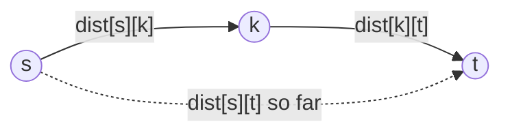

# All-Pairs Shortest Path

## Why It Exists

[Single-source shortest path](/cortex/data-structures-and-algorithms/graphs-single-source-shortest-path) answers "cheapest route from *one* node." But routing tables, network-latency analyses, and "closest facility" queries want the distance between **every** pair of nodes at once.

The obvious approach — run Dijkstra `N` times, once per source — costs `O(N·(N+E) log N)` and only works with non-negative weights (negatives force `N` Bellman-Fords at `O(N²E)`). **Floyd-Warshall** does it in a clean `O(N³)` with a *four-line* triple loop: it handles negative edges (just not negative cycles), has tiny constant factors (integer add + compare, cache-friendly over a matrix), and is trivial to memorise. For dense graphs it beats N-Dijkstras by a `log N` factor; below ~10⁴ nodes its simplicity wins regardless. It's one of the most elegant dynamic programs you'll meet.

## See It Work

Floyd-Warshall on a 5-node weighted graph: build a distance matrix, then relax through every intermediate. The result is the full all-pairs matrix (`-1` = unreachable). Run it.

```python run viz=graph viz-kind=graph
INF = float('inf')

def floyd_warshall(graph):                  # graph[u] = list of (neighbour, weight)
    n = len(graph)
    dist = [[INF] * n for _ in range(n)]
    for u in range(n):
        dist[u][u] = 0                       # distance to self
        for v, w in graph[u]:
            dist[u][v] = w                   # direct edges
    for k in range(n):                       # intermediate vertex — OUTERMOST loop
        for i in range(n):
            for j in range(n):
                if dist[i][k] + dist[k][j] < dist[i][j]:
                    dist[i][j] = dist[i][k] + dist[k][j]
    return [[x if x != INF else -1 for x in row] for row in dist]

graph = [[(1,2),(3,5)], [(4,6)], [(4,1)], [(2,2)], [(3,7)]]
for row in floyd_warshall(graph):
    print(row)
# [0, 2, 7, 5, 8] / [-1, 0, 15, 13, 6] / [-1, -1, 0, 8, 1] / [-1, -1, 2, 0, 3] / [-1, -1, 9, 7, 0]
```

## How It Works

Floyd-Warshall is **dynamic programming over intermediate vertices**. The state:

> `dist[s][t]` = shortest path from `s` to `t` that uses **only nodes `0 … k` as intermediates**.

Iterate `k = 0, 1, …, N−1`, each step *adding one more node* to the set of allowed intermediates. For every pair `(s, t)`, ask: *is routing through `k` cheaper than what I have?*



<p align="center"><strong>for each pair <code>(s, t)</code> and each intermediate <code>k</code>: is <code>s→k→t</code> cheaper than the current <code>s→t</code>?</strong></p>

```
dist[s][t] = min( dist[s][t],  dist[s][k] + dist[k][t] )
```

**Why it's correct:** take any shortest path `s → t`; let `k_max` be its highest-numbered intermediate. When the outer loop reaches `k = k_max`, both `dist[s][k_max]` and `dist[k_max][t]` are already correct (they use only intermediates `< k_max`), so the min-check captures that exact path. Across all `k`, every path's `k_max` is considered. **Three nested loops, four-line body, `O(N³)` time, `O(N²)` space** — handles negative edges; a negative entry on the diagonal (`dist[i][i] < 0`) signals a negative cycle.

### Key Takeaway

Floyd-Warshall computes all-pairs shortest paths as a DP: `dist[s][t]` using only nodes `0…k` as intermediates, with `dist[s][t] = min(dist[s][t], dist[s][k] + dist[k][t])`. The **`k` loop must be outermost** (it's the DP dimension). `O(N³)`/`O(N²)`, handles negatives, the cleanest dense-graph all-pairs solution.

## Trace It

Everything hinges on loop order: `k` (intermediate) outermost, then `s`, then `t`. It's tempting to treat the three loops as interchangeable — they're all `0…N−1`.

Before you read on: swap `k` to be the **innermost** loop (`for i: for j: for k:`) and run it on the graph `0→1(3), 0→3(7), 1→2(1), 2→3(2), 3→0(6)`. The cell `dist[1][0]` comes out as **−1 (unreachable)** instead of the true **9**. Why does the order matter, when each cell's update rule is identical?

Because `k` isn't just a loop variable — it's the **DP dimension**, and the recurrence reads values *from the previous `k`-level*. The invariant is "after the `k`-th outer pass, `dist[s][t]` is correct using intermediates `0…k`." With `k` outermost, by the time you use `dist[s][k]` and `dist[k][t]`, both were finalised in earlier passes — they're already shortest paths through lower-numbered intermediates, exactly what the proof needs. Move `k` innermost and you destroy that staging: now you fully resolve one `(i, j)` cell before moving to the next, so when you compute `dist[1][0]` you scan `k = 0…3` looking for `1→k→0` — but the path is `1→2→3→0`, which needs `dist[1][3]` as a stepping stone, and **`dist[1][3]` hasn't been computed yet** (it's filled during the *later* `(i=1, j=3)` cell). So the two-hop-via-an-unfinished-cell route is invisible, and `dist[1][0]` is left at `−1` — the algorithm wrongly reports node 0 unreachable from node 1. The fix isn't more iterations; it's the *order*: `k` outermost stages the intermediates so every value you read is already final. (A useful tell: Floyd-Warshall's correctness proof is *about* `k`, so `k` must be the loop the proof inducts over — the outer one.)

## Your Turn

Floyd-Warshall in both languages (`-1` = unreachable):

```python run viz=graph viz-kind=graph
INF = float('inf')

def floyd_warshall(graph):
    n = len(graph)
    dist = [[INF]*n for _ in range(n)]
    for u in range(n):
        dist[u][u] = 0
        for v, w in graph[u]: dist[u][v] = w
    for k in range(n):
        for i in range(n):
            for j in range(n):
                if dist[i][k] + dist[k][j] < dist[i][j]:
                    dist[i][j] = dist[i][k] + dist[k][j]
    return [[x if x != INF else -1 for x in row] for row in dist]

# 0→1(3), 0→3(7), 1→2(1), 2→3(2), 3→0(6)
print(floyd_warshall([[(1,3),(3,7)], [(2,1)], [(3,2)], [(0,6)]]))
# [[0,3,4,6],[9,0,1,3],[8,11,0,2],[6,9,10,0]]
```

```java run viz=graph viz-kind=graph
import java.util.*;
public class Main {
  static final int INF = Integer.MAX_VALUE / 2;     // /2 avoids overflow on add
  static int[][] floydWarshall(int[][][] graph) {
    int n = graph.length;
    int[][] dist = new int[n][n];
    for (int[] row : dist) Arrays.fill(row, INF);
    for (int u = 0; u < n; u++) {
      dist[u][u] = 0;
      for (int[] e : graph[u]) dist[u][e[0]] = e[1];
    }
    for (int k = 0; k < n; k++)
      for (int i = 0; i < n; i++)
        for (int j = 0; j < n; j++)
          if (dist[i][k] + dist[k][j] < dist[i][j])
            dist[i][j] = dist[i][k] + dist[k][j];
    for (int[] row : dist) for (int j = 0; j < n; j++) if (row[j] >= INF) row[j] = -1;
    return dist;
  }
  public static void main(String[] a) {
    int[][][] g = {{{1,3},{3,7}}, {{2,1}}, {{3,2}}, {{0,6}}};
    System.out.println(Arrays.deepToString(floydWarshall(g)));
    // [[0, 3, 4, 6], [9, 0, 1, 3], [8, 11, 0, 2], [6, 9, 10, 0]]
  }
}
```

Then: detect a **negative cycle** (any `dist[i][i] < 0` after the loops); compute the **transitive closure** (boolean FW: `reach[i][j] |= reach[i][k] && reach[k][j]`); reconstruct paths with a `next[][]` matrix; and benchmark FW vs `N`×Dijkstra on a sparse vs dense graph.

## Reflect & Connect

Floyd-Warshall is the all-pairs workhorse and a model dynamic program:

- **Which all-pairs strategy?** — Dense graph or negative edges → **Floyd-Warshall** (`O(N³)`, simple, cache-friendly). Sparse, non-negative, large `N` → **`N`×Dijkstra** (`O(N(N+E) log N)`, wins asymptotically when `E ≪ N²`). Sparse with negatives → Johnson's algorithm (reweight + `N`×Dijkstra). The decision is density × sign of weights.
- **It's the canonical "DP over a third dimension"** — the trick of adding one resource at a time (here, one allowed intermediate per outer pass) recurs across DP: knapsack adds one item, edit distance adds one prefix character, interval DP adds one split point. Recognise "stage the subproblems so each read is already final" and the loop order is forced.
- **The matrix representation finally pays off** — Floyd-Warshall lives on `dist[i][k]`/`dist[k][j]` `O(1)` lookups, exactly what the [adjacency matrix](/cortex/data-structures-and-algorithms/graphs-adjacency-matrix-representation) was built for. The one major algorithm where the matrix beats the list.
- **In production** — small-network routing tables, all-pairs latency/throughput matrices, "closest depot/server" precomputation, and graph-analysis (transitive closure, reachability) over dense relationship graphs.

**Prerequisites:** [Single-Source Shortest Path](/cortex/data-structures-and-algorithms/graphs-single-source-shortest-path).
**What's next:** networks where edges have *capacities* and you want maximum throughput — [Max-Flow / Min-Cut](/cortex/data-structures-and-algorithms/graphs-max-flow-min-cut-theorem).

## Recall

> **Mnemonic:** *All pairs = DP over intermediates. `dist[i][j] = min(dist[i][j], dist[i][k] + dist[k][j])`, with `k` OUTERMOST (it's the DP dimension — wrong order silently breaks it). O(N³)/O(N²); handles negative edges; `dist[i][i] < 0` ⇒ negative cycle.*

| | |
|---|---|
| State | `dist[s][t]` using only intermediates `0…k` |
| Recurrence | `min(dist[s][t], dist[s][k] + dist[k][t])` |
| Loop order | **`k` outermost**, then `s`, then `t` |
| Complexity | `O(N³)` time, `O(N²)` space |
| Negatives | edges OK; `dist[i][i] < 0` after = negative cycle |
| Use when | dense graph, negative edges, or `N ≲ 10⁴` |

<details>
<summary><strong>Q:</strong> What does Floyd-Warshall compute, and at what cost?</summary>

**A:** Shortest distance between *all* pairs of nodes, in `O(N³)` time / `O(N²)` space.

</details>
<details>
<summary><strong>Q:</strong> What's the DP state and recurrence?</summary>

**A:** `dist[s][t]` using only nodes `0…k` as intermediates; `dist[s][t] = min(dist[s][t], dist[s][k] + dist[k][t])`.

</details>
<details>
<summary><strong>Q:</strong> Why must the `k` loop be outermost?</summary>

**A:** `k` is the DP dimension; outermost ordering guarantees `dist[s][k]` and `dist[k][t]` are already final for intermediates `< k` when read — inner-`k` reads not-yet-computed cells and silently produces wrong answers.

</details>
<details>
<summary><strong>Q:</strong> Floyd-Warshall vs `N`×Dijkstra?</summary>

**A:** FW (`O(N³)`) wins on dense graphs / negatives / small `N`; `N`×Dijkstra (`O(N(N+E)log N)`) wins on large sparse non-negative graphs.

</details>
<details>
<summary><strong>Q:</strong> How does it detect a negative cycle?</summary>

**A:** After the loops, any `dist[i][i] < 0` means a cycle through `i` with negative total weight.

</details>

## Sources & Verify

- **CLRS**, *Introduction to Algorithms*, 4th ed., §23 — All-Pairs Shortest Paths (Floyd-Warshall §23.2, the DP formulation and proof; Johnson's §23.3).
- **Sedgewick & Wayne**, *Algorithms*, 4th ed., §4.4 — shortest paths and the all-pairs problem.
- Both runnable blocks are verified by running (5-node graph ⇒ the full matrix with first row `[0,2,7,5,8]`; the 4-node graph ⇒ `[[0,3,4,6],[9,0,1,3],[8,11,0,2],[6,9,10,0]]`). The Trace-It claim is verified: moving `k` to the innermost loop yields `dist[1][0] = −1` instead of the correct `9`.
