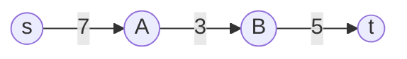

# Max-Flow / Min-Cut Theorem

## Why It Exists

Given a network of pipes with capacities — water, traffic, data, shipped goods — what's the **most** you can push from a source `s` to a sink `t`? This **maximum flow** problem models throughput everywhere: bandwidth through a network, cargo through a logistics graph, even (as the next lesson shows) matching people to jobs.

The answer is governed by one of the most elegant results in graph theory, the **max-flow / min-cut theorem**: the maximum flow equals the capacity of the **minimum cut** — the cheapest set of edges whose removal disconnects `s` from `t`. *The most you can push is exactly limited by your weakest wall.* The algorithm that finds it, **Ford-Fulkerson**, is greedy with a twist: it repeatedly pushes flow along *any* path with spare capacity, and a clever **reverse-edge** trick lets it walk back bad early decisions — so "pick any path" still converges to the optimum.

## See It Work

A small network, source 0 → sink 3. Ford-Fulkerson pushes flow along augmenting paths until none remain; the total is the max flow. The input is a weighted adjacency list `graph[u] = [[neighbour, capacity], ...]`, plus source and sink integers.

```python run viz=graph viz-kind=graph
import ast

def parseWeightedAdj(line):
    return ast.literal_eval(line)

def max_flow(graph, source, sink):          # graph[u] = list of [neighbour, capacity]
    n = len(graph)
    res = [[0]*n for _ in range(n)]          # residual capacity matrix
    for u in range(n):
        for v, c in graph[u]:
            res[u][v] = c
    def find_path(node, seen, path):         # DFS for an augmenting path (positive residual)
        seen.add(node); path.append(node)
        if node == sink: return True
        for nb in range(n):
            if nb not in seen and res[node][nb] > 0 and find_path(nb, seen, path):
                return True
        path.pop(); return False
    total = 0
    while True:
        seen, path = set(), []
        if not find_path(source, seen, path):
            break                            # no augmenting path ⇒ flow is maximum
        bottleneck = min(res[path[i]][path[i+1]] for i in range(len(path)-1))
        for i in range(len(path)-1):
            u, v = path[i], path[i+1]
            res[u][v] -= bottleneck           # forward edge loses capacity
            res[v][u] += bottleneck           # reverse edge gains it (the "undo" lane)
        total += bottleneck
    return total

graph = parseWeightedAdj(input())
source = int(input())
sink   = int(input())
print(max_flow(graph, source, sink))
```

```java run viz=graph viz-kind=graph
import java.util.*;

public class Main {
  static int n;
  static boolean findPath(int[][] res, int node, int sink, boolean[] seen, List<Integer> path) {
    seen[node] = true; path.add(node);
    if (node == sink) return true;
    for (int nb = 0; nb < n; nb++)
      if (!seen[nb] && res[node][nb] > 0 && findPath(res, nb, sink, seen, path)) return true;
    path.remove(path.size() - 1); return false;
  }
  static int maxFlow(int[][][] graph, int source, int sink) {
    n = graph.length;
    int[][] res = new int[n][n];
    for (int u = 0; u < n; u++) for (int[] e : graph[u]) res[u][e[0]] = e[1];
    int total = 0;
    while (true) {
      boolean[] seen = new boolean[n]; List<Integer> path = new ArrayList<>();
      if (!findPath(res, source, sink, seen, path)) break;
      int b = Integer.MAX_VALUE;
      for (int i = 0; i < path.size()-1; i++) b = Math.min(b, res[path.get(i)][path.get(i+1)]);
      for (int i = 0; i < path.size()-1; i++) {
        int u = path.get(i), v = path.get(i+1);
        res[u][v] -= b; res[v][u] += b;
      }
      total += b;
    }
    return total;
  }
  static int[][][] parseWeightedAdj(String line) {
    List<int[][]> g = new ArrayList<>();
    int i = 0, len = line.length();
    while (i < len && line.charAt(i) != '[') i++;
    i++;
    while (i < len) {
      while (i < len && (line.charAt(i) == ' ' || line.charAt(i) == ',')) i++;
      if (i >= len || line.charAt(i) == ']') break;
      i++;
      List<int[]> node = new ArrayList<>();
      while (i < len) {
        while (i < len && (line.charAt(i) == ' ' || line.charAt(i) == ',')) i++;
        if (line.charAt(i) == ']') { i++; break; }
        i++;
        int[] pair = new int[2]; int k = 0;
        while (i < len && line.charAt(i) != ']') {
          while (i < len && (line.charAt(i) == ' ' || line.charAt(i) == ',')) i++;
          if (line.charAt(i) == ']') break;
          int start = i;
          while (i < len && (Character.isDigit(line.charAt(i)) || line.charAt(i) == '-')) i++;
          pair[k++] = Integer.parseInt(line.substring(start, i));
        }
        i++;
        node.add(pair);
      }
      g.add(node.toArray(new int[0][]));
    }
    return g.toArray(new int[0][][]);
  }
  public static void main(String[] args) {
    Scanner sc = new Scanner(System.in);
    int[][][] graph = parseWeightedAdj(sc.nextLine());
    int source = Integer.parseInt(sc.nextLine().trim());
    int sink   = Integer.parseInt(sc.nextLine().trim());
    System.out.println(maxFlow(graph, source, sink));
  }
}
```

```testcases
{
  "args": [
    { "id": "graph",  "label": "graph (weighted adj)",  "type": "string", "placeholder": "[[[1,3],[2,4]],[[3,2]],[[3,3]],[]]" },
    { "id": "source", "label": "source", "type": "int", "placeholder": "0" },
    { "id": "sink",   "label": "sink",   "type": "int", "placeholder": "3" }
  ],
  "cases": [
    { "args": { "graph": "[[[1,3],[2,4]],[[3,2]],[[3,3]],[]]", "source": "0", "sink": "3" }, "expected": "5" },
    { "args": { "graph": "[[[1,5]],[[2,5]],[]]", "source": "0", "sink": "2" }, "expected": "5" },
    { "args": { "graph": "[[[1,3],[2,2]],[[3,3]],[[3,2]],[]]", "source": "0", "sink": "3" }, "expected": "5" }
  ]
}
```

## How It Works

Three pieces of vocabulary, then the theorem:

- **Residual graph** — each edge's *remaining* capacity. Push flow `f` along `u→v`: the forward edge drops by `f`, and a **reverse edge** `v→u` *gains* `f`.
- **Augmenting path** — any `s → t` path in the residual graph with positive capacity on every edge. You can push its **bottleneck** (minimum residual) units along it.
- **Cut `(S, T)`** — a partition with `s ∈ S`, `t ∈ T`; its capacity is the sum of capacities of edges crossing `S → T`. Every cut is a "wall" the flow must cross.



<p align="center"><strong>an augmenting path with residuals 7, 3, 5: the bottleneck is 3, so 3 units can be pushed (saturating <code>A→B</code>).</strong></p>

> **Max-flow / min-cut theorem:** maximum `s→t` flow = minimum cut capacity.

The `≤` half is obvious (all flow must cross every cut, so it can't exceed the smallest one). The `≥` half is the gem: when no augmenting path remains, let `S` = nodes reachable from `s` in the residual graph; every `S→T` edge must be **saturated** (else `T` would be reachable), so the flow already equals that cut's capacity. The corollary drives every algorithm: **a flow is maximum iff its residual graph has no augmenting path.** That's **Ford-Fulkerson** — find an augmenting path (DFS = "any path"; BFS = the **Edmonds-Karp** specialisation, `O(VE²)`), push the bottleneck, update residuals (forward − f, reverse + f), repeat until stuck.

### Key Takeaway

Max flow = min cut: throughput is capped by the cheapest disconnecting wall. Ford-Fulkerson repeatedly pushes the bottleneck of *any* augmenting path in the residual graph and stops when none remain. The reverse edge created on each push (`v→u += f`) is what lets later paths reroute around earlier mistakes, making "pick any path" provably optimal.

## Trace It

Ford-Fulkerson lets you pick **any** augmenting path each round — DFS, BFS, whatever finds an `s→t` path with spare capacity. That should feel dangerous: a greedy that commits to a *bad* path early ought to get stuck at a wrong answer.

Before you read on: take `s→A (10), s→B (10), A→B (1), A→t (10), B→t (10)` — true max flow is **20**. Suppose the first path found is `s→A→B→t`, pushing 1 unit through the skinny `A→B` edge — a wasteful choice that "uses up" the wrong edge. How does Ford-Fulkerson still reach 20 instead of getting stuck?

The **reverse edge** rescues it. When 1 unit is pushed along `s→A→B→t`, the residual graph gains a reverse edge `B→A` with capacity 1 — a lane that represents "you may *cancel* up to 1 unit of the `A→B` flow." Later, the algorithm finds the augmenting path `s → B → A → t`, which traverses that reverse `B→A` edge. Pushing 1 unit along it **cancels** the original `A→B` flow (the forward `A→B` residual goes back up, the bad commitment is undone) while effectively re-routing as `s→B→…` and `…→A→t`. From there `s→A→t` (push 9) and `s→B→t` (push 9 more) finish the job, and the total reaches **20** (verified). This is the whole reason Ford-Fulkerson is a *method*, not a fragile heuristic: the reverse edge makes every push **reversible**, so no early choice is permanent — any augmenting path you pick can be partially un-done by a future path. Without reverse edges you'd be stuck at the greedy answer (here, far below 20) and would need to be clever about path order; *with* them, correctness is guaranteed regardless of order. (The cost of that freedom: a pathological capacity/path choice can make plain Ford-Fulkerson slow — which is exactly why Edmonds-Karp pins down "shortest augmenting path via BFS" to bound it at `O(VE²)`.)

## Your Turn

Implement Ford-Fulkerson max-flow. The input is a weighted adjacency list, a source, and a sink; output the integer maximum flow value.

```python run viz=graph viz-kind=graph
import ast

def max_flow(graph, source, sink):
    # Your code goes here
    pass

graph  = ast.literal_eval(input())
source = int(input())
sink   = int(input())
print(max_flow(graph, source, sink))
```

```java run viz=graph viz-kind=graph
import java.util.*;

public class Main {
  static int n;
  static int[][][] parseWeightedAdj(String line) {
    List<int[][]> g = new ArrayList<>();
    int i = 0, len = line.length();
    while (i < len && line.charAt(i) != '[') i++;
    i++;
    while (i < len) {
      while (i < len && (line.charAt(i) == ' ' || line.charAt(i) == ',')) i++;
      if (i >= len || line.charAt(i) == ']') break;
      i++;
      List<int[]> node = new ArrayList<>();
      while (i < len) {
        while (i < len && (line.charAt(i) == ' ' || line.charAt(i) == ',')) i++;
        if (line.charAt(i) == ']') { i++; break; }
        i++;
        int[] pair = new int[2]; int k = 0;
        while (i < len && line.charAt(i) != ']') {
          while (i < len && (line.charAt(i) == ' ' || line.charAt(i) == ',')) i++;
          if (line.charAt(i) == ']') break;
          int start = i;
          while (i < len && (Character.isDigit(line.charAt(i)) || line.charAt(i) == '-')) i++;
          pair[k++] = Integer.parseInt(line.substring(start, i));
        }
        i++;
        node.add(pair);
      }
      g.add(node.toArray(new int[0][]));
    }
    return g.toArray(new int[0][][]);
  }
  static int maxFlow(int[][][] graph, int source, int sink) {
    // Your code goes here
    return 0;
  }
  public static void main(String[] args) {
    Scanner sc = new Scanner(System.in);
    int[][][] graph = parseWeightedAdj(sc.nextLine());
    int source = Integer.parseInt(sc.nextLine().trim());
    int sink   = Integer.parseInt(sc.nextLine().trim());
    System.out.println(maxFlow(graph, source, sink));
  }
}
```

```testcases
{
  "args": [
    { "id": "graph",  "label": "graph (weighted adj)",  "type": "string", "placeholder": "[[[1,8],[2,10]],[],[[3,3]],[[1,2]]]" },
    { "id": "source", "label": "source", "type": "int", "placeholder": "0" },
    { "id": "sink",   "label": "sink",   "type": "int", "placeholder": "1" }
  ],
  "cases": [
    { "args": { "graph": "[[[1,8],[2,10]],[],[[3,3]],[[1,2]]]", "source": "0", "sink": "1" }, "expected": "10" },
    { "args": { "graph": "[[[1,10],[2,10]],[[2,1],[3,10]],[[3,10]],[]]", "source": "0", "sink": "3" }, "expected": "20" },
    { "args": { "graph": "[[[1,3],[2,4]],[[3,2]],[[3,3]],[]]", "source": "0", "sink": "3" }, "expected": "5" }
  ]
}
```

<details>
<summary>Editorial</summary>

```python solution time=O(V·E·maxflow) space=O(V²)
import ast

def max_flow(graph, source, sink):
    n = len(graph)
    res = [[0]*n for _ in range(n)]
    for u in range(n):
        for v, c in graph[u]: res[u][v] = c
    def find(node, seen, path):
        seen.add(node); path.append(node)
        if node == sink: return True
        for nb in range(n):
            if nb not in seen and res[node][nb] > 0 and find(nb, seen, path): return True
        path.pop(); return False
    total = 0
    while True:
        seen, path = set(), []
        if not find(source, seen, path): break
        b = min(res[path[i]][path[i+1]] for i in range(len(path)-1))
        for i in range(len(path)-1):
            u, v = path[i], path[i+1]
            res[u][v] -= b; res[v][u] += b
        total += b
    return total

graph  = ast.literal_eval(input())
source = int(input())
sink   = int(input())
print(max_flow(graph, source, sink))
```

```java solution time=O(V·E·maxflow) space=O(V²)
import java.util.*;

public class Main {
  static int n;
  static boolean find(int[][] res, int node, int sink, boolean[] seen, List<Integer> path) {
    seen[node] = true; path.add(node);
    if (node == sink) return true;
    for (int nb = 0; nb < n; nb++)
      if (!seen[nb] && res[node][nb] > 0 && find(res, nb, sink, seen, path)) return true;
    path.remove(path.size() - 1); return false;
  }
  static int maxFlow(int[][][] graph, int source, int sink) {
    n = graph.length;
    int[][] res = new int[n][n];
    for (int u = 0; u < n; u++) for (int[] e : graph[u]) res[u][e[0]] = e[1];
    int total = 0;
    while (true) {
      boolean[] seen = new boolean[n]; List<Integer> path = new ArrayList<>();
      if (!find(res, source, sink, seen, path)) break;
      int b = Integer.MAX_VALUE;
      for (int i = 0; i < path.size()-1; i++) b = Math.min(b, res[path.get(i)][path.get(i+1)]);
      for (int i = 0; i < path.size()-1; i++) {
        int u = path.get(i), v = path.get(i+1);
        res[u][v] -= b; res[v][u] += b;
      }
      total += b;
    }
    return total;
  }
  static int[][][] parseWeightedAdj(String line) {
    List<int[][]> g = new ArrayList<>();
    int i = 0, len = line.length();
    while (i < len && line.charAt(i) != '[') i++;
    i++;
    while (i < len) {
      while (i < len && (line.charAt(i) == ' ' || line.charAt(i) == ',')) i++;
      if (i >= len || line.charAt(i) == ']') break;
      i++;
      List<int[]> node = new ArrayList<>();
      while (i < len) {
        while (i < len && (line.charAt(i) == ' ' || line.charAt(i) == ',')) i++;
        if (line.charAt(i) == ']') { i++; break; }
        i++;
        int[] pair = new int[2]; int k = 0;
        while (i < len && line.charAt(i) != ']') {
          while (i < len && (line.charAt(i) == ' ' || line.charAt(i) == ',')) i++;
          if (line.charAt(i) == ']') break;
          int start = i;
          while (i < len && (Character.isDigit(line.charAt(i)) || line.charAt(i) == '-')) i++;
          pair[k++] = Integer.parseInt(line.substring(start, i));
        }
        i++;
        node.add(pair);
      }
      g.add(node.toArray(new int[0][]));
    }
    return g.toArray(new int[0][][]);
  }
  public static void main(String[] args) {
    Scanner sc = new Scanner(System.in);
    int[][][] graph = parseWeightedAdj(sc.nextLine());
    int source = Integer.parseInt(sc.nextLine().trim());
    int sink   = Integer.parseInt(sc.nextLine().trim());
    System.out.println(maxFlow(graph, source, sink));
  }
}
```

</details>

Then: use **BFS** for the augmenting path (Edmonds-Karp, `O(VE²)`); recover the **min cut** (the saturated `S→T` edges, where `S` = nodes reachable from `s` in the final residual graph); and model **edge-disjoint paths** as max flow with all capacities 1.

## Reflect & Connect

Max-flow / min-cut is a master key that unlocks problems that don't look like flow at all:

- **Bipartite matching IS max flow** — add a super-source to all left nodes and a super-sink from all right nodes, every edge capacity 1; the max flow equals the maximum matching. That's the [next lesson](/cortex/data-structures-and-algorithms/graphs/maximum-bipartite-matching), and it's the canonical "reduce your problem to max flow" move.
- **The theorem reframes optimisation as separation** — "maximise throughput" (flow) and "find the cheapest bottleneck" (cut) are the *same* number. This flow/cut duality powers image segmentation (min cut separates foreground/background), project selection, and baseball elimination — wildly different problems, all solved by one max-flow call.
- **Reverse edges = reversible greed** — the residual-edge "undo" lane is a reusable idea: let a greedy algorithm record enough state to cancel a choice, and "pick anything" becomes provably optimal. It's why Ford-Fulkerson is a *method* you can specialise (Edmonds-Karp's BFS, Dinic's blocking flows) rather than a single brittle algorithm.
- **Integrality** — with integer capacities, max flow is an integer and Ford-Fulkerson produces an integer flow. That's what makes the unit-capacity matching reduction give a clean 0/1 answer.

**Prerequisites:** [Traversing a Graph](/cortex/data-structures-and-algorithms/graphs/traversing-a-graph).
**What's next:** the headline application — match every left node to a right node, as a unit-capacity max flow — [Maximum Bipartite Matching](/cortex/data-structures-and-algorithms/graphs/maximum-bipartite-matching).

## Recall

> **Mnemonic:** *Max flow = min cut (weakest wall caps throughput). Ford-Fulkerson: while an augmenting path exists in the residual graph, push its bottleneck; on each push, forward −f and reverse +f. The reverse edge undoes bad choices ⇒ any path order is optimal. BFS-path = Edmonds-Karp, O(VE²).*

| | |
|---|---|
| Residual graph | remaining capacity; push `f` ⇒ forward `−f`, reverse `+f` |
| Augmenting path | `s→t` path with positive residual; push the bottleneck |
| Cut `(S,T)` | `s∈S, t∈T`; capacity = sum of crossing `S→T` edges |
| Theorem | max flow = min cut capacity |
| Stop condition | no augmenting path ⇔ flow is maximum |
| Edmonds-Karp | BFS augmenting paths ⇒ `O(VE²)` |

<details>
<summary><strong>Q:</strong> What does the max-flow / min-cut theorem state?</summary>

**A:** The maximum `s→t` flow equals the minimum capacity of any cut separating `s` from `t`.

</details>
<details>
<summary><strong>Q:</strong> What is an augmenting path and how much do you push along it?</summary>

**A:** An `s→t` path in the residual graph with positive capacity everywhere; you push its bottleneck (minimum residual edge).

</details>
<details>
<summary><strong>Q:</strong> Why does Ford-Fulkerson need reverse edges?</summary>

**A:** They let later augmenting paths cancel/reroute earlier flow, so picking *any* path each round still converges to the optimum.

</details>
<details>
<summary><strong>Q:</strong> When does Ford-Fulkerson stop, and why is that correct?</summary>

**A:** When no augmenting path remains; by the theorem, that flow equals the min cut, hence is maximum.

</details>
<details>
<summary><strong>Q:</strong> What is Edmonds-Karp?</summary>

**A:** Ford-Fulkerson that always picks the *shortest* augmenting path (BFS), giving an `O(VE²)` bound independent of capacities.

</details>

## Sources & Verify

- **CLRS**, *Introduction to Algorithms*, 4th ed., §24 — Maximum Flow (Ford-Fulkerson, the max-flow/min-cut theorem and proof, Edmonds-Karp).
- **Sedgewick & Wayne**, *Algorithms*, 4th ed., §6 — maxflow/mincut and the augmenting-path method.
- Both runnable blocks are verified by running (`s→A→t / s→B→t` network ⇒ max flow 5; direct-plus-detour ⇒ 10; the reverse-edge graph `s→A→B→t` ⇒ **20**, confirming the bad first path is undone). The min cut of the See-It graph is `{s,A,B}|{t}` = `2 + 3 = 5`, matching the flow.
