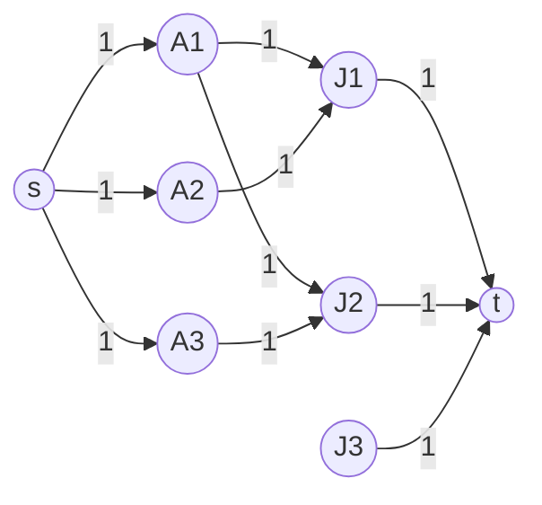

# Maximum Bipartite Matching

## Why It Exists

The **assignment problem** is everywhere: match applicants to jobs they're qualified for, students to schools, taxis to riders, interview slots to candidates — pairing across **two groups** (a *bipartite* graph: left set `L`, right set `R`, edges only crossing between them). A **matching** is a set of edges with **no shared endpoint** — nobody gets two jobs, no job gets two people — and you want the **maximum** number of such pairs.

Greedy fails: grab the first available pairing for each left node and you can paint yourself into a corner (match `A1→J1`, then `A2` — who only wants `J1` — is stuck, even though a different assignment pairs everyone). The fix is a beautiful **reduction**: turn the bipartite graph into a flow network — a super-source feeding every left node, every right node feeding a super-sink, all capacities 1 — and run [max-flow](/cortex/data-structures-and-algorithms/graphs-max-flow-min-cut-theorem). The maximum flow *equals* the maximum matching, and Ford-Fulkerson's reverse edges become the "unmatch and rematch" move that escapes the greedy trap.

## See It Work

A bipartite graph (applicants `0–3` ↔ jobs `4–7`). Build the flow network — source→L, R→sink, all capacities 1 — and the max flow is the max matching. Run it.

```python run viz=graph viz-kind=graph
import sys

def max_flow(graph, source, sink):           # Ford-Fulkerson over a residual matrix
    n = len(graph)
    res = [[0]*n for _ in range(n)]
    for u in range(n):
        for v, c in graph[u]: res[u][v] = c
    def dfs(node, seen, path):
        seen.add(node); path.append(node)
        if node == sink: return True
        for nb in range(n):
            if nb not in seen and res[node][nb] > 0 and dfs(nb, seen, path): return True
        path.pop(); return False
    total = 0
    while True:
        seen, path = set(), []
        if not dfs(source, seen, path): break
        b = min(res[path[i]][path[i+1]] for i in range(len(path)-1))
        for i in range(len(path)-1):
            u, v = path[i], path[i+1]; res[u][v] -= b; res[v][u] += b
        total += b
    return total

def bipartite_matching(graph, left, right):
    fg = [[] for _ in range(len(graph))]
    for u in range(len(graph)):
        for v in graph[u]: fg[u].append((v, 1))   # every L→R edge, capacity 1
    source = len(fg); fg.append([])
    for u in left:  fg[source].append((u, 1))      # source → each left node, cap 1
    sink = len(fg); fg.append([])
    for u in right: fg[u].append((sink, 1))        # each right node → sink, cap 1
    return max_flow(fg, source, sink)

# applicants 0-3, jobs 4-7; each applicant qualifies for some jobs
graph = [[4,5], [5], [6], [4,6], [0,3], [0,1], [2,3], []]
print("max matching:", bipartite_matching(graph, [0,1,2,3], [4,5,6,7]))   # 3
```

## How It Works

A **matching** picks edges with no shared endpoint; **maximum** matching picks as many as possible. The reduction makes the matching rules fall out of capacity-1 edges:

1. **Add a super-source `s`** with a capacity-1 edge to every left node.
2. **Add a super-sink `t`** with a capacity-1 edge from every right node.
3. **Direct every original edge `L→R`** with capacity 1.
4. **Run max-flow** from `s` to `t` — the value is the maximum matching.



<p align="center"><strong>the bipartite graph as a flow network; every edge has capacity 1, so max-flow = max matching.</strong></p>

Each unit of flow traces `s → L_i → R_j → t` — one assignment. The **source-side** capacity-1 edges enforce "each applicant takes ≤1 job"; the **sink-side** capacity-1 edges enforce "each job goes to ≤1 applicant." The capacity-1 constraint *is* the entire encoding of the matching rules, so max-flow = max matching. Cost: with Ford-Fulkerson, each augmenting path adds 1 to the matching, so `O(V·E)`; Hopcroft-Karp does it in `O(E√V)`.

### Key Takeaway

Maximum bipartite matching reduces to max-flow: a super-source into the left set, a super-sink out of the right set, every edge capacity 1. Source-side caps enforce "≤1 job per person," sink-side caps enforce "≤1 person per job"; max flow = max matching. Ford-Fulkerson's reverse edges supply the "unmatch and rematch" that greedy lacks.

## Trace It

Take the smallest trap: applicants `A1, A2`; jobs `J1, J2`. `A1` qualifies for **both** `J1` and `J2`; `A2` qualifies for **only** `J1`. The maximum matching is clearly **2** (`A1→J2`, `A2→J1`).

Before you read on: run plain greedy — for each applicant, grab the first free job. It processes `A1` first, takes `J1`; then `A2` wants only `J1`, which is gone, so `A2` goes unmatched and greedy reports **1**. The max-flow reduction reports **2**. How does it find the better assignment that greedy can't?

Through an **augmenting path that reroutes an earlier choice** — the exact reverse-edge "undo" from the max-flow lesson, now wearing matching clothes. After flow pushes `s→A1→J1→t` (matching `A1–J1`, size 1), the residual graph holds a **reverse edge `J1→A1`**. When the algorithm tries to route `A2`'s unit, it finds the augmenting path **`s → A2 → J1 → A1 → J2 → t`**: it walks `A2→J1` (claiming J1), then the reverse edge `J1→A1` (which *un-matches* `A1` from `J1`), then `A1→J2` (re-matching `A1` to the free `J2`), then `J2→t`. Pushing 1 unit along it leaves both `A1` and `A2` matched — size 2. In matching terms this is an **alternating path** (unmatched edge, matched edge, unmatched edge, …) that starts and ends at free nodes; "augmenting" it flips every edge's matched/unmatched status, increasing the matching by exactly 1. Berge's theorem says a matching is maximum **iff** no augmenting path exists — precisely the max-flow stopping condition ("no augmenting path in the residual graph"). So the reduction isn't a coincidence: matching's augmenting paths *are* flow's augmenting paths, and the reverse edge is what lets the algorithm un-commit a hasty pairing. Greedy has no reverse edge, no way to back out — which is exactly why it gets stuck at 1.

## Your Turn

Bipartite matching in both languages (reusing the Ford-Fulkerson core):

```python run viz=graph viz-kind=graph
import sys
def max_flow(graph, source, sink):
    n = len(graph); res = [[0]*n for _ in range(n)]
    for u in range(n):
        for v, c in graph[u]: res[u][v] = c
    def dfs(node, seen, path):
        seen.add(node); path.append(node)
        if node == sink: return True
        for nb in range(n):
            if nb not in seen and res[node][nb] > 0 and dfs(nb, seen, path): return True
        path.pop(); return False
    total = 0
    while True:
        seen, path = set(), []
        if not dfs(source, seen, path): break
        b = min(res[path[i]][path[i+1]] for i in range(len(path)-1))
        for i in range(len(path)-1):
            u, v = path[i], path[i+1]; res[u][v] -= b; res[v][u] += b
        total += b
    return total

def bipartite_matching(graph, left, right):
    fg = [[] for _ in range(len(graph))]
    for u in range(len(graph)):
        for v in graph[u]: fg[u].append((v, 1))
    src = len(fg); fg.append([])
    for u in left: fg[src].append((u, 1))
    snk = len(fg); fg.append([])
    for u in right: fg[u].append((snk, 1))
    return max_flow(fg, src, snk)

print(bipartite_matching([[2,3],[2],[],[]], [0,1], [2,3]))               # 2  (the rematch case)
print(bipartite_matching([[4],[5],[6],[7],[0],[1],[2],[3]], [0,1,2,3], [4,5,6,7]))  # 4  (perfect)
```

```java run viz=graph viz-kind=graph
import java.util.*;
public class Main {
  static int n;
  static boolean dfs(int[][] res, int node, int sink, boolean[] seen, List<Integer> path) {
    seen[node] = true; path.add(node);
    if (node == sink) return true;
    for (int nb = 0; nb < n; nb++)
      if (!seen[nb] && res[node][nb] > 0 && dfs(res, nb, sink, seen, path)) return true;
    path.remove(path.size() - 1); return false;
  }
  static int maxFlow(List<int[]>[] graph, int source, int sink) {
    n = graph.length; int[][] res = new int[n][n];
    for (int u = 0; u < n; u++) for (int[] e : graph[u]) res[u][e[0]] = e[1];
    int total = 0;
    while (true) {
      boolean[] seen = new boolean[n]; List<Integer> path = new ArrayList<>();
      if (!dfs(res, source, sink, seen, path)) break;
      int b = Integer.MAX_VALUE;
      for (int i = 0; i < path.size()-1; i++) b = Math.min(b, res[path.get(i)][path.get(i+1)]);
      for (int i = 0; i < path.size()-1; i++) { int u=path.get(i), v=path.get(i+1); res[u][v]-=b; res[v][u]+=b; }
      total += b;
    }
    return total;
  }
  @SuppressWarnings("unchecked")
  static int matching(int[][] g, int[] left, int[] right) {
    int N = g.length + 2, src = g.length, snk = g.length + 1;
    List<int[]>[] fg = new List[N];
    for (int i = 0; i < N; i++) fg[i] = new ArrayList<>();
    for (int u = 0; u < g.length; u++) for (int v : g[u]) fg[u].add(new int[]{v, 1});
    for (int u : left)  fg[src].add(new int[]{u, 1});
    for (int u : right) fg[u].add(new int[]{snk, 1});
    return maxFlow(fg, src, snk);
  }
  public static void main(String[] a) {
    System.out.println(matching(new int[][]{{2,3},{2},{},{}}, new int[]{0,1}, new int[]{2,3}));  // 2
    System.out.println(matching(new int[][]{{4},{5},{6},{7},{0},{1},{2},{3}}, new int[]{0,1,2,3}, new int[]{4,5,6,7}));  // 4
  }
}
```

Then: report *which* pairs were matched (read the saturated `L→R` edges from the final residual graph); add a **dummy** node so unmatched applicants/jobs are handled cleanly; and verify **König's theorem** (in a bipartite graph, max matching = min vertex cover) on a small example.

## Reflect & Connect

Bipartite matching is the textbook "reduce your problem to a solved one" lesson:

- **The reduction is the skill** — you didn't write a new algorithm; you *modelled* matching as max-flow and reused [Ford-Fulkerson](/cortex/data-structures-and-algorithms/graphs-max-flow-min-cut-theorem) verbatim. Recognising "this is max-flow in disguise" (assignment, scheduling, edge-disjoint paths, project selection) is worth more than memorising any single algorithm.
- **Augmenting path = alternating path** — flow's augmenting path *is* matching's alternating path, and **Berge's theorem** ("maximum iff no augmenting path") is the max-flow stopping condition. The reverse edge is the "unmatch" move; greedy lacks it and gets stuck.
- **Two famous companions** — **König's theorem** (bipartite max matching = min vertex cover) and **Hall's theorem** (a perfect matching of `L` exists iff every subset `S ⊆ L` has `|N(S)| ≥ |S|`) characterise *when* matchings exist and connect matching to covering — duality again, echoing max-flow/min-cut.
- **Faster in practice** — plain Ford-Fulkerson gives `O(V·E)`; **Hopcroft-Karp** finds many shortest augmenting paths per phase for `O(E√V)`, the standard for large bipartite matching.

**Prerequisites:** [Max-Flow / Min-Cut](/cortex/data-structures-and-algorithms/graphs-max-flow-min-cut-theorem).
**What's next:** the optimisation classics that close out the graphs part — [Minimum Spanning Trees](/cortex/data-structures-and-algorithms/graphs-minimum-spanning-trees).

## Recall

> **Mnemonic:** *Bipartite matching = max-flow. Super-source → every left (cap 1), every right → super-sink (cap 1), edges cap 1. Source-side caps = "≤1 job/person", sink-side caps = "≤1 person/job". Augmenting path = alternating path; reverse edge = unmatch+rematch. Greedy gets stuck.*

| | |
|---|---|
| Matching | edge set with no shared endpoint |
| Reduction | source→L (cap 1), R→sink (cap 1), edges (cap 1) |
| Result | max flow = max matching |
| Source-side caps | enforce ≤1 job per applicant |
| Sink-side caps | enforce ≤1 applicant per job |
| Complexity | `O(V·E)` (Ford-Fulkerson) · `O(E√V)` (Hopcroft-Karp) |

<details>
<summary><strong>Q:</strong> What is a matching, and what's a *maximum* matching?</summary>

**A:** A set of edges with no shared endpoint; the maximum has the most such edges.

</details>
<details>
<summary><strong>Q:</strong> How do you reduce bipartite matching to max-flow?</summary>

**A:** Super-source → every left node, every right node → super-sink, all original `L→R` edges directed; every capacity 1. Max flow = max matching.

</details>
<details>
<summary><strong>Q:</strong> Which capacities enforce which rule?</summary>

**A:** Source-side (cap 1) ⇒ each applicant ≤1 job; sink-side (cap 1) ⇒ each job ≤1 applicant.

</details>
<details>
<summary><strong>Q:</strong> Why does greedy fail where the reduction succeeds?</summary>

**A:** Greedy can't un-commit an early pairing; the reduction's augmenting path uses a reverse edge to unmatch and rematch (an alternating path), escaping the trap.

</details>
<details>
<summary><strong>Q:</strong> What theorem characterises a maximum matching?</summary>

**A:** Berge's theorem — a matching is maximum iff it has no augmenting (alternating) path, exactly the max-flow stopping condition.

</details>

## Sources & Verify

- **CLRS**, *Introduction to Algorithms*, 4th ed., §24.3 — Maximum Bipartite Matching via max-flow (the unit-capacity reduction and its correctness).
- **Sedgewick & Wayne**, *Algorithms*, 4th ed., §6 — maxflow applications, bipartite matching. **Kleinberg & Tardos**, *Algorithm Design*, §7.5.
- Both runnable blocks are verified by running (the 8-node graph ⇒ max matching 3; the rematch trap `A1:{J1,J2}, A2:{J1}` ⇒ 2 where greedy yields 1; the perfect-matching graph ⇒ 4).
