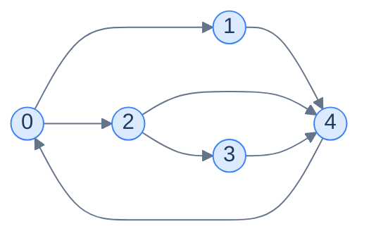
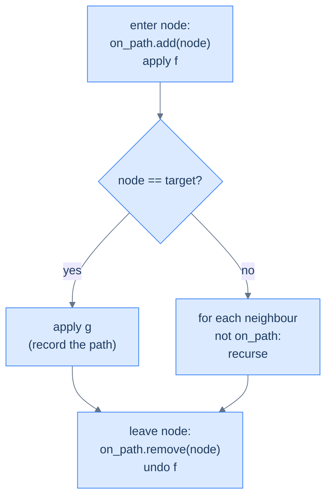

## Why It Exists

In lesson 4 you used DFS as a *traversal* — visit every node once. That's its simplest use. DFS has a second, far more powerful use: **enumerating paths**. Every recursive call walks deeper into one route; every `return` backtracks a step and tries an alternative.

The one twist that turns traversal into enumeration: track which nodes are *currently on the path*, not which have *ever* been visited. A global "visited" set locks each node out after its first use — but a node can legitimately appear in many different source-to-target paths. The on-path set behaves like a **stack mirroring the recursion**: add on entry, remove on exit. When a node leaves the stack it's free for other paths through it.



<p align="center"><strong>Three paths run from 0 to 4: <code>0→1→4</code>, <code>0→2→4</code>, and <code>0→2→3→4</code>. DFS enumerates them by backing up at each dead end and trying the next branch.</strong></p>

## See It Work

Enumerate every path from `0` to `4` on that graph. The `on_path` set is added-to on entry and removed on exit — that removal is what lets node 4 (and 2) participate in more than one path.

```python run viz=graph viz-kind=graph
adj = {0: [1, 2], 1: [4], 2: [3, 4], 3: [4], 4: [0]}

def all_paths(adj, s, t):
    res, path, on_path = [], [], set()
    def dfs(u):
        on_path.add(u); path.append(u)                  # enter
        if u == t:
            res.append(path[:])                         # record a complete path
        else:
            for v in adj.get(u, []):
                if v not in on_path:                    # skip nodes already on THIS path
                    dfs(v)
        on_path.remove(u); path.pop()                   # exit — UNDO the entry
    dfs(s)
    return res

paths = all_paths(adj, 0, 4)
for p in paths: print(" -> ".join(map(str, p)))
print("count:", len(paths))
```

```java run viz=graph viz-kind=graph
import java.util.*;

public class Main {
    static Map<Integer, List<Integer>> adj = Map.of(
        0, List.of(1, 2), 1, List.of(4), 2, List.of(3, 4), 3, List.of(4), 4, List.of(0));
    static List<List<Integer>> res = new ArrayList<>();
    static List<Integer> path = new ArrayList<>();
    static Set<Integer> onPath = new HashSet<>();

    static void dfs(int u, int t) {
        onPath.add(u); path.add(u);                     // enter
        if (u == t) {
            res.add(new ArrayList<>(path));             // record
        } else {
            for (int v : adj.getOrDefault(u, List.of()))
                if (!onPath.contains(v)) dfs(v, t);     // skip nodes on THIS path
        }
        onPath.remove(u); path.remove(path.size() - 1); // exit — UNDO
    }

    public static void main(String[] args) {
        dfs(0, 4);
        for (List<Integer> p : res) {
            StringBuilder sb = new StringBuilder();
            for (int i = 0; i < p.size(); i++) sb.append(i > 0 ? " -> " : "").append(p.get(i));
            System.out.println(sb);
        }
        System.out.println("count: " + res.size());
    }
}
```

Both enumerate the three paths `0 → 1 → 4`, `0 → 2 → 3 → 4`, `0 → 2 → 4` (DFS visits node 2's neighbour 3 before 4, so the longer route prints second).

## How It Works

The general DFS-pattern problem: *aggregate a function `f` over the nodes of every valid `s → t` path, then aggregate those per-path values with a function `g`.* Swap `f` and `g` and the same skeleton solves a whole family:

| Problem | `f` (per node) | `g` (across paths) |
|---|---|---|
| List all paths | append node | collect into a list |
| Count paths | +1 | sum |
| Sum of path weights | add edge weight | sum |
| Max-weight path | add edge weight | max |
| Hamiltonian paths | append + length check | keep those of length `N` |

The structure never changes:

```
dfs(node):
    on_path.add(node);  apply f              # ENTER
    if node == target:  apply g              # record this path's contribution
    else: for nb not in on_path: dfs(nb)
    on_path.remove(node);  undo f            # EXIT — restore state for siblings
```



<p align="center"><strong>Whatever you change on entry, undo on exit — otherwise sibling branches inherit a polluted aggregate.</strong></p>

**Recognise the pattern when:** the problem mentions **paths** between specific nodes and asks for *all / count / sum / max / min / exists*; a node may recur across different paths (so per-path `on_path`, not global `visited`); and the graph is small enough that exponential enumeration is acceptable (path counts can blow up — DFS-enumeration is for `N ≲ 20` or sparse graphs).

> **Key takeaway.** DFS-as-enumeration = plain DFS + an `on_path` set that you add on entry and **remove on exit**. That single undo is the whole pattern: it frees each node for reuse in other paths and keeps any running aggregate correct for sibling branches.

## Trace It

The pattern lives or dies on the entry/exit symmetry. Suppose you replace the per-path `on_path` set with a global `visited` set that you mark on entry and *never* unmark (the classic copy-paste from traversal code).

**Predict before you run:** on the same graph, how many of the three `0 → 4` paths does the buggy version find?

```python run viz=graph viz-kind=graph
adj = {0: [1, 2], 1: [4], 2: [3, 4], 3: [4], 4: [0]}

def all_paths_buggy(adj, s, t):
    res, path, visited = [], [], set()
    def dfs(u):
        visited.add(u); path.append(u)                  # mark — but NEVER unmark
        if u == t:
            res.append(path[:])
        else:
            for v in adj.get(u, []):
                if v not in visited: dfs(v)
        path.pop()                                      # path is restored, `visited` is NOT
    dfs(s)
    return res

paths = all_paths_buggy(adj, 0, 4)
for p in paths: print(" -> ".join(map(str, p)))
print("count:", len(paths))
```

<details>
<summary><strong>Reveal</strong></summary>

It finds just **one** path: `0 → 1 → 4`. Once the first path consumes nodes 1 and 4, the global `visited` set locks them out forever. When DFS backtracks to try `0 → 2`, node 4 is already marked, so `0 → 2 → 4` and `0 → 2 → 3 → 4` are both invisible. A "visited" set answers "have we *ever* been here?" — right for traversal, wrong for enumeration. The fix is exactly the `on_path.remove(node)` on exit: it scopes the bookkeeping to the *current* path, so a node freed on backtrack can rejoin a different route.

</details>

## Your Turn

The canonical version: **All Paths From Source to Target** ([LeetCode 797](https://leetcode.com/problems/all-paths-from-source-to-target/)). Given a DAG as an adjacency list, return every path from `0` to `n − 1`. Because it's acyclic you don't even need the `on_path` guard — but the add-on-entry / undo-on-exit rhythm is identical.

```python run viz=graph viz-kind=graph
def all_paths_source_target(graph):
    n = len(graph); res, path = [], []
    def dfs(u):
        path.append(u)                                  # enter
        if u == n - 1:
            res.append(path[:])                         # record
        else:
            for v in graph[u]: dfs(v)
        path.pop()                                      # exit — undo
    dfs(0)
    return res

print(all_paths_source_target([[1, 2], [3], [3], []]))  # [[0, 1, 3], [0, 2, 3]]
print(all_paths_source_target([[1], [2], []]))          # [[0, 1, 2]]
```

```java run viz=graph viz-kind=graph
import java.util.*;

public class Main {
    static int[][] graph; static List<List<Integer>> res; static List<Integer> path;
    static void dfs(int u) {
        path.add(u);                                    // enter
        if (u == graph.length - 1) {
            res.add(new ArrayList<>(path));             // record
        } else {
            for (int v : graph[u]) dfs(v);
        }
        path.remove(path.size() - 1);                   // exit — undo
    }
    static List<List<Integer>> allPaths(int[][] g) {
        graph = g; res = new ArrayList<>(); path = new ArrayList<>();
        dfs(0);
        return res;
    }
    public static void main(String[] args) {
        System.out.println(allPaths(new int[][]{{1, 2}, {3}, {3}, {}}));  // [[0, 1, 3], [0, 2, 3]]
        System.out.println(allPaths(new int[][]{{1}, {2}, {}}));          // [[0, 1, 2]]
    }
}
```

Both print `[[0, 1, 3], [0, 2, 3]]` then `[[0, 1, 2]]`. When you want more, the four problems in this section's **Problems** folder each instantiate a different `f`/`g`: source-to-target paths, paths with a given weight, Hamiltonian paths, and simple cycles.

## Reflect & Connect

- **This *is* backtracking.** "Add on entry, recurse, undo on exit" is the backtracking skeleton you'll meet again in the Algorithms-by-Strategy part. Generating combinations and permutations is just DFS on an *implicit* graph where the neighbours are "the choices still available."
- **The `on_path` set is the cycle-detection idea in disguise.** Tracking "nodes on the current recursion path" is exactly the grey/black colouring from directed cycle detection — a node on the path is grey, a finished node is black.
- **Mind the exponential.** A graph can have exponentially many `s → t` paths (a "diamond chain" doubles them at each layer), so DFS-enumeration is only for small or sparse inputs. When you need a single optimum rather than *all* paths, switch to BFS/Dijkstra/DP — enumeration is the wrong tool.
- **Grids are implicit graphs.** "Count all routes through a maze" is this pattern with neighbours generated from `(row±1, col±1)` deltas instead of an adjacency list.

## Recall

<details>
<summary><strong>Q:</strong> What turns DFS-traversal into DFS-enumeration?</summary>

**A:** Track nodes *currently on the path* (an `on_path` set added on entry and removed on exit) instead of a global `visited` set. The removal frees a node for reuse in other paths.

</details>
<details>
<summary><strong>Q:</strong> Why undo state on exit?</summary>

**A:** Sibling branches share the parent's running aggregate and path stack. Whatever you change on entry (`f`) must be undone on exit (`f⁻¹`) or siblings inherit polluted state.

</details>
<details>
<summary><strong>Q:</strong> The `f` / `g` template — what do they mean?</summary>

**A:** `f` updates a per-path aggregate at each node (append, +weight, +1…); `g` folds a completed path's value into the global result at the target (collect, sum, max…). Same skeleton, different `f`/`g`.

</details>
<details>
<summary><strong>Q:</strong> When is DFS-enumeration the wrong tool?</summary>

**A:** When the path count is exponential and you only need one optimum — use BFS/Dijkstra/DP instead. Enumeration suits small or sparse graphs (`N ≲ 20`).

</details>
<details>
<summary><strong>Q:</strong> How does this relate to backtracking and cycle detection?</summary>

**A:** It *is* backtracking (add/recurse/undo); combinations and permutations are DFS on an implicit choice-graph. The `on_path` set is the grey/black on-path colouring used to detect directed cycles.

</details>

## Sources & Verify

- **CLRS** (Cormen, Leiserson, Rivest, Stein), *Introduction to Algorithms*, 3rd ed., §22.3 — depth-first search, the parenthesis/white-path structure, and edge classification that underlies path enumeration.
- **Sedgewick & Wayne**, *Algorithms*, 4th ed., §4.1–4.2 — DFS on undirected and directed graphs, paths, and connectivity.
- **Skiena**, *The Algorithm Design Manual*, 3rd ed., §5.8 (DFS applications) and §7 (backtracking) — the "add/recurse/undo" enumeration template made explicit.
- **LeetCode 797** "All Paths From Source to Target" is the canonical drill for this pattern; the path lists and the buggy single-path output above come from the runnable blocks — re-run to verify.
