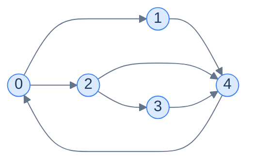

# Source to Target Paths

## Problem Statement

Given a directed graph as an adjacency list, return **all** paths from node `0` to node `N-1`. A path cannot visit any node more than once.

## Examples

**Example 1:**
```
Input:  graph = [[1, 2], [4], [3, 4], [4], [0]]
Output: [[0, 1, 4], [0, 2, 3, 4], [0, 2, 4]]
```



<p align="center"><strong>Three paths from 0 to 4: <code>0→1→4</code>, <code>0→2→3→4</code>, <code>0→2→4</code>.</strong></p>

**Example 2:**
```
Input:  graph = [[4], [0, 3], [0, 4], [2, 4], []]
Output: [[0, 4]]
```

## Constraints

- `1 ≤ N ≤ 15`
- The graph is directed and may contain cycles; nodes visited on a path may not repeat.
- The answer list is ordered by DFS discovery — neighbour order in the adjacency list determines visit order.

```python run viz=graph viz-root=graph viz-kind=graph
import ast

def source_to_target_paths(graph):
    # Your code goes here — DFS from node 0 to node n-1.
    # Track nodes currently on the path (on_path set); add on entry, remove on exit.
    # When you reach n-1, record a copy of the current path.
    pass

graph = ast.literal_eval(input())
print(source_to_target_paths(graph))
```

```java run viz=graph viz-root=graph viz-kind=graph
import java.util.*;

public class Main {
    static int[][] graph;
    static List<List<Integer>> res;
    static List<Integer> path;
    static Set<Integer> onPath;

    static void dfs(int u) {
        // Your code goes here — enter: onPath.add(u); path.add(u);
        // if u == graph.length - 1 record a copy; else recurse each neighbour not in onPath;
        // exit: onPath.remove(u); path.remove(last).
    }

    public static void main(String[] args) {
        Scanner sc = new Scanner(System.in);
        graph = parseIntMatrix(sc.nextLine());
        res = new ArrayList<>(); path = new ArrayList<>(); onPath = new HashSet<>();
        dfs(0);
        System.out.println(res);
    }

    static int[][] parseIntMatrix(String line) {
        String trimmed = line.trim();
        if (trimmed.equals("[]") || trimmed.equals("[[]]")) return new int[0][];
        String inner = trimmed.substring(1, trimmed.length() - 1).trim();
        String[] rows = inner.split("\\],\\s*\\[");
        int[][] mat = new int[rows.length][];
        for (int r = 0; r < rows.length; r++) {
            String row = rows[r].replaceAll("[\\[\\]\\s]", "");
            if (row.isEmpty()) { mat[r] = new int[0]; continue; }
            String[] parts = row.split(",");
            mat[r] = new int[parts.length];
            for (int c = 0; c < parts.length; c++) mat[r][c] = Integer.parseInt(parts[c].trim());
        }
        return mat;
    }
}
```

```testcases
{
  "args": [
    { "id": "graph", "label": "graph", "type": "int[][]", "placeholder": "[[1, 2], [4], [3, 4], [4], [0]]" }
  ],
  "cases": [
    { "args": { "graph": "[[1, 2], [4], [3, 4], [4], [0]]" }, "expected": "[[0, 1, 4], [0, 2, 3, 4], [0, 2, 4]]" },
    { "args": { "graph": "[[4], [0, 3], [0, 4], [2, 4], []]" }, "expected": "[[0, 4]]" },
    { "args": { "graph": "[[1, 2], [3], [3], []]" }, "expected": "[[0, 1, 3], [0, 2, 3]]" },
    { "args": { "graph": "[[1], [2], []]" }, "expected": "[[0, 1, 2]]" },
    { "args": { "graph": "[[], [0]]" }, "expected": "[]" }
  ]
}
```

<details>
<summary>Editorial</summary>

The target is fixed at `n - 1`. Maintain an `on_path` set and a running `path` list. On entry, add the node to both; if it is the target, record a copy of the path; otherwise recurse into each neighbour not already `on_path`. On exit, remove the node from both — this is the backtrack step that lets a node participate in other paths. Neighbour order is the input's order, so both languages enumerate paths in the same sequence without any sorting.

```python solution time=O(2^N · N) space=O(N)
import ast

def source_to_target_paths(graph):
    n = len(graph)
    res, path, on_path = [], [], set()
    def dfs(u):
        on_path.add(u); path.append(u)
        if u == n - 1:
            res.append(path[:])
        else:
            for v in graph[u]:
                if v not in on_path:
                    dfs(v)
        on_path.remove(u); path.pop()
    dfs(0)
    return res

graph = ast.literal_eval(input())
print(source_to_target_paths(graph))
```

```java solution
import java.util.*;

public class Main {
    static int[][] graph;
    static List<List<Integer>> res;
    static List<Integer> path;
    static Set<Integer> onPath;

    static void dfs(int u) {
        onPath.add(u); path.add(u);
        if (u == graph.length - 1) {
            res.add(new ArrayList<>(path));
        } else {
            for (int v : graph[u])
                if (!onPath.contains(v)) dfs(v);
        }
        onPath.remove(u); path.remove(path.size() - 1);
    }

    public static void main(String[] args) {
        Scanner sc = new Scanner(System.in);
        graph = parseIntMatrix(sc.nextLine());
        res = new ArrayList<>(); path = new ArrayList<>(); onPath = new HashSet<>();
        dfs(0);
        System.out.println(res);
    }

    static int[][] parseIntMatrix(String line) {
        String trimmed = line.trim();
        if (trimmed.equals("[]") || trimmed.equals("[[]]")) return new int[0][];
        String inner = trimmed.substring(1, trimmed.length() - 1).trim();
        String[] rows = inner.split("\\],\\s*\\[");
        int[][] mat = new int[rows.length][];
        for (int r = 0; r < rows.length; r++) {
            String row = rows[r].replaceAll("[\\[\\]\\s]", "");
            if (row.isEmpty()) { mat[r] = new int[0]; continue; }
            String[] parts = row.split(",");
            mat[r] = new int[parts.length];
            for (int c = 0; c < parts.length; c++) mat[r][c] = Integer.parseInt(parts[c].trim());
        }
        return mat;
    }
}
```

</details>
