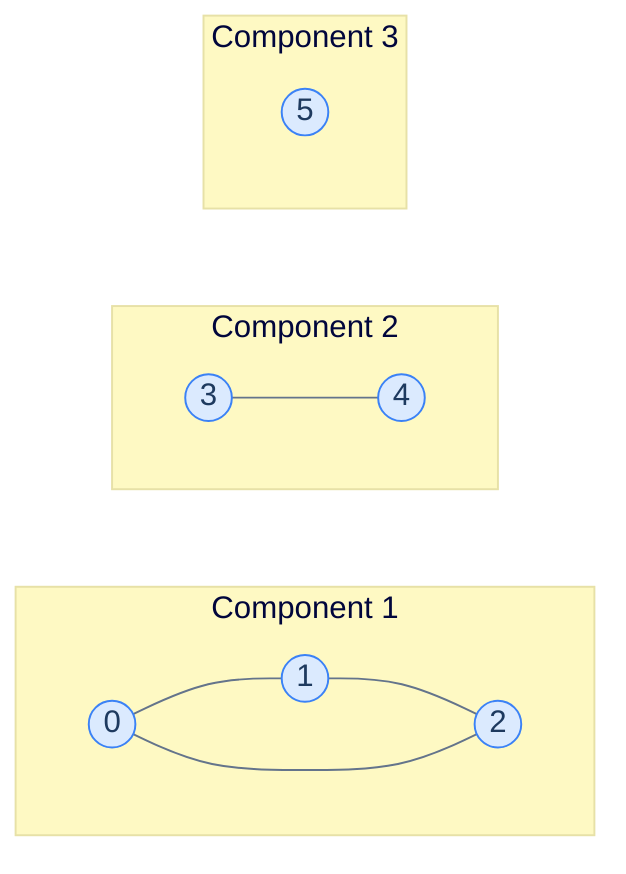
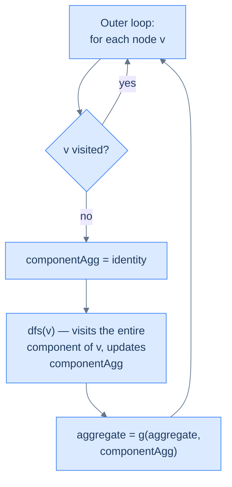

## Why It Exists

Take an undirected graph and walk it from some node. The set of nodes you can reach is a **connected component** — a maximal subgraph where every node has a path to every other. A connected graph is one component; a disconnected graph is several.

A surprising number of real questions are component questions in disguise: *how many islands on this map? how many separate friend cliques? how many isolated machines on the network?* The engine behind all of them is one loop: **walk from every node you haven't visited yet; each fresh walk uncovers exactly one new component.** Do that and you label, count, and measure every disjoint piece in a single `O(V + E)` sweep.



<p align="center"><strong>Three connected components: a triangle (0-1-2), an edge (3-4), and a singleton (5). No edges go between components.</strong></p>

## See It Work

Count the components and measure each one's size. The flood-fill (DFS here) absorbs an entire component; the outer loop kicks off a new flood from each still-unvisited node.

```python run viz=graph viz-kind=graph
adj = {0: [1, 2], 1: [0, 2], 2: [1, 0], 3: [4], 4: [3], 5: []}

def components(adj, n):
    visited = set()
    sizes = []
    def dfs(u):                                          # flood-fill one component, return its size
        visited.add(u); size = 1
        for v in adj[u]:
            if v not in visited: size += dfs(v)
        return size
    for v in range(n):                                  # outer loop: every UNVISITED node = a new component
        if v not in visited:
            sizes.append(dfs(v))
    return sizes

sizes = components(adj, 6)
print("components:", len(sizes))
print("sizes:", sizes)
```

```java run viz=graph viz-kind=graph
import java.util.*;

public class Main {
    static Map<Integer, List<Integer>> adj = Map.of(
        0, List.of(1, 2), 1, List.of(0, 2), 2, List.of(1, 0), 3, List.of(4), 4, List.of(3), 5, List.of());
    static Set<Integer> visited = new HashSet<>();

    static int dfs(int u) {                              // flood-fill one component, return its size
        visited.add(u); int size = 1;
        for (int v : adj.get(u)) if (!visited.contains(v)) size += dfs(v);
        return size;
    }

    public static void main(String[] args) {
        List<Integer> sizes = new ArrayList<>();
        for (int v = 0; v < 6; v++)                      // outer loop: every unvisited node = a new component
            if (!visited.contains(v)) sizes.add(dfs(v));
        System.out.println("components: " + sizes.size());
        System.out.println("sizes: " + sizes);
    }
}
```

Both report **3 components** with sizes `[3, 2, 1]` — the triangle, the edge, and the singleton.

## How It Works

The general pattern: *aggregate a function `f` over the nodes of every component, then aggregate the per-component values with `g`.* Pick `f` and `g` and you've solved a whole family:

| Problem | `f` (per node) | `g` (across components) |
|---|---|---|
| Count components | — | +1 per component |
| List nodes per component | append node | collect lists |
| Largest component size | +1 | max |
| Sum of per-component minima | min so far | sum |
| Count islands (grid) | mark cell | +1 per flood |

The skeleton never changes — a two-level loop:

```
for each node v:
    if v not visited:               # OUTER: discovers a new component
        comp = identity_f
        dfs(v) ...                   # INNER: flood-fills v's whole component
        result = g(result, comp)
```



<p align="center"><strong>The outer loop discovers components; the inner flood-fill exhausts each one. The per-component aggregate resets on discovery; the visited set does not.</strong></p>

The two state variables play opposite roles: the **per-component aggregate resets** at each new component, but the **visited set is global** — it accumulates across the whole graph so no node is ever counted twice. BFS or DFS works for the inner flood; the structure is identical.

> **Key takeaway.** Connected components = one global `visited` set + an outer "for every unvisited node, start a fresh flood" loop. Each flood that the outer loop launches *is* one component. Reset the per-component aggregate between floods; never reset `visited`.

## Trace It

The outer loop is the whole pattern. It's tempting to think "I'll just DFS the graph once" — after all, a single DFS visits everything reachable.

**Predict before you run:** with a single DFS launched from node 0 (no outer loop), how many components does it count on our 3-component graph?

```python run viz=graph viz-kind=graph
adj = {0: [1, 2], 1: [0, 2], 2: [1, 0], 3: [4], 4: [3], 5: []}

def components_buggy(adj, n):
    visited = set()
    def dfs(u):
        visited.add(u)
        for v in adj[u]:
            if v not in visited: dfs(v)
    dfs(0)                                              # ONE flood, from node 0 — no outer loop
    return 1                                            # "we walked the graph, so... one component?"

print("components:", components_buggy(adj, 6))
print("visited:", "only node 0's component")
```

<details>
<summary><strong>Reveal</strong></summary>

It returns **1**, but the graph has **3** components. A single DFS from node 0 only reaches `{0, 1, 2}` — it has no way to jump to the disconnected `{3, 4}` or the isolated `{5}`, because there are no edges to carry it there. Reachability stops at the component boundary; that's the definition of a component. The outer `for every unvisited node: start a new flood` loop is precisely what hops across those boundaries. Each time the outer loop finds a node the previous floods never touched, it has discovered a brand-new component. Drop the outer loop and you can never count more than one.

</details>

## Your Turn

The most famous instance is a *grid*, where the graph is implicit — each `'1'` cell is a node, neighbours are the four orthogonal cells. **Number of Islands** ([LeetCode 200](https://leetcode.com/problems/number-of-islands/)): count connected groups of land.

```python run viz=grid
def num_islands(grid):
    if not grid: return 0
    R, C = len(grid), len(grid[0])
    def sink(r, c):                                     # flood-fill one island, erasing it
        if r < 0 or r >= R or c < 0 or c >= C or grid[r][c] != '1': return
        grid[r][c] = '0'
        sink(r+1, c); sink(r-1, c); sink(r, c+1); sink(r, c-1)
    count = 0
    for r in range(R):
        for c in range(C):                              # outer loop over every cell
            if grid[r][c] == '1':                       # unvisited land = a new island
                count += 1; sink(r, c)
    return count

g1 = [list("11000"), list("11000"), list("00100"), list("00011")]
print(num_islands(g1))                                  # 3
g2 = [list("111"), list("010"), list("111")]
print(num_islands(g2))                                  # 1
```

```java run viz=grid
public class Main {
    static int R, C;
    static void sink(char[][] g, int r, int c) {        // flood-fill one island, erasing it
        if (r < 0 || r >= R || c < 0 || c >= C || g[r][c] != '1') return;
        g[r][c] = '0';
        sink(g, r+1, c); sink(g, r-1, c); sink(g, r, c+1); sink(g, r, c-1);
    }
    static int numIslands(char[][] g) {
        if (g.length == 0) return 0;
        R = g.length; C = g[0].length; int count = 0;
        for (int r = 0; r < R; r++)
            for (int c = 0; c < C; c++)                 // outer loop over every cell
                if (g[r][c] == '1') { count++; sink(g, r, c); }   // unvisited land = a new island
        return count;
    }
    static char[][] grid(String... rows) {
        char[][] g = new char[rows.length][];
        for (int i = 0; i < rows.length; i++) g[i] = rows[i].toCharArray();
        return g;
    }
    public static void main(String[] args) {
        System.out.println(numIslands(grid("11000", "11000", "00100", "00011")));  // 3
        System.out.println(numIslands(grid("111", "010", "111")));                 // 1
    }
}
```

Both print `3` then `1`. The grid version is the identical pattern — the only change is that neighbours come from `(r±1, c±1)` deltas instead of an adjacency list. The four problems in this section's **Problems** folder cover both flavours: explicit-graph components, sum-of-minimums, island count, and largest-island size.

## Reflect & Connect

- **Undirected here; directed needs more.** "Connected component" is an undirected notion. In a *directed* graph the analogous idea is the [strongly connected component](/cortex/data-structures-and-algorithms/graphs/strongly-connected-components) — mutually reachable, both directions — which needs Tarjan/Kosaraju, not a plain flood-fill.
- **Union-Find is the online alternative.** This flood-fill is the *offline* approach: you have the whole graph and sweep it once. When edges arrive incrementally and you must answer "same component?" as you go, [disjoint-set union](/cortex/data-structures-and-algorithms/trees/disjoint-set-union/introduction-to-disjoint-set-union) is the right tool — near-`O(1)` amortised per union/query.
- **BFS and DFS are interchangeable** for the inner flood — same `O(V + E)`. Pick BFS (an explicit queue) on huge grids to avoid recursion-depth overflow; the outer loop and the global `visited` set are unchanged.
- **Grids are implicit graphs.** Most "regions / islands / flood-fill" problems are this pattern with delta-generated neighbours. Recognise the shape and you reuse one skeleton across maps, mazes, and image segmentation.

## Recall

<details>
<summary><strong>Q:</strong> What is a connected component?</summary>

**A:** A maximal subgraph of an undirected graph in which every node has a path to every other. A connected graph has one; a disconnected graph has several.

</details>
<details>
<summary><strong>Q:</strong> What is the heart of the connected-components pattern?</summary>

**A:** The outer "for every *unvisited* node, start a fresh flood-fill" loop. Each flood the outer loop launches is exactly one component.

</details>
<details>
<summary><strong>Q:</strong> Which state resets per component and which is global?</summary>

**A:** The per-component aggregate (`f`'s running value) resets at each new component; the `visited` set is global and accumulates across the whole graph so nothing is counted twice.

</details>
<details>
<summary><strong>Q:</strong> Why won't a single DFS from one node count all components?</summary>

**A:** Reachability stops at component boundaries — a DFS from one node only sees its own component. The outer loop is what hops to the next unvisited component.

</details>
<details>
<summary><strong>Q:</strong> Flood-fill vs. union-find — when each?</summary>

**A:** Flood-fill (BFS/DFS) is the offline one-sweep approach when you have the whole graph. Union-find is the online approach when edges arrive incrementally and you must answer connectivity queries as you go.

</details>

## Sources & Verify

- **CLRS** (Cormen, Leiserson, Rivest, Stein), *Introduction to Algorithms*, 3rd ed., §22.3 — DFS and identifying connected components; §21 contrasts the union-find approach for incremental connectivity.
- **Sedgewick & Wayne**, *Algorithms*, 4th ed., §4.1 — the `CC` (connected components) API built directly on DFS, plus the BFS variant.
- **Skiena**, *The Algorithm Design Manual*, 3rd ed., §5.8.1 — connected components and flood-fill, including the grid/implicit-graph framing.
- **LeetCode 200** "Number of Islands" and **323** "Number of Connected Components in an Undirected Graph" are the canonical drills. The `3` / `[3,2,1]` / single-component / island outputs above come from the runnable blocks — re-run to verify.
