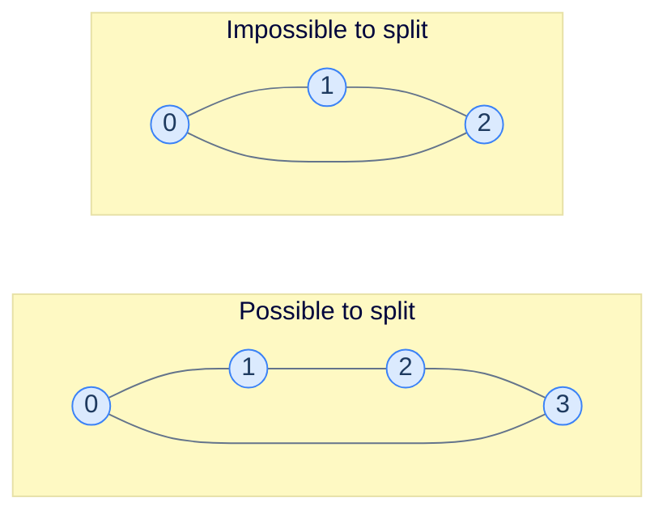

## Why It Exists

You have a group of people and a list of **dislike** pairs — pairs that can't sit together. You have exactly **two** tables. Can you seat everyone so no two enemies share a table?

That question — and a surprising number of others — is *two-colouring*: assign one of two labels to every node so adjacent nodes always differ. It shows up wherever you need to detect **antagonism** or **alternation**: conflict groups, chess-board colouring, splitting jobs across two machines, checking whether a network really decomposes into two factions.



<p align="center"><strong>The 4-cycle can be 2-coloured ({0,2} red, {1,3} blue). The 3-cycle cannot — start 0 red, 1 blue, 2 must be red, but edge 2–0 is then red–red. Conflict.</strong></p>

## See It Work

Walk the graph (DFS here), painting each node and giving every neighbour the opposite colour. The decisive line is the *check*: when you meet an already-coloured neighbour, it had better be the opposite colour. Pick a case and **Run** it.

```python run viz=graph viz-kind=graph
import ast

def colour(graph, node, col, value):
    col[node] = value
    for nb in graph[node]:
        if nb not in col:                               # uncoloured → paint it the opposite colour
            if not colour(graph, nb, col, 1 - value): return False
        elif col[nb] == value:                          # coloured the SAME → contradiction
            return False
    return True

def is_two_colourable(graph):
    if not graph: return False
    col = {}
    for node in range(len(graph)):                      # outer loop: cover every component
        if node not in col and not colour(graph, node, col, 1):
            return False
    return True

graph = ast.literal_eval(input())   # adjacency list: graph[u] = u's neighbours
print("true" if is_two_colourable(graph) else "false")
```

```java run viz=graph viz-kind=graph
import java.util.*;

public class Main {
    static boolean colour(int[][] graph, int node, int[] col, int value) {
        col[node] = value;
        for (int nb : graph[node]) {
            if (col[nb] == -1) {                        // uncoloured → opposite colour
                if (!colour(graph, nb, col, 1 - value)) return false;
            } else if (col[nb] == value) {              // coloured the SAME → contradiction
                return false;
            }
        }
        return true;
    }

    static boolean isTwoColourable(int[][] graph) {
        if (graph.length == 0) return false;
        int[] col = new int[graph.length];
        Arrays.fill(col, -1);
        for (int node = 0; node < graph.length; node++) // outer loop: cover every component
            if (col[node] == -1 && !colour(graph, node, col, 1)) return false;
        return true;
    }

    public static void main(String[] args) {
        Scanner sc = new Scanner(System.in);
        int[][] graph = parseIntMatrix(sc.nextLine());
        System.out.println(isTwoColourable(graph));
    }

    // "[[1, 2], [4], [3, 4]]" → adjacency list graph[u] = u's neighbours
    static int[][] parseIntMatrix(String line) {
        String trimmed = line.trim();
        if (trimmed.equals("[]") || trimmed.equals("[[]]")) return new int[0][];
        String inner = trimmed.substring(1, trimmed.length() - 1).trim();
        String[] rows = inner.split("\\],\\s*\\[");
        int[][] mat = new int[rows.length][];
        for (int r = 0; r < rows.length; r++) {
            String row = rows[r].replaceAll("[\\[\\]\\s]", "");
            if (row.isEmpty()) { mat[r] = new int[0]; continue; }
            String[] parts = row.split(",");
            mat[r] = new int[parts.length];
            for (int c = 0; c < parts.length; c++) mat[r][c] = Integer.parseInt(parts[c].trim());
        }
        return mat;
    }
}
```

```testcases
{
  "args": [
    { "id": "graph", "label": "graph", "type": "int[][]", "placeholder": "[[1, 3], [0, 2], [1, 3], [0, 2]]" }
  ],
  "cases": [
    { "args": { "graph": "[[1, 3], [0, 2], [1, 3], [0, 2]]" }, "expected": "true" },
    { "args": { "graph": "[[1, 2], [0, 2], [0, 1]]" }, "expected": "false" },
    { "args": { "graph": "[[1], [0, 2], [1]]" }, "expected": "true" },
    { "args": { "graph": "[[1], [0]]" }, "expected": "true" },
    { "args": { "graph": "[[1, 2, 3], [0, 2], [0, 1], [0]]" }, "expected": "false" }
  ]
}
```

Both print `true` then `false`: the 4-cycle alternates cleanly, the triangle hits a same-colour clash.

## How It Works

Three names for one property:

> **Two-colourable ⟺ bipartite ⟺ no odd cycle.**

- **Two-colourable** is the *algorithmic* view: assign one of two labels so adjacent labels differ.
- **Bipartite** is the *structural* view: split nodes into `L` and `R` so every edge crosses between them (reds = `L`, blues = `R`).
- **No odd cycle** is the *characterisation* (König's theorem): walking any cycle flips colour at each step; an odd cycle returns you to the start with the *opposite* colour — an impossible self-contradiction. Even cycles return you to the same colour, no conflict.

The algorithm is plain DFS (or BFS) plus a colour rule: paint the start node, give each uncoloured neighbour `1 - value`, and when you meet an already-coloured neighbour, verify it differs. An outer loop reseeds an uncoloured node for each disconnected component — all components must succeed. `O(V + E)`: every node coloured once, every edge checked once. BFS works identically (queue + same check) and avoids deep recursion on huge graphs.

> **Key takeaway.** Two-colouring is DFS/BFS with one extra rule — neighbours get the opposite colour, and an already-coloured neighbour must *disagree*. A clash means an odd cycle, which means the graph is not bipartite. The conflict check on visited neighbours is the entire detection mechanism.

## Trace It

The colour-propagation half (paint neighbours `1 - value`) feels like the heart of the algorithm. But propagation alone never *detects* failure — that's the job of the `elif col[nb] == value: return False` check on already-coloured neighbours.

**Predict before you run:** delete that conflict check (keep only the "recurse into uncoloured neighbours" branch) and run it on the triangle. Does it correctly report `False`?

```python run viz=graph viz-kind=graph
def colour_no_check(graph, node, col, value):
    col[node] = value
    for nb in graph[node]:
        if nb not in col:
            if not colour_no_check(graph, nb, col, 1 - value): return False
        # BUG: the `elif col[nb] == value: return False` check is gone
    return True

def is_two_colourable_buggy(graph):
    if not graph: return False
    col = {}
    for node in range(len(graph)):
        if node not in col and not colour_no_check(graph, node, col, 1):
            return False
    return True

print(is_two_colourable_buggy([[1, 2], [0, 2], [0, 1]]))   # triangle
```

<details>
<summary><strong>Reveal</strong></summary>

It prints `True` — but the triangle is **not** 2-colourable. Without the check, the DFS happily paints node 0 red, node 1 blue, node 2 red (opposite of blue, via edge 1–2), then returns. The fatal edge 2–0 connects two *already-coloured* nodes (both red), and that is the *only* place the contradiction shows up — propagation never revisits it because both endpoints are already in `col`. Colouring without verifying is just a traversal that happens to write labels. The conflict check on visited neighbours is what turns it into a bipartiteness *test*; it's the line that catches every odd cycle.

</details>

## Your Turn

Back to the opening puzzle: **Possible Bipartition** ([LeetCode 886](https://leetcode.com/problems/possible-bipartition/)). Given `n` people (1-indexed) and a list of dislike pairs, can you split them into two groups with no enemies together? Build the dislike graph and ask: is it 2-colourable?

```python run viz=graph viz-kind=graph
import ast

def possible_bipartition(n, dislikes):
    # Your code goes here — build an adjacency list (graph[a-1] ↔ graph[b-1] for each [a,b]),
    # then run the two-colouring DFS over all components.
    # Return True if 2-colourable, False otherwise.
    pass

n = int(input())
dislikes = ast.literal_eval(input())   # 1-indexed pairs [[a, b], ...]
print("true" if possible_bipartition(n, dislikes) else "false")
```

```java run viz=graph viz-kind=graph
import java.util.*;

public class Main {
    static boolean colour(List<List<Integer>> g, int node, int[] col, int value) {
        col[node] = value;
        for (int nb : g.get(node)) {
            if (col[nb] == -1) { if (!colour(g, nb, col, 1 - value)) return false; }
            else if (col[nb] == value) return false;
        }
        return true;
    }

    static boolean possibleBipartition(int n, int[][] dislikes) {
        // Your code goes here — build adjacency from 1-indexed dislikes,
        // then two-colour all components. Return true if 2-colourable.
        return false;
    }

    public static void main(String[] args) {
        Scanner sc = new Scanner(System.in);
        int n = Integer.parseInt(sc.nextLine().trim());
        int[][] dislikes = parseIntMatrix(sc.nextLine());
        System.out.println(possibleBipartition(n, dislikes));
    }

    static int[][] parseIntMatrix(String line) {
        String trimmed = line.trim();
        if (trimmed.equals("[]") || trimmed.equals("[[]]")) return new int[0][];
        String inner = trimmed.substring(1, trimmed.length() - 1).trim();
        String[] rows = inner.split("\\],\\s*\\[");
        int[][] mat = new int[rows.length][];
        for (int r = 0; r < rows.length; r++) {
            String row = rows[r].replaceAll("[\\[\\]\\s]", "");
            if (row.isEmpty()) { mat[r] = new int[0]; continue; }
            String[] parts = row.split(",");
            mat[r] = new int[parts.length];
            for (int c = 0; c < parts.length; c++) mat[r][c] = Integer.parseInt(parts[c].trim());
        }
        return mat;
    }
}
```

```testcases
{
  "args": [
    { "id": "n", "label": "n", "type": "int", "placeholder": "4" },
    { "id": "dislikes", "label": "dislikes", "type": "int[][]", "placeholder": "[[1, 2], [1, 3], [2, 4]]" }
  ],
  "cases": [
    { "args": { "n": "4", "dislikes": "[[1, 2], [1, 3], [2, 4]]" }, "expected": "true" },
    { "args": { "n": "3", "dislikes": "[[1, 2], [1, 3], [2, 3]]" }, "expected": "false" },
    { "args": { "n": "5", "dislikes": "[[1, 2], [3, 4], [4, 5], [3, 5]]" }, "expected": "false" },
    { "args": { "n": "4", "dislikes": "[]" }, "expected": "true" },
    { "args": { "n": "2", "dislikes": "[[1, 2]]" }, "expected": "true" }
  ]
}
```

<details>
<summary>Editorial</summary>

Build an adjacency list from the 1-indexed dislike pairs (subtract 1 from each to get 0-indexed nodes), then run the same DFS two-colouring over every uncoloured component. If any component fails the colour check, return false.

```python solution time=O(V + E) space=O(V + E)
import ast

def colour(graph, node, col, value):
    col[node] = value
    for nb in graph[node]:
        if nb not in col:
            if not colour(graph, nb, col, 1 - value): return False
        elif col[nb] == value:
            return False
    return True

def possible_bipartition(n, dislikes):
    graph = [[] for _ in range(n)]
    for a, b in dislikes:                               # 1-indexed people → 0-indexed nodes
        graph[a-1].append(b-1); graph[b-1].append(a-1)
    col = {}
    for node in range(n):
        if node not in col and not colour(graph, node, col, 1):
            return False
    return True

n = int(input())
dislikes = ast.literal_eval(input())   # 1-indexed pairs [[a, b], ...]
print("true" if possible_bipartition(n, dislikes) else "false")
```

```java solution
import java.util.*;

public class Main {
    static boolean colour(List<List<Integer>> g, int node, int[] col, int value) {
        col[node] = value;
        for (int nb : g.get(node)) {
            if (col[nb] == -1) { if (!colour(g, nb, col, 1 - value)) return false; }
            else if (col[nb] == value) return false;
        }
        return true;
    }

    static boolean possibleBipartition(int n, int[][] dislikes) {
        List<List<Integer>> g = new ArrayList<>();
        for (int i = 0; i < n; i++) g.add(new ArrayList<>());
        for (int[] d : dislikes) { g.get(d[0]-1).add(d[1]-1); g.get(d[1]-1).add(d[0]-1); }
        int[] col = new int[n];
        Arrays.fill(col, -1);
        for (int node = 0; node < n; node++)
            if (col[node] == -1 && !colour(g, node, col, 1)) return false;
        return true;
    }

    public static void main(String[] args) {
        Scanner sc = new Scanner(System.in);
        int n = Integer.parseInt(sc.nextLine().trim());
        int[][] dislikes = parseIntMatrix(sc.nextLine());
        System.out.println(possibleBipartition(n, dislikes));
    }

    static int[][] parseIntMatrix(String line) {
        String trimmed = line.trim();
        if (trimmed.equals("[]") || trimmed.equals("[[]]")) return new int[0][];
        String inner = trimmed.substring(1, trimmed.length() - 1).trim();
        String[] rows = inner.split("\\],\\s*\\[");
        int[][] mat = new int[rows.length][];
        for (int r = 0; r < rows.length; r++) {
            String row = rows[r].replaceAll("[\\[\\]\\s]", "");
            if (row.isEmpty()) { mat[r] = new int[0]; continue; }
            String[] parts = row.split(",");
            mat[r] = new int[parts.length];
            for (int c = 0; c < parts.length; c++) mat[r][c] = Integer.parseInt(parts[c].trim());
        }
        return mat;
    }
}
```

</details>

## Reflect & Connect

- **Bipartite is the gateway to matching.** Once you know a graph is bipartite, [maximum bipartite matching](/cortex/data-structures-and-algorithms/graphs/maximum-bipartite-matching) and assignment problems open up — 2-colouring is often the *first* check before running a matching or flow algorithm.
- **2 vs. 3 is another complexity cliff.** Deciding 2-colourability is linear; deciding `k`-colourability for `k ≥ 3` is NP-complete. Same dramatic boundary you saw in [2-SAT](/cortex/data-structures-and-algorithms/graphs/2-sat) — and indeed 2-colouring reduces to 2-SAT (each "differ" edge becomes two clauses).
- **It's cycle detection with a label.** The machinery is the same DFS/BFS used for [cycle detection](/cortex/data-structures-and-algorithms/graphs/cycle-detection); here the extra colour bit converts "is there a cycle?" into "is there an *odd* cycle?"
- **BFS or DFS — your call.** Both are `O(V + E)`. On very large or grid graphs, prefer BFS (an explicit queue) to dodge recursion-depth limits; the colour rule and conflict check are identical.

## Recall

<details>
<summary><strong>Q:</strong> State the three-way equivalence at the heart of this pattern.</summary>

**A:** Two-colourable ⟺ bipartite ⟺ contains no odd-length cycle. The algorithmic, structural, and characterisation views of the same property.

</details>
<details>
<summary><strong>Q:</strong> What is the colouring algorithm, in one sentence?</summary>

**A:** DFS/BFS the graph, paint each uncoloured neighbour the opposite colour, and on meeting an already-coloured neighbour verify it differs — a same-colour clash means not bipartite.

</details>
<details>
<summary><strong>Q:</strong> Which line actually detects non-bipartiteness?</summary>

**A:** The conflict check on *already-coloured* neighbours (`else if colour[nb] == value: return false`). Propagation alone writes labels but never notices the contradiction on a back/closing edge.

</details>
<details>
<summary><strong>Q:</strong> Why does an odd cycle break two-colouring?</summary>

**A:** Colour flips at each step; after an odd number of edges you return to the start with the opposite colour — a contradiction. Even cycles return you to the same colour, so they're fine.

</details>
<details>
<summary><strong>Q:</strong> Why the outer loop over all nodes?</summary>

**A:** The graph may be disconnected; each component must be coloured independently and all must succeed. The outer loop reseeds an uncoloured node per component.

</details>

## Sources & Verify

- **CLRS** (Cormen, Leiserson, Rivest, Stein), *Introduction to Algorithms*, 3rd ed., §22.2 (BFS) and the bipartite-graph exercises — the BFS-colouring test and the odd-cycle characterisation.
- **Sedgewick & Wayne**, *Algorithms*, 4th ed., §4.1 — the `Bipartite` / two-colourability client built on DFS, with the odd-cycle proof.
- **Skiena**, *The Algorithm Design Manual*, 3rd ed., §5.7.2 — two-colouring via BFS and its place in graph-colouring (and why `k ≥ 3` is hard).
- **LeetCode 785** "Is Graph Bipartite?" and **886** "Possible Bipartition" are the canonical drills. The `true`/`false`, buggy-triangle, and bipartition outputs above come from the runnable blocks — re-run to verify.
