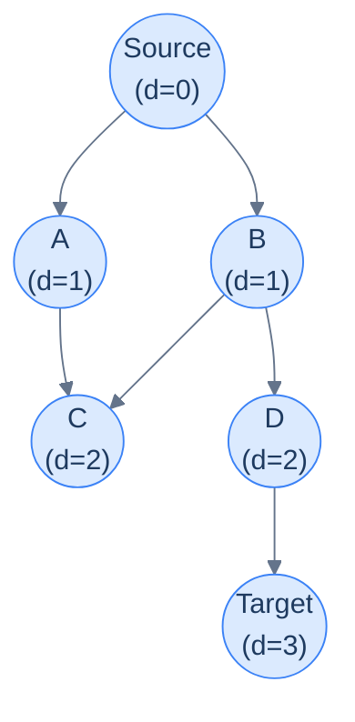

## Why It Exists

You met BFS as a *traversal* — visit nodes ring by ring outward. That ring-by-ring order hides a superpower: **the depth at which BFS first reaches a node is exactly its shortest distance from the source**, counted in edges.

That single fact makes BFS the simplest, fastest algorithm for *unweighted* shortest paths. No priority queue, no edge relaxation, no clever proof — the plain FIFO queue alone guarantees the answer. It applies anywhere distance equals hop-count: minimum moves through a maze, fewest word transformations between two dictionary words, degrees of separation in a social network, time for a fire or infection to reach every cell.



<p align="center"><strong>BFS layers from the source. Each node's <code>d</code> is its minimum hops from S; the first time BFS reaches a node, that's the answer.</strong></p>

## See It Work

Shortest path on that graph (0 = Source … 5 = Target). Each queue entry carries `(node, distance)`; the first time we pop the target, that distance is minimal.

```python run viz=graph viz-kind=graph
from collections import deque

adj = {0: [1, 2], 1: [0, 3], 2: [0, 3, 4], 3: [1, 2], 4: [2, 5], 5: [4]}

def bfs_dist(adj, source, target):
    queue = deque([(source, 0)])
    seen = {source}
    while queue:
        node, d = queue.popleft()                       # FIFO: nearest-first
        if node == target:
            return d                                    # first arrival = shortest
        for nb in adj[node]:
            if nb not in seen:
                seen.add(nb)                            # mark at PUSH time
                queue.append((nb, d + 1))
    return -1

print("0 -> 5:", bfs_dist(adj, 0, 5))                   # 3
print("0 -> 3:", bfs_dist(adj, 0, 3))                   # 2
```

```java run viz=graph viz-kind=graph
import java.util.*;

public class Main {
    static Map<Integer, List<Integer>> adj = Map.of(
        0, List.of(1, 2), 1, List.of(0, 3), 2, List.of(0, 3, 4), 3, List.of(1, 2), 4, List.of(2, 5), 5, List.of(4));

    static int bfsDist(int source, int target) {
        Deque<int[]> queue = new ArrayDeque<>();
        queue.add(new int[]{source, 0});
        Set<Integer> seen = new HashSet<>(); seen.add(source);
        while (!queue.isEmpty()) {
            int[] cur = queue.poll();                    // FIFO: nearest-first
            int node = cur[0], d = cur[1];
            if (node == target) return d;                // first arrival = shortest
            for (int nb : adj.get(node))
                if (seen.add(nb))                        // add returns false if already present (mark at PUSH)
                    queue.add(new int[]{nb, d + 1});
        }
        return -1;
    }

    public static void main(String[] args) {
        System.out.println("0 -> 5: " + bfsDist(0, 5));   // 3
        System.out.println("0 -> 3: " + bfsDist(0, 3));   // 2
    }
}
```

Both print `0 -> 5: 3` and `0 -> 3: 2` — the FIFO queue hands back the minimum hop-count for free.

## How It Works

BFS dequeues nodes in **nondecreasing order of distance**: everything at distance `d` comes out before anything at distance `d + 1`, because each node enqueues its neighbours (distance `d + 1`) only after itself. So the *first* time a node is reached, it is reached by a shortest path — and you can stop the instant you pop the target. The template is plain BFS plus two habits:

```
shortestPathBFS(graph, source, target):
    queue = [(source, 0)];  seen = {source}
    while queue:
        (node, d) = queue.popleft()
        if node == target: return d          # first pop = shortest
        for nb in graph[node]:
            if nb not in seen:
                seen.add(nb)                  # (1) mark at PUSH, not POP
                queue.push((nb, d + 1))       # (2) carry distance in the entry
    return -1
```

1. **Mark visited at push, not pop** — otherwise a node enters the queue several times (once per parent), the queue balloons, and some distance variants go wrong.
2. **Carry the distance in each entry** — no separate `dist[]` array, and the early-exit at the target is trivial.

For grids the graph is *implicit*: "neighbours" come from a 4- or 8-direction delta array, no adjacency list needed.

> **Key takeaway.** On an *unweighted* graph, BFS = shortest path. The FIFO queue explores in nondecreasing distance order, so a node's first discovery is its minimum hop-count. Mark on push, carry the distance, exit on first hitting the target. `O(V + E)`.

## Trace It

It's tempting to think any traversal that records distance would find the shortest path. But BFS's correctness rests entirely on the **FIFO** queue. Consider a graph with a short route `0 → 2 → 5` (2 hops) and a long detour `0 → 1 → 3 → 5` (3 hops).

**Predict before you run:** keep the code identical but pop from the *end* of the frontier (LIFO, turning BFS into DFS). Does it still return the shortest distance 2?

```python run viz=graph viz-kind=graph
def search(graph, source, target, use_stack):
    frontier = [(source, 0)]; seen = {source}
    while frontier:
        node, d = frontier.pop() if use_stack else frontier.pop(0)   # LIFO vs FIFO
        if node == target:
            return d
        for nb in graph[node]:
            if nb not in seen:
                seen.add(nb); frontier.append((nb, d + 1))
    return -1

# short path 0->2->5 (2 hops); long detour 0->1->3->5 (3 hops)
graph = {0: [2, 1], 1: [3], 2: [5], 3: [5], 5: []}
print("FIFO (BFS): ", search(graph, 0, 5, use_stack=False))
print("LIFO (DFS): ", search(graph, 0, 5, use_stack=True))
```

<details>
<summary><strong>Reveal</strong></summary>

FIFO returns `2`; LIFO returns `3`. With a stack, the search dives down the first branch it can — here the long detour `0 → 1 → 3 → 5` — and *marks the target* the moment it arrives, at distance 3. Because we mark on push, that wrong distance sticks; the short route never gets to overwrite it. BFS avoids this precisely because FIFO drains everything at distance `d` before touching distance `d + 1`, so the target is always first reached along a shortest path. DFS happily *finds a path*, but not the shortest one — swapping the data structure silently breaks the guarantee.

</details>

## Your Turn

The grid classic: **Shortest Path in Binary Matrix** ([LeetCode 1091](https://leetcode.com/problems/shortest-path-in-binary-matrix/)). From the top-left to the bottom-right of an `n × n` grid, moving through `0` cells in any of **8** directions, return the number of cells on the shortest clear path (or `-1`).

```python run viz=grid
from collections import deque

def shortest_path_binary_matrix(grid):
    n = len(grid)
    if grid[0][0] or grid[n-1][n-1]: return -1          # blocked start/end
    q = deque([(0, 0, 1)]); seen = {(0, 0)}             # distance counts CELLS, start = 1
    while q:
        r, c, d = q.popleft()
        if r == n-1 and c == n-1: return d
        for dr in (-1, 0, 1):
            for dc in (-1, 0, 1):                       # 8 directions
                if dr == 0 and dc == 0: continue
                nr, nc = r + dr, c + dc
                if 0 <= nr < n and 0 <= nc < n and not grid[nr][nc] and (nr, nc) not in seen:
                    seen.add((nr, nc)); q.append((nr, nc, d + 1))
    return -1

print(shortest_path_binary_matrix([[0,0,0],[1,1,0],[1,1,0]]))   # 4
print(shortest_path_binary_matrix([[1,0,0],[1,1,0],[1,1,0]]))   # -1
```

```java run viz=grid
import java.util.*;

public class Main {
    static int shortestPathBinaryMatrix(int[][] grid) {
        int n = grid.length;
        if (grid[0][0] == 1 || grid[n-1][n-1] == 1) return -1;
        Deque<int[]> q = new ArrayDeque<>();
        q.add(new int[]{0, 0, 1});                       // distance counts CELLS, start = 1
        boolean[][] seen = new boolean[n][n]; seen[0][0] = true;
        while (!q.isEmpty()) {
            int[] cur = q.poll();
            int r = cur[0], c = cur[1], d = cur[2];
            if (r == n-1 && c == n-1) return d;
            for (int dr = -1; dr <= 1; dr++)
                for (int dc = -1; dc <= 1; dc++) {       // 8 directions
                    if (dr == 0 && dc == 0) continue;
                    int nr = r + dr, nc = c + dc;
                    if (nr >= 0 && nr < n && nc >= 0 && nc < n && grid[nr][nc] == 0 && !seen[nr][nc]) {
                        seen[nr][nc] = true; q.add(new int[]{nr, nc, d + 1});
                    }
                }
        }
        return -1;
    }

    public static void main(String[] args) {
        System.out.println(shortestPathBinaryMatrix(new int[][]{{0,0,0},{1,1,0},{1,1,0}}));   // 4
        System.out.println(shortestPathBinaryMatrix(new int[][]{{1,0,0},{1,1,0},{1,1,0}}));   // -1
    }
}
```

Both print `4` then `-1`: the clear diagonal-friendly path is 4 cells, and a blocked start is unreachable. The four problems in this section's **Problems** folder drill the variants — grid steps, nearest-distance, and word-transformation ladders.

## Reflect & Connect

- **BFS is Dijkstra with all weights = 1.** When every edge costs the same, the priority queue collapses to a plain FIFO queue and "process the cheapest frontier node" becomes "process the nearest." The moment edges have *different* weights, you need [Dijkstra](/cortex/data-structures-and-algorithms/graphs-single-source-shortest-path) and a heap.
- **0/1 weights → 0-1 BFS.** If edges cost only 0 or 1, a *double-ended* queue (push 0-cost neighbours to the front, 1-cost to the back) gives Dijkstra's answer in `O(V + E)` — a neat midpoint between BFS and Dijkstra.
- **Multi-source BFS** seeds the queue with *all* sources at distance 0 (rotting oranges, nearest-exit, fire spread). One sweep computes every cell's distance to its nearest source — same code, many start nodes.
- **DFS finds *a* path, BFS finds the *shortest*.** If a problem asks for *all* paths or *any* path, reach for the [DFS pattern](/cortex/data-structures-and-algorithms/graphs-pattern-depth-first-search); if it asks for *fewest steps* on uniform-cost moves, it's BFS.

## Recall

<details>
<summary><strong>Q:</strong> Why does BFS give the shortest path on an unweighted graph?</summary>

**A:** The FIFO queue dequeues nodes in nondecreasing distance order — everything at distance `d` before anything at `d + 1` — so a node's first discovery is along a shortest path.

</details>
<details>
<summary><strong>Q:</strong> Two habits in the BFS shortest-path template?</summary>

**A:** Mark a node visited at *push* time (not pop), and carry the distance inside each queue entry so the early-exit at the target is trivial and the queue never balloons.

</details>
<details>
<summary><strong>Q:</strong> Why would swapping the queue for a stack break it?</summary>

**A:** A stack (DFS) dives down one branch and may reach the target via a longer route first; marking on push freezes that wrong distance. Only FIFO order guarantees first-arrival = shortest.

</details>
<details>
<summary><strong>Q:</strong> When do you need Dijkstra instead of BFS?</summary>

**A:** When edges have differing weights. BFS only works when every edge costs the same (unweighted). For 0/1 weights, 0-1 BFS with a deque is the lightweight middle ground.

</details>
<details>
<summary><strong>Q:</strong> How do grids fit this pattern?</summary>

**A:** A grid is an implicit graph: each cell is a node, neighbours come from 4- or 8-direction deltas. No adjacency list — generate neighbours on the fly and bounds-check.

</details>

## Sources & Verify

- **CLRS** (Cormen, Leiserson, Rivest, Stein), *Introduction to Algorithms*, 3rd ed., §22.2 — breadth-first search and the theorem that BFS computes shortest-path distances on unweighted graphs.
- **Sedgewick & Wayne**, *Algorithms*, 4th ed., §4.1 — `BreadthFirstPaths`: BFS shortest paths in number of edges, with the FIFO-order argument.
- **Skiena**, *The Algorithm Design Manual*, 3rd ed., §5.6–5.7 — BFS, its shortest-path property, and 0-1 BFS / multi-source extensions.
- **LeetCode 1091** "Shortest Path in Binary Matrix" and **127** "Word Ladder" are the canonical drills. The `3`/`2`, FIFO-vs-LIFO `2`/`3`, and `4`/`-1` outputs above come from the runnable blocks — re-run to verify.
