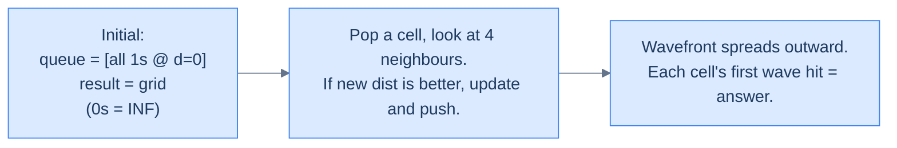

# Problem: Nearest Distance (Multi-Source BFS)

## The Problem

Grid of `0`s and `1`s. For *every* cell, return its distance to the nearest `1` (Manhattan distance, only horizontal/vertical movement).

```
Input:  grid = [[0, 0, 0, 0],
                [0, 0, 1, 0],
                [0, 0, 0, 0],
                [0, 0, 0, 0]]
Output: [[3, 2, 1, 2],
         [2, 1, 0, 1],
         [3, 2, 1, 2],
         [4, 3, 2, 3]]
```

<details>
<summary><h2>Pattern Mapping — Multi-Source BFS</h2></summary>


The trick: instead of running BFS from each `1` separately (`O(N * (R*C))`), **enqueue every `1` simultaneously at distance 0**, then BFS once. This is **multi-source BFS** — and it's a beautiful, common, often-missed pattern.

The wavefront expands from *all* the 1s in lockstep. The first time any wave reaches a cell, that's the distance to the nearest 1.



<p align="center"><strong>Multi-source BFS. Seed all 1s at distance 0; the unified wavefront races outward and fills the rest of the grid.</strong></p>

> *Before reading on — why does enqueueing every 1 at distance 0 work? Why doesn't it confuse the algorithm?*

Because BFS is **breadth-first** — it dequeues all distance-0 nodes before any distance-1 node, all distance-1 before any distance-2, and so on. The starting set is just bigger than usual; the order property still holds. Every cell still gets reached at its true minimum distance to *any* 1.

</details>
<details>
<summary><h2>The Solution</h2></summary>


```python run viz=grid viz-root=grid
from typing import List, Tuple
from queue import Queue

class Cell:
    def __init__(self, row: int, col: int, distance: int):
        self.row = row
        self.col = col
        self.distance = distance

class Solution:
    def is_valid_cell(
        self, row: int, col: int, rows: int, cols: int
    ) -> bool:
        return 0 <= row < rows and 0 <= col < cols

    def nearest_distance(self, grid: List[List[int]]) -> List[List[int]]:
        rows = len(grid)
        cols = len(grid[0])

        # Create a result matrix to store the nearest distances
        result = [[float("inf")] * cols for _ in range(rows)]

        # Create a queue for BFS traversal
        queue = Queue()

        # Enqueue all the cells with value 1 and initialize their
        # distance as 0
        for row in range(rows):
            for col in range(cols):
                if grid[row][col] == 1:
                    queue.put(Cell(row, col, 0))
                    result[row][col] = 0

        # Define the possible movements: up, right, down, left
        directions: List[Tuple[int, int]] = [
            (-1, 0),  # up
            (0, 1),   # right
            (1, 0),   # down
            (0, -1)   # left
        ]

        while not queue.empty():
            curr_cell = queue.get()

            curr_row = curr_cell.row
            curr_col = curr_cell.col
            curr_distance = curr_cell.distance

            # Explore the neighbours
            for dr, dc in directions:
                new_row = curr_row + dr
                new_col = curr_col + dc

                # Check if the new cell is within the grid boundaries
                # and has a greater distance than the current distance
                if self.is_valid_cell(new_row, new_col, rows, cols) and \
                   curr_distance + 1 < result[new_row][new_col]:

                    # Update the distance for the new cell
                    result[new_row][new_col] = curr_distance + 1

                    # Add the new cell to the queue    
                    queue.put(
                        Cell(new_row, new_col, curr_distance + 1)
                    )

        return result


# Examples from the problem statement
print(Solution().nearest_distance([[0,0,0,0],[0,0,1,0],[0,0,0,0],[0,0,0,0]]))
# [[3,2,1,2],[2,1,0,1],[3,2,1,2],[4,3,2,3]]
print(Solution().nearest_distance([[1,0,0],[0,1,0],[0,0,0]]))
# [[0,1,2],[1,0,1],[2,1,2]]

# Edge cases
print(Solution().nearest_distance([[1]]))               # [[0]] — single cell is 1
print(Solution().nearest_distance([[0]]))               # [[inf]] — single cell is 0
print(Solution().nearest_distance([[1,1],[1,1]]))       # [[0,0],[0,0]] — all 1s
print(Solution().nearest_distance([[1,0],[0,0]]))       # [[0,1],[1,2]] — one source corner
print(Solution().nearest_distance([[0,0],[0,1]]))       # [[2,1],[1,0]] — one source far corner
```

```java run viz=grid viz-root=grid
import java.util.*;

public class Main {
    static class Cell {

        int row;
        int col;
        int distance;

        Cell(int row, int col, int distance) {
            this.row = row;
            this.col = col;
            this.distance = distance;
        }
    }

    static class Solution {
        private boolean isValidCell(int row, int col, int rows, int cols) {
            return row >= 0 && row < rows && col >= 0 && col < cols;
        }

        public int[][] nearestDistance(int[][] grid) {
            int rows = grid.length;
            int cols = grid[0].length;

            // Create a result matrix to store the nearest distances
            int[][] result = new int[rows][cols];
            for (int row = 0; row < rows; row++) {
                Arrays.fill(result[row], Integer.MAX_VALUE);
            }

            // Create a queue for BFS traversal
            Queue<Cell> queue = new LinkedList<>();

            // Enqueue all the cells with value 1 and initialize their
            // distance as 0
            for (int row = 0; row < rows; row++) {
                for (int col = 0; col < cols; col++) {
                    if (grid[row][col] == 1) {
                        queue.add(new Cell(row, col, 0));
                        result[row][col] = 0;
                    }
                }
            }

            // Define the possible movements: up, right, down, left
            int[][] directions = {
                {-1, 0}, // up
                {0, 1},  // right
                {1, 0},  // down
                {0, -1}  // left
            };

            while (!queue.isEmpty()) {
                Cell currCell = queue.poll();

                int currRow = currCell.row;
                int currCol = currCell.col;
                int currDistance = currCell.distance;

                // Explore the neighbours
                for (int[] dir : directions) {
                    int newRow = currRow + dir[0];
                    int newCol = currCol + dir[1];

                    // Check if the new cell is within the grid boundaries 
                    // and has a greater distance than the current distance
                    if (isValidCell(newRow, newCol, rows, cols) &&
                        currDistance + 1 < result[newRow][newCol]) {

                        // Update the distance for the new cell
                        result[newRow][newCol] = currDistance + 1;

                        // Add the new cell to the queue
                        queue.add(
                            new Cell(newRow, newCol, currDistance + 1)
                        );
                    }
                }
            }

            return result;
        }
    }

    public static void main(String[] args) {
        Solution sol = new Solution();

        // Examples from the problem statement
        System.out.println(Arrays.deepToString(sol.nearestDistance(new int[][]{{0,0,0,0},{0,0,1,0},{0,0,0,0},{0,0,0,0}})));
        // [[3,2,1,2],[2,1,0,1],[3,2,1,2],[4,3,2,3]]
        System.out.println(Arrays.deepToString(sol.nearestDistance(new int[][]{{1,0,0},{0,1,0},{0,0,0}})));
        // [[0,1,2],[1,0,1],[2,1,2]]

        // Edge cases
        System.out.println(Arrays.deepToString(sol.nearestDistance(new int[][]{{1}})));               // [[0]]
        System.out.println(Arrays.deepToString(sol.nearestDistance(new int[][]{{1,1},{1,1}})));       // [[0,0],[0,0]]
        System.out.println(Arrays.deepToString(sol.nearestDistance(new int[][]{{1,0},{0,0}})));       // [[0,1],[1,2]]
        System.out.println(Arrays.deepToString(sol.nearestDistance(new int[][]{{0,0},{0,1}})));       // [[2,1],[1,0]]
    }
}
```


The multi-source pattern is **massively** more efficient than running BFS once per source (`O(K * R*C)` where K = number of sources). Multi-source BFS is `O(R*C)` regardless of how many sources you start with. Same algorithm, fundamentally better complexity.

</details>
