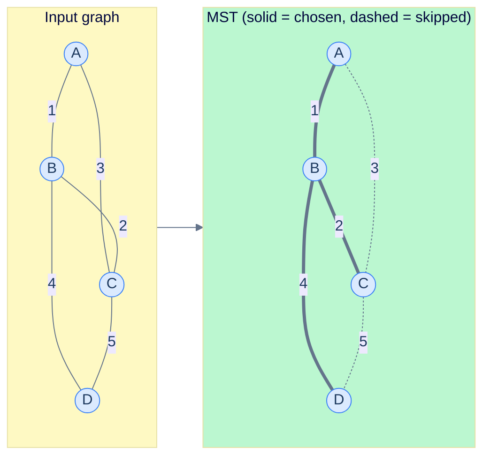

# Minimum Spanning Trees

## Why It Exists

You're laying internet cable across a country. The map is a graph: cities are vertices, possible cable runs are edges, each edge labelled with a cost (distance × terrain). You need every city reachable from every other, at minimum total cost.

Lay *every* possible cable and you pay for redundancy you don't need. Lay them haphazardly and you either miss a city or pick needlessly expensive routes. The sweet spot is a **spanning tree** — a subset of exactly `V − 1` edges that connects all `V` vertices with no cycles. The spanning tree of *minimum total weight* is the **Minimum Spanning Tree (MST)**.

Every "connect everything as cheaply as possible" problem has this shape: power grids, water mains, road networks, cluster interconnects, even single-linkage clustering in ML. Two greedy algorithms — both `O(E log V)` — solve it. **Kruskal** sorts edges and picks the cheapest ones that don't close a cycle. **Prim** grows a tree from a seed, always reaching out along the cheapest edge to a vertex it hasn't claimed yet.

## See It Work

Both algorithms on the same 4-vertex graph. They may pick different edges when weights tie, but the *total* is identical — that's the theorem at the heart of MSTs.

```python run viz=graph viz-kind=graph
import heapq

class DSU:                                              # union-find: "same component?"
    def __init__(self, n): self.parent = list(range(n)); self.rank = [0] * n
    def find(self, x):
        if self.parent[x] != x: self.parent[x] = self.find(self.parent[x])
        return self.parent[x]
    def union(self, x, y):
        rx, ry = self.find(x), self.find(y)
        if rx == ry: return False                       # already connected → would form a cycle
        if self.rank[rx] < self.rank[ry]: rx, ry = ry, rx
        self.parent[ry] = rx
        if self.rank[rx] == self.rank[ry]: self.rank[rx] += 1
        return True

def kruskal(n, edges):
    dsu, total, picked = DSU(n), 0, 0
    for u, v, w in sorted(edges, key=lambda e: e[2]):   # cheapest edge first
        if dsu.union(u, v):                             # endpoints in different components → take it
            total += w; picked += 1
            if picked == n - 1: break                   # V−1 edges → tree is complete
    return total

def prim(n, adj, start=0):
    seen = [False] * n
    pq = [(0, start)]                                   # (edge weight, vertex)
    total = 0
    while pq:
        w, u = heapq.heappop(pq)                        # cheapest edge crossing out of the tree
        if seen[u]: continue                            # stale duplicate — skip it
        seen[u] = True; total += w
        for v, wt in adj[u]:
            if not seen[v]: heapq.heappush(pq, (wt, v))
    return total

edges = [(0, 1, 1), (0, 2, 3), (1, 2, 2), (1, 3, 4), (2, 3, 5)]   # A=0 B=1 C=2 D=3
n = 4
adj = [[] for _ in range(n)]
for u, v, w in edges: adj[u].append((v, w)); adj[v].append((u, w))

print("Kruskal MST total =", kruskal(n, edges))
print("Prim MST total    =", prim(n, adj))
```

```java run viz=graph viz-kind=graph
import java.util.*;

public class Main {
    static class DSU {
        int[] p, r;
        DSU(int n) { p = new int[n]; r = new int[n]; for (int i = 0; i < n; i++) p[i] = i; }
        int find(int x) { return p[x] == x ? x : (p[x] = find(p[x])); }
        boolean union(int x, int y) {
            int rx = find(x), ry = find(y);
            if (rx == ry) return false;                 // already connected → cycle
            if (r[rx] < r[ry]) { int t = rx; rx = ry; ry = t; }
            p[ry] = rx;
            if (r[rx] == r[ry]) r[rx]++;
            return true;
        }
    }

    static int kruskal(int n, int[][] edges) {
        Arrays.sort(edges, Comparator.comparingInt(e -> e[2]));   // cheapest first
        DSU dsu = new DSU(n);
        int total = 0, picked = 0;
        for (int[] e : edges)
            if (dsu.union(e[0], e[1])) { total += e[2]; if (++picked == n - 1) break; }
        return total;
    }

    static int prim(int n, List<int[]>[] adj, int start) {
        boolean[] seen = new boolean[n];
        PriorityQueue<int[]> pq = new PriorityQueue<>((a, b) -> a[0] - b[0]);   // (weight, vertex)
        pq.offer(new int[]{0, start});
        int total = 0;
        while (!pq.isEmpty()) {
            int[] cur = pq.poll();
            int w = cur[0], u = cur[1];
            if (seen[u]) continue;                      // stale duplicate
            seen[u] = true; total += w;
            for (int[] nb : adj[u]) if (!seen[nb[0]]) pq.offer(new int[]{nb[1], nb[0]});
        }
        return total;
    }

    public static void main(String[] args) {
        int n = 4;
        int[][] edges = {{0,1,1}, {0,2,3}, {1,2,2}, {1,3,4}, {2,3,5}};
        System.out.println("Kruskal MST total = " + kruskal(n, edges));

        List<int[]>[] adj = new List[n];
        for (int i = 0; i < n; i++) adj[i] = new ArrayList<>();
        for (int[] e : edges) { adj[e[0]].add(new int[]{e[1], e[2]}); adj[e[1]].add(new int[]{e[0], e[2]}); }
        System.out.println("Prim MST total    = " + prim(n, adj, 0));
    }
}
```

Both print `7`. The MST takes edges A–B (1), B–C (2), and B–D (4); it skips A–C (3) and C–D (5) because cheaper edges already connect those vertices.

## How It Works

One theorem powers both algorithms:

> **Cut property.** Split the vertices into any two non-empty groups. The **lightest edge crossing the split** belongs to *some* MST.

That's it. The cheapest edge bridging any partition is always safe to take. Kruskal and Prim are just two strategies for choosing which partition to look at next.

- **Kruskal** walks edges cheapest-first. Each edge it accepts is the lightest edge crossing the cut between its two components — so union-find's "are these already in the same component?" check is exactly the cycle test. Sorting dominates: `O(E log E) = O(E log V)`.
- **Prim** keeps one growing tree and a min-heap of edges leaving it. Each pop is the lightest edge crossing the cut "tree vs. everything else." With a binary heap: `O((V + E) log V) = O(E log V)`.



<p align="center"><strong>Kruskal adds edges in weight order, skipping any that would close a cycle. Total weight: 1 + 2 + 4 = 7.</strong></p>

> **Key takeaway.** The cut property is the engine; **sort + union-find = Kruskal**, **heap + frontier = Prim**. Both are greedy and both are provably optimal because every edge they take is the lightest one crossing some cut.

## Trace It

Look again at Prim's `if seen[u]: continue` line. We push a vertex onto the heap *once per incident edge*, so the same vertex can sit in the heap several times with different weights. The guard skips the stale copies — the first (cheapest) pop wins. It's the cheap stand-in for a textbook `decreaseKey`.

**Predict before you run:** delete that guard and re-run Prim on the same graph. Does it still print `7`?

```python run viz=graph viz-kind=graph
import heapq

def prim_no_guard(n, adj, start=0):
    seen = [False] * n
    pq = [(0, start)]
    total, pops = 0, 0
    while pq:
        w, u = heapq.heappop(pq)
        pops += 1
        # guard removed: NO `if seen[u]: continue`
        seen[u] = True; total += w
        for v, wt in adj[u]:
            if not seen[v]: heapq.heappush(pq, (wt, v))
    return total, pops

edges = [(0, 1, 1), (0, 2, 3), (1, 2, 2), (1, 3, 4), (2, 3, 5)]
n = 4
adj = [[] for _ in range(n)]
for u, v, w in edges: adj[u].append((v, w)); adj[v].append((u, w))

total, pops = prim_no_guard(n, adj)
print(f"total = {total} from {pops} pops (a 4-vertex tree should cost 7 from 4 pops)")
```

<details>
<summary><strong>Reveal</strong></summary>

It prints `total = 20 from 7 pops`. Without the guard, every stale heap copy gets counted: vertex C and D each enter the heap from two different tree edges, and *both* copies add their weight. Seven contributions instead of four inflates the total from 7 to 20. The `if seen[u]: continue` line is not an optimisation — it is what makes lazy Prim *correct*. (A "true" Prim would `decreaseKey` an existing heap entry instead; real heaps can't do that cheaply, so every standard library uses this push-duplicates-and-skip trick.)

</details>

## Your Turn

The classic MST application: **Min Cost to Connect All Points** ([LeetCode 1584](https://leetcode.com/problems/min-cost-to-connect-all-points/)). Given 2D points, the cost to connect two of them is their Manhattan distance. Build the complete graph and run Kruskal.

```python run viz=graph viz-kind=graph
class DSU:
    def __init__(self, n): self.parent = list(range(n)); self.rank = [0] * n
    def find(self, x):
        if self.parent[x] != x: self.parent[x] = self.find(self.parent[x])
        return self.parent[x]
    def union(self, x, y):
        rx, ry = self.find(x), self.find(y)
        if rx == ry: return False
        if self.rank[rx] < self.rank[ry]: rx, ry = ry, rx
        self.parent[ry] = rx
        if self.rank[rx] == self.rank[ry]: self.rank[rx] += 1
        return True

def min_cost_connect(points):
    m = len(points)
    edges = []
    for i in range(m):
        for j in range(i + 1, m):                       # every pair is a candidate edge
            d = abs(points[i][0] - points[j][0]) + abs(points[i][1] - points[j][1])
            edges.append((i, j, d))
    dsu, total, picked = DSU(m), 0, 0
    for u, v, w in sorted(edges, key=lambda e: e[2]):
        if dsu.union(u, v):
            total += w; picked += 1
            if picked == m - 1: break
    return total

print(min_cost_connect([[0, 0], [2, 2], [3, 10], [5, 2], [7, 0]]))   # 20
print(min_cost_connect([[0, 0], [1, 1], [2, 2]]))                    # 4
```

```java run viz=graph viz-kind=graph
import java.util.*;

public class Main {
    static class DSU {
        int[] p, r;
        DSU(int n) { p = new int[n]; r = new int[n]; for (int i = 0; i < n; i++) p[i] = i; }
        int find(int x) { return p[x] == x ? x : (p[x] = find(p[x])); }
        boolean union(int x, int y) {
            int rx = find(x), ry = find(y);
            if (rx == ry) return false;
            if (r[rx] < r[ry]) { int t = rx; rx = ry; ry = t; }
            p[ry] = rx;
            if (r[rx] == r[ry]) r[rx]++;
            return true;
        }
    }

    static int minCostConnect(int[][] points) {
        int m = points.length;
        List<int[]> edges = new ArrayList<>();
        for (int i = 0; i < m; i++)
            for (int j = i + 1; j < m; j++) {
                int d = Math.abs(points[i][0] - points[j][0]) + Math.abs(points[i][1] - points[j][1]);
                edges.add(new int[]{i, j, d});
            }
        edges.sort(Comparator.comparingInt(e -> e[2]));
        DSU dsu = new DSU(m);
        int total = 0, picked = 0;
        for (int[] e : edges)
            if (dsu.union(e[0], e[1])) { total += e[2]; if (++picked == m - 1) break; }
        return total;
    }

    public static void main(String[] args) {
        System.out.println(minCostConnect(new int[][]{{0,0},{2,2},{3,10},{5,2},{7,0}}));   // 20
        System.out.println(minCostConnect(new int[][]{{0,0},{1,1},{2,2}}));                // 4
    }
}
```

Both print `20` then `4`. When you're ready for more: **Connecting Cities With Minimum Cost** (LeetCode 1135 — return `-1` if fewer than `n − 1` edges get taken, i.e. the graph is disconnected), and **Optimize Water Distribution** (LeetCode 1168 — model each well as an edge from a virtual vertex 0).

## Reflect & Connect

- **MST is *not* a shortest-path tree.** The MST minimises *total* edge weight, not the distance between any specific pair. The path between two vertices inside the MST can be far longer than their true shortest path — different objective, different algorithm. (Contrast [Single-Source Shortest Path](/cortex/data-structures-and-algorithms/graphs/single-source-shortest-path).)
- **Prim is Dijkstra's structural twin.** Both grow a frontier out of a min-heap. The only difference is the key: Prim orders by *edge weight* (cost to attach one more vertex), Dijkstra by *cumulative distance from the source*. Learn one and the other is a one-line edit.
- **Negative weights are fine.** Unlike Dijkstra, both MST algorithms work unchanged with negative edges — the cut property never assumed non-negativity.
- **Uniqueness.** The MST is unique iff all edge weights are distinct; ties allow several MSTs with the same total.
- **Where it shows up:** single-linkage hierarchical clustering is *literally* building an MST over a distance graph and cutting the heaviest edges; Felzenszwalb image segmentation grows segments as MST subtrees below a threshold; NetworkX's `minimum_spanning_tree` defaults to Kruskal. A third algorithm, **Borůvka's**, runs the cut property on *all* components at once each round (`O(log V)` rounds) and parallelises better than either.

## Recall

<details>
<summary><strong>Q:</strong> What is the cut property, and why does it matter?</summary>

**A:** For any partition of the vertices into two non-empty groups, the lightest edge crossing the partition is in some MST. It's the single theorem behind both Kruskal and Prim — every edge they accept is the cheapest edge across some cut.

</details>
<details>
<summary><strong>Q:</strong> Kruskal vs. Prim in one line each?</summary>

**A:** Kruskal: sort edges by weight, accept any whose endpoints are in different union-find components, stop at `V − 1` edges. Prim: grow a tree from a seed, repeatedly pop the lightest edge to an unclaimed vertex from a min-heap.

</details>
<details>
<summary><strong>Q:</strong> Time complexity of each?</summary>

**A:** Both `O(E log V)`. Kruskal is dominated by the sort; Prim with a binary heap is `O((V + E) log V)`. On dense graphs, Prim with an adjacency matrix and no heap runs in `O(V²)`, beating Kruskal.

</details>
<details>
<summary><strong>Q:</strong> Why does lazy Prim push duplicate heap entries and skip them on pop?</summary>

**A:** A vertex can be reached by several tree edges, each pushing a `(weight, vertex)` copy. Real heaps can't cheaply update an existing entry's priority (`decreaseKey`), so we push all copies and skip any vertex already in the tree (`if seen[u]: continue`). The first pop is the cheapest, so correctness holds.

</details>
<details>
<summary><strong>Q:</strong> Do MST algorithms need non-negative edge weights?</summary>

**A:** No. Both handle negative weights without modification — that's a Dijkstra requirement, not an MST one.

</details>

## Sources & Verify

- **CLRS** (Cormen, Leiserson, Rivest, Stein), *Introduction to Algorithms*, 3rd ed., Ch. 23 — "Minimum Spanning Trees": the cut property (Theorem 23.1), Kruskal, and Prim with full correctness proofs.
- **Sedgewick & Wayne**, *Algorithms*, 4th ed., §4.3 — MST, the cut property, and the lazy vs. eager Prim distinction worked in detail.
- **Skiena**, *The Algorithm Design Manual*, 3rd ed., §8.1 — MST applications (clustering, network design) and Borůvka's algorithm.
- **NetworkX** `minimum_spanning_tree` ([reference](https://networkx.org/documentation/stable/reference/algorithms/generated/networkx.algorithms.tree.mst.minimum_spanning_tree.html)) defaults to Kruskal; the Boost Graph Library ships both `kruskal_minimum_spanning_tree` and `prim_minimum_spanning_tree` as the canonical C++ implementations.
- The `7`, `20`, and `4` totals above are produced by the runnable blocks; re-run them to verify Kruskal and Prim agree.
