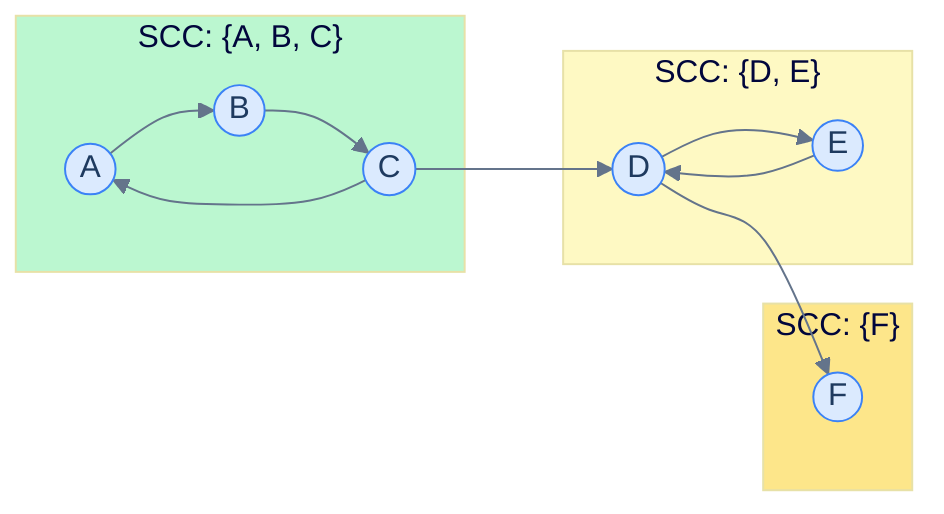

# Strongly Connected Components

## Why It Exists

In a directed graph, a **strongly connected component (SCC)** is a maximal set of vertices where every vertex can reach every other *following edge directions*. In an undirected graph "reachable from" is symmetric, so components and SCCs are the same thing. In a directed graph they are not: A can reach B without B reaching A, so a graph can look connected yet split into many SCCs.

Directionality is real wherever edges mean "depends on", "links to", or "calls":

- **Circular dependencies.** "Module A imports B" is directional. An SCC of size ≥ 2 in the import graph is a dependency cycle you need to break.
- **Compilers.** Mutually-recursive function definitions form a single SCC; the rest of the call graph is a DAG of SCCs.
- **The web.** Pages link directionally. The "core" of the web — one giant SCC where every page reaches every other — is its dominant structural feature.
- **2-SAT.** The next chapter reduces every 2-SAT instance to an SCC computation on an implication graph.

Two `O(V + E)` algorithms find all SCCs. **Kosaraju** runs two DFS passes — easy to remember. **Tarjan** runs a single pass with a stack and a "lowlink" trick — subtler, but one pass and the production default.

## See It Work

The same directed graph, both algorithms. They emit SCCs in different orders internally, but the *set* of SCCs is identical — and after canonicalizing (sort each SCC, then sort SCCs by first element) both algorithms produce the same output. The graph crosses stdin as a directed adjacency list. Pick a case and **Run** it.

```python run viz=graph viz-kind=graph
import ast
import sys
sys.setrecursionlimit(10**6)

def kosaraju(graph):
    n = len(graph)
    visited = [False] * n
    order = []                                          # vertices by DFS finish time
    def dfs1(u):
        visited[u] = True
        for v in graph[u]:
            if not visited[v]: dfs1(v)
        order.append(u)                                 # push on finish (post-order)
    for i in range(n):
        if not visited[i]: dfs1(i)

    adj_t = [[] for _ in range(n)]                      # transpose: reverse every edge
    for u in range(n):
        for v in graph[u]: adj_t[v].append(u)

    visited = [False] * n
    sccs = []
    for u in reversed(order):                           # latest finisher first
        if not visited[u]:
            scc, stk = [], [u]; visited[u] = True
            while stk:                                  # DFS the transpose
                x = stk.pop(); scc.append(x)
                for y in adj_t[x]:
                    if not visited[y]: visited[y] = True; stk.append(y)
            sccs.append(scc)
    return sccs

def tarjan(graph):
    n = len(graph)
    disc = [-1] * n; low = [-1] * n; on_stack = [False] * n
    stk, sccs, timer = [], [], [0]
    def dfs(u):
        disc[u] = low[u] = timer[0]; timer[0] += 1
        stk.append(u); on_stack[u] = True
        for v in graph[u]:
            if disc[v] == -1:                           # tree edge
                dfs(v); low[u] = min(low[u], low[v])
            elif on_stack[v]:                           # back/cross edge into current path
                low[u] = min(low[u], disc[v])
        if low[u] == disc[u]:                           # u is an SCC root
            scc = []
            while True:
                w = stk.pop(); on_stack[w] = False; scc.append(w)
                if w == u: break
            sccs.append(scc)
    for v in range(n):
        if disc[v] == -1: dfs(v)
    return sccs

def canonical(sccs):
    # sort nodes within each SCC, then sort SCCs by first element
    sorted_sccs = [sorted(s) for s in sccs]
    return sorted(sorted_sccs)

graph = ast.literal_eval(input())
k = canonical(kosaraju(graph))
t = canonical(tarjan(graph))
print("Kosaraju:", k)
print("Tarjan:  ", t)
print("same set:", "true" if k == t else "false")
```

```java run viz=graph viz-kind=graph
import java.util.*;

public class Main {
    static List<List<Integer>> kosaraju(int n, List<List<Integer>> adj) {
        boolean[] visited = new boolean[n];
        Deque<Integer> order = new ArrayDeque<>();
        for (int i = 0; i < n; i++) if (!visited[i]) dfs1(i, adj, visited, order);

        List<List<Integer>> adjT = new ArrayList<>();   // transpose
        for (int i = 0; i < n; i++) adjT.add(new ArrayList<>());
        for (int u = 0; u < n; u++) for (int v : adj.get(u)) adjT.get(v).add(u);

        Arrays.fill(visited, false);
        List<List<Integer>> sccs = new ArrayList<>();
        while (!order.isEmpty()) {                       // latest finisher first
            int s = order.pop();
            if (visited[s]) continue;
            List<Integer> scc = new ArrayList<>();
            Deque<Integer> stk = new ArrayDeque<>(); stk.push(s); visited[s] = true;
            while (!stk.isEmpty()) {                     // DFS the transpose
                int x = stk.pop(); scc.add(x);
                for (int y : adjT.get(x)) if (!visited[y]) { visited[y] = true; stk.push(y); }
            }
            sccs.add(scc);
        }
        return sccs;
    }
    static void dfs1(int u, List<List<Integer>> adj, boolean[] vis, Deque<Integer> order) {
        vis[u] = true;
        for (int v : adj.get(u)) if (!vis[v]) dfs1(v, adj, vis, order);
        order.push(u);                                   // push on finish
    }

    static int[] disc, low; static boolean[] onStack;
    static Deque<Integer> tstk = new ArrayDeque<>();
    static List<List<Integer>> tsccs = new ArrayList<>(); static int timer = 0;
    static void tarjanDfs(int u, List<List<Integer>> adj) {
        disc[u] = low[u] = timer++; tstk.push(u); onStack[u] = true;
        for (int v : adj.get(u)) {
            if (disc[v] == -1) { tarjanDfs(v, adj); low[u] = Math.min(low[u], low[v]); }
            else if (onStack[v]) low[u] = Math.min(low[u], disc[v]);
        }
        if (low[u] == disc[u]) {                          // SCC root
            List<Integer> scc = new ArrayList<>();
            while (true) { int w = tstk.pop(); onStack[w] = false; scc.add(w); if (w == u) break; }
            tsccs.add(scc);
        }
    }

    static List<List<Integer>> canonical(List<List<Integer>> sccs) {
        for (List<Integer> s : sccs) Collections.sort(s);
        sccs.sort(Comparator.comparingInt(s -> s.get(0)));
        return sccs;
    }

    static int[][] parseIntMatrix(String line) {
        String trimmed = line.trim();
        if (trimmed.equals("[]") || trimmed.equals("[[]]")) return new int[0][];
        String inner = trimmed.substring(1, trimmed.length() - 1).trim();
        String[] rows = inner.split("\\],\\s*\\[");
        int[][] mat = new int[rows.length][];
        for (int r = 0; r < rows.length; r++) {
            String row = rows[r].replaceAll("[\\[\\]\\s]", "");
            if (row.isEmpty()) { mat[r] = new int[0]; continue; }
            String[] parts = row.split(",");
            mat[r] = new int[parts.length];
            for (int c = 0; c < parts.length; c++) mat[r][c] = Integer.parseInt(parts[c].trim());
        }
        return mat;
    }

    public static void main(String[] args) {
        Scanner sc = new Scanner(System.in);
        int[][] raw = parseIntMatrix(sc.nextLine());
        int n = raw.length;
        List<List<Integer>> adj = new ArrayList<>();
        for (int i = 0; i < n; i++) adj.add(new ArrayList<>());
        for (int u = 0; u < n; u++) for (int v : raw[u]) adj.get(u).add(v);

        List<List<Integer>> k = canonical(kosaraju(n, adj));
        System.out.println("Kosaraju: " + k);

        disc = new int[n]; low = new int[n]; onStack = new boolean[n];
        tstk = new ArrayDeque<>(); tsccs = new ArrayList<>(); timer = 0; Arrays.fill(disc, -1);
        for (int i = 0; i < n; i++) if (disc[i] == -1) tarjanDfs(i, adj);
        List<List<Integer>> t = canonical(tsccs);
        System.out.println("Tarjan:   " + t);
        System.out.println("same set: " + (k.equals(t)));
    }
}
```

```testcases
{
  "args": [
    { "id": "graph", "label": "directed adj list", "type": "int[][]", "placeholder": "[[1, 2], [2], [0]]" }
  ],
  "cases": [
    {
      "args": { "graph": "[[1], [2], [0], [4], [3], []]" },
      "expected": "Kosaraju: [[0, 1, 2], [3, 4], [5]]\nTarjan:   [[0, 1, 2], [3, 4], [5]]\nsame set: true"
    },
    {
      "args": { "graph": "[[1], [2], [0]]" },
      "expected": "Kosaraju: [[0, 1, 2]]\nTarjan:   [[0, 1, 2]]\nsame set: true"
    },
    {
      "args": { "graph": "[[1], [], [3], []]" },
      "expected": "Kosaraju: [[0], [1], [2], [3]]\nTarjan:   [[0], [1], [2], [3]]\nsame set: true"
    }
  ],
  "verifying": "run"
}
```

Both find the same SCCs after canonicalization: each SCC's nodes sorted, then SCCs sorted by first element. Kosaraju lists them source-first; Tarjan lists them sink-first (`{5}` before `{3,4}` before `{0,1,2}`) — that sink-first order is a free reverse-topological sort of the condensation. After canonicalization, both match.

## How It Works

"Mutually reachable" (there is a path `u → v` *and* a path `v → u`) is an **equivalence relation** — reflexive, symmetric, transitive — so it partitions the vertices into disjoint classes. Each class is one SCC.

**Kosaraju — two passes.**

1. DFS the original graph, pushing each vertex when it *finishes*. The latest finisher sits in the SCC that is "first" in the condensation (no incoming SCC edges).
2. DFS the **transpose** (every edge reversed), taking vertices in reverse-finish order. In the transpose, that first SCC has no *outgoing* inter-SCC edges, so a DFS started inside it cannot escape — it captures exactly one SCC, then you recurse on the next unvisited vertex.

**Tarjan — one pass.** Track for each `u`:
- `disc[u]` — the time `u` was first discovered (never changes).
- `low[u]` — the smallest discovery time reachable from `u` via tree edges plus *at most one* back-edge.
- a stack of vertices on the current path, with an `on_stack[u]` flag for `O(1)` membership.

When DFS finishes a vertex with `low[u] == disc[u]`, that `u` is an **SCC root** — it can't reach anything discovered earlier — so everything above `u` on the stack is its SCC. The `on_stack` flag is essential: it stops `low[u]` from being pulled toward an *already-finished* SCC across a cross-edge, which would wrongly merge them.



<p align="center"><strong>Three SCCs in a small directed graph. Cross-component edges only go "downhill" — collapse each SCC to a super-vertex and you get a DAG, the <em>condensation</em>.</strong></p>

> **Key takeaway.** SCCs partition a directed graph into "everything mutually reachable", and the condensation (each SCC as one node) is always a **DAG**. Kosaraju = two DFS passes with a transpose; Tarjan = one DFS pass with the `low`/`disc` lowlink trick. Both are `O(V + E)`.

## Trace It

Kosaraju's correctness hinges on that second DFS running on the **transpose**, not the original graph. The finish-order ranking and the edge-reversal work *together* to trap each SCC.

**Predict before you run:** what if pass 2 forgets to transpose and just DFS-es the *original* graph in reverse-finish order? How many SCCs come back for our 6-vertex graph (true answer: 3)?

```python run viz=graph viz-kind=graph
import sys
sys.setrecursionlimit(10**6)

def kosaraju_buggy(n, adj):
    visited = [False] * n; order = []
    def dfs1(u):
        visited[u] = True
        for v in adj[u]:
            if not visited[v]: dfs1(v)
        order.append(u)
    for i in range(n):
        if not visited[i]: dfs1(i)

    g = adj                                             # BUG: should be the transpose
    visited = [False] * n; sccs = []
    for u in reversed(order):
        if not visited[u]:
            scc, stk = [], [u]; visited[u] = True
            while stk:
                x = stk.pop(); scc.append(x)
                for y in g[x]:
                    if not visited[y]: visited[y] = True; stk.append(y)
            sccs.append(scc)
    return sccs

n = 6
edges = [(0,1), (1,2), (2,0), (2,3), (3,4), (4,3), (3,5)]
adj = [[] for _ in range(n)]
for u, v in edges: adj[u].append(v)
print([sorted(s) for s in kosaraju_buggy(n, adj)])
```

<details>
<summary><strong>Reveal</strong></summary>

It prints `[[0, 1, 2, 3, 4, 5]]` — **one giant SCC** instead of three. Starting from the latest finisher (vertex 0) and following *forward* edges, the DFS reaches everything: `0→1→2→3→4→5`. Forward reachability alone says "0 can get to 5", but an SCC also needs "5 can get back to 0", which is false. The transpose is what enforces the *return* direction: a DFS on reversed edges from 0 can only reach vertices that can reach 0 in the original, so it stops at the real SCC boundary `{0,1,2}`. Drop the transpose and you measure plain reachability, not mutual reachability.

</details>

## Your Turn

The most common interview use of SCCs: **detect a cycle in a directed graph and count its components.** A directed graph has a cycle iff some SCC has size ≥ 2 (or a vertex has a self-loop).

```python run viz=graph viz-kind=graph
import ast
import sys
sys.setrecursionlimit(10**6)

# Your code goes here
def tarjan(graph):
    n = len(graph)
    disc = [-1] * n; low = [-1] * n; on_stack = [False] * n
    stk, sccs, timer = [], [], [0]
    def dfs(u):
        disc[u] = low[u] = timer[0]; timer[0] += 1
        stk.append(u); on_stack[u] = True
        for v in graph[u]:
            if disc[v] == -1: dfs(v); low[u] = min(low[u], low[v])
            elif on_stack[v]: low[u] = min(low[u], disc[v])
        if low[u] == disc[u]:
            scc = []
            while True:
                w = stk.pop(); on_stack[w] = False; scc.append(w)
                if w == u: break
            sccs.append(scc)
    for v in range(n):
        if disc[v] == -1: dfs(v)
    return sccs

def count_and_cycle(graph):
    n = len(graph)
    sccs = tarjan(graph)
    has_cycle = any(len(s) >= 2 for s in sccs) or any(u in graph[u] for u in range(n))
    return len(sccs), has_cycle

graph = ast.literal_eval(input())
count, has_cycle = count_and_cycle(graph)
print(count)
print("true" if has_cycle else "false")
```

```java run viz=graph viz-kind=graph
import java.util.*;

public class Main {
    static int[] disc, low; static boolean[] onStack;
    static Deque<Integer> stk = new ArrayDeque<>();
    static List<List<Integer>> sccs = new ArrayList<>(); static int timer = 0;
    static void tarjan(int u, List<List<Integer>> adj) {
        disc[u] = low[u] = timer++; stk.push(u); onStack[u] = true;
        for (int v : adj.get(u)) {
            if (disc[v] == -1) { tarjan(v, adj); low[u] = Math.min(low[u], low[v]); }
            else if (onStack[v]) low[u] = Math.min(low[u], disc[v]);
        }
        if (low[u] == disc[u]) {
            List<Integer> scc = new ArrayList<>();
            while (true) { int w = stk.pop(); onStack[w] = false; scc.add(w); if (w == u) break; }
            sccs.add(scc);
        }
    }

    // Your code goes here
    static int[] countAndCycle(int n, List<List<Integer>> adj) {
        disc = new int[n]; low = new int[n]; onStack = new boolean[n];
        stk = new ArrayDeque<>(); sccs = new ArrayList<>(); timer = 0; Arrays.fill(disc, -1);
        for (int i = 0; i < n; i++) if (disc[i] == -1) tarjan(i, adj);
        boolean cyc = false;
        for (List<Integer> s : sccs) if (s.size() >= 2) { cyc = true; break; }
        if (!cyc) for (int u = 0; u < n; u++) if (adj.get(u).contains(u)) { cyc = true; break; }
        return new int[]{ sccs.size(), cyc ? 1 : 0 };
    }

    static int[][] parseIntMatrix(String line) {
        String trimmed = line.trim();
        if (trimmed.equals("[]") || trimmed.equals("[[]]")) return new int[0][];
        String inner = trimmed.substring(1, trimmed.length() - 1).trim();
        String[] rows = inner.split("\\],\\s*\\[");
        int[][] mat = new int[rows.length][];
        for (int r = 0; r < rows.length; r++) {
            String row = rows[r].replaceAll("[\\[\\]\\s]", "");
            if (row.isEmpty()) { mat[r] = new int[0]; continue; }
            String[] parts = row.split(",");
            mat[r] = new int[parts.length];
            for (int c = 0; c < parts.length; c++) mat[r][c] = Integer.parseInt(parts[c].trim());
        }
        return mat;
    }

    public static void main(String[] args) {
        Scanner sc = new Scanner(System.in);
        int[][] raw = parseIntMatrix(sc.nextLine());
        int n = raw.length;
        List<List<Integer>> adj = new ArrayList<>();
        for (int i = 0; i < n; i++) adj.add(new ArrayList<>());
        for (int u = 0; u < n; u++) for (int v : raw[u]) adj.get(u).add(v);
        int[] r = countAndCycle(n, adj);
        System.out.println(r[0]);
        System.out.println(r[1] == 1);
    }
}
```

```testcases
{
  "args": [
    { "id": "graph", "label": "directed adj list", "type": "int[][]", "placeholder": "[[1, 2], [2], [0]]" }
  ],
  "cases": [
    {
      "args": { "graph": "[[1], [2], [0], [4], [3], []]" },
      "expected": "3\ntrue"
    },
    {
      "args": { "graph": "[[1], [2], []]" },
      "expected": "3\nfalse"
    },
    {
      "args": { "graph": "[[1, 2], [3], [3], []]" },
      "expected": "4\nfalse"
    }
  ],
  "verifying": "solution"
}
```

<details>
<summary>Editorial</summary>

**Approach:** Run Tarjan's SCC algorithm, then check if any SCC has size ≥ 2 (a cycle within the component) or any vertex has a self-loop. The number of SCCs is the component count. Time: `O(V + E)`. Space: `O(V)`.

```python solution time=O(V+E) space=O(V)
import ast
import sys
sys.setrecursionlimit(10**6)

def tarjan(graph):
    n = len(graph)
    disc = [-1] * n; low = [-1] * n; on_stack = [False] * n
    stk, sccs, timer = [], [], [0]
    def dfs(u):
        disc[u] = low[u] = timer[0]; timer[0] += 1
        stk.append(u); on_stack[u] = True
        for v in graph[u]:
            if disc[v] == -1: dfs(v); low[u] = min(low[u], low[v])
            elif on_stack[v]: low[u] = min(low[u], disc[v])
        if low[u] == disc[u]:
            scc = []
            while True:
                w = stk.pop(); on_stack[w] = False; scc.append(w)
                if w == u: break
            sccs.append(scc)
    for v in range(n):
        if disc[v] == -1: dfs(v)
    return sccs

def count_and_cycle(graph):
    n = len(graph)
    sccs = tarjan(graph)
    has_cycle = any(len(s) >= 2 for s in sccs) or any(u in graph[u] for u in range(n))
    return len(sccs), has_cycle

graph = ast.literal_eval(input())
count, has_cycle = count_and_cycle(graph)
print(count)
print("true" if has_cycle else "false")
```

```java solution time=O(V+E) space=O(V)
import java.util.*;

public class Main {
    static int[] disc, low; static boolean[] onStack;
    static Deque<Integer> stk = new ArrayDeque<>();
    static List<List<Integer>> sccs = new ArrayList<>(); static int timer = 0;
    static void tarjan(int u, List<List<Integer>> adj) {
        disc[u] = low[u] = timer++; stk.push(u); onStack[u] = true;
        for (int v : adj.get(u)) {
            if (disc[v] == -1) { tarjan(v, adj); low[u] = Math.min(low[u], low[v]); }
            else if (onStack[v]) low[u] = Math.min(low[u], disc[v]);
        }
        if (low[u] == disc[u]) {
            List<Integer> scc = new ArrayList<>();
            while (true) { int w = stk.pop(); onStack[w] = false; scc.add(w); if (w == u) break; }
            sccs.add(scc);
        }
    }

    static int[] countAndCycle(int n, List<List<Integer>> adj) {
        disc = new int[n]; low = new int[n]; onStack = new boolean[n];
        stk = new ArrayDeque<>(); sccs = new ArrayList<>(); timer = 0; Arrays.fill(disc, -1);
        for (int i = 0; i < n; i++) if (disc[i] == -1) tarjan(i, adj);
        boolean cyc = false;
        for (List<Integer> s : sccs) if (s.size() >= 2) { cyc = true; break; }
        if (!cyc) for (int u = 0; u < n; u++) if (adj.get(u).contains(u)) { cyc = true; break; }
        return new int[]{ sccs.size(), cyc ? 1 : 0 };
    }

    static int[][] parseIntMatrix(String line) {
        String trimmed = line.trim();
        if (trimmed.equals("[]") || trimmed.equals("[[]]")) return new int[0][];
        String inner = trimmed.substring(1, trimmed.length() - 1).trim();
        String[] rows = inner.split("\\],\\s*\\[");
        int[][] mat = new int[rows.length][];
        for (int r = 0; r < rows.length; r++) {
            String row = rows[r].replaceAll("[\\[\\]\\s]", "");
            if (row.isEmpty()) { mat[r] = new int[0]; continue; }
            String[] parts = row.split(",");
            mat[r] = new int[parts.length];
            for (int c = 0; c < parts.length; c++) mat[r][c] = Integer.parseInt(parts[c].trim());
        }
        return mat;
    }

    public static void main(String[] args) {
        Scanner sc = new Scanner(System.in);
        int[][] raw = parseIntMatrix(sc.nextLine());
        int n = raw.length;
        List<List<Integer>> adj = new ArrayList<>();
        for (int i = 0; i < n; i++) adj.add(new ArrayList<>());
        for (int u = 0; u < n; u++) for (int v : raw[u]) adj.get(u).add(v);
        int[] r = countAndCycle(n, adj);
        System.out.println(r[0]);
        System.out.println(r[1] == 1);
    }
}
```

</details>

When you're ready for more: **Mother Vertex** (the last vertex Kosaraju's first pass finishes is the only candidate), and **Critical Connections** (LeetCode 1192) — bridges, the *next* chapter, but the same lowlink machinery.

## Reflect & Connect

- **The condensation is a DAG, and that's the payoff.** Collapse each SCC to a super-vertex and cycles vanish. A huge class of directed-graph problems becomes "find SCCs, then solve on the DAG": topological-sort a graph that has cycles, count reachable pairs, or run dynamic programming over components.
- **2-SAT is the headline application** (next chapter): build an implication graph; the formula is satisfiable iff no variable `x` shares an SCC with `¬x`. Tarjan's sink-first emission order even hands you the satisfying assignment for free.
- **Bridges and articulation points reuse the lowlink trick** on *undirected* graphs — `low[v] > disc[u]` flags a bridge. Learn `low`/`disc` once and three algorithms fall out.
- **At scale, Tarjan wins.** One pass, smaller constant; Boost's `strong_components` and NetworkX's `strongly_connected_components` are Tarjan-based. Broder's 2000 paper "Graph structure in the Web" used SCC computation on a 200M-page crawl to find the web's giant core (~28% of pages).
- **Recursion depth is the real-world gotcha.** Both algorithms are recursive DFS; on a `10⁶`-vertex path the call stack overflows. Production code uses an explicit-stack iterative DFS — same algorithm, manual stack.

## Recall

<details>
<summary><strong>Q:</strong> Definition of an SCC?</summary>

**A:** A maximal set of vertices in a directed graph where every vertex can reach every other. "Mutually reachable" is an equivalence relation, so SCCs partition the vertex set.

</details>
<details>
<summary><strong>Q:</strong> Kosaraju's two passes?</summary>

**A:** Pass 1 — DFS the original graph, push each vertex when it finishes. Pass 2 — DFS the *transpose* in reverse-finish order; each DFS tree is one SCC. Without the transpose you'd measure plain reachability and merge SCCs.

</details>
<details>
<summary><strong>Q:</strong> What does <code>low[u]</code> mean in Tarjan's, and when is <code>u</code> an SCC root?</summary>

**A:** `low[u]` is the smallest discovery time reachable from `u` via tree edges plus at most one back-edge. `u` is an SCC root iff `low[u] == disc[u]` — it can't reach anything discovered earlier.

</details>
<details>
<summary><strong>Q:</strong> Why does Tarjan need the <code>on_stack</code> flag?</summary>

**A:** To distinguish "still in the current path" from "already assigned to a finished SCC". Without it, a cross-edge into a finished SCC would lower `low[u]` and wrongly merge the two.

</details>
<details>
<summary><strong>Q:</strong> When does a directed graph have a cycle, in SCC terms?</summary>

**A:** Iff some SCC has size ≥ 2, or some vertex has a self-loop.

</details>
<details>
<summary><strong>Q:</strong> What is the condensation graph, and why care?</summary>

**A:** Collapse each SCC into one super-vertex; the result is always a DAG. Many directed-graph problems reduce to "compute SCCs, then solve on the DAG".

</details>

## Sources & Verify

- **CLRS** (Cormen, Leiserson, Rivest, Stein), *Introduction to Algorithms*, 3rd ed., §22.5 — "Strongly connected components": the finish-time + transpose argument behind Kosaraju, with a full correctness proof.
- **Sedgewick & Wayne**, *Algorithms*, 4th ed., §4.2 — the Kosaraju–Sharir algorithm worked end-to-end, plus the condensation (kernel DAG).
- **Tarjan, R. E.** (1972), "Depth-first search and linear graph algorithms", *SIAM J. Computing* 1(2) — the original single-pass lowlink algorithm.
- **Skiena**, *The Algorithm Design Manual*, 3rd ed., §5.10 — SCC applications and the directed-vs-undirected connectivity distinction.
- **NetworkX** `strongly_connected_components` and **Boost** `strong_components` are Tarjan-based; Broder et al. (2000), "Graph structure in the Web", measured the web's giant SCC. The canonicalized SCC outputs and cycle-count outputs above all come from the runnable blocks — re-run to verify.
