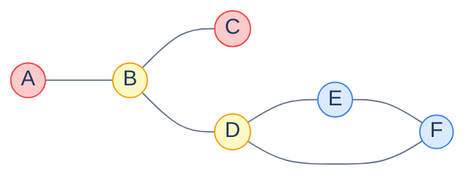

# Bridges and Articulation Points

## Why It Exists

You manage a power grid. Each transmission line connects two cities; pull one out and either the grid stays whole, or some city goes dark. A line whose removal *would* disconnect part of the grid is a **bridge** — a single point of failure that needs redundancy or hardening. A city that plays the same role is an **articulation point** (or *cut vertex*): lose that substation and the network splits.

The shape recurs everywhere a "what breaks if we lose X?" question does: network reliability (which links are critical?), social networks (who bridges two communities — Granovetter's "strength of weak ties"), molecular biology (which bond, if broken, splits the molecule?), software architecture (which module is load-bearing?).

Both problems — find all bridges, find all articulation points — are solved in a single `O(V + E)` DFS using the **same `low`/`disc` lowlink trick** you met in Tarjan's SCC algorithm. The two criteria differ by a single character.

## See It Work

One DFS computes both. The graph: a chain `A–B–C` and `B–D`, plus a triangle `D–E–F`. The graph crosses stdin as an undirected adjacency list. Pick a case and **Run** it.

```python run viz=graph viz-kind=graph
import ast
import sys
sys.setrecursionlimit(10**6)

def bridges_and_articulations(graph):
    n = len(graph)
    disc = [-1] * n; low = [-1] * n
    is_art = [False] * n
    bridges, timer = [], [0]

    def dfs(u, parent):
        disc[u] = low[u] = timer[0]; timer[0] += 1
        children = 0
        for v in graph[u]:
            if v == parent:                             # don't walk back up the tree edge
                continue
            if disc[v] == -1:                           # tree edge
                children += 1
                dfs(v, u)
                low[u] = min(low[u], low[v])
                if low[v] > disc[u]:                    # bridge: STRICT
                    bridges.append([min(u, v), max(u, v)])
                if parent != -1 and low[v] >= disc[u]:  # articulation: NON-STRICT
                    is_art[u] = True
            else:                                       # back edge
                low[u] = min(low[u], disc[v])
        if parent == -1 and children >= 2:              # root special case
            is_art[u] = True

    for v in range(n):
        if disc[v] == -1: dfs(v, -1)
    return sorted(bridges), [v for v in range(n) if is_art[v]]

graph = ast.literal_eval(input())
bridges, arts = bridges_and_articulations(graph)
print("bridges:", bridges)
print("articulations:", arts)
```

```java run viz=graph viz-kind=graph
import java.util.*;

public class Main {
    static int[] disc, low; static boolean[] isArt;
    static int timer = 0; static List<int[]> bridges = new ArrayList<>();

    static void dfs(int u, int parent, List<List<Integer>> adj) {
        disc[u] = low[u] = timer++;
        int children = 0;
        for (int v : adj.get(u)) {
            if (v == parent) continue;                  // don't walk back up the tree edge
            if (disc[v] == -1) {                        // tree edge
                children++;
                dfs(v, u, adj);
                low[u] = Math.min(low[u], low[v]);
                if (low[v] > disc[u]) bridges.add(new int[]{Math.min(u, v), Math.max(u, v)});
                if (parent != -1 && low[v] >= disc[u]) isArt[u] = true;
            } else {                                    // back edge
                low[u] = Math.min(low[u], disc[v]);
            }
        }
        if (parent == -1 && children >= 2) isArt[u] = true;   // root special case
    }

    static int[][] parseIntMatrix(String line) {
        String trimmed = line.trim();
        if (trimmed.equals("[]") || trimmed.equals("[[]]")) return new int[0][];
        String inner = trimmed.substring(1, trimmed.length() - 1).trim();
        String[] rows = inner.split("\\],\\s*\\[");
        int[][] mat = new int[rows.length][];
        for (int r = 0; r < rows.length; r++) {
            String row = rows[r].replaceAll("[\\[\\]\\s]", "");
            if (row.isEmpty()) { mat[r] = new int[0]; continue; }
            String[] parts = row.split(",");
            mat[r] = new int[parts.length];
            for (int c = 0; c < parts.length; c++) mat[r][c] = Integer.parseInt(parts[c].trim());
        }
        return mat;
    }

    public static void main(String[] args) {
        Scanner sc = new Scanner(System.in);
        int[][] raw = parseIntMatrix(sc.nextLine());
        int n = raw.length;
        List<List<Integer>> adj = new ArrayList<>();
        for (int i = 0; i < n; i++) adj.add(new ArrayList<>());
        for (int u = 0; u < n; u++) for (int v : raw[u]) adj.get(u).add(v);

        disc = new int[n]; low = new int[n]; isArt = new boolean[n];
        bridges = new ArrayList<>(); timer = 0; Arrays.fill(disc, -1);
        for (int i = 0; i < n; i++) if (disc[i] == -1) dfs(i, -1, adj);

        bridges.sort(Comparator.<int[]>comparingInt(b -> b[0]).thenComparingInt(b -> b[1]));
        List<String> bs = new ArrayList<>();
        for (int[] b : bridges) bs.add("[" + b[0] + ", " + b[1] + "]");
        System.out.println("bridges: [" + String.join(", ", bs) + "]");
        List<Integer> arts = new ArrayList<>();
        for (int i = 0; i < n; i++) if (isArt[i]) arts.add(i);
        System.out.println("articulations: " + arts);
    }
}
```

```testcases
{
  "args": [
    { "id": "graph", "label": "undirected adj list", "type": "int[][]", "placeholder": "[[1], [0, 2, 3], [1], [1, 4, 5], [3, 5], [3, 4]]" }
  ],
  "cases": [
    {
      "args": { "graph": "[[1], [0, 2, 3], [1], [1, 4, 5], [3, 5], [3, 4]]" },
      "expected": "bridges: [[0, 1], [1, 2], [1, 3]]\narticulations: [1, 3]"
    },
    {
      "args": { "graph": "[[1, 2], [0, 2], [0, 1]]" },
      "expected": "bridges: []\narticulations: []"
    },
    {
      "args": { "graph": "[[1], [0, 2], [1, 3], [2]]" },
      "expected": "bridges: [[0, 1], [1, 2], [2, 3]]\narticulations: [1, 2]"
    }
  ],
  "verifying": "run"
}
```

Both report bridges `[[0, 1], [1, 2], [1, 3]]` — that's A–B, B–C, B–D — and articulation points `[1, 3]` — that's B and D. The triangle edges D–E, E–F, F–D are *not* bridges: each sits on a cycle, so removing one leaves the other two as a detour.

## How It Works

A DFS on an undirected graph produces a tree of **tree edges** plus **back edges** (to an ancestor). For each vertex track:

- `disc[v]` — when DFS first reached `v` (never changes).
- `low[v]` — the smallest `disc` reachable from `v` via tree edges plus *at most one* back edge. It answers: "how far back up the tree can `v`'s subtree climb?"

Two criteria read off the same `low` array:

> **Bridge.** A tree edge `(u, v)` (v discovered from u) is a bridge iff `low[v] > disc[u]` — `v`'s subtree has *no* back edge to `u` or above, so the only way in or out is through that edge.
>
> **Articulation point.** A non-root `u` is a cut vertex iff some child `v` has `low[v] >= disc[u]` — `v`'s subtree can't bypass `u`. The DFS **root** is special: it's a cut vertex iff it has **≥ 2 tree children**.

The whole algorithmic difference between the two is `>` versus `>=`. A subtree that can climb back exactly to `u`'s level (`low[v] == disc[u]`) still can't survive losing the *vertex* `u`, but it *can* survive losing the single *edge* — it has another route through `u`.



<p align="center"><strong>Articulation points (yellow): B and D. The edges A–B, B–C, and B–D are bridges. The triangle D–E–F is a cycle, so none of its edges is a bridge.</strong></p>

> **Key takeaway.** One DFS, two arrays (`disc`, `low`), `O(V + E)`. Bridge = `low[v] > disc[u]` (strict); articulation = `low[v] >= disc[u]` (non-strict) with the root needing ≥ 2 children. It's the same lowlink machinery as Tarjan's SCC, just on an undirected graph.

## Trace It

That `if v == parent: continue` line looks like a trivial guard, but it is load-bearing. Without it, when DFS scans `u`'s neighbours it sees the parent — already discovered — and treats the tree edge `(u, parent)` as if it were a *back edge*, pulling `low[u]` down to `disc[parent]`.

**Predict before you run:** delete that guard and re-run on the same graph. How many bridges does it report (true answer: 3)?

```python run viz=graph viz-kind=graph
import sys
sys.setrecursionlimit(10**6)

def bridges_no_parent_skip(n, adj):
    disc = [-1] * n; low = [-1] * n; bridges, timer = [], [0]
    def dfs(u, parent):
        disc[u] = low[u] = timer[0]; timer[0] += 1
        for v in adj[u]:
            # BUG: the `if v == parent: continue` guard is gone
            if disc[v] == -1:
                dfs(v, u)
                low[u] = min(low[u], low[v])
                if low[v] > disc[u]: bridges.append((u, v))
            else:
                low[u] = min(low[u], disc[v])
    for v in range(n):
        if disc[v] == -1: dfs(v, -1)
    return bridges

n = 6
edges = [(0,1), (1,2), (1,3), (3,4), (4,5), (5,3)]
adj = [[] for _ in range(n)]
for u, v in edges: adj[u].append(v); adj[v].append(u)
print("bridges found:", bridges_no_parent_skip(n, adj))
```

<details>
<summary><strong>Reveal</strong></summary>

It prints `bridges found: []` — **zero bridges**, even though three exist. Every tree edge `(u, v)` now has the parent edge counted as a back edge, so `low[v]` gets dragged down to `disc[u]` (or lower). The strict test `low[v] > disc[u]` then fails for *every* edge. A one-line omission silently turns the algorithm into one that never finds a bridge. (The proper multi-edge fix tracks the parent *edge ID* rather than the parent *vertex*, so genuine parallel edges aren't skipped — but skipping the parent vertex is enough for simple graphs.)

</details>

## Your Turn

The canonical bridge problem: **Critical Connections in a Network** ([LeetCode 1192](https://leetcode.com/problems/critical-connections-in-a-network/)) — return every connection (edge) whose removal disconnects the network. That's exactly "find all bridges."

```python run viz=graph viz-kind=graph
import ast
import sys
sys.setrecursionlimit(10**6)

# Your code goes here
def critical_connections(n, connections):
    adj = [[] for _ in range(n)]
    for a, b in connections: adj[a].append(b); adj[b].append(a)
    disc = [-1] * n; low = [-1] * n; bridges, timer = [], [0]
    def dfs(u, parent):
        disc[u] = low[u] = timer[0]; timer[0] += 1
        for v in adj[u]:
            if v == parent: continue
            if disc[v] == -1:
                dfs(v, u)
                low[u] = min(low[u], low[v])
                if low[v] > disc[u]: bridges.append([min(u, v), max(u, v)])
            else:
                low[u] = min(low[u], disc[v])
    for v in range(n):
        if disc[v] == -1: dfs(v, -1)
    return sorted(bridges)

n = int(input())
connections = ast.literal_eval(input())
print(critical_connections(n, connections))
```

```java run viz=graph viz-kind=graph
import java.util.*;

public class Main {
    static int[] disc, low; static int timer = 0; static List<int[]> bridges = new ArrayList<>();
    static void dfs(int u, int parent, List<List<Integer>> adj) {
        disc[u] = low[u] = timer++;
        for (int v : adj.get(u)) {
            if (v == parent) continue;
            if (disc[v] == -1) {
                dfs(v, u, adj);
                low[u] = Math.min(low[u], low[v]);
                if (low[v] > disc[u]) bridges.add(new int[]{Math.min(u, v), Math.max(u, v)});
            } else {
                low[u] = Math.min(low[u], disc[v]);
            }
        }
    }

    // Your code goes here
    static List<int[]> criticalConnections(int n, int[][] connections) {
        List<List<Integer>> adj = new ArrayList<>();
        for (int i = 0; i < n; i++) adj.add(new ArrayList<>());
        for (int[] c : connections) { adj.get(c[0]).add(c[1]); adj.get(c[1]).add(c[0]); }
        disc = new int[n]; low = new int[n]; bridges = new ArrayList<>(); timer = 0; Arrays.fill(disc, -1);
        for (int i = 0; i < n; i++) if (disc[i] == -1) dfs(i, -1, adj);
        bridges.sort(Comparator.<int[]>comparingInt(b -> b[0]).thenComparingInt(b -> b[1]));
        return bridges;
    }

    static int[][] parseIntMatrix(String line) {
        String trimmed = line.trim();
        if (trimmed.equals("[]") || trimmed.equals("[[]]")) return new int[0][];
        String inner = trimmed.substring(1, trimmed.length() - 1).trim();
        String[] rows = inner.split("\\],\\s*\\[");
        int[][] mat = new int[rows.length][];
        for (int r = 0; r < rows.length; r++) {
            String row = rows[r].replaceAll("[\\[\\]\\s]", "");
            if (row.isEmpty()) { mat[r] = new int[0]; continue; }
            String[] parts = row.split(",");
            mat[r] = new int[parts.length];
            for (int c = 0; c < parts.length; c++) mat[r][c] = Integer.parseInt(parts[c].trim());
        }
        return mat;
    }

    public static void main(String[] args) {
        Scanner sc = new Scanner(System.in);
        int n = Integer.parseInt(sc.nextLine().trim());
        int[][] connections = parseIntMatrix(sc.nextLine());
        List<int[]> result = criticalConnections(n, connections);
        List<String> s = new ArrayList<>();
        for (int[] b : result) s.add("[" + b[0] + ", " + b[1] + "]");
        System.out.println("[" + String.join(", ", s) + "]");
    }
}
```

```testcases
{
  "args": [
    { "id": "n", "label": "n (number of nodes)", "type": "number", "placeholder": "4" },
    { "id": "connections", "label": "connections (edge list)", "type": "int[][]", "placeholder": "[[0, 1], [1, 2], [2, 0], [1, 3]]" }
  ],
  "cases": [
    {
      "args": { "n": "4", "connections": "[[0, 1], [1, 2], [2, 0], [1, 3]]" },
      "expected": "[[1, 3]]"
    },
    {
      "args": { "n": "3", "connections": "[[0, 1], [1, 2]]" },
      "expected": "[[0, 1], [1, 2]]"
    },
    {
      "args": { "n": "5", "connections": "[[0, 1], [1, 2], [2, 0], [1, 3], [3, 4]]" },
      "expected": "[[1, 3], [3, 4]]"
    }
  ],
  "verifying": "solution"
}
```

<details>
<summary>Editorial</summary>

**Approach:** Build an adjacency list from the edge list, then run a single DFS tracking `disc` and `low`. A tree edge `(u, v)` where `low[v] > disc[u]` is a bridge — the subtree under `v` has no back-edge to `u` or above, so it can only be reached through this edge. Canonicalize each bridge as `[min(u,v), max(u,v)]` and sort the list. Time: `O(V + E)`. Space: `O(V + E)`.

```python solution time=O(V+E) space=O(V+E)
import ast
import sys
sys.setrecursionlimit(10**6)

def critical_connections(n, connections):
    adj = [[] for _ in range(n)]
    for a, b in connections: adj[a].append(b); adj[b].append(a)
    disc = [-1] * n; low = [-1] * n; bridges, timer = [], [0]
    def dfs(u, parent):
        disc[u] = low[u] = timer[0]; timer[0] += 1
        for v in adj[u]:
            if v == parent: continue
            if disc[v] == -1:
                dfs(v, u)
                low[u] = min(low[u], low[v])
                if low[v] > disc[u]: bridges.append([min(u, v), max(u, v)])
            else:
                low[u] = min(low[u], disc[v])
    for v in range(n):
        if disc[v] == -1: dfs(v, -1)
    return sorted(bridges)

n = int(input())
connections = ast.literal_eval(input())
print(critical_connections(n, connections))
```

```java solution time=O(V+E) space=O(V+E)
import java.util.*;

public class Main {
    static int[] disc, low; static int timer = 0; static List<int[]> bridges = new ArrayList<>();
    static void dfs(int u, int parent, List<List<Integer>> adj) {
        disc[u] = low[u] = timer++;
        for (int v : adj.get(u)) {
            if (v == parent) continue;
            if (disc[v] == -1) {
                dfs(v, u, adj);
                low[u] = Math.min(low[u], low[v]);
                if (low[v] > disc[u]) bridges.add(new int[]{Math.min(u, v), Math.max(u, v)});
            } else {
                low[u] = Math.min(low[u], disc[v]);
            }
        }
    }

    static List<int[]> criticalConnections(int n, int[][] connections) {
        List<List<Integer>> adj = new ArrayList<>();
        for (int i = 0; i < n; i++) adj.add(new ArrayList<>());
        for (int[] c : connections) { adj.get(c[0]).add(c[1]); adj.get(c[1]).add(c[0]); }
        disc = new int[n]; low = new int[n]; bridges = new ArrayList<>(); timer = 0; Arrays.fill(disc, -1);
        for (int i = 0; i < n; i++) if (disc[i] == -1) dfs(i, -1, adj);
        bridges.sort(Comparator.<int[]>comparingInt(b -> b[0]).thenComparingInt(b -> b[1]));
        return bridges;
    }

    static int[][] parseIntMatrix(String line) {
        String trimmed = line.trim();
        if (trimmed.equals("[]") || trimmed.equals("[[]]")) return new int[0][];
        String inner = trimmed.substring(1, trimmed.length() - 1).trim();
        String[] rows = inner.split("\\],\\s*\\[");
        int[][] mat = new int[rows.length][];
        for (int r = 0; r < rows.length; r++) {
            String row = rows[r].replaceAll("[\\[\\]\\s]", "");
            if (row.isEmpty()) { mat[r] = new int[0]; continue; }
            String[] parts = row.split(",");
            mat[r] = new int[parts.length];
            for (int c = 0; c < parts.length; c++) mat[r][c] = Integer.parseInt(parts[c].trim());
        }
        return mat;
    }

    public static void main(String[] args) {
        Scanner sc = new Scanner(System.in);
        int n = Integer.parseInt(sc.nextLine().trim());
        int[][] connections = parseIntMatrix(sc.nextLine());
        List<int[]> result = criticalConnections(n, connections);
        List<String> s = new ArrayList<>();
        for (int[] b : result) s.add("[" + b[0] + ", " + b[1] + "]");
        System.out.println("[" + String.join(", ", s) + "]");
    }
}
```

</details>

Both print `[[1, 3]]` then `[[0, 1], [1, 2]]`: in the first graph only the spur to vertex 3 is critical (the triangle 0–1–2 is resilient); in the second, a plain path, every edge is a bridge.

## Reflect & Connect

- **It's the SCC lowlink trick again.** `disc`/`low` came from Tarjan's directed-graph SCC algorithm; here the *same* arrays solve two undirected-connectivity questions. Learn `low[v]` = "earliest reachable discovery time" once and bridges, articulation points, and SCCs all fall out.
- **`>` vs `>=` is the whole story.** Strict for edges, non-strict for vertices, plus the root's ≥ 2-children rule. If you remember one thing, remember why: a subtree reaching back to `u`'s exact level survives losing the *edge* but not the *vertex*.
- **Components built on top:** remove all bridges and the leftover pieces are the **2-edge-connected components**; partition at articulation points and you get **biconnected components**. The **block-cut tree** compresses each biconnected block to a node with articulation points as connectors — the scaffolding for harder graph problems.
- **The multi-edge gotcha.** Two parallel edges between the same pair are each other's backup, so neither is a bridge. The simple `v == parent` skip mishandles this; production code skips the parent *edge ID*.
- **Where it ships:** NetworkX's `nx.bridges` / `nx.articulation_points`, Boost's `biconnected_components`, and network-reliability tooling that flags single points of failure for redundancy planning.

## Recall

<details>
<summary><strong>Q:</strong> Define a bridge and an articulation point.</summary>

**A:** A bridge is an edge whose removal increases the number of connected components; an articulation point (cut vertex) is a vertex whose removal (with its incident edges) does the same.

</details>
<details>
<summary><strong>Q:</strong> Bridge criterion?</summary>

**A:** A tree edge `(u, v)` (v discovered from u) is a bridge iff `low[v] > disc[u]` — the subtree under `v` has no back edge to `u` or above.

</details>
<details>
<summary><strong>Q:</strong> Articulation criterion, including the root?</summary>

**A:** A non-root `u` is a cut vertex iff some child `v` has `low[v] >= disc[u]`. The DFS root is a cut vertex iff it has ≥ 2 tree children.

</details>
<details>
<summary><strong>Q:</strong> The one-character difference between the two criteria?</summary>

**A:** Bridge uses strict `>`; articulation uses non-strict `>=`. A subtree reaching back to `u`'s exact level survives losing the edge but not the vertex.

</details>
<details>
<summary><strong>Q:</strong> Why skip the parent edge in the DFS?</summary>

**A:** Otherwise the tree edge back to the parent is mistaken for a back edge, pulling `low[u]` down to `disc[parent]` and making every bridge test fail — you'd find zero bridges.

</details>
<details>
<summary><strong>Q:</strong> Time complexity, and what reuses this machinery?</summary>

**A:** `O(V + E)`, a single DFS. The same `disc`/`low` lowlink trick powers Tarjan's SCC algorithm, 2-edge-connected and biconnected components, and the block-cut tree.

</details>

## Sources & Verify

- **Hopcroft, J. & Tarjan, R.** (1973), "Algorithm 447: Efficient algorithms for graph manipulation", *CACM* 16(6) — the original linear-time biconnected-components / articulation-point algorithm.
- **Sedgewick & Wayne**, *Algorithms*, 4th ed., §4.1 — undirected graphs, connectivity, and biconnectivity built on DFS `disc`/`low`.
- **Skiena**, *The Algorithm Design Manual*, 3rd ed., §5.9 — articulation vertices, bridges, and the connectivity hierarchy (2-edge- vs 2-vertex-connected).
- **CP-Algorithms** — [Finding bridges](https://cp-algorithms.com/graph/bridge-searching.html) and [Finding articulation points](https://cp-algorithms.com/graph/cutpoints.html): the exact `low[v] > disc[u]` / `>= disc[u]` criteria and the multi-edge caveat.
- **NetworkX** `bridges` / `articulation_points` and **Boost** `biconnected_components` are the reference implementations. The bridge/articulation outputs and critical-connections outputs above all come from the runnable blocks — re-run to verify.
