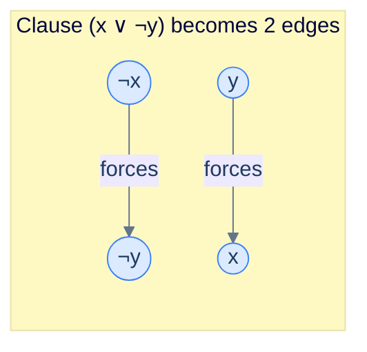

# 2-SAT (2-Satisfiability)

## Why It Exists

Boolean satisfiability — given a formula like `(x ∨ y ∨ ¬z) ∧ (¬x ∨ z) ∧ …`, is there a true/false assignment that makes it all true? — is the *original* NP-complete problem. In the worst case you try `2ⁿ` assignments and no one knows a faster general method.

Now add one constraint: every clause has *exactly two* literals (a literal is a variable or its negation). That single restriction is **2-SAT**, and it collapses the difficulty from exponential to **linear**.

The move that makes it work: a clause `(a ∨ b)` is the same as two implications, `¬a ⇒ b` and `¬b ⇒ a`. Build a directed graph with a vertex for every literal and an edge for every implication, then compute strongly connected components. If a variable `x` and its negation `¬x` ever land in the *same* SCC — meaning `x` forces `¬x` and `¬x` forces `x` — the formula is unsatisfiable. Otherwise it's satisfiable, and the SCC ordering hands you an assignment. This is one of the rare NP-flavoured problems with a clean polynomial special case.

## See It Work

A four-clause instance over three variables. The solver builds the implication graph, runs Tarjan's SCC, and reads off an assignment — then verifies it.

```python run viz=graph viz-kind=graph
import sys
sys.setrecursionlimit(10**6)

def solve_2sat(n, clauses):
    # Literal encoding: signed 1-indexed int. Vertex = 2*(|lit|-1) + (1 if negated).
    def to_v(lit): return 2 * (abs(lit) - 1) + (1 if lit < 0 else 0)
    def neg(v): return v ^ 1                              # flip the low bit: x <-> ¬x

    V = 2 * n
    adj = [[] for _ in range(V)]
    for a, b in clauses:                                  # (a ∨ b) == (¬a ⇒ b) ∧ (¬b ⇒ a)
        adj[neg(to_v(a))].append(to_v(b))
        adj[neg(to_v(b))].append(to_v(a))

    disc = [-1] * V; low = [-1] * V; on = [False] * V
    stk, scc_id, timer, cnt = [], [-1] * V, [0], [0]
    def tarjan(u):                                        # SCC ids in REVERSE topological order
        disc[u] = low[u] = timer[0]; timer[0] += 1
        stk.append(u); on[u] = True
        for v in adj[u]:
            if disc[v] == -1: tarjan(v); low[u] = min(low[u], low[v])
            elif on[v]: low[u] = min(low[u], disc[v])
        if low[u] == disc[u]:
            while True:
                w = stk.pop(); on[w] = False; scc_id[w] = cnt[0]
                if w == u: break
            cnt[0] += 1
    for v in range(V):
        if disc[v] == -1: tarjan(v)

    assignment = [False] * n
    for i in range(n):
        if scc_id[2*i] == scc_id[2*i + 1]:                # x and ¬x in one SCC → contradiction
            return None
        assignment[i] = scc_id[2*i] < scc_id[2*i + 1]     # x true iff its SCC is later in topo order
    return assignment

# (x1 ∨ x2) ∧ (¬x1 ∨ x3) ∧ (x2 ∨ ¬x3) ∧ (¬x2 ∨ ¬x3)
clauses = [(1, 2), (-1, 3), (2, -3), (-2, -3)]
a = solve_2sat(3, clauses)
print("assignment:", a)                                   # [False, True, False]

def lit(l): return a[abs(l) - 1] if l > 0 else not a[abs(l) - 1]
print("all clauses satisfied:", all(lit(x) or lit(y) for x, y in clauses))
```

```java run viz=graph viz-kind=graph
import java.util.*;

public class Main {
    static int[] disc, low, sccId; static boolean[] on;
    static Deque<Integer> stk; static int timer = 0, cnt = 0;
    static List<List<Integer>> adj;

    static int toV(int lit) { return 2 * (Math.abs(lit) - 1) + (lit < 0 ? 1 : 0); }
    static int neg(int v) { return v ^ 1; }

    static void tarjan(int u) {                            // SCC ids in REVERSE topological order
        disc[u] = low[u] = timer++; stk.push(u); on[u] = true;
        for (int v : adj.get(u)) {
            if (disc[v] == -1) { tarjan(v); low[u] = Math.min(low[u], low[v]); }
            else if (on[v]) low[u] = Math.min(low[u], disc[v]);
        }
        if (low[u] == disc[u]) {
            while (true) { int w = stk.pop(); on[w] = false; sccId[w] = cnt; if (w == u) break; }
            cnt++;
        }
    }

    static boolean[] solve2sat(int n, int[][] clauses) {
        int V = 2 * n;
        adj = new ArrayList<>();
        for (int i = 0; i < V; i++) adj.add(new ArrayList<>());
        for (int[] c : clauses) {                          // (a ∨ b) == (¬a ⇒ b) ∧ (¬b ⇒ a)
            adj.get(neg(toV(c[0]))).add(toV(c[1]));
            adj.get(neg(toV(c[1]))).add(toV(c[0]));
        }
        disc = new int[V]; low = new int[V]; sccId = new int[V]; on = new boolean[V];
        Arrays.fill(disc, -1); stk = new ArrayDeque<>(); timer = 0; cnt = 0;
        for (int v = 0; v < V; v++) if (disc[v] == -1) tarjan(v);

        boolean[] assignment = new boolean[n];
        for (int i = 0; i < n; i++) {
            if (sccId[2*i] == sccId[2*i + 1]) return null;  // contradiction
            assignment[i] = sccId[2*i] < sccId[2*i + 1];
        }
        return assignment;
    }

    public static void main(String[] args) {
        int[][] clauses = {{1, 2}, {-1, 3}, {2, -3}, {-2, -3}};
        boolean[] a = solve2sat(3, clauses);
        System.out.println("assignment: " + Arrays.toString(a));    // [false, true, false]
        boolean ok = true;
        for (int[] c : clauses) {
            boolean lx = c[0] > 0 ? a[c[0]-1] : !a[-c[0]-1];
            boolean ly = c[1] > 0 ? a[c[1]-1] : !a[-c[1]-1];
            if (!(lx || ly)) ok = false;
        }
        System.out.println("all clauses satisfied: " + ok);
    }
}
```

Both print `[False, True, False]` (x₁ = false, x₂ = true, x₃ = false) and confirm every clause holds.

## How It Works

The reduction is the whole creative step; everything after it is mechanical SCC work.

**The implication graph.** A clause `(a ∨ b)` is logically identical to `(¬a ⇒ b) ∧ (¬b ⇒ a)` — "if `a` is false, `b` must be true, and vice versa." So:

- **2n vertices**, one per literal (`x` and `¬x` for each variable).
- **For each clause `(a ∨ b)`, two directed edges**: `¬a → b` and `¬b → a`.

Every path in this graph is a chain of forced consequences.



<p align="center"><strong>Each clause becomes two edges. <code>¬x → ¬y</code> reads "if x is false then y must be false" — the only way <code>(x ∨ ¬y)</code> holds when x is false.</strong></p>

**The criterion.**

> A 2-SAT instance is satisfiable **iff** for every variable `x`, the vertices `x` and `¬x` lie in *different* SCCs.

If `x` and `¬x` share an SCC there are paths `x ⤳ ¬x` *and* `¬x ⤳ x`: "x true forces x false" and "x false forces x true" — an unbreakable contradiction.

**Reading off the assignment.** When satisfiable, the SCCs form a DAG; process it in reverse topological order and set `x = true` iff `SCC(x)` comes *later* than `SCC(¬x)`. Tarjan's algorithm hands you this for free: it numbers SCCs in reverse topological order (the first popped is a sink), so `scc_id[x] < scc_id[¬x]` *is* the test "x's SCC is later." Build the graph, one SCC pass, done — `O(V + E)` with `V = 2n` and `E = 2C`.

> **Key takeaway.** 2-SAT = implication graph + SCC. Same SCC for `x` and `¬x` ⇒ UNSAT; otherwise satisfiable, and Tarjan's reverse-topological numbering gives the assignment directly. The jump from 2-literal to 3-literal clauses is the jump from this linear-time algorithm to NP-complete 3-SAT.

## Trace It

Here are four clauses over just two variables. Each clause rules out exactly one of the four possible `(x₁, x₂)` combinations: `(¬x₁ ∨ ¬x₂)` forbids both-true, `(¬x₁ ∨ x₂)` forbids `(T, F)`, `(x₁ ∨ ¬x₂)` forbids `(F, T)`, `(x₁ ∨ x₂)` forbids both-false.

**Predict before you run:** with all four combinations forbidden, is this instance SAT or UNSAT — and what should the SCCs of `x₁` and `¬x₁` look like?

```python run viz=graph viz-kind=graph
import sys
sys.setrecursionlimit(10**6)

def solve_2sat_debug(n, clauses):
    def to_v(lit): return 2 * (abs(lit) - 1) + (1 if lit < 0 else 0)
    def neg(v): return v ^ 1
    V = 2 * n; adj = [[] for _ in range(V)]
    for a, b in clauses:
        adj[neg(to_v(a))].append(to_v(b)); adj[neg(to_v(b))].append(to_v(a))
    disc = [-1]*V; low = [-1]*V; on = [False]*V; stk = []; scc_id = [-1]*V; timer=[0]; cnt=[0]
    def tarjan(u):
        disc[u]=low[u]=timer[0]; timer[0]+=1; stk.append(u); on[u]=True
        for v in adj[u]:
            if disc[v]==-1: tarjan(v); low[u]=min(low[u],low[v])
            elif on[v]: low[u]=min(low[u],disc[v])
        if low[u]==disc[u]:
            while True:
                w=stk.pop(); on[w]=False; scc_id[w]=cnt[0]
                if w==u: break
            cnt[0]+=1
    for v in range(V):
        if disc[v]==-1: tarjan(v)
    sat = all(scc_id[2*i] != scc_id[2*i+1] for i in range(n))
    return sat, scc_id

clauses = [(1, 2), (1, -2), (-1, 2), (-1, -2)]   # forbids all four (x1, x2) combinations
sat, scc_id = solve_2sat_debug(2, clauses)
print("satisfiable:", sat)
print("SCC of x1:", scc_id[0], " SCC of ¬x1:", scc_id[1], " same SCC:", scc_id[0] == scc_id[1])
```

<details>
<summary><strong>Reveal</strong></summary>

It prints `satisfiable: False` with `x1` and `¬x1` both in **SCC 0** — the same component. With every `(x₁, x₂)` combination forbidden, no assignment can survive, and the implication graph makes that visible structurally: the four clauses weave a cycle of implications that pulls `x₁` and `¬x₁` into one mutually-reachable blob. The beauty of the SCC reduction is that you never enumerate assignments — a single linear-time component pass *sees* the contradiction as "a literal can reach its own negation and back."

</details>

## Your Turn

A clean application of the reduction: **is a graph 2-colourable?** Make each vertex a boolean (colour 0 or 1). An edge `(u, v)` demands the endpoints differ, which is `(c_u ∨ c_v) ∧ (¬c_u ∨ ¬c_v)` — two 2-SAT clauses. Solve and you've decided 2-colourability (equivalently, bipartiteness).

```python run viz=graph viz-kind=graph
import sys
sys.setrecursionlimit(10**6)

def solve_2sat(n, clauses):
    def to_v(l): return 2*(abs(l)-1) + (1 if l < 0 else 0)
    def neg(v): return v ^ 1
    V = 2*n; adj = [[] for _ in range(V)]
    for a, b in clauses:
        adj[neg(to_v(a))].append(to_v(b)); adj[neg(to_v(b))].append(to_v(a))
    disc=[-1]*V; low=[-1]*V; on=[False]*V; stk=[]; scc=[-1]*V; timer=[0]; cnt=[0]
    def tarjan(u):
        disc[u]=low[u]=timer[0]; timer[0]+=1; stk.append(u); on[u]=True
        for v in adj[u]:
            if disc[v]==-1: tarjan(v); low[u]=min(low[u],low[v])
            elif on[v]: low[u]=min(low[u],disc[v])
        if low[u]==disc[u]:
            while True:
                w=stk.pop(); on[w]=False; scc[w]=cnt[0]
                if w==u: break
            cnt[0]+=1
    for v in range(V):
        if disc[v]==-1: tarjan(v)
    return all(scc[2*i] != scc[2*i+1] for i in range(n))

def two_colourable(n, edges):
    clauses = []
    for u, v in edges:                              # endpoints must differ
        clauses.append((u + 1, v + 1)); clauses.append((-(u + 1), -(v + 1)))
    return solve_2sat(n, clauses)

print(two_colourable(3, [(0,1),(1,2),(2,0)]))       # False — triangle (odd cycle)
print(two_colourable(4, [(0,1),(1,2),(2,3),(3,0)])) # True  — 4-cycle (bipartite)
```

```java run viz=graph viz-kind=graph
import java.util.*;

public class Main {
    static int[] disc, low, scc; static boolean[] on; static Deque<Integer> stk;
    static int timer = 0, cnt = 0; static List<List<Integer>> adj;
    static int toV(int l) { return 2*(Math.abs(l)-1) + (l < 0 ? 1 : 0); }
    static int neg(int v) { return v ^ 1; }
    static void tarjan(int u) {
        disc[u] = low[u] = timer++; stk.push(u); on[u] = true;
        for (int v : adj.get(u)) {
            if (disc[v] == -1) { tarjan(v); low[u] = Math.min(low[u], low[v]); }
            else if (on[v]) low[u] = Math.min(low[u], disc[v]);
        }
        if (low[u] == disc[u]) {
            while (true) { int w = stk.pop(); on[w] = false; scc[w] = cnt; if (w == u) break; }
            cnt++;
        }
    }
    static boolean solve2sat(int n, List<int[]> clauses) {
        int V = 2*n; adj = new ArrayList<>();
        for (int i = 0; i < V; i++) adj.add(new ArrayList<>());
        for (int[] c : clauses) { adj.get(neg(toV(c[0]))).add(toV(c[1])); adj.get(neg(toV(c[1]))).add(toV(c[0])); }
        disc = new int[V]; low = new int[V]; scc = new int[V]; on = new boolean[V];
        Arrays.fill(disc, -1); stk = new ArrayDeque<>(); timer = 0; cnt = 0;
        for (int v = 0; v < V; v++) if (disc[v] == -1) tarjan(v);
        for (int i = 0; i < n; i++) if (scc[2*i] == scc[2*i + 1]) return false;
        return true;
    }
    static boolean twoColourable(int n, int[][] edges) {
        List<int[]> clauses = new ArrayList<>();
        for (int[] e : edges) {
            clauses.add(new int[]{e[0] + 1, e[1] + 1});
            clauses.add(new int[]{-(e[0] + 1), -(e[1] + 1)});
        }
        return solve2sat(n, clauses);
    }
    public static void main(String[] args) {
        System.out.println(twoColourable(3, new int[][]{{0,1},{1,2},{2,0}}));     // false
        System.out.println(twoColourable(4, new int[][]{{0,1},{1,2},{2,3},{3,0}})); // true
    }
}
```

Both print `False` then `True`: a triangle is an odd cycle and can't be 2-coloured, while a 4-cycle is bipartite and can. (For pure 2-colouring a BFS/DFS or union-find is simpler — but seeing it as 2-SAT shows how *any* pairwise binary constraint folds into the same machine.)

## Reflect & Connect

- **The reduction is the skill.** "`(a ∨ b)` ⟺ `(¬a ⇒ b) ∧ (¬b ⇒ a)`" is the entire creative move; the rest is the SCC algorithm you already know. Whenever a problem reads "each thing is one of two states, with pairwise constraints," reach for 2-SAT.
- **2 vs 3 is *the* complexity cliff.** 2-SAT is linear; 3-SAT is NP-complete. A 2-clause forces a single implication per literal (a clean graph); a 3-clause branches, and no equivalent reduction is known. This is the sharpest tractability boundary in the curriculum.
- **Decision is easy, counting is not.** Deciding satisfiability is `O(V + E)`, but *counting* satisfying assignments (#2-SAT) is `#P`-complete — as hard as counting solutions to any NP problem. Tractability depends on the question, not just the formula.
- **Cousins on the tractable side:** Horn-SAT (≤ 1 positive literal per clause, linear via unit propagation) and XOR-SAT (clauses are XORs, solved by Gaussian elimination over GF(2)).
- **Production caveat:** for implication graphs with millions of vertices the recursive Tarjan here can overflow the stack — production code uses the iterative explicit-stack DFS (same algorithm). 2-SAT pre-passes live inside real SAT solvers (MiniSat, Glucose) and in map-labelling and scheduling-with-binary-conflicts systems. This completes the graphs spine: representations, traversal, cycles, topo-sort, shortest paths, MST, max-flow, SCC, bridges, and now 2-SAT.

## Recall

<details>
<summary><strong>Q:</strong> What is the implication-graph construction, in one rule?</summary>

**A:** Each clause `(a ∨ b)` becomes two directed edges: `¬a → b` and `¬b → a`. The graph has `2n` vertices (one per literal) and `2C` edges.

</details>
<details>
<summary><strong>Q:</strong> The satisfiability criterion?</summary>

**A:** Satisfiable iff for every variable `x`, the vertices `x` and `¬x` are in *different* SCCs of the implication graph.

</details>
<details>
<summary><strong>Q:</strong> Why does `x` and `¬x` in the same SCC mean UNSAT?</summary>

**A:** It means paths `x ⤳ ¬x` and `¬x ⤳ x` both exist — "x true forces x false" and "x false forces x true." No assignment can satisfy both.

</details>
<details>
<summary><strong>Q:</strong> How do you extract an assignment, and what does Tarjan give for free?</summary>

**A:** Process SCCs in reverse topological order; set `x = true` iff `SCC(x)` is later than `SCC(¬x)`. Tarjan numbers SCCs in reverse topological order, so `scc_id[x] < scc_id[¬x]` *is* that test.

</details>
<details>
<summary><strong>Q:</strong> Time complexity, and why doesn't it extend to 3-SAT?</summary>

**A:** `O(V + E) = O(n + C)`. A 3-clause forces multiple implication branches rather than a single clean implication, so there's no equivalent SCC reduction — 3-SAT is NP-complete.

</details>
<details>
<summary><strong>Q:</strong> Is counting satisfying assignments also polynomial?</summary>

**A:** No. #2-SAT is `#P`-complete. Decision is in P; counting is as hard as counting NP solutions.

</details>

## Sources & Verify

- **Aspvall, Plass & Tarjan** (1979), "A linear-time algorithm for testing the truth of certain quantified boolean formulas", *Information Processing Letters* 8(3) — the original five-page paper proving 2-SAT polynomial via the SCC reduction.
- **CP-Algorithms** — [2-SAT](https://cp-algorithms.com/graph/2SAT.html): the implication-graph construction, the same-SCC criterion, and the Tarjan-reverse-topological-order assignment trick, with reference code.
- **Sedgewick & Wayne**, *Algorithms*, 4th ed., §4.2 — strongly connected components (the engine this reduces to); **CLRS** §22.5 for the SCC correctness proof.
- **Sipser**, *Introduction to the Theory of Computation*, 3rd ed., Ch. 7 — why SAT/3-SAT are NP-complete, framing the 2-vs-3 cliff; #P-completeness of counting (Valiant 1979).
- 2-SAT pre-processing appears in production SAT solvers (MiniSat, Glucose). The `[False, True, False]`, UNSAT-with-shared-SCC, and triangle/square 2-colouring outputs above all come from the runnable blocks — re-run to verify.
