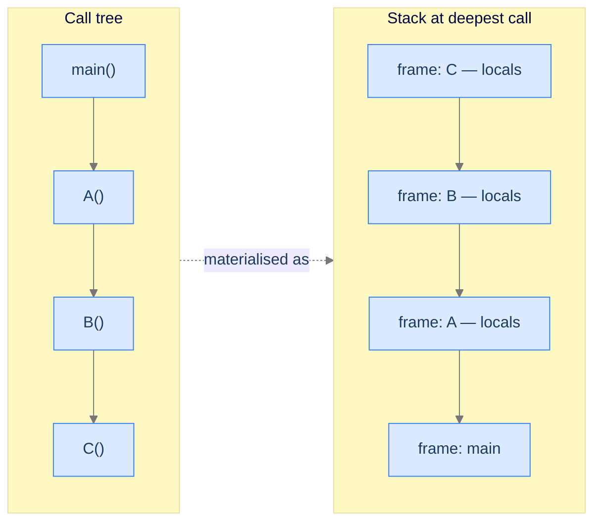

## Why It Exists

You write a clean three-line recursive function. It works on small inputs, you ship it, and six weeks later a million-row test case crashes the process with `StackOverflowError`. You add a `try/catch`; it crashes again. You raise `sys.setrecursionlimit(10**6)`; now the interpreter *segfaults*. The limit you raised wasn't the limit that mattered.

You didn't write a bad algorithm — you ran out of a **region of memory** most tutorials never show you. Every running program is partitioned into four regions, and recursion lives in one of them: the **stack**. Before recursion can make sense, you need to see those four regions, because recursion is nothing more exotic than *one region put under stress*. Name the regions and you can predict, for any value in your code, where it lives, how long it lives, who frees it, and what happens when that region runs out.

## See It Work

Recursion makes the stack *visible*. Each call pushes a frame; each return pops one. Watch `fact(n)` stack frames deep, hit the base case, then unwind last-in-first-out:

```python run viz=callstack
def fact(n, depth=0):
    pad = "  " * depth
    print(f"{pad}push fact({n})")                 # a frame is pushed onto the stack
    if n <= 1:
        print(f"{pad}base -> 1")
        return 1
    r = n * fact(n - 1, depth + 1)
    print(f"{pad}pop  fact({n}) = {r}")           # this frame pops; caller resumes
    return r

n = int(input())                  # the test case's n
print("result:", fact(n))
```

```java run viz=callstack
import java.util.*;

public class Main {
    static int fact(int n, int depth) {
        String pad = "  ".repeat(depth);
        System.out.println(pad + "push fact(" + n + ")");   // frame pushed
        if (n <= 1) { System.out.println(pad + "base -> 1"); return 1; }
        int r = n * fact(n - 1, depth + 1);
        System.out.println(pad + "pop  fact(" + n + ") = " + r);   // frame popped
        return r;
    }
    public static void main(String[] args) {
        int n = Integer.parseInt(new Scanner(System.in).nextLine().trim());
        System.out.println("result: " + fact(n, 0));
    }
}
```

```testcases
{
  "args": [
    { "id": "n", "label": "n", "type": "int", "placeholder": "3" }
  ],
  "cases": [
    { "args": { "n": "3" }, "expected": "push fact(3)\n  push fact(2)\n    push fact(1)\n    base -> 1\n  pop  fact(2) = 2\npop  fact(3) = 6\nresult: 6" },
    { "args": { "n": "1" }, "expected": "push fact(1)\nbase -> 1\nresult: 1" },
    { "args": { "n": "4" }, "expected": "push fact(4)\n  push fact(3)\n    push fact(2)\n      push fact(1)\n      base -> 1\n    pop  fact(2) = 2\n  pop  fact(3) = 6\npop  fact(4) = 24\nresult: 24" }
  ]
}
```

Both print the same nested trace ending in `result: 6` (for n=3). Three frames — `fact(3)`, `fact(2)`, `fact(1)` — are alive at the deepest point, and they unwind in reverse: `fact(1)` returns first, `fact(3)` last. That LIFO order *is* recursion.

## How It Works

When your program starts, the OS hands it a plot of address space and four "crews" stake out regions that never move:

| Region | Its job | Construction-site stand-in | Fails by |
|---|---|---|---|
| **Heap** | Hand out arbitrary-sized chunks on demand (`new`, `malloc`, `list()`). Freed manually or by a GC. | The **lumber yard** | Memory leak / OOM |
| **Stack** | Track who's calling whom — one **frame** per call, LIFO. | The **scaffolding** | **Stack overflow** |
| **Static** | Globals and constants; live the whole program. | The poured **foundation** | Fixed at startup |
| **Code** | The program's instructions; read-only, shared. | The **blueprint** | `SIGSEGV` if you write |

```d2
proc: Process address space {
  grid-rows: 6
  grid-columns: 1
  grid-gap: 0
  r0: "Code segment\n— machine code or bytecode\n— read-only, shared"
  r1: "Static / data\n— globals and statics\n— lifetime = whole program" {style.fill: "#ede9fe"; style.stroke: "#7c3aed"}
  r2: "Heap\n— grows up ↑\n— new / malloc / list()" {style.fill: "#fef9c3"; style.stroke: "#ca8a04"}
  r3: "↕ free space ↕"
  r4: "Stack\n— grows down ↓\n— frames push and pop" {style.fill: "#dbeafe"; style.stroke: "#3b82f6"}
  r5: "(High addresses)"
}
```

<p align="center"><strong>The four regions. Heap grows up, stack grows down into the same free zone; static and code never move.</strong></p>

The **stack** is the one that matters for recursion. Every function call gets a *frame* holding its **parameters**, **local variables**, and a **return address** (the caller line to resume at). Allocating a frame is one CPU instruction (move the stack pointer down); freeing it is one instruction (move it back up) — no `free`, no GC. That's why the stack is fast. It's also why it's *small*: a thread typically gets just 1–8 MB. A million recursive calls, each carrying its own locals, blows past that — and *that* is stack overflow.



<p align="center"><strong>The call tree is conceptual; the stack is physical. Every nested call deepens the stack by one frame — and recursion is just a call tree that calls itself.</strong></p>

> **Key takeaway.** Four regions, four roles. Recursion lives on the **stack**: each call pushes a frame (params + locals + return address), each return pops one, last-in-first-out. The stack is fast and automatic but small (1–8 MB), so deep recursion overflows it. Stack overflow is a *memory-layout* fact, not an algorithm bug.

## Trace It

Which region a value lives in decides its lifetime — and a name *assigned* inside a function defaults to that function's **stack frame**, not the **static** global of the same name. Here's a global counter incremented inside a function, without declaring `global`:

**Predict before you run:** does this print `1`, or something else?

```python run
counter = 0                      # lives in the static/global region

def tick():
    counter += 1                 # no `global counter`
    return counter

try:
    print(tick())
except UnboundLocalError as e:
    print("UnboundLocalError:", e)
```

<details>
<summary><strong>Reveal</strong></summary>

It raises `UnboundLocalError: cannot access local variable 'counter' where it is not associated with a value`. Because `tick` *assigns* to `counter`, Python decides at compile time that `counter` is a **frame-local** — a fresh slot on `tick`'s stack frame — shadowing the global entirely. The `+= 1` then tries to *read* that local before it's been given a value, and fails. The fix is `global counter`, which tells Python to reach into the static region instead of allocating a stack-frame local. (Java has no identical trap, but the same principle holds: an unqualified local shadows a field; you write `this.counter` / the class name to reach the static one.) The bug is invisible until you know *which region* the name binds to.

</details>

## Your Turn

The flip side: state that must **survive across calls** can't live on the stack (frames vanish on return) — it belongs in the **static** region. Implement a call-counter that returns how many times it has been called. Its value must persist even though every call gets a brand-new frame.

```python run viz=array viz-root=results
def call_count():
    # Your code goes here — the counter must survive across calls.
    # Hint: a function attribute persists with the function object (heap),
    # which outlives any single frame — the same effect as a static variable.
    return 0

k = int(input())                  # the test case's k (number of calls)
results = []
for _ in range(k):
    results.append(call_count())  # watch results fill: 1, 2, 3 … proves the counter persists
print(" ".join(str(r) for r in results))
```

```java run viz=array viz-root=results
import java.util.*;

public class Main {
    static class Counter {
        // Your code goes here — declare a class-level static field
        // so it persists in the static region across all calls.
        static int callCount() { return 0; }
    }

    public static void main(String[] args) {
        int k = Integer.parseInt(new Scanner(System.in).nextLine().trim());
        int[] results = new int[k];                       // a plain array draws as a row of cells
        for (int i = 0; i < k; i++) results[i] = Counter.callCount();
        StringBuilder out = new StringBuilder();
        for (int i = 0; i < k; i++) out.append(i == 0 ? "" : " ").append(results[i]);
        System.out.println(out.toString());
    }
}
```

```testcases
{
  "args": [
    { "id": "k", "label": "k", "type": "int", "placeholder": "3" }
  ],
  "cases": [
    { "args": { "k": "3" }, "expected": "1 2 3" },
    { "args": { "k": "5" }, "expected": "1 2 3 4 5" },
    { "args": { "k": "1" }, "expected": "1" }
  ]
}
```

<details>
<summary>Editorial</summary>

Each call gets a fresh stack frame, but the counter `n` lives in the static region — a function attribute in Python (which persists on the function object, heap-allocated), a class static field in Java — so it accumulates across calls. The contrast is the whole lesson: **stack = per-call and temporary; static = whole-program and persistent.**

```python solution time=O(1) space=O(1)
def call_count():
    # Python has no `static`; a function attribute lives with the function
    # object (heap), which persists across calls — same effect as static.
    call_count.n = getattr(call_count, "n", 0) + 1
    return call_count.n

k = int(input())
results = [call_count() for _ in range(k)]
print(" ".join(str(r) for r in results))
```

```java solution
import java.util.*;

public class Main {
    static class Counter {
        static int n = 0;                 // class-level static field = static region
        static int callCount() { return ++n; }
    }

    public static void main(String[] args) {
        int k = Integer.parseInt(new Scanner(System.in).nextLine().trim());
        List<String> results = new ArrayList<>();
        for (int i = 0; i < k; i++) results.add(String.valueOf(Counter.callCount()));
        System.out.println(String.join(" ", results));
    }
}
```

</details>

## Reflect & Connect

- **Recursion is just the stack, used self-similarly.** `factorial(4)` stacks four frames, each with its own `n`, that unwind in reverse — there is no other machinery. The next lessons ([nested functions](/cortex/data-structures-and-algorithms/algorithms-by-strategy/recursion/nested-functions), then recursion proper) walk this stack up to its overflow cliff and back.
- **Why `setrecursionlimit` can still segfault.** Python's limit guards its *own* frame counter, but the real ceiling is the OS thread's C stack (1–8 MB). Raise the Python limit past what the C stack can hold and you crash below your language, in C — no `try/except` can catch it.
- **Converting recursion to iteration moves the stack to the heap.** An explicit stack (a heap-allocated list) replaces the call stack, trading the small fixed stack region for the large growable heap — the standard fix for "deep recursion overflows."
- **The heap's failure is the opposite of the stack's.** The stack overflows from *too many frames*; the heap leaks from *forgetting to free* (or a GC that never reclaims a cycle). Same building site, opposite failure modes.

## Recall

<details>
<summary><strong>Q:</strong> Name the four memory regions and one job of each.</summary>

**A:** Heap (arbitrary-sized dynamic allocation), stack (one frame per function call, LIFO), static (globals/constants living the whole program), code segment (read-only instructions).

</details>
<details>
<summary><strong>Q:</strong> What does a stack frame hold, and when is it freed?</summary>

**A:** The call's parameters, local variables, and a return address. It's freed the instant the function returns — one stack-pointer move, no `free` or GC.

</details>
<details>
<summary><strong>Q:</strong> Why does deep recursion overflow the stack?</summary>

**A:** Each call pushes a frame, and the stack is small (typically 1–8 MB per thread). Enough frames — a deep or unbounded recursion — exhaust it, ending the *process*, not just the function.

</details>
<details>
<summary><strong>Q:</strong> In Python, why does assigning to a global inside a function without <code>global</code> raise <code>UnboundLocalError</code>?</summary>

**A:** The assignment makes the name a frame-local (stack), shadowing the global; the `+=` then reads that local before it has a value. `global` redirects the name to the static region.

</details>
<details>
<summary><strong>Q:</strong> Where must state that survives across calls live, and where must per-call temporaries live?</summary>

**A:** Persistent state → static region (globals, statics, function attributes). Per-call temporaries → stack frame, which is reclaimed on return.

</details>

## Sources & Verify

- **Bryant & O'Hallaron**, *Computer Systems: A Programmer's Perspective*, 3rd ed., Ch. 3 (machine-level stack frames) and Ch. 9 (virtual memory / the four segments) — the authoritative treatment of process memory layout.
- **Drepper, U.** (2007), "What Every Programmer Should Know About Memory" — the canonical deep dive on the memory hierarchy underneath these regions.
- **CPython docs** — `sys.setrecursionlimit` and `sys.getrecursionlimit`: the interpreter's frame limit vs. the underlying C stack, and why raising it too far segfaults.
- The `result: 6` trace, the `UnboundLocalError`, and the `1 2 3` counter above come from the runnable blocks — re-run to verify.
