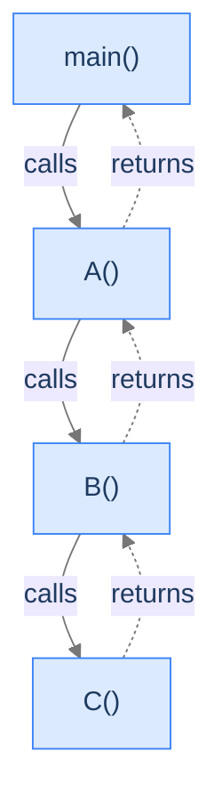

## Why It Exists

You've written nested calls a thousand times — `main` calls `parse`, `parse` calls `tokenize`, `tokenize` calls `peek`. So ordinary you stopped noticing. But *what exactly* happens at the moment of a call? Where do the arguments go? How does the program know where to resume when the callee returns? And why does this same everyday mechanism crash the process when recursion goes too deep?

This lesson is the bridge between the [memory model](/cortex/data-structures-and-algorithms/algorithms-by-strategy/recursion/introduction-to-memory-model) and recursion. Every nested call adds a tier of scaffolding; the previous tier stays paused, holding its place, until the new tier finishes. That pausing-and-resuming is exactly what the **stack** bookkeeps — and stack overflow is what happens when the pausing nests deeper than the bookkeeping can hold.

## See It Work

Four functions, one call each. At the deepest moment, *all four frames are alive* — three paused, one running. Pass a "trail" down so the deepest call can show the live chain:

```python run viz=array
def function_c(trail): print(" -> ".join(trail + ["function_c"]))
def function_b(trail): function_c(trail + ["function_b"])
def function_a(trail): function_b(trail + ["function_a"])
def main():           function_a(["main"])
main()
```

```java run viz=array
public class Main {
    static void functionC(String trail) { System.out.println(trail + " -> functionC"); }
    static void functionB(String trail) { functionC(trail + " -> functionB"); }
    static void functionA(String trail) { functionB(trail + " -> functionA"); }
    public static void main(String[] args) { functionA("main"); }
}
```

Both print `main -> function_a -> function_b -> function_c`: four frames stacked, in call order. When `function_c` returns, its frame pops and `function_b` resumes; then `function_b` pops, then `function_a`, then `main`. Last in, first out.

## How It Works

A stack frame isn't magic — it's a fixed-size block of bytes with a fixed layout the compiler decides. Every frame answers the same four questions:

```d2
frame: "Stack frame for foo(int x, int y)" {
  grid-rows: 4
  grid-columns: 1
  grid-gap: 0
  ret:    "Return address — where to resume in the caller"
  saved:  "Saved registers / frame pointer — restore caller state on return"
  params: "Parameters — x, y"
  locals: "Local variables — everything declared inside foo"
}
```

<p align="center"><strong>One frame: return address, saved registers, parameters, locals. Returning pops it in a single move — read return address, jump, restore registers, slide the stack pointer past the bytes.</strong></p>

Calls push frames; returns pop them. The diagram below traces the cascade — solid arrows are calls (going down), dashed are returns (coming back up):



<p align="center"><strong>While <code>C</code> runs, every function above it is paused — its frame still alive, holding its place via the return-address slot.</strong></p>

But the stack region is small — **1–8 MB per thread**. Push one frame too many and the OS kills the process with a **stack overflow**. It happens three ways:

1. **Too many nested calls** — small frames, but too many (deep or base-case-less recursion). `RecursionError` (Python), `StackOverflowError` (JVM), segfault (C/Rust), `RangeError` (V8).
2. **One frame too big** — a single giant local (e.g. `int arr[1_000_000_000]` on the C stack) overflows on the *first* call.
3. **Both at once** — moderately deep × moderately fat frames. The most common production crash: intermittent, edge-case-triggered, frames that look "fine" alone.

> **Key takeaway.** A frame = return address + saved registers + parameters + locals. Calls push, returns pop, LIFO. The stack is finite (1–8 MB), so the call depth you can reach is bounded by **stack size ÷ frame size** — and exceeding it overflows. Recursion adds no new mechanism; it inherits all three overflow modes.

## Trace It

If the stack is finite, then a function that calls itself forever can't run forever — it must hit a wall. The only question is *where*.

**Predict before you run:** with no base case, how deep does Python recurse before it stops — unbounded, or a specific ceiling?

```python run viz=array
import sys
print("recursion limit:", sys.getrecursionlimit())

depth = 0
def dive():
    global depth
    depth += 1
    dive()                       # no base case

try:
    dive()
except RecursionError:
    print("crashed near depth:", depth)
```

<details>
<summary><strong>Reveal</strong></summary>

It stops just short of `sys.getrecursionlimit()` — `1000` by default — printing a "crashed near depth" in the high 900s (the rest of the limit is eaten by frames already on the stack). Python guards its *own* frame counter and raises a catchable `RecursionError` before the real OS stack runs out. That guard is a safety net other languages lack: in C or the JVM the equivalent runaway recursion segfaults / throws only when the actual 1–8 MB stack is exhausted, far deeper. And raising the Python limit too high (`sys.setrecursionlimit(10**8)`) removes the net and lets you crash *below* the interpreter, in C, with no catchable error. The wall is real and the stack is finite — this is exactly why unbounded recursion is a bug, not just slow.

</details>

## Your Turn

The standard fix when recursion would nest too deep: **don't recurse — iterate.** A loop reuses a single frame, so it never grows the stack. Sum `1..n` for an `n` that would blow the recursion limit many times over:

```python run viz=array
def sum_to_iter(n):
    total = 0
    for i in range(1, n + 1):    # one frame, reused n times — stack stays flat
        total += i
    return total

print(sum_to_iter(1_000_000))    # 500000500000 — a recursive version would overflow long before here
```

```java run viz=array
public class Main {
    static long sumToIter(int n) {
        long total = 0;
        for (int i = 1; i <= n; i++) total += i;   // single frame, no stack growth
        return total;
    }
    public static void main(String[] args) {
        System.out.println(sumToIter(1_000_000));   // 500000500000
    }
}
```

Both print `500000500000`. The recursive `sum_to(1_000_000)` would pile up a million frames and overflow; the loop does the identical arithmetic in one frame. When recursion's depth would exceed `stack ÷ frame`, converting to a loop (or an explicit heap-backed stack) is the cure.

## Reflect & Connect

- **Recursion is this mechanism, self-similar.** If `function_a` calls `function_a`, every call still gets its own independent frame with its own copy of every local; they unwind LIFO exactly as above. Recursion is *not* a new feature — it's `main → A → B → C` where `A`, `B`, `C` are the same function. Stack frames don't care.
- **So recursion inherits all three overflow modes.** Recurse too deep (Mode 1), recurse with a big local (Mode 2), or both (Mode 3). The reachable depth is `stack size ÷ frame size` — shrink the frame or the depth to survive.
- **Two escape hatches.** Convert to iteration with an explicit (heap-backed) stack — trades the tiny stack region for the big heap. Or rely on **tail-call optimisation** where the language offers it (Scala's `@tailrec`, most functional languages) — a tail-recursive call reuses the current frame instead of pushing a new one.
- **Languages differ in the *report*, not the cause.** Go grows goroutine stacks on demand (deep recursion is nearly free); the JVM throws a catchable `StackOverflowError`; C just segfaults. The underlying "one frame too many" is universal.

## Recall

<details>
<summary><strong>Q:</strong> What four things does a stack frame hold?</summary>

**A:** A return address (where to resume in the caller), saved registers / frame pointer, the call's parameters, and its local variables.

</details>
<details>
<summary><strong>Q:</strong> At the deepest point of <code>main → A → B → C</code>, how many frames are alive and which is running?</summary>

**A:** Four frames — `main`, `A`, `B`, `C` — all alive simultaneously. Only `C` is running; the other three are paused, holding their place via the return address. They pop LIFO.

</details>
<details>
<summary><strong>Q:</strong> Name the three ways to overflow the stack.</summary>

**A:** (1) too many nested calls (many small frames), (2) one frame too big (a huge local), (3) both at once — moderate depth × moderate frame size. The third is the common production crash.

</details>
<details>
<summary><strong>Q:</strong> What bounds the maximum call depth?</summary>

**A:** `stack size ÷ frame size`. The stack is typically 1–8 MB per thread; bigger frames mean fewer of them fit before overflow.

</details>
<details>
<summary><strong>Q:</strong> How does recursion relate to ordinary nested calls?</summary>

**A:** Identically — recursion is the same push/pop/LIFO mechanism where the nested calls happen to be the same function with different arguments. It adds no new mechanism, and inherits every overflow mode.

</details>

## Sources & Verify

- **Bryant & O'Hallaron**, *Computer Systems: A Programmer's Perspective*, 3rd ed., §3.7 — procedure calls: the call/return instructions, the stack frame layout, return addresses, and saved registers.
- **CPython docs** — `sys.getrecursionlimit` / `sys.setrecursionlimit`: the interpreter's frame limit (default 1000) versus the underlying OS stack, and why over-raising it segfaults.
- **Scala** `@scala.annotation.tailrec` and the JVM `-Xss` flag — tail-call rewriting and configurable stack size, the two language-level levers on stack depth.
- The `main -> ... -> function_c` chain, the `1000` limit / near-1000 crash depth, and the `500000500000` sum above come from the runnable blocks — re-run to verify.
