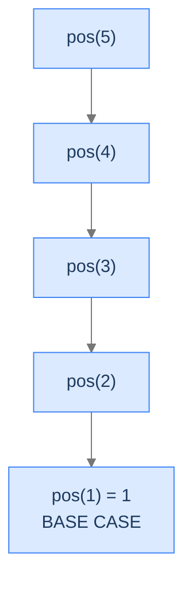
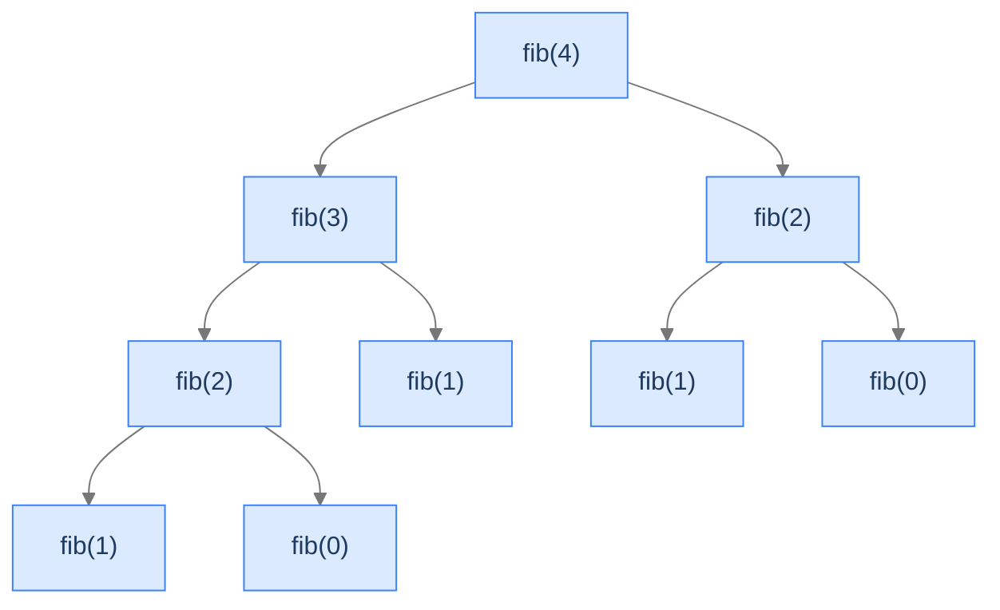

## Why It Exists

You're stuck in a queue at an ATM, wondering whether you're eleventh or thirty-seventh. You can't step out to count, and the people behind you don't know either. But you *can* ask the one person in front of you — and they can ask the person in front of *them*, all the way to the front, where person one knows their position for free. The answer comes back down the line, each person adding 1.

That's recursion, and it works whenever a problem has two features: **a smallest version you can answer directly** (the front of the line) and **a rule that solves a bigger version using a smaller one's answer** (you are one behind the person ahead). Those two features — and *only* those two — power tree traversal, divide-and-conquer, dynamic programming, and backtracking. Learn them once here and those topics become variations on a theme.

## See It Work

The queue-position problem, dictated straight from its two pieces: base case `pos(1) = 1`, recursive relation `pos(n) = 1 + pos(n-1)`.

```python run viz=array
def find_position(n):
    if n == 1:                              # base case: the front of the line
        return 1
    return 1 + find_position(n - 1)         # recursive relation: one behind the person ahead

print("find_position(4):", find_position(4))
```

```java run viz=array
public class Main {
    static int findPosition(int n) {
        if (n == 1) return 1;               // base case
        return 1 + findPosition(n - 1);     // recursive relation
    }
    public static void main(String[] args) {
        System.out.println("findPosition(4): " + findPosition(4));
    }
}
```

Both print `4`. The call descends `find_position(4) → 3 → 2 → 1`, the base case returns `1`, and each frame adds its `+1` on the way back up: `1 → 2 → 3 → 4`. Questions flow toward the front; answers bubble back.

## How It Works

Every recursive solution is **two pieces**:

- **Base case** — the smallest input whose answer is known outright. It stops the recursion. Omit it and the function calls itself forever — i.e. until the stack overflows (the [nested functions](/cortex/data-structures-and-algorithms/algorithms-by-strategy-recursion-nested-functions) failure mode). The base case is not decoration; it's the only reason the recursion ever ends.
- **Recursive relation** — a rule `F(n) = G(F(n−1))` that builds the answer for `n` from the answer to a strictly smaller input. Finding this relation is the entire battle; the code is just dictation.

The calls form a **recursion tree** — each node a call, its children the calls it makes, its leaves the base cases. The tree is the lens: its **height** is the maximum stack depth (space), its **node count** is the time cost.



<p align="center"><strong><code>pos</code>'s tree is a straight line — one recursive call each. <code>n</code> nodes, height <code>n</code> → <code>O(n)</code> time and <code>O(n)</code> stack space.</strong></p>

It's called a *tree* because other relations branch. Fibonacci's `fib(n) = fib(n−1) + fib(n−2)` makes two calls per node:



<p align="center"><strong>Fibonacci branches: ~2ⁿ nodes but height only <code>n</code> → <code>O(2ⁿ)</code> time, <code>O(n)</code> space. The tree's <em>shape</em> is what the four recursion patterns classify.</strong></p>

At runtime it's three phases: **descend** (each call pushes a frame) until the base case, **return** the base value, then **unwind** (frames pop, each combining its contribution). For `find_position` the `+1` happens during unwinding — that's *head recursion*, the first of four patterns.

> **Key takeaway.** Recursion = base case + recursive relation, materialised as a recursion tree on the LIFO stack. Tree height = stack space; node count = time. A missing or unreachable base case means the tree has no leaves — infinite recursion, then stack overflow.

## Trace It

The base case must actually be *reachable* from every input the function is called with. Watch what one off-by-one does. The code uses base case `n == 1`:

**Predict before you run:** what does `find_position(0)` do — return `0`, return something wrong, or crash?

```python run viz=array
import sys
sys.setrecursionlimit(2000)

def find_position(n):
    if n == 1:                              # base case only catches n == 1
        return 1
    return 1 + find_position(n - 1)

try:
    print(find_position(0))
except RecursionError:
    print("RecursionError: 0 -> -1 -> -2 -> ... never hits n == 1")
```

<details>
<summary><strong>Reveal</strong></summary>

It raises `RecursionError`. `find_position(0)` checks `n == 1` (false), so it recurses to `find_position(-1)`, then `find_position(-2)`, and so on — the input moves *away* from the base case forever. The recursion tree has no leaf; the stack fills until it overflows. The base case existing isn't enough — it has to be reachable from *every* valid input. The fix is `if n <= 1:` (or validating the input first). This off-by-one is invisible reading the code top-to-bottom but obvious the moment you sketch the tree and see it never bottoms out — which is exactly why the recursion tree is worth drawing.

</details>

## Your Turn

Two more relations, same two-piece recipe. **Sum to n:** base `sum(0) = 0`, relation `sum(n) = n + sum(n−1)`. **Factorial:** base `fact(1) = 1`, relation `fact(n) = n · fact(n−1)`.

```python run viz=array
def sum_to(n):
    if n == 0: return 0                     # base case
    return n + sum_to(n - 1)                # recursive relation

def factorial(n):
    if n <= 1: return 1                     # base case (reachable from 0 and 1)
    return n * factorial(n - 1)             # recursive relation

print("sum_to(5):", sum_to(5))              # 15
print("factorial(5):", factorial(5))        # 120
```

```java run viz=array
public class Main {
    static int sumTo(int n) {
        if (n == 0) return 0;                       // base case
        return n + sumTo(n - 1);                    // recursive relation
    }
    static long factorial(int n) {
        if (n <= 1) return 1;                       // base case
        return n * factorial(n - 1);                // recursive relation
    }
    public static void main(String[] args) {
        System.out.println("sum_to(5): " + sumTo(5));        // 15
        System.out.println("factorial(5): " + factorial(5)); // 120
    }
}
```

Both print `15` then `120`. Each is three lines because each *is* its recursive relation — find the relation and the code writes itself. (Note `factorial`'s `n <= 1` base case is reachable from both `0` and `1`, dodging the `find_position(0)` trap above.)

## Reflect & Connect

- **Recursion is the spine of this whole part.** DFS is recursion + a visited set; divide-and-conquer (merge sort, quicksort) is recursion that splits; dynamic programming is recursion + a cache; backtracking is recursion + an undo. Internalise the two pieces now and all four feel familiar.
- **The tree's shape is the taxonomy.** The next four lessons classify recursion by tree shape: **head** (thin, work on the way *up* — like `find_position`), **tail** (thin, work on the way *down* with an accumulator), **multiple** (branching, combine subtrees — Fibonacci), **multidimensional** (state on >1 axis, a grid of subproblems).
- **The recursion tax is real.** `find_position(n)` is `O(n)` *space* because `n` frames are alive at once, where the iterative `return n` is `O(1)`. When stack depth is bounded (`O(log n)` divide-and-conquer, tree-height traversals) the cost is negligible; when it's linear and `n` could exceed the stack, rewrite to iteration with an explicit heap-backed stack — same algorithm, resizable memory.
- **Always ask: is the depth bounded, and does every input reach the base case?** Those two questions catch the overwhelming majority of recursion bugs.

## Recall

<details>
<summary><strong>Q:</strong> What are the two pieces of every recursive solution?</summary>

**A:** A base case (the smallest input whose answer is known, which stops the recursion) and a recursive relation (a rule that builds `F(n)` from a strictly smaller input's answer).

</details>
<details>
<summary><strong>Q:</strong> What does a recursion tree tell you?</summary>

**A:** Each node is a call; children are the calls it makes; leaves are base cases. Tree height ≈ maximum stack depth (space); node count ≈ time complexity.

</details>
<details>
<summary><strong>Q:</strong> Why does a missing or unreachable base case crash the program?</summary>

**A:** Without a reachable base case the recursion never stops; the tree has no leaves, frames pile up, and the stack overflows (`RecursionError` / `StackOverflowError` / segfault).

</details>
<details>
<summary><strong>Q:</strong> When does the work happen in <code>find_position</code> — descent or unwinding?</summary>

**A:** Unwinding. Each frame adds its `+1` as it returns, assembling the answer bottom-up. That "work on the way back up" is head recursion.

</details>
<details>
<summary><strong>Q:</strong> What is the "recursion tax", and when should you avoid it?</summary>

**A:** Each live frame is real stack bytes, so a depth-`n` recursion costs `O(n)` space an iterative loop wouldn't. Rewrite to iteration (or an explicit stack) when the depth is linear and could exceed the stack region.

</details>

## Sources & Verify

- **CLRS** (Cormen, Leiserson, Rivest, Stein), *Introduction to Algorithms*, 3rd ed., Ch. 4 — recurrences and recursion trees, including reading time complexity off the tree.
- **Abelson & Sussman**, *Structure and Interpretation of Computer Programs*, §1.2 — recursive vs iterative processes, the shape of the call tree, and orders of growth.
- **Sedgewick & Wayne**, *Algorithms*, 4th ed., §1.1 (recursion) and §2.3 (recursion trees for divide-and-conquer).
- The `4`, `RecursionError`, and `15` / `120` outputs above come from the runnable blocks — re-run to verify.
