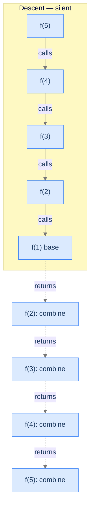

## Why It Exists

Head recursion puts the recursive call at the *head* of the body — right after the base-case check, before any real work. By the time this frame does anything, the recursive call has already returned the smaller subproblem's answer; the frame just combines it with its own input.

This is the [ATM queue](/cortex/data-structures-and-algorithms/algorithms-by-strategy/recursion/recursion) exactly: the question races to the front of the line first, then each person adds 1 as the answer travels back. **The descent is silent; the ascent does the work.** Recognising this pattern tells you *when* a frame's contribution runs (on the way back up) — which is the difference between code that prints digits forwards and code that prints them backwards from the very same recursion.



<p align="center"><strong>Solid arrows are calls (descent). Dashed arrows are returns (ascent). In head recursion, every call's real work — the combine step — happens on the dashed arrow, after the recursive call returns.</strong></p>

## See It Work

Sum the digits of an integer: `sum(n) = sum(n // 10) + (n % 10)`, base `sum(0) = 0`. The recursive call comes first; the `+ n % 10` combine runs on the ascent.

```python run viz=array
def sum_of_digits(n):
    if n == 0:                                  # base case
        return 0
    return sum_of_digits(n // 10) + n % 10      # recurse FIRST, combine AFTER

print("sum_of_digits(523):", sum_of_digits(523))
```

```java run viz=array
public class Main {
    static int sumOfDigits(int n) {
        if (n == 0) return 0;                       // base case
        return sumOfDigits(n / 10) + n % 10;        // recurse first, combine after
    }
    public static void main(String[] args) {
        System.out.println("sumOfDigits(523): " + sumOfDigits(523));
    }
}
```

Both print `10` (5 + 2 + 3). The recursion peels digits off the right (`523 → 52 → 5 → 0`); each frame's `+ n % 10` waits until the smaller answer returns, so the additions happen on the way back up.

## How It Works

Stripped of the problem, every head-recursive function is the same shape: `f(n) = g(f(h(n)), n)` — reduce the input with `h`, recurse, then combine with `g`.

```
function head_recursion(n):
    if n is base case: return known answer    # step 0 — stop
    smaller = head_recursion(h(n))            # steps 1–2 — reduce, then RECURSE FIRST
    return g(smaller, n)                       # step 3 — combine on the way back up
```

The recursive call comes *before* the combine. The frame is idle on descent and does its work on the return.

```d2
direction: right

descent: "Descent (silent)" {
  d1: "f(5) called"
  d2: "f(4) called"
  d3: "f(3) called"
  d4: "f(2) called"
  d5: "f(1) — base case" {style.fill: "#fde68a"; style.stroke: "#d97706"}
}

ascent: "Ascent (the work)" {
  a1: "f(1) returns base"
  a2: "f(2) combines g(prev, 2)" {style.fill: "#bbf7d0"; style.stroke: "#16a34a"}
  a3: "f(3) combines g(prev, 3)" {style.fill: "#bbf7d0"; style.stroke: "#16a34a"}
  a4: "f(4) combines g(prev, 4)" {style.fill: "#bbf7d0"; style.stroke: "#16a34a"}
  a5: "f(5) combines g(prev, 5) — done" {style.fill: "#bbf7d0"; style.stroke: "#16a34a"}
}

descent.d5 -> ascent.a1: hand off
```

<p align="center"><strong>The result is assembled bottom-up during the unwinding — every frame's contribution is a <code>g</code> on a return arrow.</strong></p>

Three diagnostic questions decide whether head recursion fits a new problem:

- **Q1 — smaller version?** Does `f(n)` depend on `f(something smaller)`? (Recursive structure exists.)
- **Q2 — smaller answer *first*?** Can the subproblem be solved before this step does anything? If the step must transform the input *before* recursing, you want an accumulator instead — [tail recursion](/cortex/data-structures-and-algorithms/algorithms-by-strategy-recursion-pattern-tail-recursion).
- **Q3 — known smallest answer?** Is there a base case the descent reaches? (`0`, `""`, `null`…)

Cost: `O(n)` time and `O(n)` stack space (the deepest moment holds `n` frames) when `g` and `h` are `O(1)`. That space is the **scaffolding tax** — every frame is real bytes until the unwinding starts.

> **Key takeaway.** Head recursion = recursive call first, combine after — **descend silently, ascend with work**. It fits any problem where you need the smaller subproblem's answer *before* you can compute this step's. `O(n)` time and `O(n)` stack space.

## Trace It

If the work happens on the ascent, the *order* in which frames contribute is the reverse of the order they were called. Watch it with digit printing. This function peels the last digit (`n % 10`) but recurses *first*, printing only on the way back:

**Predict before you run:** `523` is peeled right-to-left (`3`, then `2`, then `5`). With the print placed *after* the recursive call, do the digits come out `3 2 5` or `5 2 3`?

```python run viz=array
def show_head(n):
    if n == 0: return
    show_head(n // 10)        # recurse FIRST
    print(n % 10, end=" ")    # print on the ascent

def show_pre(n):
    if n == 0: return
    print(n % 10, end=" ")    # print BEFORE recursing
    show_pre(n // 10)

show_head(523); print("  <- recurse, then print (head)")
show_pre(523);  print("  <- print, then recurse")
```

<details>
<summary><strong>Reveal</strong></summary>

The head version prints `5 2 3` — **natural left-to-right order** — while print-before-recurse prints `3 2 5` (reversed). It's counterintuitive: each frame *extracts* the last digit (`3` from `523`), yet `3` prints *last*. Because the recursive call runs first, every frame is paused at its `print` until the deepest call (holding the most-significant digit, `5`) returns; then the prints fire as the stack unwinds, deepest-first. Moving one line from before the call to after it reverses the output — that's the entire practical difference between head recursion (work on the ascent) and its mirror. When a problem needs results emitted in the reverse of the peeling order, head recursion gives it to you for free.

</details>

## Your Turn

Factorial is head recursion too: `fact(n) = n · fact(n−1)`, base `fact(1) = 1`. The multiply can't happen until `fact(n−1)` returns, so the work — like sum-of-digits — lands on the ascent.

```python run viz=array
def factorial(n):
    if n <= 1:                          # base case (reachable from 0 and 1)
        return 1
    return n * factorial(n - 1)         # multiply on the ascent

print("factorial(5):", factorial(5))    # 120
```

```java run viz=array
public class Main {
    static long factorial(int n) {
        if (n <= 1) return 1;               // base case
        return n * factorial(n - 1);        // multiply on the ascent
    }
    public static void main(String[] args) {
        System.out.println("factorial(5): " + factorial(5));   // 120
    }
}
```

Both print `120`. The descent reaches `fact(1) = 1`, then the multiplications fire on the way up: `1 → 2·1 → 3·2 → 4·6 → 5·24 = 120`. The four problems in this section's **Problems** folder — forward sequence, factorial, sum of digits, reverse a queue — are all this same "recurse first, combine after" shape.

## Reflect & Connect

- **Head vs. tail is *where the work lands*.** Head recursion combines on the ascent (it needs the smaller answer first); [tail recursion](/cortex/data-structures-and-algorithms/algorithms-by-strategy-recursion-pattern-tail-recursion) does its work on the descent, carrying a running result in an accumulator so nothing is left to do on the way back. The digit-print flip above is the cleanest demonstration of the difference.
- **The ascent gives reversal for free.** Any "emit in reverse of the natural peeling order" task — print a number's digits left-to-right while peeling from the right, reverse a list by recursing then appending — is a head-recursion fit.
- **Mind the scaffolding tax.** `O(n)` stack depth is fine when `n` is modest, but linear-depth head recursion on huge inputs risks the stack-overflow modes from [nested functions](/cortex/data-structures-and-algorithms/algorithms-by-strategy/recursion/nested-functions). Convert to a loop when depth could approach the stack limit.
- **Big data: pass by reference.** In copy-semantics languages (C++, Rust) passing a large container by value copies it on every one of the `n` calls (`O(n·m)`); pass by reference so all frames share one object. High-level languages already share references.

## Recall

<details>
<summary><strong>Q:</strong> What defines head recursion?</summary>

**A:** The recursive call is the first thing the body does (after the base-case check); the combine step runs *after* it returns — work on the ascent. "Descend silently, ascend with work."

</details>
<details>
<summary><strong>Q:</strong> The three diagnostic questions for head recursion?</summary>

**A:** Q1: does `f(n)` depend on a smaller `f`? Q2: can the smaller answer be computed *before* this step's contribution? Q3: is there a known base case the descent reaches? All "yes" → head recursion fits.

</details>
<details>
<summary><strong>Q:</strong> In <code>sum_of_digits</code>, when does each <code>+ n % 10</code> execute?</summary>

**A:** On the ascent — after the recursive call returns the digit-sum of `n // 10`. The descent only peels digits and pushes frames.

</details>
<details>
<summary><strong>Q:</strong> Why does recurse-then-print emit digits in natural order while print-then-recurse reverses them?</summary>

**A:** Recurse-first pauses every frame at its `print` until the deepest call returns, so prints fire deepest-first (most-significant digit first). Print-first emits each digit before descending, in peeling order (least-significant first).

</details>
<details>
<summary><strong>Q:</strong> Time and space cost of single-call head recursion?</summary>

**A:** `O(n)` time and `O(n)` stack space when `g`/`h` are `O(1)` — one frame per step, all alive at the deepest moment. The space is the scaffolding tax.

</details>

## Sources & Verify

- **Abelson & Sussman**, *Structure and Interpretation of Computer Programs*, §1.2.1 — linear recursive processes (work deferred to the unwinding) versus iterative processes, the exact head-vs-tail distinction.
- **CLRS** (Cormen, Leiserson, Rivest, Stein), *Introduction to Algorithms*, 3rd ed., Ch. 4 — recursion trees and the cost of single-call (linear) recursion.
- **Sedgewick & Wayne**, *Algorithms*, 4th ed., §1.1 — recursion, base cases, and the order of operations on the call stack.
- The `10`, the `5 2 3` / `3 2 5` digit orders, and `120` above come from the runnable blocks — re-run to verify.
