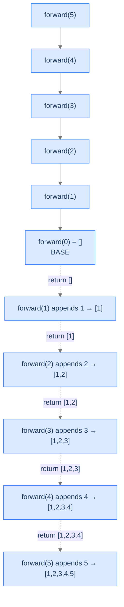

# Forward Sequence

Our first worked problem. Deliberately easy — this is where you watch the template fit a problem cleanly so you can recognise the fit on sight.

---

## The Problem

Given a positive integer `n`, return a list containing the numbers from `1` to `n` in order. You **must** solve this recursively.

```
Input:  n = 5
Output: [1, 2, 3, 4, 5]

Input:  n = 1
Output: [1]

Input:  n = 3
Output: [1, 2, 3]
```

---

<details>
<summary><h2>What Does "Build a List Recursively" Mean?</h2></summary>


The natural temptation is to loop: `for i in 1..n: append(i)`. The point of this exercise isn't that recursion is *better* here (it isn't) — it's that you can see the template lock onto a problem whose iterative version is trivial, so you can recognise the same shape later in problems where the recursive version is genuinely shorter than the loop.

The recursive idea: **build the list for `n-1` first, then append `n` to it.** That's `[1, 2, ..., n-1] ++ [n]`. The base case is `n == 0`, returning the empty list.



<p align="center"><strong>Recursion tree for <code>forward(5)</code>. Descent is silent; the appends happen on the ascent — classic head recursion.</strong></p>

</details>
<details>
<summary><h2>Applying the Diagnostic Questions</h2></summary>


| # | Check | Answer |
|---|---|---|
| **Q1** | Smaller version? | **Yes** — the list for `n` is the list for `n-1` plus the element `n`. |
| **Q2** | Smaller answer first, then combine? | **Yes** — we need the `[1..n-1]` list before we can append `n`. |
| **Q3** | Known smallest answer? | **Yes** — `forward(0) = []`. |

### Q1 — Why "the list for n is built from the list for n−1"?

The list `[1, 2, ..., n]` factors cleanly into `[1, 2, ..., n-1]` followed by `[n]`. The first part is exactly the smaller subproblem; the second is the trivial contribution this frame makes. That's the textbook shape head recursion looks for.

### Q2 — Why "smaller list before this step's append"?

To put `n` at the *end* of the list, the list for `n-1` must already exist. There's nothing this frame can do with `n` until it has the smaller list to append to. Recursive call first; combine (append) on the way back. ✓

### Q3 — Why "forward(0) = []"?

The smallest meaningful input is `0`: there are no integers from `1` to `0`, so the list is empty. The recursion bottoms out cleanly at `forward(0) = []`. (Some people prefer `forward(1) = [1]` as the base case — both work; the `0` choice is slightly more uniform because every integer reduces to `0`.)

</details>
<details>
<summary><h2>The Append-on-the-Way-Back Strategy (Visualised)</h2></summary>


The build happens during stack unwinding. We use the *output-by-reference* style — the caller creates the list, passes it as an out-argument, and each recursive frame appends its value on the ascent. This avoids `O(n)` list-copying at every step in low-level languages.

<div class="d2-slides" data-caption="Each frame appends its value on the way back up. The list grows as the stack unwinds.">

```d2
state: "After forward(0) returns" {
  list: "result = []"
}
```

```d2
state: "forward(1) appends 1" {
  list: "result = [1]" {style.fill: "#dbeafe"; style.stroke: "#3b82f6"}
}
```

```d2
state: "forward(2) appends 2" {
  list: "result = [1, 2]" {style.fill: "#fde68a"; style.stroke: "#d97706"}
}
```

```d2
state: "forward(3) appends 3" {
  list: "result = [1, 2, 3]" {style.fill: "#bbf7d0"; style.stroke: "#16a34a"}
}
```

```d2
state: "forward(4) appends 4" {
  list: "result = [1, 2, 3, 4]" {style.fill: "#fecaca"; style.stroke: "#dc2626"}
}
```

```d2
state: "forward(5) appends 5 — final" {
  list: "result = [1, 2, 3, 4, 5]" {style.fill: "#ede9fe"; style.stroke: "#7c3aed"}
}
```

</div>

</details>
<details>
<summary><h2>Solution &amp; Analysis</h2></summary>

### The Solution

```python run viz=array viz-root=result
from typing import List

class Solution:
    def helper(self, n: int, result: List[int]):

        # Base case: If n is less than or equal to 0, we have reached the
        # end of recursion
        if n <= 0:

            # Exit the function, as there are no more numbers to add
            return

        # Recursive call to the helper function with n-1, to move towards
        # the base case
        self.helper(n - 1, result)

        # After the recursive call returns, the result list contains
        # numbers from 1 to n-1. Now, we add the current number n to the
        # result list to complete the sequence
        result.append(n)

    def forward_sequence(self, n: int) -> List[int]:

        # Initialize an empty list to store the result
        result: List[int] = []

        # Call the helper function to populate the result list with
        # numbers from 1 to n
        self.helper(n, result)

        # Return the generated list containing numbers from 1 to n
        return result


# Examples from the problem statement
print(Solution().forward_sequence(5))   # [1, 2, 3, 4, 5]

# Edge cases
print(Solution().forward_sequence(1))   # [1]
print(Solution().forward_sequence(3))   # [1, 2, 3]
print(Solution().forward_sequence(10))  # [1, 2, 3, 4, 5, 6, 7, 8, 9, 10]
```

```java run viz=array viz-root=result
import java.util.*;

public class Main {
    static class Solution {
        private void helper(int N, List<Integer> result) {

            // Base case: If N is less than or equal to 0, we have reached
            // the end of recursion
            if (N <= 0) {

                // Exit the function, as there are no more numbers to add
                return;
            }

            // Recursive call to the helper function with N-1, to move
            // towards the base case
            helper(N - 1, result);

            // After the recursive call returns, the result list contains
            // numbers from 1 to N-1 Now, we add the current number N to the
            // result list to complete the sequence
            result.add(N);
        }

        public List<Integer> forwardSequence(int N) {

            // Initialize an empty list to store the result
            List<Integer> result = new ArrayList<>();

            // Call the helper function to populate the result list with
            // numbers from 1 to N
            helper(N, result);

            // Return the generated list containing numbers from 1 to N
            return result;
        }
    }

    public static void main(String[] args) {
        // Examples from the problem statement
        System.out.println(new Solution().forwardSequence(5));   // [1, 2, 3, 4, 5]

        // Edge cases
        System.out.println(new Solution().forwardSequence(1));   // [1]
        System.out.println(new Solution().forwardSequence(3));   // [1, 2, 3]
        System.out.println(new Solution().forwardSequence(10));  // [1, 2, 3, 4, 5, 6, 7, 8, 9, 10]
    }
}
```


<details>
<summary><strong>Trace — n = 5</strong></summary>

```
Call:    helper(5, []) → helper(4, []) → helper(3, []) → helper(2, [])
         → helper(1, []) → helper(0, [])  ← base case, returns immediately

Ascent:
  helper(0, []) returns               result = []
  helper(1, ...) appends 1            result = [1]
  helper(2, ...) appends 2            result = [1, 2]
  helper(3, ...) appends 3            result = [1, 2, 3]
  helper(4, ...) appends 4            result = [1, 2, 3, 4]
  helper(5, ...) appends 5            result = [1, 2, 3, 4, 5]

Final answer: [1, 2, 3, 4, 5]
```

The list grows by one element per ascending frame. The descent is silent; the work is in the unwinding.

</details>

### Complexity Analysis

| Resource | Cost | Why |
|---|---|---|
| **Time** | `O(n)` | One frame per integer; each frame does an `O(1)` append (amortised for dynamic arrays). |
| **Space (output)** | `O(n)` | The result list itself contains `n` elements. |
| **Space (stack)** | `O(n)` | Recursion depth equals `n`. |

The output-reference style avoids the `O(n²)` cost of "build the list then return-by-copy at every frame," which is the trap a naive recursive build falls into.

### Edge Cases

| Case | Example | Expected | Reasoning |
|---|---|---|---|
| Smallest valid input | `n = 1` | `[1]` | Recurse to `forward(0) = []`, append `1`. |
| Smallest possible | `n = 0` | `[]` | Base case fires immediately. |
| Negative input | `n = -3` | `[]` | The `n <= 0` guard catches it; harmless. |
| Large input | `n = 100_000` | Output of length 100k; **possible stack overflow** on JVM (default ~10K) | Linear stack depth — trip Failure Mode 1 from the Nested Functions lesson if the stack is small. The fix is to use iteration for very large `n`. |

</details>
<details>
<summary><h2>Key Takeaway</h2></summary>


Forward Sequence is the head-recursion template applied with `g = append` and `h = decrement`. The recursive call goes first, the append happens on the way back, and the list assembles bottom-up — the same scaffolding-unwind picture from the Memory Model lesson producing observable output this time. The next problem looks similar — until you notice the combine step is *multiplication*, and one base case decision changes everything.

</details>
