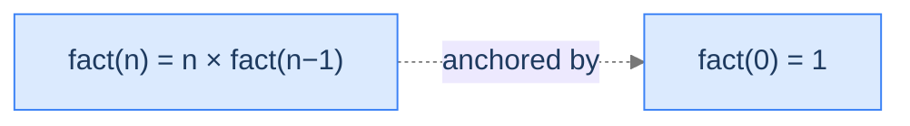
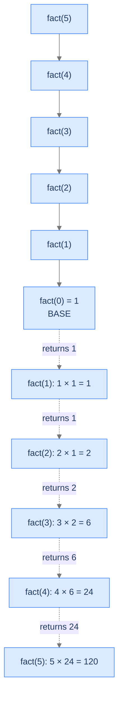

# Calculate Factorial

The poster child of recursion. The combine function is multiplication; the base case is delicate.

---

## The Problem

Given a non-negative integer `n`, return its factorial: `n! = n × (n-1) × (n-2) × ... × 1`. By convention `0! = 1`. You **must** solve this recursively.

---

## Examples

**Example 1**
```
Input:  n = 7
Output: 5040
Explanation: 7 × 6 × 5 × 4 × 3 × 2 × 1 = 5040
```

**Example 2**
```
Input:  n = 5
Output: 120
Explanation: 5 × 4 × 3 × 2 × 1 = 120
```

```quiz
{
  "prompt": "What would be wrong with using fact(0) = 0 as the base case?",
  "options": [
    "Nothing — 0 is a valid identity",
    "Every multiplication on the ascent would be n × 0 = 0, collapsing the whole result to 0",
    "It would cause an infinite loop",
    "It only affects odd inputs"
  ],
  "answer": "Every multiplication on the ascent would be n × 0 = 0, collapsing the whole result to 0"
}
```

## Constraints

- `0 ≤ n ≤ 12` (fits in a 32-bit int; `13!` overflows)
- Must be solved recursively (no loop over integers).

```python run viz=array
class Solution:
    def factorial(self, n: int) -> int:
        # Your code goes here — base case n == 0 returns 1;
        # otherwise recurse on n-1 and multiply on the ascent.
        return 0

n = int(input())
print(Solution().factorial(n))
```

```java run viz=array
import java.util.*;

public class Main {
    static class Solution {
        public int factorial(int N) {
            // Your code goes here — base case N == 0 returns 1;
            // otherwise recurse on N-1 and multiply on the ascent.
            return 0;
        }
    }

    public static void main(String[] args) {
        int n = Integer.parseInt(new Scanner(System.in).nextLine().trim());
        System.out.println(new Solution().factorial(n));
    }
}
```

```testcases
{
  "args": [
    { "id": "n", "label": "n", "type": "int", "placeholder": "5" }
  ],
  "cases": [
    { "args": { "n": "7" }, "expected": "5040" },
    { "args": { "n": "5" }, "expected": "120" },
    { "args": { "n": "0" }, "expected": "1" },
    { "args": { "n": "1" }, "expected": "1" },
    { "args": { "n": "2" }, "expected": "2" },
    { "args": { "n": "10" }, "expected": "3628800" }
  ]
}
```

<details>
<summary><h2>What Does "Factorial" Mean Recursively?</h2></summary>


Read the definition `n! = n × (n-1)!` and the recursion writes itself: the answer for `n` is `n` times the answer for `n-1`. The base case is the one that needs care: `0! = 1`, not `0`.



<p align="center"><strong>The recursive relation for factorial. <code>fact(0) = 1</code> is the multiplicative identity — picking <code>0</code> instead of <code>1</code> as the base would silently produce wrong answers.</strong></p>

> *Predict before reading on — what would happen if we used `fact(0) = 0` as the base case? What about `fact(1) = 1`? Are both valid?*

`fact(0) = 0` would propagate `0` all the way up: every multiplication on the ascent is `n × 0 = 0`. The whole computation collapses. **`fact(1) = 1`** is fine and is sometimes preferred — but you must guarantee `n >= 1` at the call site, or `fact(0)` will skip the base and recurse to `fact(-1)` and crash. `fact(0) = 1` is the safer, more general choice.

</details>
<details>
<summary><h2>Applying the Diagnostic Questions</h2></summary>


| # | Check | Answer |
|---|---|---|
| **Q1** | Smaller version? | **Yes** — `fact(n)` reduces to `fact(n-1)`. |
| **Q2** | Smaller answer first, then combine? | **Yes** — multiply `n × fact(n-1)` *after* the recursive call returns. |
| **Q3** | Known smallest answer? | **Yes** — `fact(0) = 1`. |

### Q1 — Why "n−1 is the smaller subproblem"?

`n!` is defined as `n × (n-1)!`. The right-hand side contains `(n-1)!` — that's the same problem on a smaller input. By induction, every step reduces by one until we hit `0`. ✓

### Q2 — Why "compute fact(n−1) before multiplying"?

Multiplication doesn't help us compute `fact(n)` until we know `fact(n-1)`. We can't multiply `n` by an unknown. So the recursive call must happen first — we need its return value before the combine step `n × _` can run. ✓

### Q3 — Why "fact(0) = 1, not 0"?

`1` is the multiplicative identity: anything times `1` is itself. Picking `1` keeps the multiplicative chain consistent. Picking `0` would zero out the whole answer (`5! = 5 × 4 × 3 × 2 × 1 × 0 = 0`).

</details>
<details>
<summary><h2>The Multiply-on-the-Way-Back Strategy (Visualised)</h2></summary>




<p align="center"><strong>The descent walks down to <code>fact(0)</code>; the ascent multiplies each frame's <code>n</code> by the smaller answer. The product accumulates from the bottom up.</strong></p>

</details>
<details>
<summary><h2>Solution &amp; Analysis</h2></summary>

### The Solution

```python solution time=O(n) space=O(n)
class Solution:
    def factorial(self, n: int) -> int:

        # Base case: If n is 0, the factorial is 1
        if n == 0:
            return 1

        # Recursive call to calculate factorial of (n - 1)
        factorial_of_n_minus_1 = self.factorial(n - 1)

        # Multiply n with the factorial of (n - 1)
        return n * factorial_of_n_minus_1


n = int(input())
print(Solution().factorial(n))
```

```java solution
import java.util.*;

public class Main {
    static class Solution {
        public int factorial(int N) {

            // Base case: If N is 0, the factorial is 1
            if (N == 0) {
                return 1;
            }

            // Recursive call to calculate factorial of (N - 1)
            int factorialOfNMinus1 = factorial(N - 1);

            // Multiply N with the factorial of (N - 1)
            return N * factorialOfNMinus1;
        }
    }

    public static void main(String[] args) {
        int n = Integer.parseInt(new Scanner(System.in).nextLine().trim());
        System.out.println(new Solution().factorial(n));
    }
}
```


<details>
<summary><strong>Trace — n = 5</strong></summary>

```
Descent:
  fact(5) → fact(4) → fact(3) → fact(2) → fact(1) → fact(0)

Ascent (multiplications happen here):
  fact(0) returns 1
  fact(1) returns 1 × 1   = 1
  fact(2) returns 2 × 1   = 2
  fact(3) returns 3 × 2   = 6
  fact(4) returns 4 × 6   = 24
  fact(5) returns 5 × 24  = 120

Final answer: 120
```

The product is built from the base case up to the top. Same shape as Forward Sequence; different combine function.

</details>

### Complexity Analysis

| Resource | Cost | Why |
|---|---|---|
| **Time** | `O(n)` | One frame per integer; constant-time multiply per frame. |
| **Space** | `O(n)` | Recursion depth equals `n`. |

For very large `n` the *integer overflow* matters more than the recursion depth. `20!` already exceeds the range of a 64-bit `long long`. Use big-integer types (Python's native `int`, Java `BigInteger`) for `n > 20`.

### Edge Cases

| Case | Example | Expected | Reasoning |
|---|---|---|---|
| Identity base | `n = 0` | `1` | Multiplicative identity. |
| Smallest computational | `n = 1` | `1` | One multiplication: `1 × fact(0) = 1`. |
| Overflow at small `n` | `n = 21` | exceeds 64-bit `long long` | Switch to big-int or warn the caller. |
| Negative input | `n = -3` | undefined | Must be guarded at the entry point — `n < 0` would skip the base and recurse forever. |
| Large `n` | `n = 100_000` | overflow + stack overflow | Use big-int + iteration. |

</details>
<details>
<summary><h2>Key Takeaway</h2></summary>


Factorial is the head-recursion template with `g = multiply` and a base case that has to be the multiplicative identity. Different combine, different base case, same scaffolding-unwind shape. The next problem replaces the combine with addition — but adds a twist: the input doesn't shrink by one each time. It shrinks by *a digit*.

</details>
