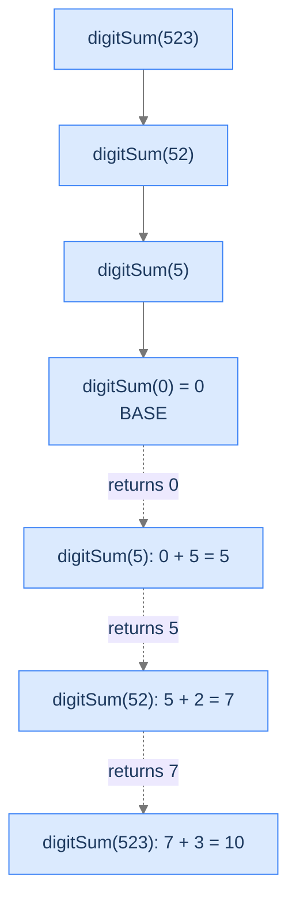

# Sum of Digits

This is the warm-up from earlier promoted to a full problem. The reduction `h` is no longer "decrement" — it's "lop off the last digit." Same template, different `h`.

---

## The Problem

Given a non-negative integer `n`, return the sum of its digits. You **must** solve this recursively.

```
Input:  n = 523
Output: 10
Explanation: 5 + 2 + 3 = 10

Input:  n = 1005
Output: 6
Explanation: 1 + 0 + 0 + 5 = 6

Input:  n = 0
Output: 0
```

---

<details>
<summary><h2>What Does "Lop Off the Last Digit" Mean?</h2></summary>


For any non-negative integer `n`, the operation `n / 10` (integer division) drops its last digit. The dropped digit itself is `n % 10`. Together, these two operations factor any number into "all but the last digit" plus "the last digit":

```d2
direction: right

n: "n = 523" {style.fill: "#dbeafe"; style.stroke: "#3b82f6"}
quot: "n / 10 = 52" {style.fill: "#fde68a"; style.stroke: "#d97706"}
mod:  "n % 10 = 3" {style.fill: "#bbf7d0"; style.stroke: "#16a34a"}

n -> quot: integer division
n -> mod: modulo
```

<p align="center"><strong>Integer division and modulo split <code>n</code> into "everything except the last digit" and "the last digit." This is the engine that drives every digit-by-digit recursion.</strong></p>

The recursive insight: **`digitSum(n) = digitSum(n / 10) + (n % 10)`.** Drop the last digit to get the smaller subproblem; add the last digit on the ascent.

</details>
<details>
<summary><h2>Applying the Diagnostic Questions</h2></summary>


| # | Check | Answer |
|---|---|---|
| **Q1** | Smaller version? | **Yes** — `digitSum(n)` reduces to `digitSum(n / 10)` (one fewer digit). |
| **Q2** | Smaller answer first, then combine? | **Yes** — add `n % 10` after the recursive call returns. |
| **Q3** | Known smallest answer? | **Yes** — `digitSum(0) = 0`. |

### Q1 — Why "n / 10 is the smaller version"?

`n / 10` removes the last digit, so the input shrinks by one digit each call. After at most `⌈log₁₀(n)⌉` calls the input is `0` and the recursion terminates. The reduction `h(n) = n / 10` is the textbook "make the input smaller by one unit" — but the unit here is a *digit*, not a unit value. Recursion depth is therefore `O(log n)`, not `O(n)` — much shallower than the previous two problems. ✓

### Q2 — Why "add n % 10 after recursing"?

We need the digit-sum of `n / 10` first. Once we have that, adding the last digit (`n % 10`) gives `digitSum(n)`. The combine step is plain addition; we have to wait for the smaller answer before we can do it. ✓

### Q3 — Why "digitSum(0) = 0"?

Zero has no nonzero digits to sum. Mathematically, `0 = 0`. Picking `0` as the base case makes the recursion terminate cleanly: the moment `n / 10` reaches `0`, we stop. ✓

</details>
<details>
<summary><h2>The Add-on-the-Way-Back Strategy (Visualised)</h2></summary>




<p align="center"><strong>Each frame contributes its own last digit on the ascent. The total accumulates bottom-up, frame by frame.</strong></p>

</details>
<details>
<summary><h2>Solution &amp; Analysis</h2></summary>

### The Solution

```python run viz=array
class Solution:
    def sum_of_digits(self, n: int) -> int:

        # Base case: If n is 0, we have reached
        # the end of recursion
        if n == 0:
            return 0

        # Recursive call with the remaining number without
        # the last digit
        remaining_sum = self.sum_of_digits(n // 10)

        # Combine results with the last digit
        return remaining_sum + n % 10


# Examples from the problem statement
print(Solution().sum_of_digits(523))   # 10
print(Solution().sum_of_digits(1005))  # 6
print(Solution().sum_of_digits(0))     # 0

# Edge cases
print(Solution().sum_of_digits(9))     # 9
print(Solution().sum_of_digits(99))    # 18
print(Solution().sum_of_digits(1000))  # 1
print(Solution().sum_of_digits(999))   # 27
```

```java run viz=array
public class Main {
    static class Solution {
        public int sumOfDigits(int N) {

            // Base case: If N is 0, we have reached
            // the end of recursion
            if (N == 0) {
                return 0;
            }

            // Recursive call with the remaining number without
            // the last digit
            int remainingSum = sumOfDigits(N / 10);

            // Combine results with the last digit
            return remainingSum + (N % 10);
        }
    }

    public static void main(String[] args) {
        // Examples from the problem statement
        System.out.println(new Solution().sumOfDigits(523));   // 10
        System.out.println(new Solution().sumOfDigits(1005));  // 6
        System.out.println(new Solution().sumOfDigits(0));     // 0

        // Edge cases
        System.out.println(new Solution().sumOfDigits(9));     // 9
        System.out.println(new Solution().sumOfDigits(99));    // 18
        System.out.println(new Solution().sumOfDigits(1000));  // 1
        System.out.println(new Solution().sumOfDigits(999));   // 27
    }
}
```


<details>
<summary><strong>Trace — n = 1005</strong></summary>

```
Descent (each call removes one digit):
  digitSum(1005) → digitSum(100) → digitSum(10) → digitSum(1) → digitSum(0)

Ascent (each frame adds its last digit):
  digitSum(0)      returns 0
  digitSum(1)      returns 0 + 1 = 1
  digitSum(10)     returns 1 + 0 = 1
  digitSum(100)    returns 1 + 0 = 1
  digitSum(1005)   returns 1 + 5 = 6

Final answer: 6
```

The depth is `4` (number of digits), not `1005` (the value). That's the `O(log n)` depth in action.

</details>

### Complexity Analysis

| Resource | Cost | Why |
|---|---|---|
| **Time** | `O(log n)` | Recursion depth equals the number of digits, which is `⌈log₁₀(n)⌉`. |
| **Space** | `O(log n)` | Same — one frame per digit. |

The depth here is *much* shallower than the previous two problems. Forward Sequence and Factorial recurse `n` times for input `n`; Sum of Digits recurses `~log₁₀(n)` times. Even `n = 10⁹` only goes ten frames deep — completely safe.

### Edge Cases

| Case | Example | Expected | Reasoning |
|---|---|---|---|
| Zero | `n = 0` | `0` | Base case fires; correct. |
| Single digit | `n = 7` | `7` | `digitSum(0) + 7 = 7`. |
| Trailing zeros | `n = 1005` | `6` | The zeros contribute `0` each — see trace above. |
| All same digit | `n = 9999` | `36` | `9 + 9 + 9 + 9 = 36`. |
| Large input | `n = 2_147_483_647` | sum of those 10 digits | Even max-int is only ~10 digits deep. |

</details>
<details>
<summary><h2>Key Takeaway</h2></summary>


Sum of Digits is head recursion with `g = add` and a `h(n) = n / 10` reduction that shrinks the input by an order of magnitude per call instead of by one unit. The shape is identical to Forward Sequence and Factorial; only the *rate* of descent differs. The next problem stretches the template the furthest yet — the input is a queue, not an integer, and the combine step has to be done with care.

</details>
