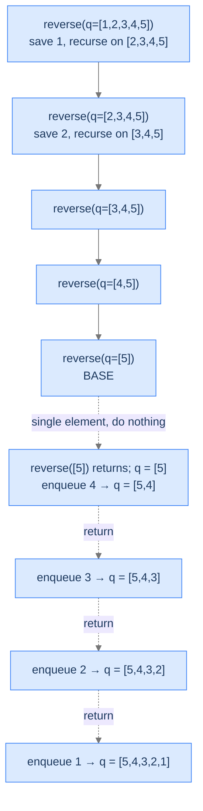

# Reverse a Queue

The hardest of the four. The recursive structure is still head-recursion-flavoured, but you have to use the call stack itself as your auxiliary data structure — and the combine step requires an enqueue *after* the recursive call.

---

## The Problem

Given a queue `q`, reverse its contents in place. You may not return a new queue. You **must** solve this recursively.

```
Input:  q = [1, 2, 3, 4, 5, 6, 7]   (front on the left)
Output: q = [7, 6, 5, 4, 3, 2, 1]
```

---

<details>
<summary><h2>What Makes Reversing a Queue Recursively Tricky?</h2></summary>


A queue gives you two operations: dequeue from the front, enqueue to the back. There's no "swap front and back" operation. To reverse, every element has to move from the front to the back — but the order in which they get re-enqueued is the *reverse* of the order in which they were dequeued.

The recursive trick: **dequeue the front, recurse on the rest, then enqueue the saved front at the back.** The recursion uses the call stack as a temporary stash for every dequeued element, then drains it on the ascent.



<p align="center"><strong>Recursion tree for reversing a 5-element queue. The descent saves each front in a stack frame's local variable. The ascent re-enqueues them in reverse order.</strong></p>

</details>
<details>
<summary><h2>Applying the Diagnostic Questions</h2></summary>


| # | Check | Answer |
|---|---|---|
| **Q1** | Smaller version? | **Yes** — reverse of `q` reduces to "save front, reverse the rest, append saved front." |
| **Q2** | Smaller answer first, then combine? | **Yes** — recurse first, then enqueue the saved front. |
| **Q3** | Known smallest answer? | **Yes** — a queue of size 0 or 1 is already "reversed." |

### Q1 — Why "the rest of the queue is the smaller version"?

A queue with `n` elements reversed is logically: `[front] + reverse(rest)` — but the front belongs at the *end* after reversal. Concretely: reverse-of-`[1,2,3,4,5]` = `[reverse-of-[2,3,4,5], 1]`. The rest is the smaller subproblem; the saved front is this frame's contribution. ✓

### Q2 — Why "recurse first, enqueue later"?

The saved front has to go *behind* the reversed rest. We can't enqueue it before the rest has been reversed; if we did, it'd land in the middle. So the recursion must complete first. Each ascending frame's enqueue lands the saved element at what's currently the back of the partially-reversed queue. ✓

### Q3 — Why "size 0 or 1 is the base case"?

A 0- or 1-element queue is identical forwards and backwards. There's nothing to do, and the recursion bottoms out cleanly. ✓

</details>
<details>
<summary><h2>The Save-and-Re-enqueue Strategy (Visualised)</h2></summary>


The descent saves each front in a stack-frame local. The ascent drains those locals back into the queue.

<div class="d2-slides" data-caption="Each descending frame saves its front and recurses; each ascending frame enqueues the saved front to the back.">

```d2
state: "Start" {
  q: "queue: [1, 2, 3, 4, 5]" {style.fill: "#dbeafe"; style.stroke: "#3b82f6"}
  stash: "saved fronts: (none)"
}
```

```d2
state: "After dequeue 1, recurse" {
  q: "queue: [2, 3, 4, 5]"
  stash: "saved: 1 (in deepest-but-one frame)" {style.fill: "#fde68a"; style.stroke: "#d97706"}
}
```

```d2
state: "After dequeue 2, 3, 4 — recursion at base" {
  q: "queue: [5]" {style.fill: "#bbf7d0"; style.stroke: "#16a34a"}
  stash: "saved (deep → shallow): 4, 3, 2, 1"
}
```

```d2
state: "Ascent — enqueue 4 from its frame" {
  q: "queue: [5, 4]" {style.fill: "#fde68a"; style.stroke: "#d97706"}
  stash: "saved: 3, 2, 1"
}
```

```d2
state: "Continue ascending — enqueue 3, 2, 1" {
  q: "queue: [5, 4, 3, 2, 1]" {style.fill: "#ede9fe"; style.stroke: "#7c3aed"}
  stash: "(empty — all drained)"
}
```

</div>

The "stash" is conceptual — those saved fronts physically live in `frontElement` locals on each frame. The call stack is doing double duty as both control flow and temporary storage.

</details>
<details>
<summary><h2>Solution &amp; Analysis</h2></summary>

### The Solution

```python run viz=array viz-root=q1
from typing import List

class Solution:
    def reverse_a_queue(self, q: List[int]) -> None:

        # Base case: List is empty or has only one element
        if len(q) == 0 or len(q) == 1:
            return

        # Dequeue the front element
        front_element: int = q.pop(0)

        # Reverse the remaining list
        self.reverse_a_queue(q)

        # Enqueue the front element to the rear
        q.append(front_element)


# Examples from the problem statement
q1 = [1, 2, 3, 4, 5, 6, 7]
Solution().reverse_a_queue(q1); print(q1)   # [7, 6, 5, 4, 3, 2, 1]

# Edge cases
q2: List[int] = []
Solution().reverse_a_queue(q2); print(q2)   # []

q3 = [42]
Solution().reverse_a_queue(q3); print(q3)   # [42]

q4 = [1, 2]
Solution().reverse_a_queue(q4); print(q4)   # [2, 1]

q5 = [3, 3, 3]
Solution().reverse_a_queue(q5); print(q5)   # [3, 3, 3]

q6 = [10, 20, 30, 40, 50]
Solution().reverse_a_queue(q6); print(q6)   # [50, 40, 30, 20, 10]
```

```java run viz=array viz-root=q1
import java.util.*;

public class Main {
    static class Solution {
        public void reverseAQueue(Queue<Integer> q) {

            // Base case: Queue is empty or has only one element
            if (q.isEmpty() || q.size() == 1) {
                return;
            }

            // Dequeue the front element
            int frontElement = q.poll();

            // Reverse the remaining queue
            reverseAQueue(q);

            // Enqueue the front element to the rear
            q.add(frontElement);
        }
    }

    public static void main(String[] args) {
        // Examples from the problem statement
        Queue<Integer> q1 = new LinkedList<>(Arrays.asList(1, 2, 3, 4, 5, 6, 7));
        new Solution().reverseAQueue(q1);
        System.out.println(q1);   // [7, 6, 5, 4, 3, 2, 1]

        // Edge cases
        Queue<Integer> q2 = new LinkedList<>();
        new Solution().reverseAQueue(q2);
        System.out.println(q2);   // []

        Queue<Integer> q3 = new LinkedList<>(Arrays.asList(42));
        new Solution().reverseAQueue(q3);
        System.out.println(q3);   // [42]

        Queue<Integer> q4 = new LinkedList<>(Arrays.asList(1, 2));
        new Solution().reverseAQueue(q4);
        System.out.println(q4);   // [2, 1]

        Queue<Integer> q5 = new LinkedList<>(Arrays.asList(3, 3, 3));
        new Solution().reverseAQueue(q5);
        System.out.println(q5);   // [3, 3, 3]

        Queue<Integer> q6 = new LinkedList<>(Arrays.asList(10, 20, 30, 40, 50));
        new Solution().reverseAQueue(q6);
        System.out.println(q6);   // [50, 40, 30, 20, 10]
    }
}
```


<details>
<summary><strong>Trace — q = [1, 2, 3, 4, 5]</strong></summary>

```
Descent (each frame saves its front, recurses on the rest):
  reverse([1,2,3,4,5])  saves 1  recurses on [2,3,4,5]
  reverse([2,3,4,5])    saves 2  recurses on [3,4,5]
  reverse([3,4,5])      saves 3  recurses on [4,5]
  reverse([4,5])        saves 4  recurses on [5]
  reverse([5])          BASE — size 1, returns

Ascent (each frame enqueues its saved front to the current back):
  reverse([5]) returned                 q = [5]
  reverse([4,5]) enqueues 4             q = [5, 4]
  reverse([3,4,5]) enqueues 3           q = [5, 4, 3]
  reverse([2,3,4,5]) enqueues 2         q = [5, 4, 3, 2]
  reverse([1,2,3,4,5]) enqueues 1       q = [5, 4, 3, 2, 1]

Final answer: q = [5, 4, 3, 2, 1] ✓
```

The saved fronts (`1, 2, 3, 4` — `5` was the base case) live in the `front_element` local of their respective frames and drain back into the queue as the stack unwinds. This is a head-recursion problem where the call stack is *itself* the auxiliary data structure.

</details>

### Complexity Analysis

| Resource | Cost | Why |
|---|---|---|
| **Time** | `O(n)` | One frame per element; each frame does an `O(1)` dequeue/enqueue. |
| **Space (stack)** | `O(n)` | One frame per element. |
| **Space (extra heap)** | `O(1)` | The queue is mutated in place; no auxiliary container. |

Pay attention to the `O(n)` *stack* space — for very large queues this is a real concern. A common production alternative is the iterative version using an explicit stack data structure on the heap; same total work, but the frames live in heap memory you can size as needed.

### Edge Cases

| Case | Example | Expected | Reasoning |
|---|---|---|---|
| Empty | `q = []` | `q = []` | Base case fires; nothing to do. |
| Single element | `q = [42]` | `q = [42]` | Base case fires. |
| Two elements | `q = [a, b]` | `q = [b, a]` | One save (a), recurse (b is base), enqueue a → [b, a]. |
| All same | `q = [5, 5, 5]` | `q = [5, 5, 5]` | Reversed but indistinguishable. |
| Very large queue | `q.size = 100_000` | reversed, but stack overflow risk | Linear stack depth — same caveat as Forward Sequence / Factorial. |

</details>
<details>
<summary><h2>Key Takeaway</h2></summary>


Reverse-a-Queue is head recursion's hardest standard problem because the combine step (enqueue) and the descent (dequeue) act on the *same* mutable structure. You're not just adding a number to a smaller answer; you're using the call stack itself as a stash and the queue as a workspace. Once you see this trick — *recurse and let the call stack hold the elements for you* — you'll see it again in tree problems, in linked-list reversal, and in dozens of "in-place" interview questions.

You came in with a vague sense that "head recursion does work after the call." You're leaving with a template, three diagnostic questions, four solved problems, and a transferable feel for *which* problems fit. The next lesson flips the timing: tail recursion does its work *before* the call. Same scaffolding, opposite direction of work.

**Transfer challenge — try before the Tail Recursion lesson:** Write a head-recursive function that returns the **length of a singly linked list** (base case: empty list → 0; recursive case: `1 + length(rest)`). Three lines including the base case. Try it in either language above.

<details>
<summary><strong>Answer — open after you've written it</strong></summary>

```python run viz=array
class Node:
    def __init__(self, value, nxt=None):
        self.value = value
        self.next = nxt

class Solution:
    def length(self, head: Node) -> int:
        if head is None:
            return 0                          # Base case — empty list
        return 1 + self.length(head.next)     # Combine on ascent: 1 + length of rest


# Build [a → b → c]
head = Node("a", Node("b", Node("c")))
print(Solution().length(head))   # 3
```

The recursive relation is `length(L) = 1 + length(rest of L)`, base case `length(empty) = 0`. The +1 happens on the ascent — pure head recursion. **You just walked the linked list without a loop.** That's the same trick used in tree height calculations, in stringified-output-of-a-list, and in dozens of structural problems on linked structures.

</details>

</details>
