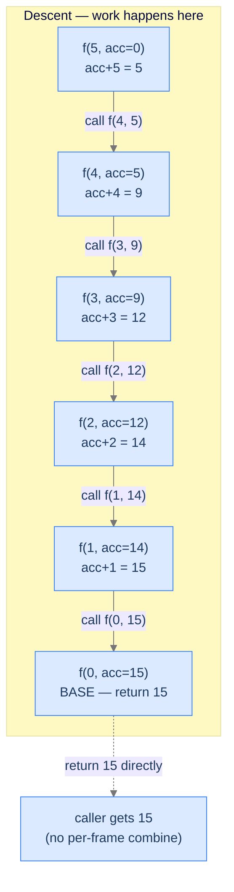

## Why It Exists

A call is a **tail call** if it's the *last* thing a function does — nothing remains to compute after it returns. A function is **tail-recursive** when its recursive call is a tail call: it returns the recursive result directly, with no wrapping work. The mirror image of [head recursion](/cortex/data-structures-and-algorithms/algorithms-by-strategy-recursion-pattern-head-recursion):

```text
head: return n + head(n - 1)          # work (the n + …) runs AFTER the call — on the ascent
tail: return tail(n - 1, acc + n)     # work (acc + n) runs BEFORE the call — on the descent
```

The difference looks tiny; the runtime impact is large. In the tail version the recursive call has nothing to return *to* — the answer is already complete by the time the base case is reached, carried down in an **accumulator**. That structural fact unlocks **tail-call optimisation**: the compiler can reuse one frame instead of stacking `n` of them, turning recursion into a loop. Knowing whether your language does that is the difference between elegant code and a stack overflow.



<p align="center"><strong>Each frame folds its work into <code>acc</code> on the way down. The base case returns the finished answer; nothing happens during unwinding.</strong></p>

## See It Work

Sum `1..n` tail-recursively. A wrapper hides the accumulator; the helper folds `acc + n` *before* the tail call.

```python run viz=array
def sum_to_n(n):
    def helper(n, acc):
        if n == 0:                          # base: hand back the finished answer
            return acc
        return helper(n - 1, acc + n)       # fold FIRST, then tail-call (last action)
    return helper(n, 0)

n = int(input())
print(sum_to_n(n))
```

```java run viz=array
import java.util.*;

public class Main {
    static int sumToN(int n) { return helper(n, 0); }
    static int helper(int n, int acc) {
        if (n == 0) return acc;                 // base
        return helper(n - 1, acc + n);          // fold first, tail-call last
    }
    public static void main(String[] args) {
        int n = Integer.parseInt(new Scanner(System.in).nextLine().trim());
        System.out.println(sumToN(n));
    }
}
```

```testcases
{
  "args": [
    { "id": "n", "label": "n", "type": "int", "placeholder": "5" }
  ],
  "cases": [
    { "args": { "n": "5" }, "expected": "15" },
    { "args": { "n": "1" }, "expected": "1" },
    { "args": { "n": "0" }, "expected": "0" },
    { "args": { "n": "10" }, "expected": "55" }
  ]
}
```

The accumulator grows on the descent — `0 → 5 → 9 → 12 → 14 → 15` — and the base case returns it unchanged. No frame does anything on the way back; each just passes the value through.

## How It Works

Every tail-recursive function is the same shape: `f(n, acc) = f(h(n), g(acc, n))` — fold this step into the accumulator with `g`, reduce the input with `h`, then tail-call.

```
function tail_recursion(n, acc):
    if n is base case: return acc            # return the accumulated answer
    return tail_recursion(h(n), g(acc, n))   # tail call — the LAST action, nothing follows
```

Three things distinguish it from head recursion: the combine `g` runs *before* the call; the call is the last action (no `+ result` wrapping it); and the base case returns `acc` directly. The result is complete by the time the base case is hit.

That "nothing left to do after the call" is what enables **tail-call optimisation (TCO)** — reuse one frame instead of pushing `n`:

```d2
direction: right

without: "Without TCO" {
  grid-rows: 1
  grid-columns: 1
  grid-gap: 0
  s: "Stack: n frames pile up\n(O(n) space)" {style.fill: "#fecaca"; style.stroke: "#dc2626"}
}
with: "With TCO" {
  grid-rows: 1
  grid-columns: 1
  grid-gap: 0
  s: "Stack: 1 frame, reused\n(O(1) space)" {style.fill: "#bbf7d0"; style.stroke: "#16a34a"}
}
without -> with: compiler reuses the frame
```

<p align="center"><strong>With TCO a tail-recursive function runs in <code>O(1)</code> stack — a loop in disguise. But not every language does it.</strong></p>

| Language | TCO? |
|---|---|
| **Scala** (`@tailrec`), **Kotlin** (`tailrec`) | ✅ Guaranteed — compiler rewrites to a loop |
| **C / C++ / Rust** | ⚠️ Sometimes — at high optimisation levels, no language guarantee |
| **Java, Python, JavaScript, TypeScript, Go** | ❌ No — tail frames still pile up (Go's stacks grow instead) |

Three diagnostic questions: **Q1** — can the answer be built *as you descend*, never looking back? **Q2** — does it fold into a single accumulator? **Q3** — is the recursive call the *very last* action (`return helper(...)`, not `return helper(...) + 1`)? All "yes" → tail recursion fits.

> **Key takeaway.** Tail recursion does its work on the **descent**, carrying the answer in an **accumulator**; the base case returns it unchanged. The recursive call must be in tail position (last action). With TCO it's `O(1)` stack — a loop; without it (Java, Python, JS) it's still `O(n)` stack and overflows on deep input.

## Trace It

"Tail recursion is just a loop" is true — *if* your language eliminates the frames. The accumulator version of `sum` above is in perfect tail position.

**Predict before you run:** does Python run `tail_sum(100_000)` in `O(1)` stack like a loop, or does it crash?

```python run viz=array
import sys
print("recursion limit:", sys.getrecursionlimit())

def tail_sum(n, acc=0):
    if n == 0:
        return acc
    return tail_sum(n - 1, acc + n)         # textbook tail position

try:
    print(tail_sum(100_000))
except RecursionError:
    print("RecursionError: the tail frames piled up anyway")
```

<details>
<summary><strong>Reveal</strong></summary>

It raises `RecursionError`. The call is in *perfect* tail position — but **Python has no TCO** (Guido van Rossum rejected it deliberately, valuing readable stack traces). So the frames pile up exactly as in head recursion, and 100,000 of them blow past the ~1000 limit. Tail recursion buys you *correctness* and a loop-like *style* in any language, but the `O(1)`-stack *payoff* only materialises where the compiler eliminates the call — Scala (`@tailrec`), Kotlin (`tailrec`), and sometimes optimised C/C++/Rust. In Java, Python, JavaScript, and TypeScript, deep tail recursion must be rewritten as an explicit loop. Same algorithm, language-dependent space.

</details>

## Your Turn

A palindrome check is naturally tail-recursive: compare the ends, then tail-call on the inner substring. The "accumulator" is degenerate — the answer is `True` unless a mismatch returns early — and the recursive call is the last action.

```python run viz=array
def is_palindrome(s, lo=0, hi=None):
    # Your code goes here
    return True

s = input()
print("true" if is_palindrome(s) else "false")
```

```java run viz=array
import java.util.*;

public class Main {
    static boolean isPalindrome(String s, int lo, int hi) {
        // Your code goes here
        return true;
    }
    public static void main(String[] args) {
        String s = new Scanner(System.in).nextLine().trim();
        System.out.println(isPalindrome(s, 0, s.length() - 1) ? "true" : "false");
    }
}
```

```testcases
{
  "args": [
    { "id": "s", "label": "s", "type": "string", "placeholder": "racecar" }
  ],
  "cases": [
    { "args": { "s": "racecar" }, "expected": "true" },
    { "args": { "s": "hello" }, "expected": "false" },
    { "args": { "s": "a" }, "expected": "true" },
    { "args": { "s": "ab" }, "expected": "false" },
    { "args": { "s": "abba" }, "expected": "true" }
  ]
}
```

<details>
<summary>Editorial</summary>

```python solution time=O(n) space=O(n)
def is_palindrome(s, lo=0, hi=None):
    if hi is None: hi = len(s) - 1
    if lo >= hi:                            # base: pointers crossed → palindrome
        return True
    if s[lo] != s[hi]:                      # mismatch → done, not a palindrome
        return False
    return is_palindrome(s, lo + 1, hi - 1) # tail call: shrink inward

s = input()
print("true" if is_palindrome(s) else "false")
```

```java solution
import java.util.*;

public class Main {
    static boolean isPalindrome(String s, int lo, int hi) {
        if (lo >= hi) return true;                       // base
        if (s.charAt(lo) != s.charAt(hi)) return false;  // mismatch
        return isPalindrome(s, lo + 1, hi - 1);          // tail call
    }
    public static void main(String[] args) {
        String s = new Scanner(System.in).nextLine().trim();
        System.out.println(isPalindrome(s, 0, s.length() - 1) ? "true" : "false");
    }
}
```

Both print `true` then `false`. Each call's only work — the end comparison — happens *before* the tail call; nothing is left for the ascent. The four problems in this section's **Problems** folder — reverse a sequence, search an element, palindrome check, reverse a list — are all this "work-on-descent, recurse-last" shape.

</details>

## Reflect & Connect

- **Tail is head's mirror.** Head recursion combines on the ascent (needs the smaller answer first); tail recursion folds into an accumulator on the descent (the answer is done before the base case returns). Spotting which you're in tells you where the work lands and what order results come out.
- **Tail recursion *is* a loop.** The accumulator is the loop variable; `h(n)` is the loop's step; the base case is the loop's exit. That's why TCO is even possible — and why, in a no-TCO language, the clean rewrite is literally a `while` loop with the accumulator as a local.
- **TCO is the whole practical story.** In Scala/Kotlin, write tail-recursive code freely. In Java/Python/JS, treat it as a *style* and rewrite to iteration when depth could approach the stack limit (the [nested-functions](/cortex/data-structures-and-algorithms/algorithms-by-strategy-recursion-pattern-head-recursion) overflow modes still apply).
- **The tail-position test is exact.** `return f(...)` is a tail call; `return f(...) + 1` or `return n * f(...)` is **not** — the wrapping work makes it head/multiple recursion, and TCO can't apply.

## Recall

<details>
<summary><strong>Q:</strong> What makes a function tail-recursive?</summary>

**A:** Its recursive call is in tail position — the last action, with no wrapping work (`return f(...)`, never `return f(...) + 1`). The answer is carried down in an accumulator and the base case returns it directly.

</details>
<details>
<summary><strong>Q:</strong> Where does the work happen in tail recursion, versus head?</summary>

**A:** On the **descent** — each frame folds its contribution into the accumulator *before* recursing. Head recursion does its work on the ascent, after the call returns.

</details>
<details>
<summary><strong>Q:</strong> What is tail-call optimisation and what does it buy?</summary>

**A:** The compiler reuses one stack frame for the tail call instead of pushing a new one, so a tail-recursive function runs in `O(1)` stack — like a loop — instead of `O(n)`.

</details>
<details>
<summary><strong>Q:</strong> Does Python/Java tail recursion run in O(1) stack?</summary>

**A:** No — neither does TCO, so tail frames pile up and deep recursion overflows just like head recursion. Only Scala/Kotlin (and sometimes optimised C/C++/Rust) eliminate the frames; elsewhere, rewrite to a loop.

</details>
<details>
<summary><strong>Q:</strong> Why is <code>return n * factorial(n - 1)</code> not tail-recursive?</summary>

**A:** The `n *` multiplication runs *after* the recursive call returns, so the call isn't the last action — that's head recursion, and TCO can't apply.

</details>

## Sources & Verify

- **Abelson & Sussman**, *Structure and Interpretation of Computer Programs*, §1.2.1 — "iterative processes": tail recursion with an accumulator running in constant space, the formal basis for TCO.
- **Scala** `@scala.annotation.tailrec` and **Kotlin** `tailrec` — compiler-verified tail-call rewriting; the JVM itself has no TCO, which is why the annotation exists.
- **Clinger** (1998), "Proper tail recursion and space efficiency" — the formal definition of proper tail calls; and the ES2015 PTC saga (specced, only Safari shipped it, V8 declined) for why JS lacks it in practice.
- The `15`, the `RecursionError`, and the `racecar`/`hello` results above come from the runnable blocks — re-run to verify.
