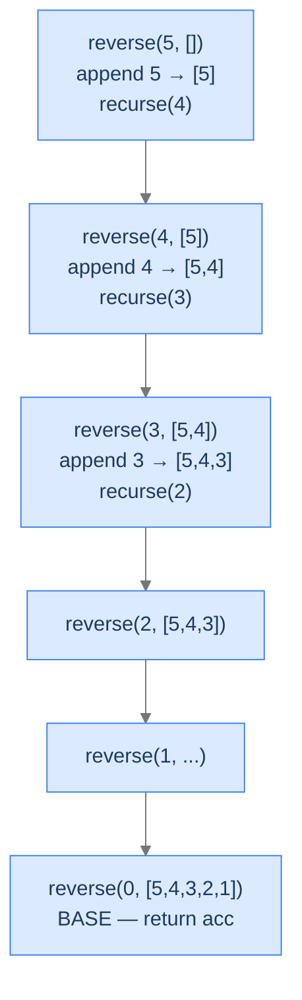

# Reverse Sequence

The mirror image of Forward Sequence from the Head Recursion lesson. Same problem family, but now we want the numbers in descending order — and tail recursion gives it to us essentially for free.

---

## The Problem

Given a positive integer `n`, return a list containing the numbers from `n` down to `1`. You **must** solve this recursively.

---

## Examples

**Example 1**
```
Input:  n = 5
Output: [5, 4, 3, 2, 1]
Explanation: Numbers from 5 down to 1, appended during descent.
```

**Example 2**
```
Input:  n = 1
Output: [1]
Explanation: Single element — append 1, recurse to n=0 which is the base case.
```

## Constraints

- `1 ≤ n ≤ 1000`
- Must be solved recursively.

```python run viz=array viz-root=result
from typing import List

class Solution:
    def helper(self, n: int, result: List[int]) -> None:
        # Your code goes here
        pass

    def reverse_sequence(self, n: int) -> List[int]:
        result: List[int] = []
        self.helper(n, result)
        return result

n = int(input())
print(Solution().reverse_sequence(n))
```

```java run viz=array viz-root=result
import java.util.*;

public class Main {
    static class Solution {
        private void helper(int n, List<Integer> result) {
            // Your code goes here
        }

        public List<Integer> reverseSequence(int n) {
            List<Integer> result = new ArrayList<>();
            helper(n, result);
            return result;
        }
    }

    public static void main(String[] args) {
        int n = Integer.parseInt(new Scanner(System.in).nextLine().trim());
        System.out.println(new Solution().reverseSequence(n));
    }
}
```

```testcases
{
  "args": [
    { "id": "n", "label": "n", "type": "int", "placeholder": "5" }
  ],
  "cases": [
    { "args": { "n": "5" }, "expected": "[5, 4, 3, 2, 1]" },
    { "args": { "n": "1" }, "expected": "[1]" },
    { "args": { "n": "3" }, "expected": "[3, 2, 1]" },
    { "args": { "n": "10" }, "expected": "[10, 9, 8, 7, 6, 5, 4, 3, 2, 1]" }
  ]
}
```

<details>
<summary><h2>Why Tail Recursion Fits Here</h2></summary>


Each frame's job is to append its `n`, then recurse on `n-1`. The append happens *before* the recursive call. By the time we hit the base case, the list is fully built. The base case has nothing to do but return.

Compare with the head-recursive Forward Sequence: the list was built *during unwinding*, with each ascending frame appending its number. Here, the list is built *during the descent*, with each descending frame appending its number. **The direction of work matches the direction of output.**



<p align="center"><strong>Each descending frame appends and recurses. The list is fully built by the time the base case fires.</strong></p>

</details>
<details>
<summary><h2>Applying the Diagnostic Questions</h2></summary>


| # | Check | Answer |
|---|---|---|
| **Q1** | Build down without look-back? | **Yes** — append each `n` as we go; never revisit. |
| **Q2** | Single accumulator? | **Yes** — the list itself is the accumulator. |
| **Q3** | Recursive call last? | **Yes** — append, then `return helper(n-1, result)` with nothing after. |

### Q1 — Why "build down, no look-back"?

The output `[5, 4, 3, 2, 1]` is exactly the descent order. Nothing in the result depends on a smaller `n`; in fact, smaller numbers are *appended after* larger ones. We never look back at frames already done. ✓

### Q2 — Why "the list is the accumulator"?

The list is the running answer, mutated as we descend. There's no second piece of state. Tail recursion needs exactly this. ✓

### Q3 — Why "the call is in tail position"?

After appending, the recursive call is the function's last action. The return is `return helper(n-1, result)` (or in languages without explicit return, just the call). Nothing wraps it — the language can apply TCO if it supports it. ✓

</details>
<details>
<summary><h2>The Append-on-Descent Strategy (Visualised)</h2></summary>


<div class="d2-slides" data-caption="Each descending frame appends and recurses. The list is fully built when the base case fires.">

```d2
state: "Initial — start at n=5" {
  list: "result = []"
}
```

```d2
state: "n=5 — append, recurse(4)" {
  list: "result = [5]" {style.fill: "#dbeafe"; style.stroke: "#3b82f6"}
}
```

```d2
state: "n=4 — append, recurse(3)" {
  list: "result = [5, 4]" {style.fill: "#fde68a"; style.stroke: "#d97706"}
}
```

```d2
state: "n=3 — append, recurse(2)" {
  list: "result = [5, 4, 3]" {style.fill: "#bbf7d0"; style.stroke: "#16a34a"}
}
```

```d2
state: "n=1 — append, recurse(0)" {
  list: "result = [5, 4, 3, 2, 1]" {style.fill: "#ede9fe"; style.stroke: "#7c3aed"}
}
```

```d2
state: "n=0 — base case fires, return" {
  list: "result = [5, 4, 3, 2, 1] (final)" {style.fill: "#bbf7d0"; style.stroke: "#16a34a"}
}
```

</div>

</details>
<details>
<summary><h2>Solution &amp; Analysis</h2></summary>

### The Solution

```python solution time=O(n) space=O(n)
from typing import List

class Solution:
    def helper(self, n: int, result: List[int]) -> None:

        # Base case: If n is less than or equal to 0, we have reached the
        # end of recursion
        if n <= 0:

            # Exit the function, as there are no more numbers to add
            return

        # First, add the current number n to the result list
        result.append(n)

        # Recursive call to the helper function with n-1, to move towards
        # the base case
        self.helper(n - 1, result)

    def reverse_sequence(self, n: int) -> List[int]:

        # Initialize an empty list to store the result
        result: List[int] = []

        # Call the helper function to populate the result list with
        # numbers from n to 1
        self.helper(n, result)

        # Return the generated list containing numbers from n to 1
        return result


n = int(input())
print(Solution().reverse_sequence(n))
```

```java solution
import java.util.*;

public class Main {
    static class Solution {
        private void helper(int N, List<Integer> result) {

            // Base case: If N is less than or equal to 0, we have reached
            // the end of recursion
            if (N <= 0) {

                // Exit the function, as there are no more numbers to add
                return;
            }

            // First, add the current number N to the result list
            result.add(N);

            // Recursive call to the helper method with N-1, to move towards
            // the base case
            helper(N - 1, result);
        }

        public List<Integer> reverseSequence(int N) {

            // Initialize an empty list to store the result
            List<Integer> result = new ArrayList<>();

            // Call the helper method to populate the result list with
            // numbers from N to 1
            helper(N, result);

            // Return the generated list containing numbers from N to 1
            return result;
        }
    }

    public static void main(String[] args) {
        int n = Integer.parseInt(new Scanner(System.in).nextLine().trim());
        System.out.println(new Solution().reverseSequence(n));
    }
}
```


<details>
<summary><strong>Trace — n = 5</strong></summary>

```
Step 1 │ n=5 │ append 5 → [5]            │ recurse(4)
Step 2 │ n=4 │ append 4 → [5, 4]         │ recurse(3)
Step 3 │ n=3 │ append 3 → [5, 4, 3]      │ recurse(2)
Step 4 │ n=2 │ append 2 → [5, 4, 3, 2]   │ recurse(1)
Step 5 │ n=1 │ append 1 → [5, 4, 3, 2, 1]│ recurse(0)
Step 6 │ n=0 │ BASE — return immediately

Result: [5, 4, 3, 2, 1]  (no per-frame combine on ascent)
```

The list is fully built during descent. The ascent is silent — every frame just returns.

</details>

### Complexity Analysis

| Resource | Cost (without TCO) | Cost (with TCO) | Why |
|---|---|---|---|
| **Time** | `O(n)` | `O(n)` | One append per integer. |
| **Space (output)** | `O(n)` | `O(n)` | The list has `n` elements. |
| **Space (stack)** | `O(n)` | `O(1)` | Without TCO, `n` frames; with TCO, one reused. |

### Edge Cases

| Case | Example | Expected | Reasoning |
|---|---|---|---|
| Smallest valid | `n = 1` | `[1]` | Append 1, recurse(0) → base. |
| Smallest possible | `n = 0` | `[]` | Base case fires immediately. |
| Negative input | `n = -3` | `[]` | Guard catches it. |
| Large input | `n = 100_000` | descending list | Stack overflow on Java/Python/JS without TCO; safe on Scala/Kotlin/Go. |

</details>
<details>
<summary><h2>Key Takeaway</h2></summary>


Reverse Sequence is the tail-recursion mirror of Forward Sequence: same recursion shape, same depth, but the work happens on the way *down* rather than the way back. The next problem applies the same template to *search* — where the accumulator's job is to track "we haven't found it yet" rather than to build output.

</details>
